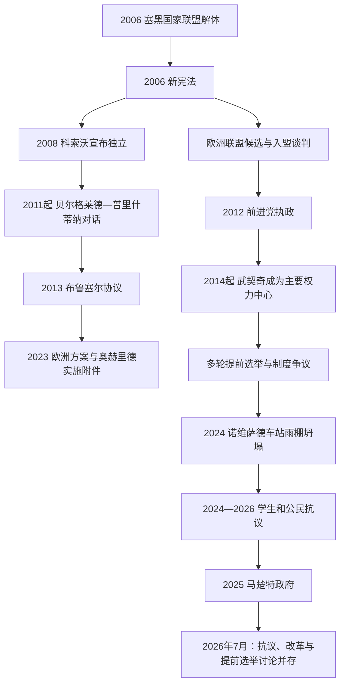

# 当代塞尔维亚

[返回塞尔维亚历史](/%E4%BA%BA%E6%96%87%E7%A7%91%E5%AD%A6/%E5%8E%86%E5%8F%B2/%E6%AC%A7%E6%B4%B2/%E4%B8%9C%E5%8D%97%E6%AC%A7%E4%B8%8E%E5%B7%B4%E5%B0%94%E5%B9%B2/%E5%A1%9E%E5%B0%94%E7%BB%B4%E4%BA%9A/README.md)

## 时间

2006年至今

## 概括

2006年塞尔维亚和黑山国家联盟解体后，塞尔维亚承接共同国家的国际组织席位和条约，并以新宪法建立议会制共和国。其政治主线围绕四组相互牵制的问题展开：科索沃的法定主张、实际控制与国际承认不一致；加入欧洲联盟的目标与国内法治、媒体及选举改革进度不匹配；国家在欧盟、俄罗斯、中国和美国之间实行多向平衡；经济增长、基础设施和外资投入与人口减少、地区差距、环境和治理争议并存。2012年后塞尔维亚前进党长期执政，总统亚历山大·武契奇成为实际政治中心。2024年诺维萨德车站雨棚坍塌引发的问责和反腐抗议延续到2026年，构成这一时期最严重的政治危机之一。

## 2006年独立与宪法重建

黑山2006年公投独立后，塞尔维亚依国家联盟宪章成为国际法承接方，不需重新申请联合国席位。新国旗、国歌和机构由共和国独立运作；军事改革把义务兵役暂停，国家宣布军事中立，同时参加北约“和平伙伴关系”项目。

2006年宪法经公投通过，规定塞尔维亚为议会制共和国：总统由直接选举产生并代表国家，总理由议会多数支持、政府掌握行政权，国民议会为一院制。宪法序言把科索沃—梅托希亚写为塞尔维亚组成部分；伏伊伏丁那保留自治省地位。宪法确立独立后的制度连续性，却也因司法任命、政党控制和科索沃条款等持续引发修宪讨论。

| 机构 / 层级 | 法定角色 | 截至2026年7月14日的运行要点 |
|---|---|---|
| 共和国总统 | 国家元首、提名总理候选人、外交与国防代表职能 | 亚历山大·武契奇在任；虽然宪法不是总统制，实际政治影响显著超过礼仪角色。 |
| 国民议会 | 立法、选举政府、监督行政 | 议长安娜·布尔纳比奇；执政联盟占多数，反对派围绕选举条件、议事程序和媒体公平持续抗议。 |
| 共和国政府 | 行政与政策执行 | 久罗·马楚特自2025年4月16日任总理；政府在前进党主导的议会多数支持下运作。 |
| 司法与检察 | 宪法规定独立，2022年修宪调整任命制度 | 欧盟进程推动制度改革，但案件独立、政治压力、腐败追责和实施效果仍是争议重点。 |
| 伏伊伏丁那自治省 | 省议会、政府和法定自治权限 | 自治程度受共和国法律和财政安排制约，地区认同与权限争论延续。 |
| 科索沃 | 塞尔维亚宪法主张为自治省 | 1999年后由普里什蒂纳机构和国际安全安排实际治理；2008年宣布独立，承认不一致，塞尔维亚不承认。 |

完整人名、代任和政府更替见[塞尔维亚近现代国家元首与政府首脑表](/%E4%BA%BA%E6%96%87%E7%A7%91%E5%AD%A6/%E5%8E%86%E5%8F%B2/%E6%AC%A7%E6%B4%B2/%E4%B8%9C%E5%8D%97%E6%AC%A7%E4%B8%8E%E5%B7%B4%E5%B0%94%E5%B9%B2/%E5%A1%9E%E5%B0%94%E7%BB%B4%E4%BA%9A/%E5%A1%9E%E5%B0%94%E7%BB%B4%E4%BA%9A%E8%BF%91%E7%8E%B0%E4%BB%A3%E5%9B%BD%E5%AE%B6%E5%85%83%E9%A6%96%E4%B8%8E%E6%94%BF%E5%BA%9C%E9%A6%96%E8%84%91%E8%A1%A8.md)。

## 科索沃地位与谈判

### 2008年独立及国际法律争议

科索沃议会于2008年2月宣布独立。美国和多数欧盟成员国承认，俄罗斯、中国、塞尔维亚及若干国家不承认；欧盟内部也没有统一承认。塞尔维亚通过外交、国际法院咨询意见程序和维持北部及塞族聚居区机构来反对独立。2010年国际法院认为该份独立宣言本身没有违反一般国际法，这一咨询意见没有裁定科索沃必然具国家地位，也没有强迫各国承认。

塞尔维亚对科索沃的法定主张、普里什蒂纳的实际治理、北约驻军和国际承认构成四个不同层次。北科索沃塞族地区长期使用塞尔维亚资助的教育、医疗和地方网络，与科索沃警察、海关和行政整合存在冲突；南部塞族飞地则更依赖当地安全和宗教遗产保护。

### 欧盟斡旋的正常化

2011年开始的技术对话处理人员流动、海关印章、学历和地区代表等问题。2013年《布鲁塞尔协议》规定北部塞族警察和司法纳入科索沃制度，并设想成立塞族市镇共同体；前一部分逐步执行，共同体的权限和设立长期搁置。塞尔维亚政府把协议描述为在不承认独立前提下改善塞族安全，反对者则认为它削弱塞尔维亚国家机构。

2023年欧盟推动的关系正常化方案及奥赫里德实施附件要求双方接受彼此文件、避免阻挠对方国际道路并落实既有义务。双方领导人没有以传统双边条约方式签字，对义务次序和法律性质各有解释。同年9月班尼斯卡发生塞族武装人员与科索沃警察冲突，造成警察和武装人员死亡，谈判互信进一步下降。北部地方治理、塞尔维亚机构和货币使用等争议在此后继续制造危机。

科索沃问题既是身份和宪法问题，也是居民权利、安全、财产、宗教遗产、能源和跨境生活问题。只用“承认或不承认”无法解释实际治理，也不能把所有科索沃塞族或阿尔巴尼亚人的立场视为一致。

## 欧洲一体化与外交平衡

塞尔维亚2008年签署稳定与联系协议，2009年获得申根区短期免签，2012年成为欧盟候选国，2014年开启入盟谈判。欧盟长期是最大贸易、投资和援助伙伴，入盟改革覆盖司法、公共采购、竞争、环境、媒体和与科索沃关系正常化。谈判进展缓慢，原因既包括科索沃和欧盟成员内部意见，也包括塞尔维亚在法治、选举、媒体自由、腐败和外交政策协调上的执行缺口。

外交政策实行多向平衡：

- 欧盟提供主要市场、供应链、资金和人员流动空间，正式入盟仍是政府政策。
- 俄罗斯在联合国科索沃议题和能源供应上重要，塞尔维亚社会也保有历史文化亲近。2022年俄乌全面战争后，塞尔维亚在联合国支持谴责侵略或维护乌克兰领土完整的多项决议，却没有加入欧盟对俄制裁。
- 中国通过钢铁、矿业、交通、能源、监控技术和贷款扩大存在，帮助快速建设，也引发合同透明、劳工、债务和环境标准争议。
- 美国和北约在科索沃安全、地区稳定和投资上不可绕过；1999年轰炸记忆又限制国内对北约的支持。
- 与土耳其、阿联酋及邻国的投资和外交关系，为塞尔维亚增加了议价空间。

所谓“平衡”并非等距离中立，而是在安全、能源、市场和国内政治叙事之间逐案选择。国际危机越尖锐，维持这种政策的成本越高。

## 政党重组与权力集中

### 2006—2012年：民主阵营分化

独立初期，民主党、塞尔维亚民主党、激进党、社会党等竞争。2008年科索沃宣布独立使亲欧联盟内部破裂，随后选举形成以鲍里斯·塔迪奇和民主党为中心、与社会党合作的政府。国家推进欧盟整合、海牙法庭合作和私有化，但全球金融危机、失业、腐败感和改革疲劳削弱执政基础。

托米斯拉夫·尼科利奇和亚历山大·武契奇于2008年从激进党分裂，建立较温和、正式支持入欧的塞尔维亚前进党。尼科利奇2012年当选总统，前进党领导的新联盟取得政府权，标志2000年民主反对派主导时代结束。

### 2012年以后：前进党长期执政

武契奇先任第一副总理，2014年起任总理，2017年起任总统。前进党在2014、2016、2020、2022、2023等多轮提前或定期议会选举中保持主导，通过广泛地方组织、执政资源、联盟伙伴和以武契奇命名的选举名单集中选票。政府强调财政稳定、工资养老金恢复、外资、道路铁路、军力和国家国际地位。

批评者关注公共媒体和亲政府私营媒体倾斜、行政资源介入竞选、对公务员和选民施压、议会快速立法、反对派和公民组织受攻击，以及重大项目合同透明不足。2020年部分反对派抵制议会选举，执政联盟几乎垄断席位；同年疫情宵禁计划触发街头冲突。此后对话和降低门槛使反对派重返议会，但选举条件争议没有消失。

2023年5月学校枪击和姆拉代诺瓦茨附近大规模枪击造成社会震动，“塞尔维亚反暴力”抗议要求追究安全与媒体责任。2023年12月提前选举后，国内反对派和国际观察者对选民迁移、媒体不平衡、行政资源和地方选举提出质疑；执政联盟否认系统性操控并保持多数。

## 经济、社会与人口变化

2000年代私有化和市场开放清理部分低效企业，也造成失业、资产争议和去工业化。2014年后财政紧缩、工资养老金削减、外资补贴和基础设施投资改善预算与就业，汽车零部件、信息技术、农业加工和物流增长。贝尔格莱德滨水区、高速公路、铁路和矿业项目成为国家现代化展示，同时被批评规划参与不足、征地和合同不透明。

区域差距明显：贝尔格莱德和诺维萨德吸引资本、大学和年轻人，南部、东部与小城镇面对人口外流和服务收缩。低生育率、老龄化和赴欧劳务使人口持续减少；来自俄罗斯等地的新移民及一定回流尚不足以逆转长期趋势。空气污染、河流小水电、力拓锂矿计划、矿业和城市开发激发环境运动，把生态问题转化为国家治理和地方参与问题。

## 2024—2026年的抗议危机

2024年11月1日，翻修后的诺维萨德火车站混凝土雨棚坍塌，最终造成16人死亡。政府以事故调查、逮捕和公布文件回应，学生、遇难者家属和反对派则认为公共工程合同、监督和责任链未充分公开。大学封锁、默哀、步行游行和全国集会逐渐从事故问责扩展到腐败、法治、媒体、选举和警察行为。

2025年1月，诺维萨德学生遇袭后，总理米洛什·武切维奇宣布辞职；议会3月确认，久罗·马楚特政府4月成立，提出恢复大学教学和对话。政府更替没有结束运动，抗议和道路封锁在2025—2026年持续，警方执法、拘捕、亲政府集会和校园治理引起新争议。欧洲机构在2026年仍把政治极化、和平集会保障、媒体和选举改革列为入盟问题。

2026年6月底，武契奇公开表示将在数月内举行提前议会选举，并可能在此前辞去总统职务。此为政治宣布而非已完成的法律行为；截至2026年7月14日，选举日期尚未依法确定，武契奇仍为总统，马楚特仍为总理。笔记因此不预写继任结果。

## 重要事件

| 时间 | 事件 | 结果与长期影响 |
|---|---|---|
| 2006年 | 塞黑国家联盟解体、新宪法通过 | 塞尔维亚恢复独立国家形式，确立现行制度与科索沃宪法主张。 |
| 2008年 | 科索沃宣布独立、稳定与联系协议签署 | 领土地位与入欧路线同时成为政治主轴。 |
| 2009年 | 申根短期免签 | 加强人员流动，成为欧盟整合的可见成果。 |
| 2010年 | 国际法院科索沃咨询意见 | 宣言本身被认定不违反国际法，但国家地位和承认问题未解决。 |
| 2012年 | 获欧盟候选国地位、尼科利奇当选总统 | 前进党阵营取代民主党成为主要执政力量。 |
| 2013年 | 《布鲁塞尔协议》 | 推动北科索沃部分制度整合，塞族市镇共同体问题遗留。 |
| 2014年 | 入盟谈判开启、武契奇任总理、严重洪灾 | 改革与权力集中同步；灾害暴露防洪和应急能力问题。 |
| 2017年 | 武契奇转任总统、布尔纳比奇组阁 | 法定议会制下政治中心从总理职位转到总统职位。 |
| 2020年 | 疫情、选举抵制与反宵禁抗议 | 公共卫生紧急权力和代表性争议加剧。 |
| 2022年 | 俄乌全面战争后的外交选择 | 支持乌克兰领土完整但不对俄制裁，平衡政策压力上升。 |
| 2023年 | 大规模枪击、反暴力抗议、科索沃方案和班尼斯卡冲突 | 国内安全、媒体责任与科索沃安全危机同时升级。 |
| 2023年12月 | 提前议会与地方选举 | 执政联盟维持优势，选举条件争议延续。 |
| 2024年5月 | 武切维奇政府成立 | 前进党保持政府连续性。 |
| 2024年11月 | 诺维萨德车站雨棚坍塌 | 造成16人死亡，触发长期学生和公民反腐抗议。 |
| 2025年1—4月 | 武切维奇辞职、马楚特政府成立 | 政府为缓和危机而更替，抗议未结束。 |
| 2026年 | 抗议持续、提前选举和总统去留进入公开讨论 | 截止7月14日仍无正式权力交接，政治不确定性上升。 |

## 当前结构性挑战

| 领域 | 结构因素 | 外部压力或直接触发 | 可能的制度出口 |
|---|---|---|---|
| 民主治理 | 长期一党优势、行政资源和媒体集中 | 选举争议、抗议执法和公共工程问责 | 改善选民名册、媒体监管、议会监督、独立调查与司法执行。 |
| 科索沃 | 法定主张与实际治理分离、塞族安全和地方机构问题 | 北部冲突、国际斡旋、双方互不信任 | 落实现有义务、保障少数群体、降低安全化并建立可核验安排。 |
| 欧洲一体化 | 法律移植快于执行、改革成本高 | 欧盟内部扩员政治、对俄政策和正常化要求 | 以司法、采购、媒体和竞争政策的可见执行恢复可信度。 |
| 经济模式 | 外资补贴、国企和大型项目驱动，地区差距大 | 全球供应链、能源和融资波动 | 提升本地企业、透明采购、教育技能与地方财政能力。 |
| 人口与社会 | 低生育、老龄化、青年外流和城乡差距 | 欧盟劳动力市场吸引、住房和公共服务成本 | 托育、住房、医疗、教育与回流政策组合，而非单一生育补贴。 |
| 外交平衡 | 同时依赖欧盟市场、俄罗斯能源与科索沃支持、中国资本 | 大国竞争和俄乌战争压缩模糊空间 | 明确政策优先序、提高合同透明度并减少单一能源依赖。 |

## 演变关系

- 前一节点：[南斯拉夫国家框架下的塞尔维亚](/%E4%BA%BA%E6%96%87%E7%A7%91%E5%AD%A6/%E5%8E%86%E5%8F%B2/%E6%AC%A7%E6%B4%B2/%E4%B8%9C%E5%8D%97%E6%AC%A7%E4%B8%8E%E5%B7%B4%E5%B0%94%E5%B9%B2/%E5%A1%9E%E5%B0%94%E7%BB%B4%E4%BA%9A/%E5%8D%97%E6%96%AF%E6%8B%89%E5%A4%AB%E5%9B%BD%E5%AE%B6%E6%A1%86%E6%9E%B6%E4%B8%8B%E7%9A%84%E5%A1%9E%E5%B0%94%E7%BB%B4%E4%BA%9A.md)。
- 当前节点：塞尔维亚共和国，现状核验至2026年7月14日。
