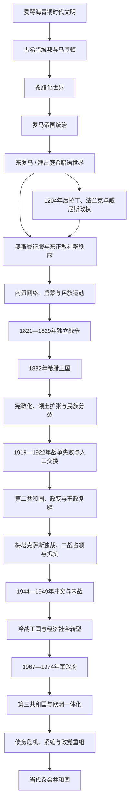

# 希腊

## 范围与概括

希腊历史包含多个彼此关联但不能简单等同的层次：爱琴海青铜时代文明、古典城邦与马其顿—希腊化世界、罗马和东罗马帝国的希腊语社会、十字军和威尼斯统治区、奥斯曼帝国中的东正教社群，以及1821年革命后逐步形成的现代民族国家。现代希腊广泛吸收古典语言、东正教、拜占庭记忆和近代民族主义传统，但并不是雅典、斯巴达或拜占庭帝国的直接政治延续。

本页以“现代希腊国家的前世今生”为主线：古代和中世纪只保留通向近代的制度、人口与文化背景，详细内容分别见[古希腊](/%E4%BA%BA%E6%96%87%E7%A7%91%E5%AD%A6/%E5%8E%86%E5%8F%B2/%E6%AC%A7%E6%B4%B2/_%E9%80%9A%E5%8F%B2/%E5%8F%A4%E5%B8%8C%E8%85%8A/README.md)、[东罗马帝国与拜占庭帝国](/%E4%BA%BA%E6%96%87%E7%A7%91%E5%AD%A6/%E5%8E%86%E5%8F%B2/%E6%AC%A7%E6%B4%B2/_%E9%80%9A%E5%8F%B2/%E5%8F%A4%E7%BD%97%E9%A9%AC/%E4%B8%9C%E7%BD%97%E9%A9%AC%E5%B8%9D%E5%9B%BD%E4%B8%8E%E6%8B%9C%E5%8D%A0%E5%BA%AD%E5%B8%9D%E5%9B%BD.md)和[奥斯曼帝国](/%E4%BA%BA%E6%96%87%E7%A7%91%E5%AD%A6/%E5%8E%86%E5%8F%B2/%E8%A5%BF%E4%BA%9A/%E5%9C%9F%E8%80%B3%E5%85%B6/%E5%A5%A5%E6%96%AF%E6%9B%BC%E5%B8%9D%E5%9B%BD/README.md)；1821年以后则补齐建国过程、王朝更替、共和国、战争、独裁、民主转型及兴衰原因。完整的革命政府、历代总统和政府首脑任期见[希腊国家元首与政府首脑表](/%E4%BA%BA%E6%96%87%E7%A7%91%E5%AD%A6/%E5%8E%86%E5%8F%B2/%E6%AC%A7%E6%B4%B2/%E4%B8%9C%E5%8D%97%E6%AC%A7%E4%B8%8E%E5%B7%B4%E5%B0%94%E5%B9%B2/%E5%B8%8C%E8%85%8A%E5%9B%BD%E5%AE%B6%E5%85%83%E9%A6%96%E4%B8%8E%E6%94%BF%E5%BA%9C%E9%A6%96%E8%84%91%E8%A1%A8.md)。

## 历史演进图

## 历史主线导航

| 顺序 | 阶段 | 时间 | 政治与社会主线 |
|---:|---|---|---|
| 1 | 爱琴海、古希腊与希腊化世界 | 约前3000年—前146年 | 宫殿文明、城邦、殖民网络、波希战争、城邦竞争、马其顿统一与希腊化扩散。 |
| 2 | 罗马与东罗马时期 | 前146年—1204/1453年 | 希腊地区纳入罗马世界；基督教化后，希腊语成为东罗马帝国核心行政文化语言。 |
| 3 | 拉丁、威尼斯与奥斯曼交错 | 1204—18世纪末 | 领土长期分割；奥斯曼行政、东正教教会、地方武装和威尼斯海上据点并存。 |
| 4 | 民族启蒙与独立战争 | 18世纪末—1832年 | 商人和侨民网络、秘密社团、地方武装与列强干预共同促成独立。 |
| 5 | 奥托王朝 | 1832—1862年 | 外来君主、巴伐利亚摄政、中央集权和财政依赖；1843年革命迫使国王接受宪法，1862年被废。 |
| 6 | 格吕克斯堡王朝与国家扩张 | 1863—1913年 | 议会制逐步形成，伊奥尼亚群岛、色萨利等地并入；巴尔干战争使领土和人口大幅增加。 |
| 7 | 民族分裂、世界大战与小亚细亚灾难 | 1913—1923年 | 国王与韦尼泽洛斯阵营对立；一战参战、小亚细亚战争失败及人口交换重塑国家。 |
| 8 | 第二共和国、王政复辟与梅塔克萨斯政权 | 1924—1941年 | 难民安置、政变循环、经济震荡；1935年复辟王政，1936年建立“八月四日”独裁。 |
| 9 | 轴心国占领、解放与内战 | 1941—1949年 | 德意保三国占领、饥荒、抵抗与合作并存；解放后左右阵营冲突演变为内战。 |
| 10 | 冷战王国 | 1949—1967年 | 反共国家、美国援助、北约体系、经济增长与城市化并行，王室干政和军政网络加剧危机。 |
| 11 | 军政府 | 1967—1974年 | 军官政变终止议会政治；镇压与制度改造未能取得稳定合法性，塞浦路斯危机触发垮台。 |
| 12 | 第三共和国 | 1974年至今 | 共和制稳定、政党轮替、加入欧洲共同体与欧元区；2009年后经历债务危机和深刻社会调整。 |

## 古代希腊与罗马世界

### 从青铜时代到希腊化世界

克里特的米诺斯文明和希腊本土的迈锡尼文明构成爱琴海青铜时代的重要中心。约前1200年前后宫殿体系崩溃后，人口、聚落和政治组织经历重组；至前8世纪，城邦制度、字母书写、泛希腊宗教节庆和地中海殖民网络逐渐形成。雅典、斯巴达、科林斯、底比斯等城邦具有不同政制，不存在一个长期统一的“古希腊国家”。

前5世纪希波战争强化部分城邦的共同身份，但雅典海上同盟和斯巴达同盟的竞争又引发伯罗奔尼撒战争。此后城邦间战争、波斯干预和社会财政压力削弱自主秩序。前4世纪马其顿的腓力二世利用军事改革和城邦分裂建立霸权；亚历山大东征使希腊语政治文化扩展至埃及和西亚。其死后形成的希腊化王国不是现代希腊的前身国家，而是多民族帝国体系。

### 罗马统治与希腊语东部

前146年罗马摧毁科林斯，希腊本土逐渐纳入罗马行省体系。希腊城市保留不同程度自治，希腊语教育、哲学和城市文化反过来深刻影响罗马精英。罗马帝国分治以后，君士坦丁堡及东部行省延续罗马国家制度；基督教化、教会组织和希腊语行政文化逐步成为东地中海共同纽带。

“拜占庭”是后世对中世纪东罗马帝国的称呼。帝国居民长期自称“罗马人”，其疆域和政治认同跨越巴尔干、安纳托利亚和东地中海，不能简化成“中世纪希腊民族国家”。不过，希腊语、东正教、罗马法和帝国记忆后来成为现代希腊认同的重要来源。

## 拉丁、威尼斯与奥斯曼时期

### 政权分割与征服过程

1204年第四次十字军攻占君士坦丁堡后，希腊地区出现拉丁帝国、亚该亚侯国、雅典公国和威尼斯殖民据点，同时存在伊庇鲁斯、尼西亚和特拉比松等东罗马继承政权。1261年君士坦丁堡虽被尼西亚系政权收复，但帝国财政、军力和领土已明显收缩。

奥斯曼征服不是以1453年为唯一节点完成：君士坦丁堡于1453年陷落，伯罗奔尼撒摩里亚专制国在1460年被征服；部分岛屿和沿海据点长期属于威尼斯、热那亚或其他拉丁势力。克里特到1669年才大体落入奥斯曼，蒂诺斯延至1715年；伊奥尼亚群岛主要处在威尼斯及其后法俄、法国和英国体系中，未形成与希腊本土完全相同的奥斯曼经验。

### 奥斯曼统治机制

| 结构 | 运作方式 | 历史影响 |
|---|---|---|
| 行省与税收 | 土地、税农和地方官僚体系不断变化，中央与地方权贵共同征收资源 | 农民负担因地区、战乱和税制而异，不能概括为固定不变的“奴役”。 |
| 东正教教会 | 君士坦丁堡普世牧首及地方主教管理宗教、婚姻、教育和部分社群事务 | 保存希腊语宗教文化，也形成与帝国行政合作的教会精英。 |
| 地方精英 | 法纳尔人、岛屿船主、商人、乡绅与武装首领扮演中介 | 部分家族进入帝国外交和多瑙河公国行政，另一些在地方积累军事与经济自主。 |
| 克莱夫特与阿尔马托利 | 前者常为山地武装或盗匪，后者受当局授权维持地方治安 | 两者身份可以转换，独立战争时期成为重要军事资源，但并非一直具有民族革命目标。 |
| 改宗与人口流动 | 伊斯兰化、基督徒迁徙、阿尔巴尼亚语与斯拉夫语群体流动并存 | 宗教、语言和地方身份彼此交错，后来的民族边界不能直接套回早期社会。 |

### 民族运动形成条件

18世纪商贸扩张使希腊语商人、船主和侨民在黑海、地中海及中欧建立网络。印刷、学校和启蒙思想传播，里加斯·费赖奥斯、阿扎曼蒂奥斯·科赖斯等人提出不同版本的政治共同体想象。1770年俄国煽动的奥尔洛夫起义失败，显示外援承诺与地方能力之间的差距；拿破仑战争、俄土战争和塞尔维亚革命又削弱奥斯曼对巴尔干的控制。

1814年成立于敖德萨的友爱社秘密组织筹划起义。民族主义知识分子、东正教网络、船岛商人、地方名门和山地武装因共同反对帝国统治而合作，但对中央政府、社会秩序和权力分配并无一致方案，这种差异在革命内战中迅速暴露。

## 独立战争与建国（1821—1832）

### 革命过程

1. **多瑙河起事与希腊本土起义**：亚历山大·伊普西兰蒂斯于1821年2月进入摩尔达维亚发动起事，很快被奥斯曼军击败；3月以后伯罗奔尼撒、中希腊和部分岛屿相继起义。
2. **早期军事胜利与暴力循环**：起义军夺取卡拉马塔、的黎波里察等地，奥斯曼当局处死普世牧首格里高利五世。双方针对穆斯林、基督徒和犹太平民的屠杀与报复使冲突具有残酷的族群—宗教战争特征。
3. **革命政权建构**：1822年埃皮达鲁斯国民会议宣布独立并制定宪制，但岛屿船主、伯罗奔尼撒名门、军事首领和中央政治家之间发生1823—1825年两轮内战，消耗了革命力量。
4. **埃及干预与革命危机**：奥斯曼苏丹以克里特和伯罗奔尼撒利益换取穆罕默德·阿里派兵。易卜拉欣帕夏自1825年登陆后重创起义军；迈索隆吉翁在1826年陷落，革命濒临失败。
5. **列强介入**：欧洲亲希腊运动、俄国战略利益和英法维持东地中海均势的考虑逐渐汇合。1827年英法俄舰队在纳瓦里诺海战摧毁奥斯曼—埃及舰队，随后俄土战争进一步迫使奥斯曼让步。
6. **卡波季斯特里亚治理**：前俄国外交官爱奥尼斯·卡波季斯特里亚于1828年出任总督，建立财政、军队、教育和地方行政，但中央集权触动地方家族利益，1831年遇刺。
7. **国际承认与边界**：1830年伦敦议定书承认希腊为独立国家；1832年列强安排巴伐利亚王子奥托为国王，并以贷款、担保和外交监督约束新国家。最初国境主要包括伯罗奔尼撒、中希腊和部分岛屿，大量希腊语东正教人口仍在国境之外。

### 革命成功的原因

| 类型 | 因素 | 作用 |
|---|---|---|
| 内部基础 | 商船队、侨民资金、山地武装和地方自治经验 | 使起义能在岛屿、山区和伯罗奔尼撒维持多年。 |
| 帝国结构 | 奥斯曼同时面对地方强人、俄国压力和多地战争 | 难以把全部军力长期集中于希腊。 |
| 国际环境 | 亲希腊舆论、列强均势计算与纳瓦里诺海战 | 在革命几近失败时改变军事力量对比，是独立得以实现的关键外部条件。 |
| 制度尝试 | 国民会议、宪法和中央政府 | 为国际承认提供政治主体，但派系内战也暴露国家整合能力有限。 |

## 奥托王朝：中央集权、宪政与废黜（1832—1862）

奥托即位时未成年，1833—1835年由巴伐利亚摄政团治理。摄政团建立常备军、法院、官僚、地方行政和国教体系，1833年单方面宣布希腊教会自主；君士坦丁堡牧首区到1850年才承认其自治。快速中央集权削弱革命时期地方首领，外国官员和贷款依赖又造成“外来统治”的观感。

奥托成年后实行无宪法的个人君主制。财政薄弱、土地问题、军人安置不满以及英法俄“保护国”派系竞争长期存在。1843年9月军民起义迫使国王接受1844年宪法，转入有限君主立宪；但选举干预、王室派系政治和宫廷对政府的控制并未消失。

“大希腊主义”主张把奥斯曼境内的希腊语东正教地区和君士坦丁堡纳入未来国家，为扩张政策提供动员，也使国内改革经常服从外交冒险。克里米亚战争期间希腊试图在奥斯曼边境制造起事，英法军队占领比雷埃夫斯迫使其中止。王室无嗣、财政和外交挫败、政治联盟瓦解叠加，1862年军政起义废黜奥托；国民会议另选丹麦王子威廉为乔治一世。

## 格吕克斯堡王朝与领土扩张（1863—1913）

乔治一世即位后使用“希腊人的国王”称号。英国于1864年把伊奥尼亚群岛移交希腊，同年宪法确认人民主权和一院制议会。1875年以后，“明示信任原则”逐渐要求国王任命获得议会多数支持者组阁，议会制有所巩固，但王室仍保有军政和组阁影响。

### 扩张与国家建设

| 时间 | 事件 | 结果 |
|---|---|---|
| 1864 | 伊奥尼亚群岛并入 | 扩大海上领土，也象征新王朝获得列强支持。 |
| 1881 | 色萨利大部和阿尔塔并入 | 柏林会议后通过外交实现扩张，但大地产和农民问题随之进入国家政治。 |
| 1893 | 政府宣布无力按原条件偿债 | 铁路、军费和行政开支超过税基承受能力，显示扩张国家的财政脆弱。 |
| 1897 | 希土战争 | 希腊因克里特问题仓促开战而迅速失败，赔款和国际财政监督加深外部约束。 |
| 1909 | 古迪军人运动 | 军官要求整军和行政改革，促成克里特政治家埃莱夫塞里奥斯·韦尼泽洛斯进入全国政治。 |
| 1912—1913 | 两次巴尔干战争 | 希腊获得塞萨洛尼基、伊庇鲁斯南部、克里特和多座爱琴海岛屿，领土和人口约增加一倍。 |

韦尼泽洛斯政府改革军队、行政、教育和劳动立法，并通过与塞尔维亚、保加利亚、黑山结盟参与第一次巴尔干战争。第二次巴尔干战争中原盟友共同击败保加利亚。扩张成功建立在军事改革、外交结盟和奥斯曼衰弱之上，也把马其顿多语言人口、难民与边界争议纳入国家。乔治一世在1913年于新并入的塞萨洛尼基遇刺，由康斯坦丁一世继位。

## 王朝世系与摄政

| 顺序 | 君主或摄政 | 在位 / 摄政 | 王室与继承关系 | 关键事件与备注 |
|---:|---|---|---|---|
| 1 | **奥托** | 1832—1862年 | 维特尔斯巴赫王朝；列强选立，无前任直系继承 | 1833年前后由巴伐利亚摄政团治理；1843年被迫接受宪法，1862年被废，无嗣。 |
| — | 巴伐利亚摄政团 | 1833—1835年 | 代未成年奥托执政 | 推行中央集权、司法和教会改革，因外来官僚与高成本军队引发反感。 |
| 2 | **乔治一世** | 1863—1913年 | 格吕克斯堡王朝；国民会议选立 | 1864年宪法、议会政治发展与领土扩张；1913年遇刺。 |
| 3 | 康斯坦丁一世 | 1913—1917年 | 乔治一世长子 | 与韦尼泽洛斯在一战立场上冲突，协约国压力下退位。 |
| 4 | 亚历山大 | 1917—1920年 | 康斯坦丁一世次子 | 在协约国与韦尼泽洛斯阵营支持下即位，政府加入一战并进军小亚细亚；意外死亡。 |
| — | 奥尔加王后 | 1920年11—12月 | 乔治一世遗孀、短期摄政 | 亚历山大死后至康斯坦丁复位之间代理王权。 |
| 3（复位） | 康斯坦丁一世 | 1920—1922年 | 公投后复位 | 小亚细亚战争失败后再次退位。 |
| 5 | 乔治二世 | 1922—1924年 | 康斯坦丁一世长子 | 1923年底离境，1924年第二共和国成立。 |
| — | 帕夫洛斯·孔杜里奥蒂斯 | 1923—1924年 | 海军将领、革命政府推举摄政 | 王室离境后代行元首，随后成为共和国总统。 |
| 5（复位） | 乔治二世 | 1935—1947年 | 1935年在军政压力下恢复王位 | 默许梅塔克萨斯独裁；1941年随政府流亡，1946年公投后回国。 |
| — | 达马斯基诺斯大主教 | 1944—1946年 | 解放后经政治妥协担任摄政 | 在王位是否恢复未决时维持名义国家元首职能。 |
| 6 | 保罗 | 1947—1964年 | 乔治二世之弟 | 任期覆盖内战结束、冷战重建和塞浦路斯问题升温。 |
| 7 | 康斯坦丁二世 | 1964—1973年 | 保罗之子 | 1965年王室与民选政府冲突；1967年反军政府行动失败后流亡，军政府1973年宣布废除王室。 |
| — | 乔治奥斯·佐伊塔基斯；乔治奥斯·帕帕佐普洛斯 | 1967—1973年 | 军政府设置的摄政 | 国王流亡后由军政府代行王权；职位服务于独裁统治，不代表正常议会摄政。 |

1974年民主恢复后举行自由公投，69.18%的投票者选择共和制，王朝问题最终由第三共和国解决。完整的共和国元首、代理元首及历届政府首脑见[希腊国家元首与政府首脑表](/%E4%BA%BA%E6%96%87%E7%A7%91%E5%AD%A6/%E5%8E%86%E5%8F%B2/%E6%AC%A7%E6%B4%B2/%E4%B8%9C%E5%8D%97%E6%AC%A7%E4%B8%8E%E5%B7%B4%E5%B0%94%E5%B9%B2/%E5%B8%8C%E8%85%8A%E5%9B%BD%E5%AE%B6%E5%85%83%E9%A6%96%E4%B8%8E%E6%94%BF%E5%BA%9C%E9%A6%96%E8%84%91%E8%A1%A8.md)。

## 民族分裂、第一次世界大战与小亚细亚灾难（1913—1923）

### 民族分裂

康斯坦丁一世倾向中立，既受军事判断和王室德意关系影响，也担忧国家承受力；首相韦尼泽洛斯认为协约国胜利可帮助实现领土目标。1915年国王两次迫使韦尼泽洛斯离职，宪政争议演变为“民族分裂”。1916年韦尼泽洛斯在塞萨洛尼基成立国防临时政府，协约国控制海上交通并向雅典施压；1917年康斯坦丁离境，亚历山大即位，全国在韦尼泽洛斯政府下参战。

胜利使希腊在色雷斯和士麦那获得扩张机会，但占领小亚细亚不是单纯的民族“收复”：当地人口混居，战后同盟体系脆弱，意法政策转变，土耳其民族运动又建立了新的军事政治中心。1920年选举中韦尼泽洛斯阵营失败，康斯坦丁复位；新政府继续向安纳托利亚内陆推进，补给线、财政和外交支持却持续恶化。

### 1922年崩溃及其影响

1921年萨卡里亚河战役后希军无力继续进攻。1922年土耳其军发动总攻，希腊战线崩溃，士麦那大火与沿岸撤退造成大规模死亡和流离。军官革命迫使康斯坦丁再次退位，“六人审判”处决多名前政府和军方负责人。[土耳其独立战争](/%E4%BA%BA%E6%96%87%E7%A7%91%E5%AD%A6/%E5%8E%86%E5%8F%B2/%E8%A5%BF%E4%BA%9A/%E5%9C%9F%E8%80%B3%E5%85%B6/%E5%9C%9F%E8%80%B3%E5%85%B6%E7%8B%AC%E7%AB%8B%E6%88%98%E4%BA%89.md)最终以1923年《洛桑条约》确立新边界。

希腊与土耳其以宗教身份为主要标准实施强制人口交换，约百万以上东正教难民进入希腊，数十万穆斯林离开希腊；伊斯坦布尔希腊人和西色雷斯穆斯林等被列为例外。难民安置加速雅典、比雷埃夫斯和塞萨洛尼基城市化，带来劳动力、商业和文化活力，也制造住房、土地、政治和公共卫生压力。小亚细亚主义的失败同时摧毁持续向安纳托利亚扩张的现实基础。

## 第二共和国、王政复辟与梅塔克萨斯政权（1924—1941）

1924年公投建立第二共和国。新政体吸收大量难民、推进土地改革与公共建设，却持续受韦尼泽洛斯派和保王派分裂、军官政治、债务及世界经济危机冲击。帕夫洛斯·孔杜里奥蒂斯任总统期间政局多次更迭；1925年将军塞奥多罗斯·潘加洛斯发动政变并实行短暂独裁，次年又被推翻。

韦尼泽洛斯1928—1932年政府推动学校、基础设施、外交正常化，并于1930年与土耳其和解；全球萧条、财政违约和政治暴力随后削弱其阵营。1933和1935年政变与反政变加深军队清洗。1935年乔治奥斯·孔迪利斯掌权，以受操控的公投恢复乔治二世王位，第二共和国因此终结。

1936年议会僵局、劳工动员和国王对反共强人政府的支持，使首相爱奥尼斯·梅塔克萨斯在8月4日暂停宪法、解散议会。政权实施审查、逮捕和流放，镇压共产党与工会，同时推行社会保险、劳工仲裁和青年组织，借古典和拜占庭符号塑造国家主义。“八月四日政权”依赖国王、警察和军队，缺乏成熟群众党；其终结不是国内反对直接推翻，而是二战入侵摧毁国家机构。

## 第二次世界大战、占领与内战（1940—1949）

### 对轴心国战争与占领

1940年10月28日梅塔克萨斯拒绝意大利最后通牒，希军击退自阿尔巴尼亚方向的进攻并推进至北伊庇鲁斯一带。这一胜利提高士气，却使希腊在1941年德国经南斯拉夫和保加利亚进攻时兵力分散。4月战线迅速崩溃，国王和政府撤往克里特、埃及，克里特岛在激烈空降战后失守。

德国、意大利和保加利亚分区占领希腊。征用、封锁、运输崩溃和行政失灵共同造成1941—1942年大饥荒。塞萨洛尼基犹太社群几乎被整体驱逐至灭绝营，其他地区的生存率因意占区、地方救援和德国接管时间不同而有差异。占领当局扶植合作政府和安全营；与此同时，民族解放阵线—希腊人民解放军（EAM—ELAS）、全国共和希腊联盟（EDES）等组织展开抵抗，但在对战后权力安排的目标上激烈冲突。

### 从解放到内战

1944年德军撤退后，英国支持的流亡政府回国。EAM拥有规模最大的国内武装和群众组织，政府则要求建立统一军队。12月雅典冲突使政治争端转化为武装对抗；1945年《瓦尔基扎协议》要求ELAS解除武装，但右翼暴力、左翼遭迫害、选举与王位公投争议破坏和解。

1946年希腊民主军发动持续叛乱，内战全面化。共产党领导的武装依赖北方邻国通道，政府军获得英国、继而美国“杜鲁门主义”和马歇尔援助。1948年苏南冲突后南斯拉夫关闭边界，叛军补给和退路骤减；政府军经过重组并使用优势火力，于1949年在格拉莫斯—维齐地区获胜。

### 内战结局的因果

| 类型 | 因素 | 作用 |
|---|---|---|
| 结构因素 | 占领时期国家崩溃、抵抗组织竞争和战前社会分裂 | 使解放后的权力真空难以通过常规议会政治解决。 |
| 外部因素 | 英美支持政府，巴尔干社会主义国家阶段性援助叛军 | 把国内冲突嵌入冷战；援助规模和持续性明显有利于政府军。 |
| 组织因素 | 政府军逐步统一指挥并获得空运火力，叛军转向固定阵地战 | 削弱游击战原有优势。 |
| 直接触发与终局 | 瓦尔基扎失灵、1946年冲突升级；1948—1949年边境通道受限 | 前者推动全面内战，后者加速民主军军事失败。 |

战后国家以反共合法性重建，数万政治犯、流亡者和难民长期无法回归，内战记忆直到1974年以后才逐步纳入更包容的公共叙事。

## 冷战王国与军政府（1949—1974）

### 战后重建和王室—议会危机

希腊在美国援助、航运、建筑、旅游和劳动力转移推动下实现快速增长，大量农村人口迁往雅典、塞萨洛尼基或西欧。国家1952年加入北约；军队、安全机构和王室在反共体制中保持强大影响。共产党被禁，左翼公民受到监控和就业限制，形式上的议会选举与“深层国家”并存。

塞浦路斯希腊族的“并入希腊”诉求使雅典与伦敦、安卡拉关系紧张；1955年后塞浦路斯武装斗争和族群冲突进一步国际化。1960年塞浦路斯共和国独立并未消除矛盾。国内方面，康斯坦丁·卡拉曼利斯的保守派政府推动经济和欧洲联系；1963年左翼议员格里戈里斯·兰布拉基斯遇刺暴露安全网络问题。中间联盟领袖乔治·帕潘德里欧1964年胜选后与年轻国王康斯坦丁二世就军队控制发生冲突，1965年国王解除首相职务，引发“叛离”危机和不稳定政府。

### 1967年政变及统治结构

1967年4月21日，以乔治奥斯·帕帕佐普洛斯等为首的中级军官先于可能的高级军官政变发动行动，逮捕政治人物、暂停自由并实行军事法庭。国王同年12月反政变失败后流亡，军政府以摄政名义统治，1973年直接宣布共和。

| 权力层级 | 人物或机构 | 实际作用 |
|---|---|---|
| 军官集团 | 帕帕佐普洛斯、斯蒂利亚诺斯·帕塔科斯、尼古拉奥斯·马卡雷佐斯等 | 掌握政变后的安全、军政和行政核心。 |
| 名义王权 | 康斯坦丁二世及军政府任命的摄政 | 国王1967年底离境后不再掌握国内权力；摄政为独裁统治提供形式包装。 |
| 1973年总统制 | 帕帕佐普洛斯任总统，斯皮罗斯·马克齐尼斯主持有限“自由化” | 试图摆脱王室并缓和统治，未建立可信民主。 |
| 强硬派 | 迪米特里奥斯·约阿尼迪斯控制宪兵网络 | 1973年雅典理工学院抗议遭镇压后推翻帕帕佐普洛斯，成为幕后实际领导。 |

军政府通过审查、酷刑、流放和取消政党压制反对者。经济在早期延续增长，后期通胀、裙带开发和国际孤立扩大。1973年海军反抗和雅典理工学院起义表明军内外合法性崩坏；约阿尼迪斯支持1974年塞浦路斯政变，试图推翻马卡里奥斯并推动并入希腊，土耳其随即出兵。战争风险和塞岛分治暴露军政府无力控制后果，军方邀请卡拉曼利斯回国组建全国团结政府。相关区域过程见[塞浦路斯独立、族群冲突与岛屿分治](/%E4%BA%BA%E6%96%87%E7%A7%91%E5%AD%A6/%E5%8E%86%E5%8F%B2/%E8%A5%BF%E4%BA%9A/%E5%A1%9E%E6%B5%A6%E8%B7%AF%E6%96%AF/%E7%8B%AC%E7%AB%8B%E3%80%81%E6%97%8F%E7%BE%A4%E5%86%B2%E7%AA%81%E4%B8%8E%E5%B2%9B%E5%B1%BF%E5%88%86%E6%B2%BB.md)。

## 第三共和国与欧洲一体化（1974年至今）

### 民主转型

卡拉曼利斯政府恢复政党和新闻自由，使希腊共产党合法化，举行1974年自由选举及共和制公投。1975年宪法建立议会共和国，最初赋予总统一定调节权；1986年修宪后总统权力收缩，政府首脑和议会多数成为日常行政核心。军政府责任人受到审判，军队退出公开政治，王室问题也经公投解决。

新民主党主导最初过渡。安德烈亚斯·帕潘德里欧领导的泛希腊社会主义运动在1981年胜选，扩大社会福利、承认内战时期左翼抵抗、改革家庭法并提升国家对经济的干预。政治包容和大众参与巩固民主，但任人唯亲、财政赤字、国有部门效率和两大党家族化也逐渐形成长期负担。

希腊1981年加入欧洲共同体，2001年进入欧元区。欧洲资金改善公路、港口和公共设施，服务业、航运和旅游持续重要；但低利率也掩盖税收征管、生产率、养老金和公共债务问题。1990年代希腊与新独立的北方邻国就“马其顿”名称发生争议，2018年《普雷斯帕协议》推动邻国改名为北马其顿，相关历史层次见[北马其顿历史](/%E4%BA%BA%E6%96%87%E7%A7%91%E5%AD%A6/%E5%8E%86%E5%8F%B2/%E6%AC%A7%E6%B4%B2/%E4%B8%9C%E5%8D%97%E6%AC%A7%E4%B8%8E%E5%B7%B4%E5%B0%94%E5%B9%B2/%E5%8C%97%E9%A9%AC%E5%85%B6%E9%A1%BF/README.md)。

### 债务危机与政党重组

2009年政府确认财政赤字远高于此前公布水平，市场融资成本急升。2010年起，希腊与欧盟、欧洲中央银行和国际货币基金组织达成多轮援助方案，以削减赤字、税制和劳动力市场改革、私有化及银行重组为条件。紧缩与经济萎缩相互强化，失业、贫困、青年外流和公共服务压力显著上升。

传统的新民主党—泛希社运两党格局瓦解，激进左翼联盟崛起。2015年政府举行公投否决债权方方案，却在银行关闭和退出欧元风险下接受第三轮援助，显示选举授权、货币联盟约束和金融流动之间的冲突。希腊2018年退出正式救助计划，随后逐步恢复市场融资；危机留下的高债务、人口老化、住房与工资压力仍然存在。

### 2019年以来

基里亚科斯·米佐塔基斯领导的新民主党2019年上台，推动行政数字化、投资、减税和边境管控；政府在2023年选举后连任。新冠疫情、能源价格、山火与洪灾考验国家能力。2023年坦佩铁路相撞造成重大伤亡，铁路安全、行政责任和问责成为持续政治议题。移民与难民路线、爱琴海与东地中海海域权益、对土耳其关系、塞浦路斯问题和欧盟政策继续影响外交。

截至2026-07-14，希腊总统为康斯坦丁诺斯·塔苏拉斯，总理为基里亚科斯·米佐塔基斯。总统主要承担国家代表和宪法礼仪职能；总理依托议会多数领导政府。现任及完整前任序列见[希腊国家元首与政府首脑表](/%E4%BA%BA%E6%96%87%E7%A7%91%E5%AD%A6/%E5%8E%86%E5%8F%B2/%E6%AC%A7%E6%B4%B2/%E4%B8%9C%E5%8D%97%E6%AC%A7%E4%B8%8E%E5%B7%B4%E5%B0%94%E5%B9%B2/%E5%B8%8C%E8%85%8A%E5%9B%BD%E5%AE%B6%E5%85%83%E9%A6%96%E4%B8%8E%E6%94%BF%E5%BA%9C%E9%A6%96%E8%84%91%E8%A1%A8.md)。

## 重要事件与转折点

| 时间 | 事件 | 直接结果 | 长期影响 |
|---|---|---|---|
| 前146年 | 罗马征服希腊本土 | 城邦纳入罗马行省体系 | 希腊文化与罗马国家结合，后来成为东罗马世界的重要基础。 |
| 1204年 | 第四次十字军攻陷君士坦丁堡 | 希腊地区出现多个拉丁和东罗马继承政权 | 加深政治分裂并扩大威尼斯海上影响。 |
| 1453—1715年 | 奥斯曼逐步征服各希腊地区 | 大部分本土和岛屿纳入奥斯曼体系 | 形成教会社群、地方精英和帝国行政交织的社会。 |
| 1821年 | 希腊革命爆发 | 多地起义并建立革命政府 | 开启现代国家建构，同时引发内战和族群暴力。 |
| 1827年 | 纳瓦里诺海战 | 奥斯曼—埃及舰队被毁 | 列强干预使革命由危局转向国际承认。 |
| 1830—1832年 | 独立获承认、王国建立 | 形成有限疆域的主权国家 | 列强担保、外债与王权成为早期制度特征。 |
| 1843—1844年 | 九月三日革命与宪法 | 奥托接受立宪 | 建立有限代议制，但王权干政延续。 |
| 1862—1864年 | 奥托被废、乔治一世即位与新宪法 | 王朝更替、伊奥尼亚群岛并入 | 人民主权和议会政治获得更稳定制度基础。 |
| 1897年 | 希土战争失败 | 赔款与国际财政监督 | 促使整军和行政改革，也暴露“大希腊主义”的风险。 |
| 1909—1913年 | 古迪运动、韦尼泽洛斯改革与巴尔干战争 | 军政改革、领土扩张 | 现代国家规模大增，亦带入新的族群和边界问题。 |
| 1915—1917年 | 民族分裂 | 国王与韦尼泽洛斯形成竞争政府 | 王党—共和派分裂贯穿此后二十年政治。 |
| 1922—1923年 | 小亚细亚灾难与人口交换 | 战争失败、王位更替、大规模难民迁入 | 终结安纳托利亚扩张，重塑城市、土地和民族国家人口结构。 |
| 1924年 | 第二共和国成立 | 暂时废除王室 | 未能消除军官政治与阵营对立。 |
| 1935—1936年 | 王政复辟与梅塔克萨斯独裁 | 共和国终结、议会被暂停 | 反共威权国家形成，但被二战入侵摧毁。 |
| 1940—1941年 | 击退意军后遭德国入侵 | 国家被轴心国分区占领 | 饥荒、抵抗、合作与内战根源同时扩大。 |
| 1944—1949年 | 十二月事件、瓦尔基扎失败与内战 | 共产党武装败退 | 希腊进入西方冷战体系，社会长期分裂。 |
| 1967年 | 军官政变 | 议会政治中断 | 酷刑、审查与国际孤立破坏制度合法性。 |
| 1974—1975年 | 塞浦路斯危机、民主恢复与新宪法 | 军政府倒台、共和制确立 | 开启稳定的第三共和国。 |
| 1981年 | 加入欧洲共同体 | 纳入欧洲制度与资金体系 | 推动基础设施和制度趋同，也强化对欧洲政治经济的依赖。 |
| 2009—2018年 | 主权债务危机与三轮救助 | 紧缩、经济萎缩和政党格局重组 | 改变社会结构、人口流动及国家与欧盟关系。 |
| 2018年 | 《普雷斯帕协议》 | 与北方邻国解决国名争议 | 改善巴尔干合作，同时在希腊国内引发身份政治争论。 |

## 政体兴衰的因果比较

| 政体或阶段 | 建立 / 崛起机制 | 维持条件 | 结构性衰落因素 | 直接终结 |
|---|---|---|---|---|
| 奥斯曼统治 | 分阶段军事征服、地方合作与行省整合 | 军税体系、教会社群和地方中介 | 财政军事压力、地方权贵、商贸社会和民族思想兴起 | 1821年革命、列强军事介入及1828—1829年俄土战争迫使其承认希腊独立。 |
| 奥托王朝 | 列强外交安排、贷款担保与巴伐利亚官僚军队 | 中央行政、军队和王权 | 外来合法性不足、财政依赖、无嗣、宪政冲突与外交失败 | 1862年军政起义及政治精英倒戈。 |
| 格吕克斯堡王朝 | 国民会议选立并获列强承认 | 领土扩张、议会制度和军队—王室网络 | 民族分裂、军事失败、王室干政及共和派军官政治 | 1924年首次废除；1935年复辟后又因1967—1974年独裁、国王流亡和公投最终终结。 |
| 第二共和国 | 1922年军事革命和小亚细亚失败后的反王室浪潮 | 难民安置、议会制度和韦尼泽洛斯派支持 | 阵营对立、政变循环、萧条与军队派系化 | 1935年孔迪利斯政变和受操控公投恢复王政。 |
| 梅塔克萨斯政权 | 国王授权、议会僵局和反共恐惧 | 警察、审查、王室与军队 | 缺乏独立群众党和稳固继承机制 | 1941年德国入侵摧毁国内统治结构。 |
| 军政府 | 冷战反共网络、军队派系与政局不稳 | 军法、宪兵和审查 | 合法性不足、军内分裂、经济压力和社会反抗 | 1974年支持塞浦路斯政变引发土耳其出兵，国家安全失败迫使军方交权。 |
| 第三共和国 | 卡拉曼利斯回归、军队撤政与公投制宪 | 议会竞争、欧洲一体化和社会包容 | 客户主义、财政失衡和制度信任危机 | 截至2026年未终结；债务危机造成政党重组，但宪制连续。 |

## 统治结构与当代制度

| 角色 | 产生方式 | 主要权力 | 截至2026-07-14 |
|---|---|---|---|
| 总统 | 由议会选举，任期五年 | 国家元首；公布法律、任命依宪法产生的政府并承担国家代表等职能，日常行政权有限 | 康斯坦丁诺斯·塔苏拉斯 |
| 总理 | 通常为能够获得议会信任的政党或联盟领导人 | 领导部长会议、制定和执行政府政策 | 基里亚科斯·米佐塔基斯 |
| 希腊议会 | 普选产生的一院制议会 | 立法、预算、监督政府并选举总统 | 议会多数是政府存续基础 |
| 司法机关 | 依宪法与法律组织 | 普通、行政和审计司法分立运作，无单一宪法法院 | 通过最高法院体系处理司法审查 |
| 东正教会 | 宪法承认“主导宗教”，但不是政府机关 | 宗教与社会影响显著；教会—国家关系受法律规范 | 宗教自由与历史特权并存 |

## 关键辨析

- “古希腊”是多个城邦、联盟和王国构成的历史文化世界，不是一条直接延续至现代共和国的国家世系。
- 东罗马帝国具有希腊语核心文化，但其臣民长期以“罗马人”自称，帝国也不是现代民族国家。
- 1453年只标志君士坦丁堡陷落；伯罗奔尼撒、克里特、伊奥尼亚群岛等地的政权更替发生在不同年代。
- 希腊独立既来自本地革命，也依赖列强军事和外交干预；二者不能舍去其一。
- “大希腊主义”促进19世纪领土整合，也推动1919—1922年超出国家能力和国际支持的战争。
- 1940年代冲突不能只写成单一的“外国占领后复国”：占领抵抗、合作、左右竞争、英国干预和冷战化共同塑造内战。
- 1967年政变并非国王主动建立的王室政府；国王最初与军政府共存，反政变失败后流亡，实际权力转入军官集团。
- 1974年后的“第三共和国”是现代希腊持续至今的宪政阶段，不要与1820年代革命政体或1924—1935年第二共和国混称。
- 希腊、北马其顿、阿尔巴尼亚、土耳其和塞浦路斯的历史记忆跨越现代边界，应区分古代地理名称、人口社群与当代主权国家。

## 相关笔记

- 古代与古典主线：[古希腊](/%E4%BA%BA%E6%96%87%E7%A7%91%E5%AD%A6/%E5%8E%86%E5%8F%B2/%E6%AC%A7%E6%B4%B2/_%E9%80%9A%E5%8F%B2/%E5%8F%A4%E5%B8%8C%E8%85%8A/README.md)
- 中世纪帝国主线：[东罗马帝国与拜占庭帝国](/%E4%BA%BA%E6%96%87%E7%A7%91%E5%AD%A6/%E5%8E%86%E5%8F%B2/%E6%AC%A7%E6%B4%B2/_%E9%80%9A%E5%8F%B2/%E5%8F%A4%E7%BD%97%E9%A9%AC/%E4%B8%9C%E7%BD%97%E9%A9%AC%E5%B8%9D%E5%9B%BD%E4%B8%8E%E6%8B%9C%E5%8D%A0%E5%BA%AD%E5%B8%9D%E5%9B%BD.md)
- 奥斯曼背景：[奥斯曼帝国](/%E4%BA%BA%E6%96%87%E7%A7%91%E5%AD%A6/%E5%8E%86%E5%8F%B2/%E8%A5%BF%E4%BA%9A/%E5%9C%9F%E8%80%B3%E5%85%B6/%E5%A5%A5%E6%96%AF%E6%9B%BC%E5%B8%9D%E5%9B%BD/README.md)
- 1919—1923年战争的另一侧：[土耳其独立战争](/%E4%BA%BA%E6%96%87%E7%A7%91%E5%AD%A6/%E5%8E%86%E5%8F%B2/%E8%A5%BF%E4%BA%9A/%E5%9C%9F%E8%80%B3%E5%85%B6/%E5%9C%9F%E8%80%B3%E5%85%B6%E7%8B%AC%E7%AB%8B%E6%88%98%E4%BA%89.md)
- 塞浦路斯危机：[塞浦路斯独立、族群冲突与岛屿分治](/%E4%BA%BA%E6%96%87%E7%A7%91%E5%AD%A6/%E5%8E%86%E5%8F%B2/%E8%A5%BF%E4%BA%9A/%E5%A1%9E%E6%B5%A6%E8%B7%AF%E6%96%AF/%E7%8B%AC%E7%AB%8B%E3%80%81%E6%97%8F%E7%BE%A4%E5%86%B2%E7%AA%81%E4%B8%8E%E5%B2%9B%E5%B1%BF%E5%88%86%E6%B2%BB.md)
- 国家元首与政府首脑：[希腊国家元首与政府首脑表](/%E4%BA%BA%E6%96%87%E7%A7%91%E5%AD%A6/%E5%8E%86%E5%8F%B2/%E6%AC%A7%E6%B4%B2/%E4%B8%9C%E5%8D%97%E6%AC%A7%E4%B8%8E%E5%B7%B4%E5%B0%94%E5%B9%B2/%E5%B8%8C%E8%85%8A%E5%9B%BD%E5%AE%B6%E5%85%83%E9%A6%96%E4%B8%8E%E6%94%BF%E5%BA%9C%E9%A6%96%E8%84%91%E8%A1%A8.md)
- 上级：[东南欧与巴尔干](/%E4%BA%BA%E6%96%87%E7%A7%91%E5%AD%A6/%E5%8E%86%E5%8F%B2/%E6%AC%A7%E6%B4%B2/%E4%B8%9C%E5%8D%97%E6%AC%A7%E4%B8%8E%E5%B7%B4%E5%B0%94%E5%B9%B2/README.md)
