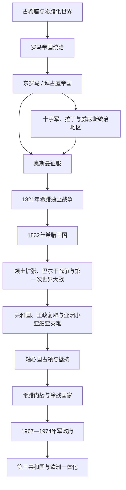

# 希腊

## 概括

现代希腊国家建立于19世纪独立战争之后，其历史背景包括古希腊城邦与希腊化世界、罗马和东罗马帝国、拉丁与威尼斯势力、奥斯曼统治及东地中海希腊语社群。古希腊遗产重要，但现代国家不是古代城邦的直接政治延续。

## 演变关系

## 统治结构与政治阶段

| 阶段 | 时间 | 统治结构 |
|---|---|---|
| 拜占庭与后拜占庭希腊世界 | 4—15世纪及以后 | 希腊语逐渐成为东罗马核心语言，帝国、教会、城市和地方贵族共同构成社会。 |
| 奥斯曼与威尼斯时期 | 15世纪—1821年 | 大部分希腊地区受奥斯曼统治，部分岛屿和沿海地区长期受威尼斯等势力控制。 |
| 希腊王国 | 1832—1924年、1935—1973年 | 君主制与议会政治并存，期间多次政变、战争和宪政调整。 |
| 共和国与军政府 | 1924年至今的若干阶段 | 共和国、王政复辟、军事独裁和1974年后的议会共和国先后出现。 |

## 重要事件

- [古希腊](/%E4%BA%BA%E6%96%87%E7%A7%91%E5%AD%A6/%E5%8E%86%E5%8F%B2/%E6%AC%A7%E6%B4%B2/_%E9%80%9A%E5%8F%B2/%E5%8F%A4%E5%B8%8C%E8%85%8A/README.md)包括城邦、马其顿和希腊化世界，不等于现代希腊国家史。
- 1453年君士坦丁堡陷落并非所有希腊地区同时进入奥斯曼统治，征服和地方变化持续更久。
- 1821年独立战争在列强干预和地方军事政治力量作用下建立希腊国家。
- 19世纪至巴尔干战争期间，希腊通过战争和外交扩大领土。
- 1919—1922年希土战争失败及人口交换重塑希腊社会，被称为小亚细亚灾难。
- 第二次世界大战占领后爆发内战，希腊进入西方冷战阵营。
- 1974年军政府垮台后建立第三共和国，1981年加入欧洲共同体。

## 关键辨析

- 拜占庭帝国是多地区罗马帝国，不应简单改称“中世纪希腊帝国”。
- 现代希腊认同继承古典、东正教、拜占庭和近代民族主义等多重传统。
- 希腊与土耳其、北马其顿、阿尔巴尼亚及塞浦路斯的边界和记忆问题需要分别处理。

## 上级

- [东南欧与巴尔干](/%E4%BA%BA%E6%96%87%E7%A7%91%E5%AD%A6/%E5%8E%86%E5%8F%B2/%E6%AC%A7%E6%B4%B2/%E4%B8%9C%E5%8D%97%E6%AC%A7%E4%B8%8E%E5%B7%B4%E5%B0%94%E5%B9%B2/README.md)
