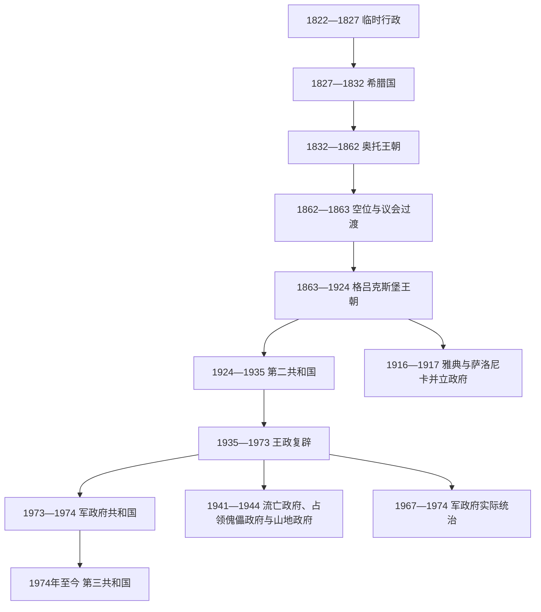

# 希腊国家元首与政府首脑表

[希腊](/%E4%BA%BA%E6%96%87%E7%A7%91%E5%AD%A6/%E5%8E%86%E5%8F%B2/%E6%AC%A7%E6%B4%B2/%E4%B8%9C%E5%8D%97%E6%AC%A7%E4%B8%8E%E5%B7%B4%E5%B0%94%E5%B9%B2/%E5%B8%8C%E8%85%8A.md) · [东南欧与巴尔干](/%E4%BA%BA%E6%96%87%E7%A7%91%E5%AD%A6/%E5%8E%86%E5%8F%B2/%E6%AC%A7%E6%B4%B2/%E4%B8%9C%E5%8D%97%E6%AC%A7%E4%B8%8E%E5%B7%B4%E5%B0%94%E5%B9%B2/README.md)

## 范围与口径

本表从1822年第一次国民议会建立全国性临时行政机关起，按政体分列法定国家元首、摄政、政府首脑和实际权力中心。1821年各地先后成立伯罗奔尼撒元老院、希腊大陆东西部地区机构等革命政府，但当时不存在一位获全境承认的单一国家元首，因此不把地方首脑硬接入全国世系。

1923年3月前，希腊官方使用儒略历；表中早期精确日月沿用常见希腊任期表口径，与公历换算通常相差12日或13日。革命、政变、国王离境、候任者尚未抵达等时段会出现一两日空档或并列日期；这些是制度交接和历法口径，不等于凭空出现两个同等合法政府。连续执政但跨越选举或内阁重组的任期，在资料明确分段时分别列出；同一人物不连续组阁一律另列。现实状态核验至2026年7月14日。

## 全国革命行政与希腊国元首（1822—1833）

这一时期通常被后世称为“第一希腊共和国”，但早期正式名称是“希腊临时行政”，1827年后称“希腊国”。执行机构主席或总督兼具元首与政府首脑性质。

| 顺序 | 人物或机构 | 任期 | 法定身份 | 继任与关键说明 |
|---:|---|---|---|---|
| 1 | 亚历山德罗斯·马夫罗科尔达托斯（Alexandros Mavrokordatos） | 1822-01-15—1823-04-26 | 执行机构主席 | 首届全国临时行政的政治首脑；塞奥多罗斯·内格里斯另任“部长会议主席”。 |
| 2 | 佩特罗斯·马夫罗米哈利斯（Petros Mavromichalis） | 1823-04-26—1824-01-05 | 执行机构主席 | 第二届执行机构主席。 |
| 3 | 乔治奥斯·孔图里奥蒂斯（Georgios Kountouriotis） | 1824-01-06—1826-04-17 | 执行机构主席 | 任期覆盖革命内战和易卜拉欣帕夏进攻。 |
| 4 | 安德烈亚斯·扎伊米斯（Andreas Zaimis） | 1826-04-18—1827-03-26 | 政府委员会主席 | 危机中的集体行政首脑。 |
| — | 1827年副总督委员会 | 1827-04-03—1828-01-20 | 三人代行机关 | 乔治奥斯·马夫罗米哈利斯、爱奥尼斯·米莱蒂斯、爱奥尼斯·纳科斯代候任总督执政。 |
| 5 | **爱奥尼斯·卡波季斯特里亚斯（Ioannis Kapodistrias）** | 1828-01-18／20—1831-09-27（旧历） | 希腊总督 | 元首与政府首脑合一；1831-10-09公历遇刺。就任日常见1月18日与20日两种行政口径。 |
| 6 | 奥古斯蒂诺斯·卡波季斯特里亚斯（Augustinos Kapodistrias） | 1831-09-27—1832-03-28 | 行政委员会主席 | 与科莱蒂斯、科洛科特罗尼斯共同组成委员会，后辞职。 |
| — | 1832年行政委员会 | 1832-03-28—1833-01-25 | 五人集体元首／政府 | 在奥托已获列强承认但尚未抵达的过渡期实际治理。 |

## 维特尔斯巴赫王朝、摄政与1862年空位期

| 顺序 | 君主、摄政或过渡机关 | 任期 | 法定地位 | 实际权力与备注 |
|---:|---|---|---|---|
| 1 | **奥托（Otto）** | 1832-05-07—1862-10-23（公历） | 希腊国王 | 1832年伦敦会议确立王位；1833年到达希腊，未成年期由摄政院执政；1862年革命废黜并流亡。 |
| — | 第一摄政院：阿尔曼斯佩格、海德克、毛雷尔 | 1833-02-06—1834-07-21 | 代未成年国王行使王权 | 阿尔曼斯佩格任主席，三人集体表决；秘书卡尔·冯·阿贝尔是替补成员，不另列为独立元首。 |
| — | 第二摄政院：阿尔曼斯佩格、埃吉德·冯·科贝尔、约翰·巴普蒂斯特·冯·格赖纳 | 1834-07-21—1835-06-01 | 代未成年国王行使王权 | 毛雷尔、海德克被更换；奥托成年后摄政终止。 |
| — | 阿玛莉亚王后（Amalia） | 1836—1862年间数次短期 | 国王患病或离开首都时的摄政 | 不是一段连续统治，现有通行名录不为每次短期代行提供统一起止日。 |
| — | 武尔加里斯、卡纳里斯、鲁福斯三人临时政府 | 1862-10-23—1863-10-19前后 | 革命后的集体最高行政 | 宣布奥托王朝终结，召集国民议会并选立新王；其内部政府首脑另见下表。 |
| — | 第二国民议会／“治理议会” | 1862-10—1863-10 | 空位期主权与制宪机关 | 希腊宪制史上罕见由议会直接主导治理的阶段。乔治一世1863-03-30获选，但至10月抵达后才全面履职。 |

## 格吕克斯堡王朝君主与摄政（1863—1924）

| 顺序 | 君主或摄政 | 任期 | 王室／身份 | 继承、复位与离境说明 |
|---:|---|---|---|---|
| 1 | **乔治一世（George I）** | 1863-03-30—1913-03-18 | 格吕克斯堡王朝国王 | 由国民议会选立，1913年在塞萨洛尼基遇刺。 |
| — | 石勒苏益格—荷尔斯泰因—松德堡—格吕克斯堡的约翰亲王 | 1867-03—1867-11 | 摄政 | 乔治一世赴欧洲访问时代行王权。 |
| 2 | 康斯坦丁一世（Constantine I），第一次 | 1913-03-18—1917-06-11 | 乔治一世长子 | 因民族分裂及协约国压力退位并离境。 |
| 3 | 亚历山大（Alexander） | 1917-06-11—1920-10-25 | 康斯坦丁一世次子 | 父兄被排除后即位；在任内病逝。 |
| — | 帕夫洛斯·孔图里奥蒂斯（Pavlos Kountouriotis） | 1920-10-28—1920-11-17 | 摄政 | 亚历山大死后代行王权，选举后辞职。 |
| — | 奥尔加王太后（Queen Olga） | 1920-11-17—1920-12-19 | 摄政 | 乔治一世遗孀，主持至康斯坦丁一世复位。 |
| 2（复位） | 康斯坦丁一世，第二次 | 1920-12-19—1922-09-27 | 复位国王 | 经1920年公投复位；小亚细亚战败后的革命中再次退位。 |
| 4 | 乔治二世（George II），第一次 | 1922-09-27—1924-03-25 | 康斯坦丁一世长子 | 1923-12-20离境，1924年共和国成立后被废黜。 |
| — | 帕夫洛斯·孔图里奥蒂斯 | 1923-12-20—1924-03-25 | 摄政 | 代离境的乔治二世行使元首权，废君后转任共和国元首。 |

## 第二希腊共和国元首（1924—1935）

| 顺序 | 国家元首 | 任期 | 产生方式 | 终止与备注 |
|---:|---|---|---|---|
| 1 | 帕夫洛斯·孔图里奥蒂斯 | 1924-03-25—1926-04-06 | 先由摄政转为临时元首，后当选总统 | 1926年在潘加洛斯压力下辞职。 |
| 2 | 塞奥多罗斯·潘加洛斯（Theodoros Pangalos） | 1926-04-06—1926-04-18 | 军事强人临时代行 | 在掌握独裁权力后安排总统选举。 |
| 2 | 塞奥多罗斯·潘加洛斯 | 1926-04-18—1926-08-22 | 当选总统 | 被孔迪利斯政变推翻。 |
| 1（复任） | 帕夫洛斯·孔图里奥蒂斯 | 1926-08-22／24—1929-12-10 | 政变后恢复职位 | 8月22日为政变恢复、24日为正式复任常见口径；1929年辞职。 |
| 3 | 亚历山德罗斯·扎伊米斯（Alexandros Zaimis） | 1929-12-10／14—1935-10-10 | 议会选举总统，1933年连任 | 12月10日当选、14日就职；1935年孔迪利斯政变废黜共和国。 |

## 复辟王国、摄政与军政府元首（1935—1974）

| 顺序 | 君主、摄政或总统 | 任期 | 法定身份 | 实际状态与备注 |
|---:|---|---|---|---|
| — | 乔治奥斯·孔迪利斯（Georgios Kondylis） | 1935-10-10—1935-11-25 | 摄政 | 政变废除共和国并主持复辟；部分摄政名录以11月22日为终点，11月25日为国王实际返国。 |
| 1（复位） | **乔治二世** | 1935-11-25—1947-04-01 | 国王 | 1941年轴心国占领后流亡，仍是国际承认政府的法定元首；1944—1946年由摄政代行。 |
| — | 达马斯基诺斯大主教（Archbishop Damaskinos） | 1944-12-31—1946-09-27 | 摄政 | 解放后在王制公投举行前代行王权；同时曾短期兼任政府首脑。 |
| 2 | 保罗（Paul） | 1947-04-01—1964-03-06 | 乔治二世之弟 | 在位期覆盖内战后期、重建和冷战结盟。 |
| — | 王储康斯坦丁 | 1964-02-20—1964-03-06 | 摄政 | 保罗术后病重期间代行，随后继位。 |
| 3 | 康斯坦丁二世（Constantine II） | 1964-03-06—1973-06-01 | 保罗之子、末代国王 | 1967-12-13反政变失败后流亡；军政府先以摄政名义统治，1973年自行废君。1974年公投才最终确认共和制。 |
| — | 乔治奥斯·佐伊塔基斯（Georgios Zoitakis） | 1967-12-13—1972-03-21 | 代流亡国王的摄政 | 由军政府任命，不代表国王能自由行使王权。 |
| — | **乔治奥斯·帕帕多普洛斯（Georgios Papadopoulos）** | 1972-03-21—1973-05-31 | 自任摄政 | 同时是军政府强人和政府首脑，法定职位与实际权力高度集中。 |
| 1 | **乔治奥斯·帕帕多普洛斯** | 1973-06-01—1973-11-25 | 军政府设立的共和国总统 | 1973年军政府公投确认其设计的共和制；后被约阿尼迪斯发动的内部政变推翻。 |
| 2 | 费宗·吉齐基斯（Phaedon Gizikis） | 1973-11-25—1974-12-18 | 军政府总统；1974-07-24后暂留任 | 1973—1974年实际权力在季米特里奥斯·约阿尼迪斯军官集团；民主恢复后暂任过渡元首。 |

## 第三希腊共和国总统与代理总统（1974—2026）

| 顺序 | 总统或代理者 | 任期 | 性质 | 关键说明 |
|---:|---|---|---|---|
| — | 费宗·吉齐基斯 | 1974-07-24—1974-12-18 | 前军政府元首暂留任 | 文官政府恢复后已不再是实际最高统治者。 |
| 1 | 米哈伊尔·斯塔西诺普洛斯（Michail Stasinopoulos） | 1974-12-18—1975-07-19 | 议会选出的临时总统 | 1975年新宪法前后过渡。 |
| 2 | 康斯坦丁诺斯·察佐斯（Konstantinos Tsatsos） | 1975-07-19—1980-05-10 | 总统 | 新民主党。 |
| 3 | **康斯坦丁诺斯·卡拉曼利斯（Konstantinos Karamanlis）**，第一次 | 1980-05-10—1985-03-10 | 总统 | 辞职后由议长代理。 |
| — | 爱奥尼斯·阿莱夫拉斯（Ioannis Alevras） | 1985-03-10—1985-03-30 | 国会议长代理总统 | 宪法规定的短期代行。 |
| 4 | 赫里斯托斯·萨尔泽塔基斯（Christos Sartzetakis） | 1985-03-30—1990-05-05 | 总统 | 无党派法官。 |
| 3（再任） | **康斯坦丁诺斯·卡拉曼利斯** | 1990-05-05—1995-03-10 | 总统 | 第二个非连续任期。 |
| 5 | 康斯坦丁诺斯·斯特凡诺普洛斯（Konstantinos Stephanopoulos） | 1995-03-10—2005-03-12 | 总统 | 连任两届。 |
| 6 | 卡罗洛斯·帕普利亚斯（Karolos Papoulias） | 2005-03-12—2015-03-13 | 总统 | 连任两届。 |
| 7 | 普罗科皮斯·帕夫洛普洛斯（Prokopis Pavlopoulos） | 2015-03-13—2020-03-13 | 总统 | 新民主党背景。 |
| 8 | 卡泰里娜·萨凯拉罗普卢（Katerina Sakellaropoulou） | 2020-03-13—2025-03-13 | 总统 | 希腊首位女性总统。 |
| 9 | **康斯坦丁诺斯·塔苏拉斯（Konstantinos Tasoulas）** | 2025-03-13—至今 | 总统 | 2025-02-12由议会选出；截至2026-07-14仍在任。 |

## 政府首脑：革命行政、希腊国与奥托时期（1822—1863）

1822—1833年的“执行机构主席”“政府委员会主席”或“总督”并非后来议会制意义的总理；本表按实际主持全国行政的连续段列出。1833—1843年间又曾使用“部长会议主席”“国务首席秘书”等不同称号。

| 顺序 | 政府首脑 | 任期 | 政党／性质 | 关键说明 |
|---:|---|---|---|---|
| 1 | 亚历山德罗斯·马夫罗科尔达托斯（Alexandros Mavrokordatos） | 1822-01-15—1823-04-26 | 无党派／独立人士 | 执行机构主席；塞奥多罗斯·内格里斯另任“部长会议主席”，两职不可混同。 |
| 2 | 佩特罗斯·马夫罗米哈利斯（Petros Mavromichalis） | 1823-04-26—1824-01-05 | 无党派／独立人士 |  |
| 3 | 乔治奥斯·孔图里奥蒂斯（Georgios Kountouriotis） | 1824-01-06—1826-04-17 | 无党派／独立人士 |  |
| 4 | 安德烈亚斯·扎伊米斯（Andreas Zaimis） | 1826-04-18—1827-03-26 | 无党派／独立人士 |  |
| 5 | 1827年副总督委员会 | 1827-04-03—1828-01-20 | 无党派／独立人士 | 三人委员会代候任总督卡波季斯特里亚执政。 |
| 6 | **爱奥尼斯·卡波季斯特里亚斯（Ioannis Kapodistrias）** | 1828-01-20—1831-09-27 | 无党派／独立人士 | 希腊总督，国家元首与政府首脑合一；1831年遇刺。 |
| 7 | 奥古斯蒂诺斯·卡波季斯特里亚斯（Augustinos Kapodistrias） | 1831-09-27—1832-03-28 | 无党派／独立人士 | 卡波季斯特里亚遇刺后先主持三人行政委员会，1831年12月国民议会又确认其为“希腊政府主席”；机构改组日期与旧历换算不应误作政府首脑空缺。 |
| 8 | 1832年行政委员会 | 1832-03-28—1833-01-25 | 无党派／独立人士 | 五人行政委员会，延续至奥托抵达。 |
| 9 | 斯皮里宗·特里库皮斯（Spyridon Trikoupis） | 1833-01-25—1833-04-03 | 英国党 | 部长会议主席；第一段任期。 |
| 10 | 斯皮里宗·特里库皮斯（Spyridon Trikoupis） | 1833-04-03—1833-10-12 | 英国党 | 部长会议主席；内阁重组后的连续第二段。 |
| 11 | 亚历山德罗斯·马夫罗科尔达托斯（Alexandros Mavrokordatos） | 1833-10-12—1834-05-31 | 英国党 |  |
| 12 | 爱奥尼斯·科莱蒂斯（Ioannis Kolettis） | 1834-05-31—1835-05-09 | 法国党 |  |
| 13 | 约瑟夫·路德维希·冯·阿尔曼斯佩格伯爵（Count Josef Ludwig von Armansperg） | 1835-05-09—1837-02-02 | 无党派／独立人士 | 国务首席秘书；摄政结束后仍主持政府。 |
| 14 | 伊格纳茨·冯·鲁德哈特（Ignaz von Rudhart） | 1837-02-02—1837-12-08 | 无党派／独立人士 |  |
| 15 | **奥托国王（King Otto）** | 1837-12-08—1841-06-24 | 无党派／独立人士 | 君主亲自监督内阁，未另设独立政府首脑。 |
| 16 | 亚历山德罗斯·马夫罗科尔达托斯（Alexandros Mavrokordatos） | 1841-06-24—1841-08-10 | 英国党 |  |
| 17 | **奥托国王（King Otto）** | 1841-08-10—1843-09-03 | 无党派／独立人士 | 再次亲自监督内阁，至1843年九月革命。 |
| 18 | 安德烈亚斯·梅塔克萨斯（Andreas Metaxas） | 1843-09-03—1844-02-12 | 俄国党 | 九月革命后的临时内阁，筹备制宪会议。 |
| 19 | 康斯坦丁诺斯·卡纳里斯（Konstantinos Kanaris） | 1844-02-12—1844-03-30 | 俄国党 | 临时内阁，1844年宪法通过。 |
| 20 | 亚历山德罗斯·马夫罗科尔达托斯（Alexandros Mavrokordatos） | 1844-03-30—1844-08-04 | 英国党 | 看守内阁，组织1844年选举。 |
| 21 | 爱奥尼斯·科莱蒂斯（Ioannis Kolettis） | 1844-08-06—1847-09-05 | 法国党 | 在任内去世。 |
| 22 | 基佐斯·察韦拉斯（Kitsos Tzavelas） | 1847-09-05—1848-03-08 | 俄国党 |  |
| 23 | 乔治奥斯·孔图里奥蒂斯（Georgios Kountouriotis） | 1848-03-08—1848-10-12 | 法国党 |  |
| 24 | 康斯坦丁诺斯·卡纳里斯（Konstantinos Kanaris） | 1848-10-27—1849-12-14 | 俄国党 |  |
| 25 | 安东尼奥斯·克里耶齐斯（Antonios Kriezis） | 1849-12-14—1854-05-16 | 英国党 | 克里米亚战争期间在英法压力下辞职。 |
| 26 | 亚历山德罗斯·马夫罗科尔达托斯（Alexandros Mavrokordatos） | 1854-05-16—1855-09-29 | 英国党 | 英法军队在比雷埃夫斯驻扎背景下的“占领内阁”。 |
| 27 | 季米特里奥斯·武尔加里斯（Dimitrios Voulgaris） | 1855-09-29—1857-11-13 | 法国党 |  |
| 28 | 阿塔纳西奥斯·米奥利斯（Athanasios Miaoulis） | 1857-11-13—1862-05-26 | 军方 |  |
| 29 | 根奈奥斯·科洛科特罗尼斯（Gennaios Kolokotronis） | 1862-05-26—1862-10-11 | 军方 | 奥托被推翻后辞职。 |
| 30 | 季米特里奥斯·武尔加里斯（Dimitrios Voulgaris） | 1862-10-11—1863-02-09 | 法国党 | 推翻奥托后的临时政府首脑，并主持选举。 |
| 31 | 阿里斯泰迪斯·莫赖蒂尼斯（Aristeidis Moraitinis） | 1863-02-09—1863-02-11 | 法国党 |  |
| 32 | 齐诺维奥斯·瓦尔维斯（Zinovios Valvis） | 1863-02-11—1863-03-25 | 无党派／独立人士 |  |
| 33 | 迪奥米迪斯·基里亚科斯（Diomidis Kyriakos） | 1863-03-27—1863-04-29 | 无党派／独立人士 |  |
| 34 | 贝尼泽洛斯·鲁福斯（Benizelos Roufos） | 1863-04-29—1863-06-19 | 法国党 | 临时政府；6月骚乱中短暂离任。 |
| 35 | 贝尼泽洛斯·鲁福斯（Benizelos Roufos） | 1863-06-21—1863-10-18 | 法国党 | 复任临时政府首脑，至乔治一世抵达前夕。 |

## 政府首脑：格吕克斯堡王朝第一阶段（1863—1924）

下表保留每一段连续任职。同一人重返职位另列；1916—1917年雅典王党政府与萨洛尼卡民族防卫政府并行，不能把重叠日期视为抄录错误。

| 顺序 | 政府首脑 | 任期 | 政党／性质 | 关键说明 |
|---:|---|---|---|---|
| 1 | 季米特里奥斯·武尔加里斯（Dimitrios Voulgaris） | 1863-10-25—1864-03-05 | 法国党 |  |
| 2 | 康斯坦丁诺斯·卡纳里斯（Konstantinos Kanaris） | 1864-03-05—1864-04-16 | 俄国党 |  |
| 3 | 齐诺维奥斯·瓦尔维斯（Zinovios Valvis） | 1864-04-16—1864-07-26 | 无党派／独立人士 |  |
| 4 | 康斯坦丁诺斯·卡纳里斯（Konstantinos Kanaris） | 1864-07-26—1865-03-02 | 俄国党 |  |
| 5 | 亚历山德罗斯·库蒙杜罗斯（Alexandros Koumoundouros） | 1865-03-02—1865-10-20 | 民族党 |  |
| 6 | 埃帕米农达斯·德利耶奥尔吉斯（Epameinondas Deligeorgis） | 1865-10-20—1865-11-03 | 民族委员会 |  |
| 7 | 季米特里奥斯·武尔加里斯（Dimitrios Voulgaris） | 1865-11-03—1865-11-06 | 无党派／独立人士 |  |
| 8 | 亚历山德罗斯·库蒙杜罗斯（Alexandros Koumoundouros） | 1865-11-06—1865-11-13 | 民族党 |  |
| 9 | 埃帕米农达斯·德利耶奥尔吉斯（Epameinondas Deligeorgis） | 1865-11-13—1865-11-28 | 民族委员会 |  |
| 10 | 贝尼泽洛斯·鲁福斯（Benizelos Roufos） | 1865-11-28—1866-06-09 | 无党派／独立人士 |  |
| 11 | 季米特里奥斯·武尔加里斯（Dimitrios Voulgaris） | 1866-06-09—1866-12-17 | 无党派／独立人士 |  |
| 12 | 亚历山德罗斯·库蒙杜罗斯（Alexandros Koumoundouros） | 1866-12-18—1867-12-20 | 民族党 |  |
| 13 | 阿里斯泰迪斯·莫赖蒂尼斯（Aristeidis Moraitinis） | 1867-12-20—1868-01-25 | 无党派／独立人士 |  |
| 14 | 季米特里奥斯·武尔加里斯（Dimitrios Voulgaris） | 1868-01-25—1869-01-25 | 无党派／独立人士 |  |
| 15 | 特拉西武洛斯·扎伊米斯（Thrasyvoulos Zaimis） | 1869-01-25—1870-07-09 | 无党派／独立人士 |  |
| 16 | 埃帕米农达斯·德利耶奥尔吉斯（Epameinondas Deligeorgis） | 1870-07-09—1870-12-03 | 民族委员会 |  |
| 17 | 亚历山德罗斯·库蒙杜罗斯（Alexandros Koumoundouros） | 1870-12-03—1871-10-28 | 民族党 |  |
| 18 | 特拉西武洛斯·扎伊米斯（Thrasyvoulos Zaimis） | 1871-10-28—1871-12-25 | 无党派／独立人士 |  |
| 19 | 季米特里奥斯·武尔加里斯（Dimitrios Voulgaris） | 1871-12-25—1872-07-08 | 无党派／独立人士 |  |
| 20 | 埃帕米农达斯·德利耶奥尔吉斯（Epameinondas Deligeorgis） | 1872-07-08—1874-02-09 | 民族委员会 |  |
| 21 | 季米特里奥斯·武尔加里斯（Dimitrios Voulgaris） | 1874-02-09—1875-04-27 | 无党派／独立人士 |  |
| 22 | 哈里拉奥斯·特里库皮斯（Charilaos Trikoupis） | 1875-04-27—1875-10-15 | 新党 |  |
| 23 | 亚历山德罗斯·库蒙杜罗斯（Alexandros Koumoundouros） | 1875-10-15—1876-11-26 | 民族党 |  |
| 24 | 埃帕米农达斯·德利耶奥尔吉斯（Epameinondas Deligeorgis） | 1876-11-26—1876-12-01 | 民族委员会 |  |
| 25 | 亚历山德罗斯·库蒙杜罗斯（Alexandros Koumoundouros） | 1876-12-01—1877-02-26 | 民族党 |  |
| 26 | 埃帕米农达斯·德利耶奥尔吉斯（Epameinondas Deligeorgis） | 1877-02-26—1877-05-19 | 民族委员会 |  |
| 27 | 亚历山德罗斯·库蒙杜罗斯（Alexandros Koumoundouros） | 1877-05-19—1877-05-26 | 民族党 |  |
| 28 | 康斯坦丁诺斯·卡纳里斯（Konstantinos Kanaris） | 1877-05-26—1877-09-02 | 无党派／独立人士 | 民族团结内阁；本人1877-09-02在任内去世。 |
| 29 | 卡纳里斯民族团结内阁阁员集体轮值 | 1877-09-02—1878-01-11 | 联合内阁／集体主持 | 卡纳里斯去世后没有另立单一正式总理，各部长轮流主持，至库蒙杜罗斯组阁。 |
| 30 | 亚历山德罗斯·库蒙杜罗斯（Alexandros Koumoundouros） | 1878-01-11—1878-10-21 | 民族党 |  |
| 31 | 哈里拉奥斯·特里库皮斯（Charilaos Trikoupis） | 1878-10-21—1878-10-26 | 新党 |  |
| 32 | 亚历山德罗斯·库蒙杜罗斯（Alexandros Koumoundouros） | 1878-10-26—1880-03-10 | 民族党 |  |
| 33 | 哈里拉奥斯·特里库皮斯（Charilaos Trikoupis） | 1880-03-10—1880-10-13 | 新党 |  |
| 34 | 亚历山德罗斯·库蒙杜罗斯（Alexandros Koumoundouros） | 1880-10-13—1882-03-03 | 民族党 |  |
| 35 | 哈里拉奥斯·特里库皮斯（Charilaos Trikoupis） | 1882-03-03—1885-04-19 | 新党 |  |
| 36 | 塞奥多罗斯·德利扬尼斯（Theodoros Deligiannis） | 1885-04-19—1886-04-30 | 民族党 |  |
| 37 | 季米特里奥斯·瓦尔维斯（Dimitrios Valvis） | 1886-04-30—1886-05-09 | 无党派／独立人士 |  |
| 38 | 哈里拉奥斯·特里库皮斯（Charilaos Trikoupis） | 1886-05-09—1890-10-24 | 新党 |  |
| 39 | 塞奥多罗斯·德利扬尼斯（Theodoros Deligiannis） | 1890-10-24—1892-02-18 | 民族党 |  |
| 40 | 康斯坦丁诺斯·康斯坦托普洛斯（Konstantinos Konstantopoulos） | 1892-02-10—1892-06-10 | 民族党 | 任期表与前任终止日存在旧历／新历换算重叠，不代表两内阁共享合法权力。 |
| 41 | 哈里拉奥斯·特里库皮斯（Charilaos Trikoupis） | 1892-06-10—1893-05-03 | 新党 |  |
| 42 | 索蒂里奥斯·索蒂罗普洛斯（Sotirios Sotiropoulos） | 1893-05-03—1893-10-30 | 无党派／独立人士 |  |
| 43 | 哈里拉奥斯·特里库皮斯（Charilaos Trikoupis） | 1893-10-30—1895-01-12 | 新党 |  |
| 44 | 尼古拉奥斯·德利扬尼斯（Nikolaos Deligiannis） | 1895-01-12—1895-05-31 | 民族党 |  |
| 45 | 塞奥多罗斯·德利扬尼斯（Theodoros Deligiannis） | 1895-05-31—1897-04-18 | 民族党 |  |
| 46 | 季米特里奥斯·拉利斯（Dimitrios Rallis） | 1897-04-18—1897-09-21 | 无党派／独立人士 |  |
| 47 | 亚历山德罗斯·扎伊米斯（Alexandros Zaimis） | 1897-09-21—1899-04-02 | 无党派／独立人士 |  |
| 48 | 乔治奥斯·塞奥托基斯（Georgios Theotokis） | 1899-04-02—1901-11-12 | 新党 |  |
| 49 | 亚历山德罗斯·扎伊米斯（Alexandros Zaimis） | 1901-11-12—1902-11-18 | 无党派／独立人士 |  |
| 50 | 塞奥多罗斯·德利扬尼斯（Theodoros Deligiannis） | 1902-11-24—1903-06-14 | 民族党 |  |
| 51 | 乔治奥斯·塞奥托基斯（Georgios Theotokis） | 1903-06-14—1903-06-28 | 新党 |  |
| 52 | 季米特里奥斯·拉利斯（Dimitrios Rallis） | 1903-06-28—1903-12-06 | 无党派／独立人士 |  |
| 53 | 乔治奥斯·塞奥托基斯（Georgios Theotokis） | 1903-12-06—1904-12-17 | 新党 |  |
| 54 | 塞奥多罗斯·德利扬尼斯（Theodoros Deligiannis） | 1904-12-17—1905-06-09 | 民族党 |  |
| 55 | 季米特里奥斯·拉利斯（Dimitrios Rallis） | 1905-06-09—1905-12-08 | 无党派／独立人士 |  |
| 56 | 乔治奥斯·塞奥托基斯（Georgios Theotokis） | 1905-12-08—1909-07-07 | 新党 |  |
| 57 | 季米特里奥斯·拉利斯（Dimitrios Rallis） | 1909-07-07—1909-08-15 | 无党派／独立人士 | 古迪军事政变中下台。 |
| 58 | 基里亚库利斯·马夫罗米哈利斯（Kyriakoulis Mavromichalis） | 1909-08-15—1910-01-18 | 民族党 | 在军事联盟监督下执政。 |
| 59 | 斯特凡诺斯·德拉古米斯（Stefanos Dragoumis） | 1910-01-18—1910-10-06 | 无党派／独立人士 |  |
| 60 | **埃莱夫塞里奥斯·韦尼泽洛斯（Eleftherios Venizelos）** | 1910-10-06—1915-02-25 | 自由党 | 连续执政，涵盖1910年11月及1912年选后内阁；与君主在参战问题上决裂。 |
| 61 | 季米特里奥斯·古纳里斯（Dimitrios Gounaris） | 1915-02-25—1915-08-10 | 人民党 |  |
| 62 | **埃莱夫塞里奥斯·韦尼泽洛斯（Eleftherios Venizelos）** | 1915-08-10—1915-09-24 | 自由党 | 再度因第一次世界大战参战问题与君主冲突而辞职。 |
| 63 | 亚历山德罗斯·扎伊米斯（Alexandros Zaimis） | 1915-09-24—1915-10-25 | 无党派／独立人士 |  |
| 64 | 斯特凡诺斯·斯库卢迪斯（Stefanos Skouloudis） | 1915-10-25—1916-06-09 | 无党派／独立人士 |  |
| 65 | 亚历山德罗斯·扎伊米斯（Alexandros Zaimis） | 1916-06-09—1916-09-03 | 无党派／独立人士 |  |
| 66 | 尼古拉奥斯·卡洛耶罗普洛斯（Nikolaos Kalogeropoulos） | 1916-09-03—1916-09-27 | 无党派／独立人士 | 雅典王党政府，仅控制南部；与萨洛尼卡政府并立。 |
| 67 | 斯皮里宗·兰布罗斯（Spyridon Lambros） | 1916-09-27—1917-04-21 | 无党派／独立人士 | 雅典王党政府；与萨洛尼卡政府并立。 |
| 68 | 亚历山德罗斯·扎伊米斯（Alexandros Zaimis） | 1917-04-21—1917-06-14 | 无党派／独立人士 | 雅典王党政府末期。 |
| 69 | **埃莱夫塞里奥斯·韦尼泽洛斯（Eleftherios Venizelos）** | 1916-09-27—1917-06-14 | 自由党 | 萨洛尼卡“民族防卫临时政府”，控制北部、爱琴海岛屿与克里特，获协约国承认。 |
| 70 | **埃莱夫塞里奥斯·韦尼泽洛斯（Eleftherios Venizelos）** | 1917-06-14—1920-11-04 | 自由党 | 全国统一后的韦尼泽洛斯政府，正式参加第一次世界大战。 |
| 71 | 季米特里奥斯·拉利斯（Dimitrios Rallis） | 1920-11-04—1921-01-24 | 人民党 |  |
| 72 | 尼古拉奥斯·卡洛耶罗普洛斯（Nikolaos Kalogeropoulos） | 1921-01-24—1921-03-26 | 人民党 |  |
| 73 | 季米特里奥斯·古纳里斯（Dimitrios Gounaris） | 1921-03-26—1922-05-03 | 人民党 |  |
| 74 | 尼古拉奥斯·斯特拉托斯（Nikolaos Stratos） | 1922-05-03—1922-05-09 | 人民党 |  |
| 75 | 佩特罗斯·普罗托帕帕达基斯（Petros Protopapadakis） | 1922-05-09—1922-08-28 | 人民党 |  |
| 76 | 尼古拉奥斯·特里安塔菲拉科斯（Nikolaos Triantafyllakos） | 1922-08-28—1922-09-16 | 无党派／独立人士 | 小亚细亚灾难后的军事革命推翻政府。 |
| 77 | 阿纳斯塔西奥斯·哈拉兰比斯（Anastasios Charalambis） | 1922-09-16—1922-09-17 | 军方 | 因克罗基达斯尚未抵达雅典而任一日政府首脑。 |
| 78 | 索蒂里奥斯·克罗基达斯（Sotirios Krokidas） | 1922-09-17—1922-11-14 | 无党派／独立人士 | 军方监督下的临时政府；因“六人审判”辞职。 |
| 79 | 斯蒂利亚诺斯·戈纳塔斯（Stylianos Gonatas） | 1922-11-14—1924-01-11 | 军方 | 1922年革命委员会主导下的军人政府。 |
| 80 | **埃莱夫塞里奥斯·韦尼泽洛斯（Eleftherios Venizelos）** | 1924-01-11—1924-02-06 | 自由党 |  |
| 81 | 乔治奥斯·卡凡塔里斯（Georgios Kafantaris） | 1924-02-06—1924-03-12 | 自由党 |  |

## 政府首脑：第二希腊共和国（1924—1935）

| 顺序 | 政府首脑 | 任期 | 政党／性质 | 关键说明 |
|---:|---|---|---|---|
| 1 | 亚历山德罗斯·帕帕纳斯塔西乌（Alexandros Papanastasiou） | 1924-03-12—1924-07-24 | 无党派／独立人士 | 宣布共和国并由公投确认。 |
| 2 | 塞米斯托克利斯·索福利斯（Themistoklis Sofoulis） | 1924-07-24—1924-10-07 | 自由党 |  |
| 3 | 安德烈亚斯·米哈拉科普洛斯（Andreas Michalakopoulos） | 1924-10-07—1925-06-26 | 自由党 | 被1925年军事政变推翻。 |
| 4 | 塞奥多罗斯·潘加洛斯（Theodoros Pangalos） | 1925-06-26—1926-07-19 | 军方 | 建立军事独裁；后兼任共和国总统。 |
| 5 | 阿塔纳西奥斯·埃夫塔克西亚斯（Athanasios Eftaxias） | 1926-07-19—1926-08-23 | 无党派／独立人士 | 潘加洛斯独裁下的政府首脑。 |
| 6 | 乔治奥斯·孔迪利斯（Georgios Kondylis） | 1926-08-26—1926-12-04 | 军方 | 推翻潘加洛斯；自8月23日起实际掌权并主持看守政府。 |
| 7 | 亚历山德罗斯·扎伊米斯（Alexandros Zaimis） | 1926-12-04—1927-08-17 | 无党派／独立人士 |  |
| 8 | 亚历山德罗斯·扎伊米斯（Alexandros Zaimis） | 1927-08-17—1928-02-08 | 无党派／独立人士 |  |
| 9 | 亚历山德罗斯·扎伊米斯（Alexandros Zaimis） | 1928-02-08—1928-07-04 | 无党派／独立人士 |  |
| 10 | **埃莱夫塞里奥斯·韦尼泽洛斯（Eleftherios Venizelos）** | 1928-07-04—1929-06-07 | 自由党 |  |
| 11 | **埃莱夫塞里奥斯·韦尼泽洛斯（Eleftherios Venizelos）** | 1929-06-07—1929-12-16 | 自由党 |  |
| 12 | **埃莱夫塞里奥斯·韦尼泽洛斯（Eleftherios Venizelos）** | 1929-12-16—1932-05-26 | 自由党 |  |
| 13 | 亚历山德罗斯·帕帕纳斯塔西乌（Alexandros Papanastasiou） | 1932-05-26—1932-06-05 | 农业与劳工党 |  |
| 14 | **埃莱夫塞里奥斯·韦尼泽洛斯（Eleftherios Venizelos）** | 1932-06-05—1932-11-04 | 自由党 |  |
| 15 | 帕纳吉斯·察尔达里斯（Panagis Tsaldaris） | 1932-11-04—1933-01-16 | 人民党 |  |
| 16 | **埃莱夫塞里奥斯·韦尼泽洛斯（Eleftherios Venizelos）** | 1933-01-16—1933-03-06 | 自由党 | 政变相关的过渡政府。 |
| 17 | 亚历山德罗斯·奥索奈奥斯（Alexandros Othonaios） | 1933-03-06—1933-03-10 | 军方 | 韦尼泽洛斯派未遂军事行动中的四日紧急政府。 |
| 18 | 帕纳吉斯·察尔达里斯（Panagis Tsaldaris） | 1933-03-10—1935-10-10 | 人民党 | 镇压1935年未遂政变后被军方推翻，复辟王政。 |

## 政府首脑：复辟王国、战争、内战与军政府（1935—1974）

### 国际承认或宪制主线政府

1941—1944年这一列延续乔治二世名下的国际承认政府，1944年返回希腊；占领区傀儡政府和抵抗运动的竞争性政府另表列出。1967年以后表中“总理”是军政府设置的法定政府首脑，实际军权结构还需与后文对照。

| 顺序 | 政府首脑 | 任期 | 政党／性质 | 关键说明 |
|---:|---|---|---|---|
| 1 | 乔治奥斯·孔迪利斯（Georgios Kondylis） | 1935-10-10—1935-11-30 | 军方／民族激进党 | 政变推翻共和国，并以摄政身份推动王政复辟。 |
| 2 | 康斯坦丁诺斯·德梅尔齐斯（Konstantinos Demertzis） | 1935-11-30—1936-04-13 | 无党派／独立人士 | 无党派看守／妥协政府；在任内去世。 |
| 3 | **爱奥尼斯·梅塔克萨斯（Ioannis Metaxas）** | 1936-04-13—1941-01-29 | 无党派（原自由思想者党） | 1936-08-04起暂停议会并建立独裁政权。 |
| 4 | 亚历山德罗斯·科里齐斯（Alexandros Koryzis） | 1941-01-29—1941-04-18 | 无党派／独立人士 | 德军入侵、雅典即将失守时自杀。 |
| 5 | 乔治二世（George II） | 1941-04-18—1941-04-21 | 无党派／独立人士 | 科里齐斯死后短暂直接主持政府，至流亡政府首脑确定。 |
| 6 | 埃马努伊尔·楚德罗斯（Emmanouil Tsouderos） | 1941-04-21—1944-04-14 | 无党派／独立人士 | 国际承认政府；1941-05-23后先后流亡伦敦、开罗。 |
| 7 | 索福克利斯·韦尼泽洛斯（Sofoklis Venizelos） | 1944-04-14—1944-04-26 | 自由党 | 开罗流亡政府首脑。 |
| 8 | 乔治奥斯·帕潘德里欧（Georgios Papandreou） | 1944-04-26—1945-01-03 | 希腊民主社会党 | 流亡政府及后来的民族团结政府；1944-10-18返回雅典。 |
| 9 | 尼古拉奥斯·普拉斯蒂拉斯（Nikolaos Plastiras） | 1945-01-03—1945-04-08 | 无党派（自由派） |  |
| 10 | 佩特罗斯·武尔加里斯（Petros Voulgaris） | 1945-04-08—1945-08-11 | 军方 |  |
| 11 | 佩特罗斯·武尔加里斯（Petros Voulgaris） | 1945-08-11—1945-10-17 | 军方 |  |
| 12 | 达马斯基诺斯大主教（Archbishop Damaskinos） | 1945-10-17—1945-11-01 | 无党派／独立人士 |  |
| 13 | 帕纳约蒂斯·卡内洛普洛斯（Panagiotis Kanellopoulos） | 1945-11-01—1945-11-22 | 民族统一党 |  |
| 14 | 塞米斯托克利斯·索福利斯（Themistoklis Sofoulis） | 1945-11-22—1946-04-04 | 自由党 |  |
| 15 | 帕纳约蒂斯·普利察斯（Panagiotis Poulitsas） | 1946-04-04—1946-04-18 | 无党派／独立人士 | 高级法官主持的临时政府。 |
| 16 | 康斯坦丁诺斯·察尔达里斯（Konstantinos Tsaldaris） | 1946-04-18—1946-10-02 | 人民党 |  |
| 17 | 康斯坦丁诺斯·察尔达里斯（Konstantinos Tsaldaris） | 1946-10-02—1947-01-24 | 人民党 |  |
| 18 | 季米特里奥斯·马克西莫斯（Dimitrios Maximos） | 1947-01-24—1947-08-29 | 人民党 |  |
| 19 | 康斯坦丁诺斯·察尔达里斯（Konstantinos Tsaldaris） | 1947-08-29—1947-09-07 | 人民党 |  |
| 20 | 塞米斯托克利斯·索福利斯（Themistoklis Sofoulis） | 1947-09-07—1948-11-18 | 自由党 |  |
| 21 | 塞米斯托克利斯·索福利斯（Themistoklis Sofoulis） | 1948-11-18—1949-01-20 | 自由党 |  |
| 22 | 塞米斯托克利斯·索福利斯（Themistoklis Sofoulis） | 1949-01-20—1949-04-14 | 自由党 |  |
| 23 | 塞米斯托克利斯·索福利斯（Themistoklis Sofoulis） | 1949-04-14—1949-06-24 | 自由党 |  |
| 24 | 亚历山德罗斯·迪奥米迪斯（Alexandros Diomidis） | 1949-06-24（代理）／06-30（正式）—1950-01-06 | 自由党 | 索福利斯去世当日即以副总理身份代理，6月30日正式主持中右联合政府。 |
| 25 | 爱奥尼斯·塞奥托基斯（Ioannis Theotokis） | 1950-01-06—1950-03-23 | 人民党 | 看守政府。 |
| 26 | 索福克利斯·韦尼泽洛斯（Sofoklis Venizelos） | 1950-03-23—1950-04-15 | 自由党 |  |
| 27 | 尼古拉奥斯·普拉斯蒂拉斯（Nikolaos Plastiras） | 1950-04-15—1950-08-21 | 民族进步中间联盟 |  |
| 28 | 索福克利斯·韦尼泽洛斯（Sofoklis Venizelos） | 1950-08-21—1950-09-13 | 自由党 |  |
| 29 | 索福克利斯·韦尼泽洛斯（Sofoklis Venizelos） | 1950-09-13—1950-11-03 | 自由党 |  |
| 30 | 索福克利斯·韦尼泽洛斯（Sofoklis Venizelos） | 1950-11-03—1951-10-27 | 自由党 |  |
| 31 | 尼古拉奥斯·普拉斯蒂拉斯（Nikolaos Plastiras） | 1951-10-27—1952-10-11 | 民族进步中间联盟 |  |
| 32 | 季米特里奥斯·基乌索普洛斯（Dimitrios Kiousopoulos） | 1952-10-11—1952-11-19 | 无党派／独立人士 | 高级法官主持的看守政府。 |
| 33 | 亚历山德罗斯·帕帕戈斯（Alexandros Papagos） | 1952-11-19—1955-10-04 | 希腊阵线 | 陆军元帅；在任内去世。 |
| — | 斯特凡诺斯·斯特凡诺普洛斯（Stefanos Stefanopoulos） | 1955-10-04—1955-10-05 | 希腊阵线／代理 | 帕帕戈斯去世后以副总理身份短期代理，国王随后授权卡拉曼利斯组阁。 |
| 34 | **康斯坦丁诺斯·卡拉曼利斯（Konstantinos Karamanlis）** | 1955-10-06—1956-02-29 | 希腊阵线／民族激进联盟 |  |
| 35 | **康斯坦丁诺斯·卡拉曼利斯（Konstantinos Karamanlis）** | 1956-02-29—1958-03-05 | 希腊阵线／民族激进联盟 |  |
| 36 | 康斯坦丁诺斯·耶奥尔加科普洛斯（Konstantinos Georgakopoulos） | 1958-03-05—1958-05-17 | 无党派／独立人士 | 看守政府。 |
| 37 | **康斯坦丁诺斯·卡拉曼利斯（Konstantinos Karamanlis）** | 1958-05-17—1961-09-20 | 民族激进联盟 |  |
| 38 | 康斯坦丁诺斯·多瓦斯（Konstantinos Dovas） | 1961-09-20—1961-11-04 | 无党派／独立人士 | 退役将领、王室负责人主持的看守政府。 |
| 39 | **康斯坦丁诺斯·卡拉曼利斯（Konstantinos Karamanlis）** | 1961-11-04—1963-06-18 | 民族激进联盟 |  |
| 40 | 帕纳约蒂斯·皮皮内利斯（Panagiotis Pipinelis） | 1963-06-19—1963-09-28 | 民族激进联盟 |  |
| 41 | 斯蒂利亚诺斯·马夫罗米哈利斯（Stylianos Mavromichalis） | 1963-09-28—1963-11-08 | 无党派／独立人士 | 最高法院院长主持的看守政府。 |
| 42 | 乔治奥斯·帕潘德里欧（Georgios Papandreou） | 1963-11-08—1963-12-31 | 中间联盟 |  |
| 43 | 爱奥尼斯·帕拉斯凯沃普洛斯（Ioannis Paraskevopoulos） | 1963-12-31—1964-02-19 | 无党派／独立人士 | 希腊银行副行长主持的看守政府。 |
| 44 | 乔治奥斯·帕潘德里欧（Georgios Papandreou） | 1964-02-19—1965-07-15 | 中间联盟 |  |
| 45 | 乔治奥斯·阿塔纳西亚迪斯-诺瓦斯（Georgios Athanasiadis-Novas） | 1965-07-15—1965-08-20 | 无党派（原中间联盟） | 国王解除帕潘德里欧职务后形成的“叛教者”政府。 |
| 46 | 伊利亚斯·齐里莫科斯（Ilias Tsirimokos） | 1965-08-20—1965-09-17 | 无党派（原中间联盟） | 1965年王室—议会危机中的短命政府。 |
| 47 | 斯特凡诺斯·斯特凡诺普洛斯（Stefanos Stefanopoulos） | 1965-09-17—1966-12-22 | 自由民主中间派 | 1965年危机中的王室支持政府。 |
| 48 | 爱奥尼斯·帕拉斯凯沃普洛斯（Ioannis Paraskevopoulos） | 1966-12-22—1967-04-03 | 无党派／独立人士 | 看守政府。 |
| 49 | 帕纳约蒂斯·卡内洛普洛斯（Panagiotis Kanellopoulos） | 1967-04-03—1967-04-21 | 民族激进联盟 | 看守政府；4月21日军人政变推翻。 |
| 50 | 康斯坦丁诺斯·科利亚斯（Konstantinos Kollias） | 1967-04-21—1967-12-13 | 无党派／独立人士 | 军政府与国王妥协任命的文官总理，实权在军官集团。 |
| 51 | **乔治奥斯·帕帕多普洛斯（Georgios Papadopoulos）** | 1967-12-13—1973-10-08 | 军方 | 军政府强人兼政府首脑，后又兼摄政与总统。 |
| 52 | 斯皮罗斯·马尔凯齐尼斯（Spyros Markezinis） | 1973-10-08—1973-11-25 | 进步党 | 帕帕多普洛斯“有限自由化”方案的文官总理。 |
| 53 | 阿达曼蒂奥斯·安德鲁佐普洛斯（Adamantios Androutsopoulos） | 1973-11-25—1974-07-24 | 无党派／独立人士 | 约阿尼迪斯政变后的名义政府首脑。 |

### 轴心国占领区合作政府（1941—1944）

这些政府依附德国、意大利和保加利亚占领体系，不是国际承认的希腊流亡政府。

| 顺序 | 政府首脑 | 任期 | 政党／性质 | 关键说明 |
|---:|---|---|---|---|
| 1 | 乔治奥斯·措拉科格卢（Georgios Tsolakoglou） | 1941-04-30—1942-12-02 | 军方 |  |
| 2 | 康斯坦丁诺斯·洛戈塞托普洛斯（Konstantinos Logothetopoulos） | 1942-12-02—1943-04-07 | 无党派／独立人士 |  |
| 3 | 爱奥尼斯·拉利斯（Ioannis Rallis） | 1943-04-07—1944-10-12 | 人民党 |  |

### 民族解放政治委员会／“山地政府”（1944）

这是抵抗运动控制区的竞争性行政，并非当时国际承认的全国政府；黎巴嫩会议后其成员加入民族团结政府。

| 顺序 | 政府首脑 | 任期 | 政党／性质 | 关键说明 |
|---:|---|---|---|---|
| 1 | 埃夫里皮迪斯·巴基尔齐斯（Evripidis Bakirtzis） | 1944-03-10—1944-04-18 | 共产党 |  |
| 2 | 亚历山德罗斯·斯沃洛斯（Alexandros Svolos） | 1944-04-18—1944-09-02 | 社会党 |  |

### 内战中的临时民主政府（1947—1950）

共产党领导的竞争性政府在1949年军事失败后流亡；不能与雅典政府的法定总理世系合并。

| 顺序 | 政府首脑 | 任期 | 政党／性质 | 关键说明 |
|---:|---|---|---|---|
| 1 | 马科斯·瓦菲阿迪斯（Markos Vafeiadis） | 1947-12-24—1949-02-07 | 共产党 |  |
| 2 | 季米特里奥斯·帕察利迪斯（Dimitrios Partsalidis） | 1949-04-03—1950-10 | 共产党 |  |

## 政府首脑：第三希腊共和国（1974—2026）

| 顺序 | 政府首脑 | 任期 | 政党／性质 | 关键说明 |
|---:|---|---|---|---|
| 1 | **康斯坦丁诺斯·卡拉曼利斯（Konstantinos G. Karamanlis）** | 1974-07-24—1974-11-21 | 民族激进联盟 | 民族团结政府，恢复民主并处理塞浦路斯危机。 |
| 2 | **康斯坦丁诺斯·卡拉曼利斯（Konstantinos G. Karamanlis）** | 1974-11-21—1977-11-28 | 新民主党 |  |
| 3 | **康斯坦丁诺斯·卡拉曼利斯（Konstantinos G. Karamanlis）** | 1977-11-28—1980-05-10 | 新民主党 |  |
| 4 | 乔治奥斯·拉利斯（Georgios Rallis） | 1980-05-10—1981-10-21 | 新民主党 |  |
| 5 | 安德烈亚斯·帕潘德里欧（Andreas Papandreou） | 1981-10-21—1985-06-05 | 泛希腊社会主义运动 |  |
| 6 | 安德烈亚斯·帕潘德里欧（Andreas Papandreou） | 1985-06-05—1989-07-02 | 泛希腊社会主义运动 |  |
| 7 | 察尼斯·察内塔基斯（Tzannis Tzannetakis） | 1989-07-02—1989-10-12 | 新民主党 |  |
| 8 | 爱奥尼斯·格里瓦斯（Ioannis Grivas） | 1989-10-12—1989-11-23 | 无党派／独立人士 | 最高法院院长主持的看守政府。 |
| 9 | 色诺丰·佐洛塔斯（Xenophon Zolotas） | 1989-11-23—1990-04-11 | 无党派／独立人士 |  |
| 10 | 康斯坦丁诺斯·米佐塔基斯（Konstantinos Mitsotakis） | 1990-04-11—1993-10-13 | 新民主党 |  |
| 11 | 安德烈亚斯·帕潘德里欧（Andreas Papandreou） | 1993-10-13—1996-01-22 | 泛希腊社会主义运动 |  |
| 12 | 康斯坦丁诺斯·西米蒂斯（Konstantinos Simitis） | 1996-01-22—1996-09-25 | 泛希腊社会主义运动 |  |
| 13 | 康斯坦丁诺斯·西米蒂斯（Konstantinos Simitis） | 1996-09-25—2000-04-13 | 泛希腊社会主义运动 |  |
| 14 | 康斯坦丁诺斯·西米蒂斯（Konstantinos Simitis） | 2000-04-13—2004-03-10 | 泛希腊社会主义运动 |  |
| 15 | **科斯塔斯·卡拉曼利斯（Konstantinos A. Karamanlis）** | 2004-03-10—2007-09-17 | 新民主党 |  |
| 16 | **科斯塔斯·卡拉曼利斯（Konstantinos A. Karamanlis）** | 2007-09-17—2009-10-06 | 新民主党 |  |
| 17 | 乔治·帕潘德里欧（George A. Papandreou） | 2009-10-06—2011-11-11 | 泛希腊社会主义运动 |  |
| 18 | 卢卡斯·帕帕季莫斯（Lucas Papademos） | 2011-11-11—2012-05-16 | 无党派／独立人士 |  |
| 19 | 帕纳约蒂斯·皮克拉梅诺斯（Panagiotis Pikrammenos） | 2012-05-16—2012-06-20 | 无党派／独立人士 | 国务委员会主席主持的看守政府。 |
| 20 | 安东尼斯·萨马拉斯（Antonis Samaras） | 2012-06-20—2015-01-26 | 新民主党 |  |
| 21 | 阿莱克西斯·齐普拉斯（Alexis Tsipras） | 2015-01-26—2015-08-27 | 激进左翼联盟 |  |
| 22 | 瓦西莉基·萨努-赫里斯托菲卢（Vassiliki Thanou-Christophilou） | 2015-08-27—2015-09-21 | 无党派／独立人士 | 最高法院院长主持的看守政府；希腊首位女性政府首脑。 |
| 23 | 阿莱克西斯·齐普拉斯（Alexis Tsipras） | 2015-09-21—2019-07-08 | 激进左翼联盟 |  |
| 24 | **基里亚科斯·米佐塔基斯（Kyriakos Mitsotakis）** | 2019-07-08—2023-05-24 | 新民主党 |  |
| 25 | 爱奥尼斯·萨尔马斯（Ioannis Sarmas） | 2023-05-25—2023-06-26 | 无党派／独立人士 | 审计法院院长主持的看守政府。 |
| 26 | **基里亚科斯·米佐塔基斯（Kyriakos Mitsotakis）** | 2023-06-26—至今（截至2026-07-14） | 新民主党 | 第二届米佐塔基斯政府；截至2026-07-14仍在任。 |

## 法定职位与实际权力对照

| 时段 | 法定国家元首 | 法定政府首脑 | 实际权力结构 |
|---|---|---|---|
| 1822—1827 | 执行机构或政府委员会主席 | 早期部长会议／行政机构负责人 | 革命议会、地方军事首领、岛屿船主精英与中央执行机构分权；职位尚未稳定分化。 |
| 1833—1835 | 未成年国王奥托 | 部长会议主席或国务首席秘书 | 巴伐利亚摄政院集体掌握王权，奥托本人尚不能亲政。 |
| 1862—1863 | 王位空缺 | 多届临时政府首脑 | 三人临时政府与第二国民议会共同主导，乔治一世获选至抵达之间存在法定选择与实际履职的时间差。 |
| 1916—1917 | 康斯坦丁一世，后亚历山大 | 雅典王党政府；萨洛尼卡韦尼泽洛斯政府 | 国家分裂为两个行政中心；协约国逐步承认和支持萨洛尼卡政府。 |
| 1922—1924 | 乔治二世；后由孔图里奥蒂斯摄政 | 克罗基达斯、戈纳塔斯、韦尼泽洛斯等 | 普拉斯蒂拉斯—戈纳塔斯革命委员会决定军政大方向，国王和文官内阁权力受限。 |
| 1925—1926 | 孔图里奥蒂斯，后潘加洛斯总统 | 潘加洛斯、埃夫塔克西亚斯 | 潘加洛斯以军人独裁者身份掌握最高权力，总统与总理职务曾集中或受其支配。 |
| 1936—1941 | 乔治二世 | 梅塔克萨斯 | 乔治二世支持“八月四日体制”，但日常独裁政府由梅塔克萨斯主导；两者并非简单的礼仪君主—议会总理关系。 |
| 1941—1944 | 乔治二世在流亡中仍为国际承认元首 | 楚德罗斯、索福克利斯·韦尼泽洛斯、乔治奥斯·帕潘德里欧 | 希腊本土另有轴心国扶植合作政府，抵抗区又出现山地政府，三套权力体系并存。 |
| 1947—1949 | 保罗 | 雅典联合政府历任总理 | 雅典政府获国际承认并受英美支持；共产党临时民主政府控制部分山地并依托民主军，战败后流亡。 |
| 1967—1972 | 康斯坦丁二世流亡；国内由军政府摄政 | 科利亚斯，后帕帕多普洛斯 | 帕帕多普洛斯及政变军官集团控制军队、警察和决策；国王无法在国内自由行使王权。 |
| 1972—1973 | 帕帕多普洛斯先任摄政、后任总统 | 帕帕多普洛斯，后马尔凯齐尼斯 | 帕帕多普洛斯把军政府强人、政府首脑、摄政／总统职位集中于一身。 |
| 1973-11—1974-07 | 吉齐基斯 | 安德鲁佐普洛斯 | 季米特里奥斯·约阿尼迪斯（Dimitrios Ioannidis）不担任元首或总理，却以军警网络成为实际强人。 |
| 1974年至今 | 共和国总统 | 获议会多数支持的总理 | 总统是法定国家元首；特别是1986年修宪后，行政政策核心在总理和内阁。现任总统塔苏拉斯不是政府首脑。 |

## 截止2026年7月14日的现任者

- 国家元首：**康斯坦丁诺斯·塔苏拉斯（Konstantinos Tasoulas）**，2025-03-13就任共和国总统。
- 政府首脑：**基里亚科斯·米佐塔基斯（Kyriakos Mitsotakis）**，2019-07-08首次就任；2023年短暂看守政府后于2023-06-26重新组阁并持续在任。
- 实际行政权：依议会制宪法由总理、内阁和议会多数承担；总统具有国家代表、任命和宪法保障等职能，但不是日常政府负责人。

## 前后关系

- 国家通史：[希腊](/%E4%BA%BA%E6%96%87%E7%A7%91%E5%AD%A6/%E5%8E%86%E5%8F%B2/%E6%AC%A7%E6%B4%B2/%E4%B8%9C%E5%8D%97%E6%AC%A7%E4%B8%8E%E5%B7%B4%E5%B0%94%E5%B9%B2/%E5%B8%8C%E8%85%8A.md)
- 上级区域：[东南欧与巴尔干](/%E4%BA%BA%E6%96%87%E7%A7%91%E5%AD%A6/%E5%8E%86%E5%8F%B2/%E6%AC%A7%E6%B4%B2/%E4%B8%9C%E5%8D%97%E6%AC%A7%E4%B8%8E%E5%B7%B4%E5%B0%94%E5%B9%B2/README.md)
