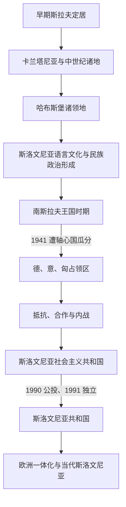

# 斯洛文尼亚历史

[返回东南欧与巴尔干历史](/%E4%BA%BA%E6%96%87%E7%A7%91%E5%AD%A6/%E5%8E%86%E5%8F%B2/%E6%AC%A7%E6%B4%B2/%E4%B8%9C%E5%8D%97%E6%AC%A7%E4%B8%8E%E5%B7%B4%E5%B0%94%E5%B9%B2/README.md)

## 概括

斯洛文尼亚历史可按“早期斯拉夫定居与卡兰塔尼亚 → 中欧封建领地和哈布斯堡统治 → 语言文化复兴与民族政治 → 南斯拉夫王国和二战瓜分 → 社会主义加盟共和国 → 1991年独立与当代国家”来理解。它既属于南斯拉夫人的共同历史，又长期处在阿尔卑斯、中欧和亚得里亚海交通圈；哈布斯堡制度、德语—意大利语城市文化与斯洛文尼亚语乡村社会共同影响了现代民族形成。

## 历史阶段导航

| 顺序 | 阶段 | 时间 | 历史走向 |
|---:|---|---|---|
| 1 | [早期斯拉夫定居与卡兰塔尼亚](/%E4%BA%BA%E6%96%87%E7%A7%91%E5%AD%A6/%E5%8E%86%E5%8F%B2/%E6%AC%A7%E6%B4%B2/%E4%B8%9C%E5%8D%97%E6%AC%A7%E4%B8%8E%E5%B7%B4%E5%B0%94%E5%B9%B2/%E6%96%AF%E6%B4%9B%E6%96%87%E5%B0%BC%E4%BA%9A/%E6%97%A9%E6%9C%9F%E6%96%AF%E6%8B%89%E5%A4%AB%E5%AE%9A%E5%B1%85%E4%B8%8E%E5%8D%A1%E5%85%B0%E5%A1%94%E5%B0%BC%E4%BA%9A.md) | 6世纪—13世纪 | 斯拉夫社群进入东阿尔卑斯；卡兰塔尼亚兴衰后，地方进入法兰克、神圣罗马帝国和中欧封建秩序。 |
| 2 | [哈布斯堡统治与斯洛文尼亚民族形成](/%E4%BA%BA%E6%96%87%E7%A7%91%E5%AD%A6/%E5%8E%86%E5%8F%B2/%E6%AC%A7%E6%B4%B2/%E4%B8%9C%E5%8D%97%E6%AC%A7%E4%B8%8E%E5%B7%B4%E5%B0%94%E5%B9%B2/%E6%96%AF%E6%B4%9B%E6%96%87%E5%B0%BC%E4%BA%9A/%E5%93%88%E5%B8%83%E6%96%AF%E5%A0%A1%E7%BB%9F%E6%B2%BB%E4%B8%8E%E6%96%AF%E6%B4%9B%E6%96%87%E5%B0%BC%E4%BA%9A%E6%B0%91%E6%97%8F%E5%BD%A2%E6%88%90.md) | 13世纪—1918年 | 克拉尼斯卡、施蒂利亚、克恩顿和滨海等地分属不同领地，斯洛文尼亚语文化与民族政治逐步形成。 |
| 3 | [王国时期与第二次世界大战](/%E4%BA%BA%E6%96%87%E7%A7%91%E5%AD%A6/%E5%8E%86%E5%8F%B2/%E6%AC%A7%E6%B4%B2/%E4%B8%9C%E5%8D%97%E6%AC%A7%E4%B8%8E%E5%B7%B4%E5%B0%94%E5%B9%B2/%E6%96%AF%E6%B4%9B%E6%96%87%E5%B0%BC%E4%BA%9A/%E7%8E%8B%E5%9B%BD%E6%97%B6%E6%9C%9F%E4%B8%8E%E7%AC%AC%E4%BA%8C%E6%AC%A1%E4%B8%96%E7%95%8C%E5%A4%A7%E6%88%98.md) | 1918—1945年 | 加入南斯拉夫共同国家，1941年遭德、意、匈瓜分并经历抵抗、合作与内战。 |
| 4 | [社会主义斯洛文尼亚](/%E4%BA%BA%E6%96%87%E7%A7%91%E5%AD%A6/%E5%8E%86%E5%8F%B2/%E6%AC%A7%E6%B4%B2/%E4%B8%9C%E5%8D%97%E6%AC%A7%E4%B8%8E%E5%B7%B4%E5%B0%94%E5%B9%B2/%E6%96%AF%E6%B4%9B%E6%96%87%E5%B0%BC%E4%BA%9A/%E7%A4%BE%E4%BC%9A%E4%B8%BB%E4%B9%89%E6%96%AF%E6%B4%9B%E6%96%87%E5%B0%BC%E4%BA%9A.md) | 1945—1991年 | 作为南斯拉夫联邦加盟共和国发展工业、自治制度和共和国政治。 |
| 5 | [独立与当代斯洛文尼亚](/%E4%BA%BA%E6%96%87%E7%A7%91%E5%AD%A6/%E5%8E%86%E5%8F%B2/%E6%AC%A7%E6%B4%B2/%E4%B8%9C%E5%8D%97%E6%AC%A7%E4%B8%8E%E5%B7%B4%E5%B0%94%E5%B9%B2/%E6%96%AF%E6%B4%9B%E6%96%87%E5%B0%BC%E4%BA%9A/%E7%8B%AC%E7%AB%8B%E4%B8%8E%E5%BD%93%E4%BB%A3%E6%96%AF%E6%B4%9B%E6%96%87%E5%B0%BC%E4%BA%9A.md) | 1991年至今 | 十日战争后完成独立，转型为议会民主国家并加入欧洲联盟。 |

## 与南斯拉夫共同历史的关系

- 人口迁徙和早期分化见[早期南斯拉夫人](/%E4%BA%BA%E6%96%87%E7%A7%91%E5%AD%A6/%E5%8E%86%E5%8F%B2/%E6%AC%A7%E6%B4%B2/%E4%B8%9C%E5%8D%97%E6%AC%A7%E4%B8%8E%E5%B7%B4%E5%B0%94%E5%B9%B2/%E5%8D%97%E6%96%AF%E6%8B%89%E5%A4%AB%E5%8E%86%E5%8F%B2/%E6%97%A9%E6%9C%9F%E5%8D%97%E6%96%AF%E6%8B%89%E5%A4%AB%E4%BA%BA.md)。
- 1918年后的共同国家见[南斯拉夫王国](/%E4%BA%BA%E6%96%87%E7%A7%91%E5%AD%A6/%E5%8E%86%E5%8F%B2/%E6%AC%A7%E6%B4%B2/%E4%B8%9C%E5%8D%97%E6%AC%A7%E4%B8%8E%E5%B7%B4%E5%B0%94%E5%B9%B2/%E5%8D%97%E6%96%AF%E6%8B%89%E5%A4%AB%E5%8E%86%E5%8F%B2/%E5%8D%97%E6%96%AF%E6%8B%89%E5%A4%AB%E7%8E%8B%E5%9B%BD.md)。
- 占领、抵抗与内战的共同背景见[第二次世界大战时期的南斯拉夫](/%E4%BA%BA%E6%96%87%E7%A7%91%E5%AD%A6/%E5%8E%86%E5%8F%B2/%E6%AC%A7%E6%B4%B2/%E4%B8%9C%E5%8D%97%E6%AC%A7%E4%B8%8E%E5%B7%B4%E5%B0%94%E5%B9%B2/%E5%8D%97%E6%96%AF%E6%8B%89%E5%A4%AB%E5%8E%86%E5%8F%B2/%E7%AC%AC%E4%BA%8C%E6%AC%A1%E4%B8%96%E7%95%8C%E5%A4%A7%E6%88%98%E6%97%B6%E6%9C%9F%E7%9A%84%E5%8D%97%E6%96%AF%E6%8B%89%E5%A4%AB.md)。
- 联邦时期与独立过程见[南斯拉夫社会主义联邦共和国](/%E4%BA%BA%E6%96%87%E7%A7%91%E5%AD%A6/%E5%8E%86%E5%8F%B2/%E6%AC%A7%E6%B4%B2/%E4%B8%9C%E5%8D%97%E6%AC%A7%E4%B8%8E%E5%B7%B4%E5%B0%94%E5%B9%B2/%E5%8D%97%E6%96%AF%E6%8B%89%E5%A4%AB%E5%8E%86%E5%8F%B2/%E5%8D%97%E6%96%AF%E6%8B%89%E5%A4%AB%E7%A4%BE%E4%BC%9A%E4%B8%BB%E4%B9%89%E8%81%94%E9%82%A6%E5%85%B1%E5%92%8C%E5%9B%BD.md)和[南斯拉夫解体](/%E4%BA%BA%E6%96%87%E7%A7%91%E5%AD%A6/%E5%8E%86%E5%8F%B2/%E6%AC%A7%E6%B4%B2/%E4%B8%9C%E5%8D%97%E6%AC%A7%E4%B8%8E%E5%B7%B4%E5%B0%94%E5%B9%B2/%E5%8D%97%E6%96%AF%E6%8B%89%E5%A4%AB%E5%8E%86%E5%8F%B2/%E5%8D%97%E6%96%AF%E6%8B%89%E5%A4%AB%E8%A7%A3%E4%BD%93.md)。

## 关键辨析

- 卡兰塔尼亚是东阿尔卑斯斯拉夫历史的重要政治节点，但不能画成与现代斯洛文尼亚共和国之间没有中断的国家直系继承。
- “斯洛文尼亚土地”在近代不是一个统一行政单位；克拉尼斯卡、施蒂利亚、克恩顿、戈里齐亚、的里雅斯特及伊斯特拉的政治归属和语言结构各不相同。
- 斯洛文尼亚长期受哈布斯堡统治，奥斯曼影响主要体现为边疆战争和袭扰，不能套用巴尔干内陆长期奥斯曼统治的单一路线。
- 1918年的南斯拉夫共同国家既为民族统一提供框架，也产生中央集权、边界和政治代表问题。
- 1991年十日战争相对短暂，是斯洛文尼亚独立线的特征，不能用来概括克罗地亚和波斯尼亚随后更长期、更复杂的战争。
