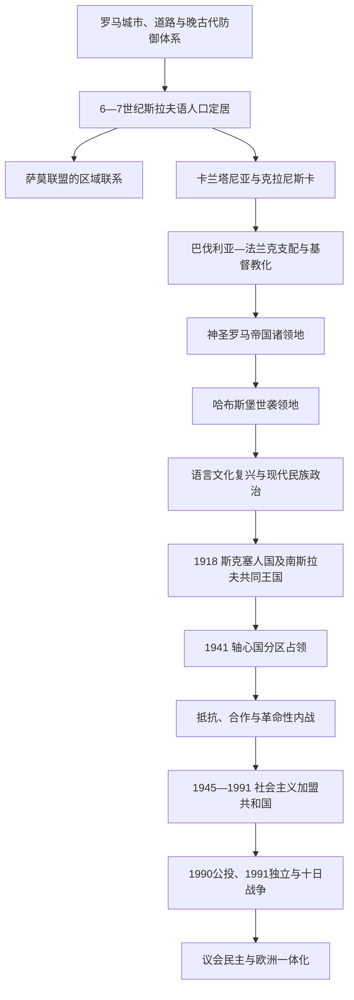

# 斯洛文尼亚历史

[返回东南欧与巴尔干历史](/%E4%BA%BA%E6%96%87%E7%A7%91%E5%AD%A6/%E5%8E%86%E5%8F%B2/%E6%AC%A7%E6%B4%B2/%E4%B8%9C%E5%8D%97%E6%AC%A7%E4%B8%8E%E5%B7%B4%E5%B0%94%E5%B9%B2/README.md)

## 概括

斯洛文尼亚历史不是一条由卡兰塔尼亚直接延伸到现代共和国的国家世系，而是东阿尔卑斯、潘诺尼亚平原、迪纳里克喀斯特和北亚得里亚海四个空间长期交汇的结果。今天的国土在罗马时代分属诺里库姆、潘诺尼亚和意大利等行政范围；西罗马秩序解体后，斯拉夫语人口于6—7世纪定居，卡兰塔尼亚和克拉尼斯卡等早期政治—边疆单位又被纳入巴伐利亚、法兰克及神圣罗马帝国体系。

13—15世纪以后，今斯洛文尼亚多数地区逐步成为哈布斯堡世袭领地，但从未组成单一“斯洛文尼亚省”。克拉尼斯卡、施蒂利亚、克恩顿、戈里齐亚、的里雅斯特、伊斯特拉和普雷克穆列分属不同法权与行政体系。16世纪宗教改革奠定斯洛文尼亚书面语，反宗教改革恢复天主教主导；18—19世纪的教育、印刷、铁路、市场与政治动员，才把跨领地的语言社群逐步塑造成现代民族。

1918年哈布斯堡帝国崩溃后，斯洛文尼亚政治中心先加入短暂的斯洛文尼亚人、克罗地亚人和塞尔维亚人国，再进入南斯拉夫共同王国。新边界使大量斯洛文尼亚语人口留在意大利和奥地利。1941年轴心国瓜分斯洛文尼亚语地区，强制同化、驱逐、集中营、抵抗、合作和革命性内战交织；1945年共产党领导的游击队获胜，斯洛文尼亚成为社会主义南斯拉夫的加盟共和国。

社会主义时期带来工业化、城市化、教育和福利扩展，也保留一党统治、政治压制及战后未经审判处决等创伤。1980年代的经济危机、联邦宪制冲突、公民社会兴起和民主化使共和国政治脱离旧框架。1990年多党选举与独立公投、1991年十日战争和1992年国际承认建立现代国家；此后斯洛文尼亚实行议会民主，加入北约、欧洲联盟、欧元区和申根区。

## 历史主线

### 从罗马交通走廊到东阿尔卑斯斯拉夫社会

罗马城市埃莫纳、波埃托维奥和采列亚以及尤利安阿尔卑斯屏障，说明这一地区很早就是意大利半岛与多瑙河流域之间的通道。晚古代的战争和人口重组削弱城市网络，却没有造成文化与人口的完全断裂。斯拉夫语居民的定居、与罗马化居民及阿瓦—日耳曼势力的互动，构成后来的语言人口基础。详见[早期斯拉夫定居与卡兰塔尼亚](/%E4%BA%BA%E6%96%87%E7%A7%91%E5%AD%A6/%E5%8E%86%E5%8F%B2/%E6%AC%A7%E6%B4%B2/%E4%B8%9C%E5%8D%97%E6%AC%A7%E4%B8%8E%E5%B7%B4%E5%B0%94%E5%B9%B2/%E6%96%AF%E6%B4%9B%E6%96%87%E5%B0%BC%E4%BA%9A/%E6%97%A9%E6%9C%9F%E6%96%AF%E6%8B%89%E5%A4%AB%E5%AE%9A%E5%B1%85%E4%B8%8E%E5%8D%A1%E5%85%B0%E5%A1%94%E5%B0%BC%E4%BA%9A.md)。

### 分散领地、共同王朝与语言民族化

中世纪诸公国、边区、教会领和城镇的发展先于现代民族政治。哈布斯堡逐步取得克拉尼斯卡、施蒂利亚、克恩顿、的里雅斯特和戈里齐亚等地的王朝权利，但各地议会、等级、城市法和语言构成仍不同。斯洛文尼亚语的印刷、学校和文学，1848年“统一斯洛文尼亚”纲领以及1867年后的群众政治，把语言要求转化为领土与自治诉求。详见[哈布斯堡统治与斯洛文尼亚民族形成](/%E4%BA%BA%E6%96%87%E7%A7%91%E5%AD%A6/%E5%8E%86%E5%8F%B2/%E6%AC%A7%E6%B4%B2/%E4%B8%9C%E5%8D%97%E6%AC%A7%E4%B8%8E%E5%B7%B4%E5%B0%94%E5%B9%B2/%E6%96%AF%E6%B4%9B%E6%96%87%E5%B0%BC%E4%BA%9A/%E5%93%88%E5%B8%83%E6%96%AF%E5%A0%A1%E7%BB%9F%E6%B2%BB%E4%B8%8E%E6%96%AF%E6%B4%9B%E6%96%87%E5%B0%BC%E4%BA%9A%E6%B0%91%E6%97%8F%E5%BD%A2%E6%88%90.md)。

### 南斯拉夫共同国家与边界分割

1918年的共同国家解决了部分斯洛文尼亚语地区脱离哈布斯堡统治的问题，却没有实现全部民族地域统一。拉帕洛边界和克恩顿公投把重要斯洛文尼亚少数族群留在意大利、奥地利；王国内部又发生中央集权、地方自治和宗教—世俗政治竞争。1941年的崩溃证明国家军政整合脆弱，也把战前分歧推入占领与内战。详见[王国时期与第二次世界大战](/%E4%BA%BA%E6%96%87%E7%A7%91%E5%AD%A6/%E5%8E%86%E5%8F%B2/%E6%AC%A7%E6%B4%B2/%E4%B8%9C%E5%8D%97%E6%AC%A7%E4%B8%8E%E5%B7%B4%E5%B0%94%E5%B9%B2/%E6%96%AF%E6%B4%9B%E6%96%87%E5%B0%BC%E4%BA%9A/%E7%8E%8B%E5%9B%BD%E6%97%B6%E6%9C%9F%E4%B8%8E%E7%AC%AC%E4%BA%8C%E6%AC%A1%E4%B8%96%E7%95%8C%E5%A4%A7%E6%88%98.md)。

### 社会主义现代化与联邦解体

1945年后共和国拥有自身议会、行政和文化制度，但共产党及其联盟掌握实际权力。斯洛文尼亚成为联邦内工业化和出口程度较高的共和国，西部边界逐步稳定，1974年宪法又扩大共和国权限。1980年代债务、通胀、科索沃问题、联邦再集中倾向与斯洛文尼亚公民社会的自由化诉求彼此放大，最终使民主化和主权问题合流。详见[社会主义斯洛文尼亚](/%E4%BA%BA%E6%96%87%E7%A7%91%E5%AD%A6/%E5%8E%86%E5%8F%B2/%E6%AC%A7%E6%B4%B2/%E4%B8%9C%E5%8D%97%E6%AC%A7%E4%B8%8E%E5%B7%B4%E5%B0%94%E5%B9%B2/%E6%96%AF%E6%B4%9B%E6%96%87%E5%B0%BC%E4%BA%9A/%E7%A4%BE%E4%BC%9A%E4%B8%BB%E4%B9%89%E6%96%AF%E6%B4%9B%E6%96%87%E5%B0%BC%E4%BA%9A.md)。

### 独立国家与欧洲一体化

1990年公投得到绝大多数有效票和全体选民的高比例支持；1991年独立法案引发与南斯拉夫人民军的短期战争。国际承认后，国家在私有化、福利制度、政党竞争和欧洲规范之间寻找平衡。2004年加入北约与欧洲联盟、2007年采用欧元并进入申根区，是外交与经济锚定的主要节点。独立后的完整总统、政府首脑及社会主义时期法定职位，集中见[斯洛文尼亚国家元首与政府首脑表](/%E4%BA%BA%E6%96%87%E7%A7%91%E5%AD%A6/%E5%8E%86%E5%8F%B2/%E6%AC%A7%E6%B4%B2/%E4%B8%9C%E5%8D%97%E6%AC%A7%E4%B8%8E%E5%B7%B4%E5%B0%94%E5%B9%B2/%E6%96%AF%E6%B4%9B%E6%96%87%E5%B0%BC%E4%BA%9A/%E6%96%AF%E6%B4%9B%E6%96%87%E5%B0%BC%E4%BA%9A%E5%9B%BD%E5%AE%B6%E5%85%83%E9%A6%96%E4%B8%8E%E6%94%BF%E5%BA%9C%E9%A6%96%E8%84%91%E8%A1%A8.md)。

## 历史阶段导航

| 顺序 | 阶段 | 时间 | 主线与阅读重点 |
|---:|---|---|---|
| 1 | [早期斯拉夫定居与卡兰塔尼亚](/%E4%BA%BA%E6%96%87%E7%A7%91%E5%AD%A6/%E5%8E%86%E5%8F%B2/%E6%AC%A7%E6%B4%B2/%E4%B8%9C%E5%8D%97%E6%AC%A7%E4%B8%8E%E5%B7%B4%E5%B0%94%E5%B9%B2/%E6%96%AF%E6%B4%9B%E6%96%87%E5%B0%BC%E4%BA%9A/%E6%97%A9%E6%9C%9F%E6%96%AF%E6%8B%89%E5%A4%AB%E5%AE%9A%E5%B1%85%E4%B8%8E%E5%8D%A1%E5%85%B0%E5%A1%94%E5%B0%BC%E4%BA%9A.md) | 史前—13世纪，重点为6—13世纪 | 罗马与晚古代遗产、斯拉夫定居、萨莫联盟、卡兰塔尼亚、基督教化、克拉尼斯卡和中世纪领地形成。 |
| 2 | [哈布斯堡统治与斯洛文尼亚民族形成](/%E4%BA%BA%E6%96%87%E7%A7%91%E5%AD%A6/%E5%8E%86%E5%8F%B2/%E6%AC%A7%E6%B4%B2/%E4%B8%9C%E5%8D%97%E6%AC%A7%E4%B8%8E%E5%B7%B4%E5%B0%94%E5%B9%B2/%E6%96%AF%E6%B4%9B%E6%96%87%E5%B0%BC%E4%BA%9A/%E5%93%88%E5%B8%83%E6%96%AF%E5%A0%A1%E7%BB%9F%E6%B2%BB%E4%B8%8E%E6%96%AF%E6%B4%9B%E6%96%87%E5%B0%BC%E4%BA%9A%E6%B0%91%E6%97%8F%E5%BD%A2%E6%88%90.md) | 13世纪—1918年 | 哈布斯堡取得诸领地、宗教改革与反宗教改革、农民起义、伊利里亚省、1848纲领、民族政治和一战终结。 |
| 3 | [王国时期与第二次世界大战](/%E4%BA%BA%E6%96%87%E7%A7%91%E5%AD%A6/%E5%8E%86%E5%8F%B2/%E6%AC%A7%E6%B4%B2/%E4%B8%9C%E5%8D%97%E6%AC%A7%E4%B8%8E%E5%B7%B4%E5%B0%94%E5%B9%B2/%E6%96%AF%E6%B4%9B%E6%96%87%E5%B0%BC%E4%BA%9A/%E7%8E%8B%E5%9B%BD%E6%97%B6%E6%9C%9F%E4%B8%8E%E7%AC%AC%E4%BA%8C%E6%AC%A1%E4%B8%96%E7%95%8C%E5%A4%A7%E6%88%98.md) | 1918—1945年 | 斯克塞人国、南斯拉夫王国中央集权、跨境少数族群、法西斯意大利化、轴心国瓜分、抵抗与内战暴力。 |
| 4 | [社会主义斯洛文尼亚](/%E4%BA%BA%E6%96%87%E7%A7%91%E5%AD%A6/%E5%8E%86%E5%8F%B2/%E6%AC%A7%E6%B4%B2/%E4%B8%9C%E5%8D%97%E6%AC%A7%E4%B8%8E%E5%B7%B4%E5%B0%94%E5%B9%B2/%E6%96%AF%E6%B4%9B%E6%96%87%E5%B0%BC%E4%BA%9A/%E7%A4%BE%E4%BC%9A%E4%B8%BB%E4%B9%89%E6%96%AF%E6%B4%9B%E6%96%87%E5%B0%BC%E4%BA%9A.md) | 1945—1991年 | 加盟共和国制度、党内实际权力、边界重组、工业化、工人自治、1974宪法、1980年代危机和多党化。 |
| 5 | [独立与当代斯洛文尼亚](/%E4%BA%BA%E6%96%87%E7%A7%91%E5%AD%A6/%E5%8E%86%E5%8F%B2/%E6%AC%A7%E6%B4%B2/%E4%B8%9C%E5%8D%97%E6%AC%A7%E4%B8%8E%E5%B7%B4%E5%B0%94%E5%B9%B2/%E6%96%AF%E6%B4%9B%E6%96%87%E5%B0%BC%E4%BA%9A/%E7%8B%AC%E7%AB%8B%E4%B8%8E%E5%BD%93%E4%BB%A3%E6%96%AF%E6%B4%9B%E6%96%87%E5%B0%BC%E4%BA%9A.md) | 1990年至今 | 多党选举、公投、十日战争、独立宪制、完整政党轮替、欧洲一体化及当代议题。 |

## 统治者与行政首脑导航

| 时段 | 表格位置 | 说明 |
|---|---|---|
| 卡兰塔尼亚 | [早期斯拉夫定居与卡兰塔尼亚](/%E4%BA%BA%E6%96%87%E7%A7%91%E5%AD%A6/%E5%8E%86%E5%8F%B2/%E6%AC%A7%E6%B4%B2/%E4%B8%9C%E5%8D%97%E6%AC%A7%E4%B8%8E%E5%B7%B4%E5%B0%94%E5%B9%B2/%E6%96%AF%E6%B4%9B%E6%96%87%E5%B0%BC%E4%BA%9A/%E6%97%A9%E6%9C%9F%E6%96%AF%E6%8B%89%E5%A4%AB%E5%AE%9A%E5%B1%85%E4%B8%8E%E5%8D%A1%E5%85%B0%E5%A1%94%E5%B0%BC%E4%BA%9A.md)中的“可考王侯与史料限度” | 只把来源能支持的名称列为可考统治者；存疑者不伪造连续谱系。 |
| 中世纪—1918 | [哈布斯堡统治与斯洛文尼亚民族形成](/%E4%BA%BA%E6%96%87%E7%A7%91%E5%AD%A6/%E5%8E%86%E5%8F%B2/%E6%AC%A7%E6%B4%B2/%E4%B8%9C%E5%8D%97%E6%AC%A7%E4%B8%8E%E5%B7%B4%E5%B0%94%E5%B9%B2/%E6%96%AF%E6%B4%9B%E6%96%87%E5%B0%BC%E4%BA%9A/%E5%93%88%E5%B8%83%E6%96%AF%E5%A0%A1%E7%BB%9F%E6%B2%BB%E4%B8%8E%E6%96%AF%E6%B4%9B%E6%96%87%E5%B0%BC%E4%BA%9A%E6%B0%91%E6%97%8F%E5%BD%A2%E6%88%90.md)中的“统治结构” | 现代斯洛文尼亚语地区分属多个领地，不能编造成一列本国君主；按领地、王朝与实际行政层级说明。 |
| 1918—1945 | [王国时期与第二次世界大战](/%E4%BA%BA%E6%96%87%E7%A7%91%E5%AD%A6/%E5%8E%86%E5%8F%B2/%E6%AC%A7%E6%B4%B2/%E4%B8%9C%E5%8D%97%E6%AC%A7%E4%B8%8E%E5%B7%B4%E5%B0%94%E5%B9%B2/%E6%96%AF%E6%B4%9B%E6%96%87%E5%B0%BC%E4%BA%9A/%E7%8E%8B%E5%9B%BD%E6%97%B6%E6%9C%9F%E4%B8%8E%E7%AC%AC%E4%BA%8C%E6%AC%A1%E4%B8%96%E7%95%8C%E5%A4%A7%E6%88%98.md)中的地方行政及占领当局表 | 王国君主属于南斯拉夫共同国家，另列斯洛文尼亚地方政府、德拉瓦河省和占领区首脑。 |
| 1945年至今 | [斯洛文尼亚国家元首与政府首脑表](/%E4%BA%BA%E6%96%87%E7%A7%91%E5%AD%A6/%E5%8E%86%E5%8F%B2/%E6%AC%A7%E6%B4%B2/%E4%B8%9C%E5%8D%97%E6%AC%A7%E4%B8%8E%E5%B7%B4%E5%B0%94%E5%B9%B2/%E6%96%AF%E6%B4%9B%E6%96%87%E5%B0%BC%E4%BA%9A/%E6%96%AF%E6%B4%9B%E6%96%87%E5%B0%BC%E4%BA%9A%E5%9B%BD%E5%AE%B6%E5%85%83%E9%A6%96%E4%B8%8E%E6%94%BF%E5%BA%9C%E9%A6%96%E8%84%91%E8%A1%A8.md) | 分别列法定元首、政府首脑、共产党实际领导、独立后总统及历届政府；不混用职位。 |

## 重要转折与时间节点

| 时间 | 转折 | 长期意义 |
|---|---|---|
| 前1世纪—4世纪 | 罗马道路、城市和边防体系形成 | 固化跨阿尔卑斯—亚得里亚海交通走廊与城市节点。 |
| 6—7世纪 | 斯拉夫语人口定居；部分社群与萨莫联盟相关 | 奠定东阿尔卑斯斯拉夫语言人口基础，但不能等同现代民族国家。 |
| 约745年 | 卡兰塔尼亚在阿瓦压力下接受巴伐利亚保护 | 开始进入巴伐利亚—法兰克宗主和拉丁基督教网络。 |
| 828年 | 法兰克方面撤换本地王侯 | 卡兰塔尼亚自主政治终结，地区纳入伯爵、边区与公国秩序。 |
| 13—15世纪 | 哈布斯堡逐步取得多数斯洛文尼亚语地区 | 形成延续至1918年的共同王朝框架，但行政仍分散。 |
| 1550、1584年 | 特鲁巴尔出版首批斯洛文尼亚语书；达尔马廷译本和博霍里奇语法问世 | 建立可跨方言传播的书面语传统。 |
| 1809—1813年 | 拿破仑伊利里亚省 | 短暂引入法国行政司法改革，卢布尔雅那成为总督驻地。 |
| 1848年 | “统一斯洛文尼亚”纲领 | 第一次明确提出合并帝国内斯洛文尼亚语地区及语言平等。 |
| 1915—1917年 | 索查河前线 | 大规模动员、难民与战争破坏把民族政治推向帝国重组。 |
| 1918年 | 哈布斯堡帝国解体，加入南斯拉夫共同国家 | 政治中心转向贝尔格莱德，同时产生新边界和中央化问题。 |
| 1920年 | 克恩顿公投与拉帕洛条约 | 现代西部、北部民族边界与少数族群问题大体定型。 |
| 1941年 | 德、意、匈及克罗地亚独立国分割斯洛文尼亚语地区 | 吞并和强制同化引发抵抗，也激化革命与反革命冲突。 |
| 1945年 | 游击队胜利并建立联邦加盟共和国 | 结束占领，同时开启一党统治、国有化和社会主义现代化。 |
| 1948、1974年 | 与共产党情报局决裂；联邦宪法扩大共和国权限 | 分别推动南斯拉夫独立社会主义道路和联邦分权。 |
| 1987—1990年 | 《新评论》第57期、JBTZ审判、多党选举 | 公民社会、法治诉求和民族主权议程汇合。 |
| 1990年12月 | 独立公投 | 为退出联邦提供直接民主授权。 |
| 1991年6—7月 | 独立法案与十日战争 | 建立事实主权，战事以布里俄尼协议和联邦军撤出收束。 |
| 1992年 | 广泛承认并加入联合国 | 完成国际法上的国家建构。 |
| 2004、2007年 | 加入北约和欧盟；采用欧元并进入申根区 | 把安全、市场和人员流动嵌入欧洲—大西洋制度。 |
| 2026年6月 | 第16届政府就职 | 截至2026年7月14日，总统为娜塔莎·皮尔茨·穆萨尔，总理为亚内兹·扬沙。 |

## 与南斯拉夫共同历史的关系

- 人口迁徙与早期分化参见[早期南斯拉夫人](/%E4%BA%BA%E6%96%87%E7%A7%91%E5%AD%A6/%E5%8E%86%E5%8F%B2/%E6%AC%A7%E6%B4%B2/%E4%B8%9C%E5%8D%97%E6%AC%A7%E4%B8%8E%E5%B7%B4%E5%B0%94%E5%B9%B2/%E5%8D%97%E6%96%AF%E6%8B%89%E5%A4%AB%E5%8E%86%E5%8F%B2/%E6%97%A9%E6%9C%9F%E5%8D%97%E6%96%AF%E6%8B%89%E5%A4%AB%E4%BA%BA.md)；斯洛文尼亚方向因东阿尔卑斯—法兰克联系形成独特路径。
- 1918—1941年的共同国家宪制和王室参见[南斯拉夫王国](/%E4%BA%BA%E6%96%87%E7%A7%91%E5%AD%A6/%E5%8E%86%E5%8F%B2/%E6%AC%A7%E6%B4%B2/%E4%B8%9C%E5%8D%97%E6%AC%A7%E4%B8%8E%E5%B7%B4%E5%B0%94%E5%B9%B2/%E5%8D%97%E6%96%AF%E6%8B%89%E5%A4%AB%E5%8E%86%E5%8F%B2/%E5%8D%97%E6%96%AF%E6%8B%89%E5%A4%AB%E7%8E%8B%E5%9B%BD.md)，本目录重点说明斯洛文尼亚地方政治、边界与行政。
- 占领、抵抗及跨共和国战争背景参见[第二次世界大战时期的南斯拉夫](/%E4%BA%BA%E6%96%87%E7%A7%91%E5%AD%A6/%E5%8E%86%E5%8F%B2/%E6%AC%A7%E6%B4%B2/%E4%B8%9C%E5%8D%97%E6%AC%A7%E4%B8%8E%E5%B7%B4%E5%B0%94%E5%B9%B2/%E5%8D%97%E6%96%AF%E6%8B%89%E5%A4%AB%E5%8E%86%E5%8F%B2/%E7%AC%AC%E4%BA%8C%E6%AC%A1%E4%B8%96%E7%95%8C%E5%A4%A7%E6%88%98%E6%97%B6%E6%9C%9F%E7%9A%84%E5%8D%97%E6%96%AF%E6%8B%89%E5%A4%AB.md)；本目录进一步区分德、意、匈各占领区以及斯洛文尼亚合作武装。
- 联邦制度参见[南斯拉夫社会主义联邦共和国](/%E4%BA%BA%E6%96%87%E7%A7%91%E5%AD%A6/%E5%8E%86%E5%8F%B2/%E6%AC%A7%E6%B4%B2/%E4%B8%9C%E5%8D%97%E6%AC%A7%E4%B8%8E%E5%B7%B4%E5%B0%94%E5%B9%B2/%E5%8D%97%E6%96%AF%E6%8B%89%E5%A4%AB%E5%8E%86%E5%8F%B2/%E5%8D%97%E6%96%AF%E6%8B%89%E5%A4%AB%E7%A4%BE%E4%BC%9A%E4%B8%BB%E4%B9%89%E8%81%94%E9%82%A6%E5%85%B1%E5%92%8C%E5%9B%BD.md)，独立过程与其他共和国战争的相互关系参见[南斯拉夫解体](/%E4%BA%BA%E6%96%87%E7%A7%91%E5%AD%A6/%E5%8E%86%E5%8F%B2/%E6%AC%A7%E6%B4%B2/%E4%B8%9C%E5%8D%97%E6%AC%A7%E4%B8%8E%E5%B7%B4%E5%B0%94%E5%B9%B2/%E5%8D%97%E6%96%AF%E6%8B%89%E5%A4%AB%E5%8E%86%E5%8F%B2/%E5%8D%97%E6%96%AF%E6%8B%89%E5%A4%AB%E8%A7%A3%E4%BD%93.md)。

## 关键辨析

- **卡兰塔尼亚不是现代共和国的法权前身**：其中心主要在今天奥地利克恩顿，疆域、身份和统治制度与现代国家不同。
- **王侯推举仪式不可简单称为现代民主**：仪式的起源、参加者、程序及其从卡兰塔尼亚到克恩顿公国的连续性都有史料争议；现存详细记载多晚于早期王侯时代。
- **“斯洛文尼亚土地”不是统一行政区**：语言人口分布跨越多个公国、伯国、自由港和匈牙利王冠领地。
- **奥斯曼影响不等于长期奥斯曼统治**：主要体现为15—16世纪袭扰、军事财政、难民迁徙和毗邻克罗地亚军事边疆。
- **1918年不是全部族群统一**：意大利法西斯化政策和奥地利境内少数族群问题，是理解战间期政治不可缺少的一部分。
- **二战同时包含占领、抵抗与内战**：承认抵抗的反法西斯性质，不等于回避共产党革命暴力；说明合作武装责任，也不等于把占领者与被占领社会等同。
- **社会主义共和国不是主权独立国家**：它有法定共和国机构并在1974年后取得较大权限，但国防、外交和联邦主权仍处于南斯拉夫框架。
- **十日战争不能代表全部南斯拉夫解体战争**：斯洛文尼亚的族群结构、边界条件和联邦军战略判断使战事较短，克罗地亚及波黑随后走向更长期战争。
