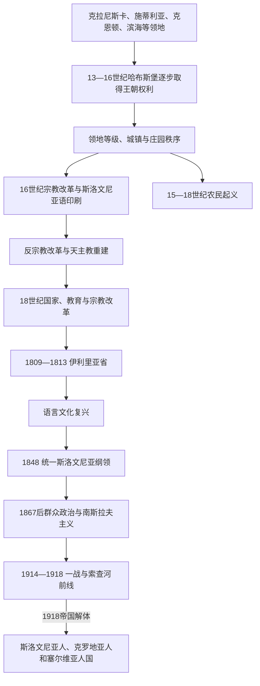

# 哈布斯堡统治与斯洛文尼亚民族形成

## 时间

13世纪—1918年

## 概括

哈布斯堡并非一次征服一个现成的“斯洛文尼亚国家”，而是在13—16世纪通过战争、帝国封授、婚姻继承和地方协议逐步取得施蒂利亚、克恩顿、克拉尼斯卡、的里雅斯特、戈里齐亚等地。各领地保留等级议会、法院、税制和城市特权；普雷克穆列则属于匈牙利王冠的沃什、佐洛等县。因而共同君主之下仍不存在统一的斯洛文尼亚行政单位。

这一长时期的关键变化是语言社群转化为民族政治。16世纪宗教改革催生首批斯洛文尼亚语印刷品、完整《圣经》译本和语法；反宗教改革压制新教组织，却无法抹去书面语成果。18世纪国家改革、学校和市场扩大识字人口，拿破仑伊利里亚省短暂改变行政经验。1848年“统一斯洛文尼亚”纲领首次把语言平等与领土自治结合，1867年后政党、报刊、合作社、天主教组织、自由派和工人运动又把民族政治带入群众社会。第一次世界大战和帝国崩溃最终使政治重心转向南斯拉夫共同国家。

## 哈布斯堡统治的建立

### 取得诸领地的过程

| 时间 | 地区与方式 | 结果与限度 |
|---|---|---|
| 1278—1282年 | 哈布斯堡的鲁道夫一世击败波希米亚王奥托卡二世，随后把奥地利和施蒂利亚授予其子 | 哈布斯堡进入斯洛文尼亚语人口较多的施蒂利亚南部；并未同时取得全部地区。 |
| 1335年 | 克恩顿公爵亨利去世后，皇帝把克恩顿及克拉尼斯卡相关权利授予哈布斯堡兄弟阿尔布雷希特二世与奥托 | 哈布斯堡在东阿尔卑斯的领地连成更大板块，但地方等级和封臣关系继续存在。 |
| 1364年 | 鲁道夫四世把克拉尼斯卡提升为公国 | 克拉尼斯卡逐步成为斯洛文尼亚语人口最集中的核心领地，却仍是神圣罗马帝国和哈布斯堡世袭领之一。 |
| 1382年 | 的里雅斯特为对抗威尼斯接受哈布斯堡保护 | 港口保留广泛城市特权，意大利语、斯洛文尼亚语和德语社群并存。 |
| 1436—1456年 | 采列伯爵升为帝国诸侯，乌尔里希二世遇刺后家族绝嗣 | 哈布斯堡依继承协议接收其大量领地，消除最强本地王朝竞争者。 |
| 1500年 | 戈里齐亚伯爵莱昂哈德无嗣去世 | 戈里齐亚伯国大部转入哈布斯堡；威尼斯仍控制伊斯特拉和沿海若干地区。 |
| 1526年后 | 哈布斯堡取得匈牙利王位 | 普雷克穆列随匈牙利王冠进入同一王朝复合体，但其县制、法律和1867年后的匈牙利行政仍与奥地利诸领地不同。 |
| 1564—1619年 | 施蒂利亚、克恩顿、克拉尼斯卡及滨海等组成以格拉茨为中心的“内奥地利”支系领地 | 为边防、财政和反宗教改革提供共同协调，却没有建立语言民族意义的斯洛文尼亚省。 |
| 1816—1849年 | 奥地利建立名义上的伊利里亚王国 | 把若干恢复领地置于共同王冠名称下，实际仍由各公国、行政区分别治理。 |
| 1849年后 | 克拉尼斯卡、施蒂利亚、克恩顿、奥地利滨海等成为帝国王冠领 | 现代官僚制增强；领地边界依旧切割斯洛文尼亚语人口。 |

### 为什么哈布斯堡能够长期维持

- **王朝资源**：哈布斯堡兼有帝国头衔、奥地利世袭领、匈牙利和波希米亚王冠，可调动更大财政与军事网络。
- **地方妥协**：贵族、教会和城镇通过等级议会同意税赋、确认特权；中央集权与领地法不是简单一方取代另一方。
- **外部威胁**：奥斯曼袭扰和威尼斯竞争使内地贵族、城市与王朝在防务上相互依赖。
- **交通经济**：维也纳—格拉茨—卢布尔雅那—的里雅斯特道路、矿业、木材和港口贸易把各地嵌入共同市场。
- **继承而非全面征服**：采列和戈里齐亚等家族绝嗣后，契约与封建继承减少了重新建立统治的成本。

## 统治结构：不能伪造为单列“斯洛文尼亚君主”

| 层级 | 机构或人物 | 实际作用 |
|---|---|---|
| 共同君主 | 奥地利公爵／大公，1804年后奥地利皇帝，1867年后奥地利皇帝兼匈牙利国王 | 掌握王朝、军队、外交和高层任命；不同领地依据各自法权承认同一君主。 |
| 内奥地利中央机关 | 格拉茨的枢密、财政和军事机关；后由维也纳中央部门加强统筹 | 处理税收、边防、司法上诉和王朝政策，权力随时期变化。 |
| 王冠领 | 克拉尼斯卡、施蒂利亚、克恩顿、戈里齐亚—格拉迪斯卡、的里雅斯特、伊斯特拉等 | 各有省长、等级议会或1861年后的领地议会，边界并不按语言划分。 |
| 匈牙利一侧 | 普雷克穆列所属县、匈牙利议会与布达佩斯政府 | 1867年后归奥匈二元体制的匈牙利部分，不受维也纳的奥地利政府直接行政。 |
| 城镇 | 的里雅斯特、卢布尔雅那、马里博尔、采列、普图伊等市政机构 | 管理市场、行会、警务、公共建设；选举权长期受财产和身份限制。 |
| 等级与庄园 | 贵族、教会、城市代表、庄园领主 | 议税、征兵、地方法院和农民劳役；1848年农奴义务废除后政治基础改变。 |
| 语言民族组织 | 报刊、阅览室、塔博尔大会、政党、合作社和教会群众网络 | 19世纪把跨领地语言诉求转化为现代选举与自治运动。 |

这一阶段不是一个独立王朝节点，不能把所有奥地利公爵、神圣罗马皇帝和匈牙利国王重复登记为“斯洛文尼亚君主”。跨区域王朝主线分别见[哈布斯堡君主国](/%E4%BA%BA%E6%96%87%E7%A7%91%E5%AD%A6/%E5%8E%86%E5%8F%B2/%E6%AC%A7%E6%B4%B2/%E5%BE%B7%E6%84%8F%E5%BF%97/%E5%A5%A5%E5%9C%B0%E5%88%A9/%E5%93%88%E5%B8%83%E6%96%AF%E5%A0%A1%E5%90%9B%E4%B8%BB%E5%9B%BD.md)、[奥地利帝国](/%E4%BA%BA%E6%96%87%E7%A7%91%E5%AD%A6/%E5%8E%86%E5%8F%B2/%E6%AC%A7%E6%B4%B2/%E5%BE%B7%E6%84%8F%E5%BF%97/%E5%A5%A5%E5%9C%B0%E5%88%A9/%E5%A5%A5%E5%9C%B0%E5%88%A9%E5%B8%9D%E5%9B%BD.md)和[奥匈帝国](/%E4%BA%BA%E6%96%87%E7%A7%91%E5%AD%A6/%E5%8E%86%E5%8F%B2/%E6%AC%A7%E6%B4%B2/%E5%BE%B7%E6%84%8F%E5%BF%97/%E5%A5%A5%E5%9C%B0%E5%88%A9/%E5%A5%A5%E5%8C%88%E5%B8%9D%E5%9B%BD.md)；本页聚焦这些君主的复合领地如何作用于斯洛文尼亚语地区。

## 中世纪晚期：城镇、贵族与边防

### 采列伯爵的崛起与灭亡

采列家族从萨内克领主发展为施蒂利亚重要伯爵，依靠婚姻、借贷、军事服务和巴尔干—中欧联盟迅速扩张。赫尔曼二世在1396年尼科波利斯战役后协助匈牙利王西吉斯蒙德脱险，家族由此进入王室核心；其女芭芭拉嫁给西吉斯蒙德，后来成为匈牙利和波希米亚王后、神圣罗马皇后。1436年家族被提升为帝国诸侯，与哈布斯堡发生领地和法权竞争。

1456年乌尔里希二世在贝尔格莱德被匈牙利权贵拉斯洛·匈雅提一派刺杀，男性直系绝嗣。结构上，家族扩张过快且依赖个人婚姻联盟；外部上卷入匈牙利摄政和王位政治；直接触发则是贝尔格莱德的权力冲突。哈布斯堡依据先前继承协议接收采列领地，强化在今斯洛文尼亚的优势。采列伯爵是本地兴起的跨国贵族王朝，不是现代斯洛文尼亚民族王朝。

### 奥斯曼袭扰与防御体系

15世纪后期至16世纪，奥斯曼骑兵多次穿过克罗地亚方向袭扰克拉尼斯卡、施蒂利亚和克恩顿，掠夺人口与牲畜。斯洛文尼亚地区大部没有成为奥斯曼行省，却承担堡垒、预警火堆、征税、征兵和补给等边疆成本。克罗地亚军事边疆成为主要缓冲区，难民和边防军人迁入又改变局部人口。贵族与农民对“土耳其税”、军役和庄园负担的冲突，是农民起义的重要背景之一。

## 宗教改革、书面语与反宗教改革

### 宗教改革为何扩展

城市商人、矿区、部分贵族和受德意志大学教育的教士传播路德宗思想。地方教会弊端、领主保护、印刷网络和以本地语言传教的需要，使改革在16世纪中叶形成组织。斯洛文尼亚语此前主要用于口语与有限宗教文本，宗教争论给它带来印刷、翻译和学校功能。

| 时间 | 人物或成果 | 历史意义 |
|---|---|---|
| 1550年 | **普里莫日·特鲁巴尔**出版《教理问答》和识字读本 | 通常视为首批斯洛文尼亚语印刷书，确立跨方言书写实践。 |
| 1560年代 | 新教教会、学校与书籍传播 | 使读写、讲道和民族语言相互加强，但覆盖仍以部分城镇和贵族网络为主。 |
| 1584年 | **尤里·达尔马廷**完整翻译《圣经》 | 证明斯洛文尼亚语能够承载大型神学文本，对后来标准语影响深远。 |
| 1584年 | **亚当·博霍里奇**出版语法 | 系统描述拼写与语言结构，长期成为书写规范基础。 |
| 1598年后 | 统治者驱逐新教传教士，查禁组织 | 反宗教改革摧毁公开新教制度，多数居民重新纳入天主教体系。 |

反宗教改革由哈布斯堡统治者、卢布尔雅那主教托马日·赫伦、耶稣会及地方天主教贵族推动。它采用传教、学校、书籍审查、改宗压力和驱逐牧师等手段。新教社群衰落的结构因素是缺乏独立政治保护和城市自治资源；外部因素是内奥地利王朝把宗教统一视为边防和国家忠诚的一部分；直接触发则是16世纪末统治者系统清除新教机构。新教失败并未消灭其语言遗产，天主教教育后来也利用已形成的书写传统。

## 农民起义与庄园秩序

| 时间 | 起义 | 具体过程、结果与原因 |
|---|---|---|
| 1478年 | 克恩顿农民联盟起义 | 农民试图自行组织对奥斯曼袭扰的防御并反对领主负担；贵族镇压，奥斯曼突袭又使联盟瓦解。 |
| 1515年 | 斯洛文尼亚农民大起义 | 从克拉尼斯卡扩展至施蒂利亚和克恩顿，口号要求恢复“旧权利”；规模大但缺乏统一指挥，被贵族和雇佣军击败。 |
| 1573年 | 克罗地亚—斯洛文尼亚农民起义 | 跨萨瓦河两侧反抗弗拉尼奥·塔希等领主的重役与暴力，马蒂亚·古贝茨等领导；迅速遭军事镇压。 |
| 1635年 | 第二次斯洛文尼亚农民起义 | 三十年战争时期税役、军费和庄园压迫引发反抗，扩散后被领主军队击败。 |
| 1713年 | 托尔明起义 | 新国家税与地方征收方式叠加旧庄园矛盾，农民袭击征税机构；军队镇压并处决首领。 |

这些起义不能简化为现代民族解放。参与者首先维护地方习惯权、减轻劳役和税负，组织通常受区域、通讯和武器限制。失败后庄园制度仍延续，但长期抗争使农民权利成为18世纪改革和1848年废除封建义务的重要社会背景。

## 18世纪改革与现代化

玛丽亚·特蕾西亚和约瑟夫二世时期，王朝为战争财政和行政效率进行人口调查、税制、征兵、教育和教区改革。1774年学校条例扩大初等教育，识字与教师需求提高斯洛文尼亚语教材的价值；约瑟夫二世的宽容政策、修道院改革和对农民人身依附的限制，削弱教会与庄园的部分特权。改革并未实现民族平等，德语仍在高层行政和教育占优势，但国家深入乡村也创造了更统一的公共领域。

道路改善、的里雅斯特自由港发展、矿业和手工业把农村商品化。启蒙知识圈围绕日加·佐伊斯等人研究语言、自然科学和历史；瓦伦丁·沃德尼克的报刊和教材扩大公众阅读。现代民族形成既来自反中央化抵抗，也依赖国家学校、人口统计、交通与市场所提供的整合工具。

## 拿破仑战争与伊利里亚省

1809年奥地利战败后，法国把克拉尼斯卡、戈里齐亚、的里雅斯特、伊斯特拉、达尔马提亚及克罗地亚部分地区组成伊利里亚省，卢布尔雅那成为总督驻地。法国政府重组法院和行政区，削弱等级特权，推动较统一的民法与国家官僚制度，并在部分学校扩大地方语言用途。

改革伴随高税、征兵、贸易封锁和战争负担，地方社会并非一致欢迎。1813年奥地利军队收复地区，1815年维也纳会议确认复归，法国制度部分被撤销。其终结的结构原因是省份财政依赖战争国家；外部因素是拿破仑在欧洲战败；直接触发是第六次反法同盟军事进攻。短短四年仍留下“卢布尔雅那可作为更大行政中心”及法律平等的经验。

## 语言文化复兴与1848年政治化

### 文化整合

耶尔奈·科皮塔尔的语言研究、马蒂亚·乔普的文学批评、弗兰策·普列舍仁的诗歌和雅内兹·布莱维斯的报刊，把斯洛文尼亚语从宗教和乡村用途推进到现代文学、学术与新闻。方言差异没有消失，但共同书写市场扩大。普列舍仁《祝酒歌》的部分诗节后来成为国歌，反映文化作品在国家建立后被重新赋予政治意义。

### 1848年“统一斯洛文尼亚”

革命爆发后，马蒂亚·马亚尔等知识分子提出：

- 把帝国内分散的斯洛文尼亚语地区合为一个自治行政单位；
- 确认斯洛文尼亚语在学校、法院和行政中的平等地位；
- 反对并入德意志民族国家的法兰克福方案；
- 在改组后的哈布斯堡框架内实现自治，而非立即建立完全独立共和国。

纲领未实现。结构上，语言地区跨越多个王冠领且城市、贵族与地方身份复杂；外部上，革命被镇压并恢复中央集权；直接政治障碍是帝国政府拒绝按民族重划领地。与此同时，1848年废除农奴劳役和庄园司法，改变社会基础，农民成为财产权主体和后来群众政治的选民。

## 1867年后的民族政治

### 二元体制与地区差异

1867年奥匈妥协后，克拉尼斯卡、施蒂利亚、克恩顿及奥地利滨海属于帝国议会代表的奥地利一侧；普雷克穆列属于匈牙利一侧。奥地利宪制扩大议会、结社和新闻空间，但选举权起初按财产和身份分组，直到1907年男性普选才显著扩大。斯洛文尼亚语在克拉尼斯卡公共机构中增强，在施蒂利亚、克恩顿、的里雅斯特和戈里齐亚则面对德语或意大利语民族运动竞争；匈牙利一侧还承受马扎尔化压力。

### 政治阵营

| 阵营 | 组织基础 | 主要主张与矛盾 |
|---|---|---|
| 天主教群众政治 | 教区、乡村社团、合作社、斯洛文尼亚人民党 | 维护宗教教育、农民和民族权利；内部在王朝忠诚、自治和南斯拉夫主义之间变化。 |
| 自由民族派 | 城市知识分子、商人、报刊和文化协会 | 强调语言平等、世俗教育与市民自治；社会基础较集中于城镇。 |
| 社会民主派 | 工人、矿区、铁路与跨民族劳工组织 | 争取普选、劳动权利和联邦化；需协调阶级国际主义与民族自治。 |
| 南斯拉夫主义者 | 青年、部分天主教与自由派政治家 | 希望斯洛文尼亚人与克罗地亚人、塞尔维亚人在帝国内自治，战争后转向共同国家。 |
| 德意志和意大利民族派 | 施蒂利亚、克恩顿及滨海城市网络 | 把学校、城市行政、大学和领土归属视为民族竞争，强化政治极化。 |

1868—1871年的塔博尔露天大会把“统一斯洛文尼亚”带向群众，要求语言和自治。政党、阅览室、体操会、学校协会、合作社及报刊建立平行社会网络。民族化不是所有居民自然选择的单一路径：地方、宗教、阶级、德语或意大利语城市身份仍可与斯洛文尼亚语言身份重叠。

## 第一次世界大战与帝国终结

### 战争过程

1. **1914年动员**：斯洛文尼亚语士兵编入奥匈军队，在东线、巴尔干和后来的意大利前线作战；军法、审查和对“南斯拉夫主义”的怀疑压缩政治空间。
2. **1915年意大利参战**：秘密伦敦条约许诺意大利取得包括的里雅斯特、戈里齐亚和伊斯特拉在内的土地；索查河沿线成为十二次大战的主战场。
3. **平民流离与战时经济**：前线地区疏散，难民进入帝国内地；征用、粮荒、通胀和伤亡削弱王朝合法性。
4. **1917年五月宣言**：以安东·科罗舍茨为首的南斯拉夫议员要求把帝国内斯洛文尼亚、克罗地亚和塞尔维亚人居住地合成民主自治单位，起初仍承认哈布斯堡王朝。
5. **1918年权力转移**：军事失败、民族委员会和士兵返乡使帝国行政失去控制。10月29日萨格勒布宣布斯洛文尼亚人、克罗地亚人和塞尔维亚人国；10月31日卢布尔雅那民族政府接管地方行政；12月1日该国与塞尔维亚王国合并。

### 王朝统治衰落与直接终结

- **结构因素**：复合君主国长期无法把民族平等、民主代表和跨领地自治整合为各方接受的制度；工业与群众教育扩大政治参与，却使旧等级妥协不足。
- **内部压力**：德意志、意大利、匈牙利和南斯拉夫民族运动争夺学校、城市、选区及边界；阶级政治和宗教分歧又叠加其上。
- **外部压力**：一战总体战造成巨量伤亡、饥荒和财政崩溃，协约国逐步支持新的民族国家。
- **直接触发**：1918年秋军事战线瓦解、盟国求和及各地民族委员会接管行政，使查理一世的联邦化方案来不及实施。
- **终结方式**：哈布斯堡共同主权和军政机关崩溃，并非一支斯洛文尼亚军队单独推翻帝国；新民族政府依靠旧官僚、地方警察和南斯拉夫政治组织完成过渡。

## 重要事件

| 时间 | 事件 | 过程与长期影响 |
|---|---|---|
| 1278—1282年 | 哈布斯堡取得施蒂利亚 | 王朝进入斯洛文尼亚语地区，为后续复合领地奠基。 |
| 1335、1364年 | 取得克恩顿与克拉尼斯卡权利；克拉尼斯卡升为公国 | 确立延续至1918年的核心领地框架。 |
| 1382年 | 的里雅斯特接受哈布斯堡保护 | 港口与内地交通进入共同王朝体系，同时保持城市特殊性。 |
| 1456年 | 采列伯爵绝嗣 | 最强本地诸侯家族退出，哈布斯堡继承其领地。 |
| 1478—1713年 | 多轮农民起义 | 揭示庄园负担、边防、国家税与地方习惯权冲突。 |
| 1500年 | 继承戈里齐亚 | 哈布斯堡扩大滨海与意大利边境影响。 |
| 1550、1584年 | 首批印刷书、《圣经》译本和语法 | 奠定现代斯洛文尼亚书面语基础。 |
| 1598年后 | 反宗教改革 | 新教组织被清除，天主教重建；语言成果部分保留。 |
| 1774—1780年代 | 教育、宗教和农民改革 | 国家深入地方社会，扩大识字与公共行政。 |
| 1809—1813年 | 伊利里亚省 | 法国行政实验和卢布尔雅那中心地位成为近代记忆。 |
| 1848年 | “统一斯洛文尼亚”纲领 | 从文化复兴转向领土自治和语言权利政治。 |
| 1868—1871年 | 塔博尔运动 | 自治诉求进入乡村群众动员。 |
| 1907年 | 奥地利一侧实行男性普选 | 政党和群众组织在帝国议会层面增强代表。 |
| 1915—1917年 | 索查河前线与五月宣言 | 战争灾难和帝国内南斯拉夫自治方案并行。 |
| 1918年 | 帝国解体与民族政府接管 | 哈布斯堡时期结束，斯洛文尼亚中心区进入南斯拉夫国家框架。 |

## 演变关系

- 前一阶段：[早期斯拉夫定居与卡兰塔尼亚](/%E4%BA%BA%E6%96%87%E7%A7%91%E5%AD%A6/%E5%8E%86%E5%8F%B2/%E6%AC%A7%E6%B4%B2/%E4%B8%9C%E5%8D%97%E6%AC%A7%E4%B8%8E%E5%B7%B4%E5%B0%94%E5%B9%B2/%E6%96%AF%E6%B4%9B%E6%96%87%E5%B0%BC%E4%BA%9A/%E6%97%A9%E6%9C%9F%E6%96%AF%E6%8B%89%E5%A4%AB%E5%AE%9A%E5%B1%85%E4%B8%8E%E5%8D%A1%E5%85%B0%E5%A1%94%E5%B0%BC%E4%BA%9A.md)。
- 共同区域背景：[奥斯曼—哈布斯堡分治与民族运动](/%E4%BA%BA%E6%96%87%E7%A7%91%E5%AD%A6/%E5%8E%86%E5%8F%B2/%E6%AC%A7%E6%B4%B2/%E4%B8%9C%E5%8D%97%E6%AC%A7%E4%B8%8E%E5%B7%B4%E5%B0%94%E5%B9%B2/%E5%8D%97%E6%96%AF%E6%8B%89%E5%A4%AB%E5%8E%86%E5%8F%B2/%E5%A5%A5%E6%96%AF%E6%9B%BC%E2%80%94%E5%93%88%E5%B8%83%E6%96%AF%E5%A0%A1%E5%88%86%E6%B2%BB%E4%B8%8E%E6%B0%91%E6%97%8F%E8%BF%90%E5%8A%A8.md)。
- 后一阶段：[王国时期与第二次世界大战](/%E4%BA%BA%E6%96%87%E7%A7%91%E5%AD%A6/%E5%8E%86%E5%8F%B2/%E6%AC%A7%E6%B4%B2/%E4%B8%9C%E5%8D%97%E6%AC%A7%E4%B8%8E%E5%B7%B4%E5%B0%94%E5%B9%B2/%E6%96%AF%E6%B4%9B%E6%96%87%E5%B0%BC%E4%BA%9A/%E7%8E%8B%E5%9B%BD%E6%97%B6%E6%9C%9F%E4%B8%8E%E7%AC%AC%E4%BA%8C%E6%AC%A1%E4%B8%96%E7%95%8C%E5%A4%A7%E6%88%98.md)。
- 国家入口：[斯洛文尼亚历史](/%E4%BA%BA%E6%96%87%E7%A7%91%E5%AD%A6/%E5%8E%86%E5%8F%B2/%E6%AC%A7%E6%B4%B2/%E4%B8%9C%E5%8D%97%E6%AC%A7%E4%B8%8E%E5%B7%B4%E5%B0%94%E5%B9%B2/%E6%96%AF%E6%B4%9B%E6%96%87%E5%B0%BC%E4%BA%9A/README.md)。

## 关键辨析

- 哈布斯堡共同统治不等于“斯洛文尼亚省”存在；领地和匈牙利县制长期分立。
- 采列伯爵是跨王朝欧洲贵族，不能无条件称为斯洛文尼亚民族王朝。
- 宗教改革的组织最终失败，但斯洛文尼亚语印刷、翻译和语法成果成为跨教派文化遗产。
- 农民起义主要围绕庄园负担、税和习惯权，不应倒写成成熟民族独立战争。
- 伊利里亚省是法兰西帝国行政单位，不是独立斯洛文尼亚或南斯拉夫国家。
- 1848纲领主张在哈布斯堡框架内合并语言地区并自治，与1991年的完全主权方案不同。
- 普雷克穆列1867年后属匈牙利一侧；克拉尼斯卡等属奥地利一侧，二者的学校与民族政策不能混写。
- 1918年帝国终结由总体战、财政崩溃、民族委员会和国际格局共同造成，不能归结为单一民族觉醒。
