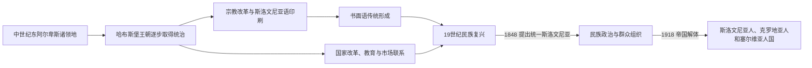

# 哈布斯堡统治与斯洛文尼亚民族形成

## 时间

13世纪—1918年

## 概括

中世纪后期到第一次世界大战结束，绝大多数斯洛文尼亚语人口生活在哈布斯堡王朝的不同领地内。共同王朝并未消除克拉尼斯卡、施蒂利亚、克恩顿、戈里齐亚和滨海地区的行政差异；宗教改革时期的斯洛文尼亚语书写、19世纪民族复兴以及1848年的“统一斯洛文尼亚”方案，逐步把分散语言社群组织为现代民族政治。

## 重要进程

- **领地格局**：哈布斯堡在13—15世纪逐步控制克拉尼斯卡、施蒂利亚、克恩顿及滨海的许多地区；采列伯爵等地方势力一度保持重要地位。沿海部分地区和伊斯特拉又受威尼斯等政权影响。
- **语言文化**：普里莫日·特鲁巴尔于16世纪出版早期斯洛文尼亚语书籍，宗教改革推动文字和翻译；反宗教改革恢复天主教主导地位，却未消除已经形成的书面语传统。
- **帝国改革**：18世纪的行政、教育和宗教改革以及商品经济发展，加强了不同地区之间的联系。1809—1813年法国统治下的伊利里亚省又带来短暂制度变化。
- **民族复兴**：语言学、文学、报刊和社团把地方方言群整合进斯洛文尼亚民族文化；弗兰策·普列舍仁等人的文学后来成为国家象征。
- **1848年方案**：“统一斯洛文尼亚”要求把分散在各领地的斯洛文尼亚语地区合为一个自治单位，并主张语言权利，但未获帝国采纳。
- **帝国晚期**：1867年后斯洛文尼亚语人口主要处在奥地利一侧；德国化、意大利民族主义、选举政治、天主教群众组织和南斯拉夫主义共同塑造政治竞争。
- **1918年转折**：帝国崩溃后，斯洛文尼亚政治精英参与建立斯洛文尼亚人、克罗地亚人和塞尔维亚人国，随后加入以贝尔格莱德为中心的共同王国。

## 演变关系

- 前一阶段：[早期斯拉夫定居与卡兰塔尼亚](/%E4%BA%BA%E6%96%87%E7%A7%91%E5%AD%A6/%E5%8E%86%E5%8F%B2/%E6%AC%A7%E6%B4%B2/%E4%B8%9C%E5%8D%97%E6%AC%A7%E4%B8%8E%E5%B7%B4%E5%B0%94%E5%B9%B2/%E6%96%AF%E6%B4%9B%E6%96%87%E5%B0%BC%E4%BA%9A/%E6%97%A9%E6%9C%9F%E6%96%AF%E6%8B%89%E5%A4%AB%E5%AE%9A%E5%B1%85%E4%B8%8E%E5%8D%A1%E5%85%B0%E5%A1%94%E5%B0%BC%E4%BA%9A.md)。
- 共同区域背景：[奥斯曼—哈布斯堡分治与民族运动](/%E4%BA%BA%E6%96%87%E7%A7%91%E5%AD%A6/%E5%8E%86%E5%8F%B2/%E6%AC%A7%E6%B4%B2/%E4%B8%9C%E5%8D%97%E6%AC%A7%E4%B8%8E%E5%B7%B4%E5%B0%94%E5%B9%B2/%E5%8D%97%E6%96%AF%E6%8B%89%E5%A4%AB%E5%8E%86%E5%8F%B2/%E5%A5%A5%E6%96%AF%E6%9B%BC%E2%80%94%E5%93%88%E5%B8%83%E6%96%AF%E5%A0%A1%E5%88%86%E6%B2%BB%E4%B8%8E%E6%B0%91%E6%97%8F%E8%BF%90%E5%8A%A8.md)。
- 后一阶段：[王国时期与第二次世界大战](/%E4%BA%BA%E6%96%87%E7%A7%91%E5%AD%A6/%E5%8E%86%E5%8F%B2/%E6%AC%A7%E6%B4%B2/%E4%B8%9C%E5%8D%97%E6%AC%A7%E4%B8%8E%E5%B7%B4%E5%B0%94%E5%B9%B2/%E6%96%AF%E6%B4%9B%E6%96%87%E5%B0%BC%E4%BA%9A/%E7%8E%8B%E5%9B%BD%E6%97%B6%E6%9C%9F%E4%B8%8E%E7%AC%AC%E4%BA%8C%E6%AC%A1%E4%B8%96%E7%95%8C%E5%A4%A7%E6%88%98.md)。

## 关键辨析

- 共同处在哈布斯堡王朝之下不等于形成了统一的“斯洛文尼亚省”；历史领地、城市语言和地方身份长期各异。
- 斯洛文尼亚民族形成依靠语言、教育、宗教和政治动员，不是卡兰塔尼亚身份未经变化的简单延续。
