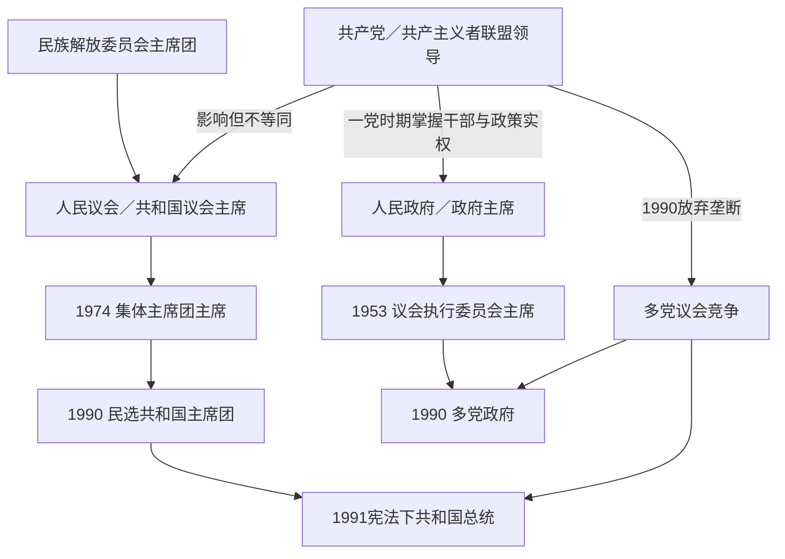

# 斯洛文尼亚国家元首与政府首脑表

## 范围与使用方法

本表集中列出1945年以来斯洛文尼亚共和国层级的法定元首、政府首脑和一党时期的党内主要领导，并补充1990年多党化后的完整总统与历届政府。南斯拉夫联邦国家元首、联邦政府和王国君主属于共同国家层级，另见[南斯拉夫国家元首与政府首脑表](/%E4%BA%BA%E6%96%87%E7%A7%91%E5%AD%A6/%E5%8E%86%E5%8F%B2/%E6%AC%A7%E6%B4%B2/%E4%B8%9C%E5%8D%97%E6%AC%A7%E4%B8%8E%E5%B7%B4%E5%B0%94%E5%B9%B2/%E5%8D%97%E6%96%AF%E6%8B%89%E5%A4%AB%E5%8E%86%E5%8F%B2/%E5%8D%97%E6%96%AF%E6%8B%89%E5%A4%AB%E5%9B%BD%E5%AE%B6%E5%85%83%E9%A6%96%E4%B8%8E%E6%94%BF%E5%BA%9C%E9%A6%96%E8%84%91%E8%A1%A8.md)。

社会主义时期没有始终不变的“总统”职位。1945—1953年由民族解放委员会／人民议会主席团承担共和国代表职能；1953—1974年通常以人民议会或共和国议会主席作为法定最高代表；1974年宪法建立集体主席团。政府首脑则由政府主席改称议会执行委员会主席。共产党职务掌握干部任命和政策方向，却不等于法定国家职位，故单独列出。

## 职位对应表

| 时段 | 法定共和国代表 | 政府首脑 | 实际权力结构 |
|---|---|---|---|
| 1945—1953年 | 斯洛文尼亚民族解放委员会／人民议会主席团主席 | 人民政府／政府主席 | 南斯拉夫共产党及斯洛文尼亚共产党、联邦机关、秘密警察和游击队干部网络居主导。 |
| 1953—1974年 | 人民议会／共和国议会主席 | 议会执行委员会主席 | 共产主义者联盟通过干部体系确定政策；联邦总统铁托及爱德华·卡德尔等联邦领导具有跨层级影响。 |
| 1974—1990年 | 共和国集体主席团及其主席 | 共和国议会执行委员会主席 | 共和国权限扩大，但一党制、联邦国防外交与党—国家协调仍限制多元竞争。 |
| 1990—1991年 | 民选的共和国主席团，米兰·库昌任主席 | 阿洛伊兹·彼得莱领导多党政府 | 旧1974宪制经修正后运行，议会、主席团与政府共同推动主权和独立。 |
| 1991年至今 | 直接选举的共和国总统 | 由国民议会选出、领导内阁的总理 | 议会制为核心；总统主要代表国家并承担部分任命、选举和国防职能，总理掌握日常行政。 |

## 社会主义时期法定元首

### 民族解放机关与议会主席

早期机关名称多次改变，交接日也可能因“当选日、机关开会日、法令生效日”相差一日。下表采用共和国机构任职主线；1974年后，议会主席继续存在，但国家代表职能转给集体主席团，因此不再列入元首序列。

| 顺序 | 姓名 | 法定职位 | 任期 | 继任关系与关键说明 |
|---:|---|---|---|---|
| 1 | **约瑟普·维德马尔（Josip Vidmar）** | 斯洛文尼亚民族解放委员会主席团主席；制宪／人民议会主席团主席 | 1944年2月19日—1953年1月30日；本表重点从1945年起 | 抵抗时期机关转为战后共和国代表机构；法定地位重要，但共产党领导层掌握实际政策。 |
| 2 | 费尔多·科扎克（Ferdo Kozak） | 人民议会主席 | 1953年1月30日—12月15日 | 1953年宪制重组后短任；人民议会主席承担共和国最高代表角色。 |
| 3 | 米哈·马林科（Miha Marinko） | 人民议会主席 | 1953年12月15日—1962年6月9日 | 此前任政府首脑和党书记；显示党、政、议会干部交叉，但任期必须按职位分别计算。 |
| 4 | **维达·托姆希奇（Vida Tomšič）** | 人民议会主席 | 1962年6月9日—1963年6月25日 | 著名女性共产党干部和社会政策活动者；1963年共和国改称“社会主义共和国”。 |
| 5 | 伊万·马切克（Ivan Maček） | 共和国议会主席 | 1963年6月25日—1967年5月9日 | 战时安全与党务干部；法定议会职位不等于单独总统制。 |
| 6 | **塞尔盖·克赖格尔（Sergej Kraigher）** | 共和国议会主席 | 1967年5月9日—1973年 | 后转任集体主席团首任主席；1973—1974年议会领导发生过渡调整。 |
| 7 | 托内·克罗普舍克（Tone Kropušek） | 共和国议会主席 | 1973—1974年，月日资料常不统一 | 1974年宪法实施前的短任过渡者；不应被“克赖格尔连续任元首”一项吞并。 |
| 8 | 马里扬·布雷采利（Marijan Brecelj） | 共和国议会主席 | 1974年—1974年5月9日（作为元首序列的过渡段） | 新宪制后仍任议会主席至1978年，但5月9日起共和国代表职能转由主席团，故此后不再算元首。 |

### 共和国主席团主席

| 顺序 | 姓名 | 任期 | 产生与继任 | 关键事件 |
|---:|---|---|---|---|
| 1 | **塞尔盖·克赖格尔** | 1974年5月9日—1979年5月23日 | 1974年宪法下集体主席团首任主席 | 共和国自治扩大；后任南斯拉夫联邦主席团主席。 |
| 2 | 维克托·阿夫贝利（Viktor Avbelj） | 1979年5月23日—1984年5月7日 | 由共和国代表机关选出 | 经历铁托去世、债务和稳定化危机初期。 |
| 3 | 弗兰采·波皮特（France Popit） | 1984年5月7日—1988年5月6日 | 前斯洛文尼亚党组织领导 | 一方面维持一党秩序，另一方面公民社会和经济批评迅速扩展。 |
| 4 | **亚内兹·斯塔诺夫尼克（Janez Stanovnik）** | 1988年5月6日—1990年5月10日 | 最后一位一党时期主席团主席 | JBTZ审判、宪法修正、反对派合法化和多党选举均发生于任内。 |
| 5 | **米兰·库昌（Milan Kučan）** | 1990年5月10日—1991年12月23日 | 1990年多党选举中直接当选主席团主席 | 与四名主席团成员组成集体机关；主持公投、十日战争和独立过渡，1991年宪法后改任共和国总统。 |

## 社会主义时期政府首脑

| 顺序 | 姓名 | 职位 | 任期 | 继任关系与关键政策 |
|---:|---|---|---|---|
| 1 | **鲍里斯·基德里奇（Boris Kidrič）** | 人民政府主席／政府主席 | 1945年5月5日—1946年6月17日 | 首届战后政府首脑；推动接管、国有化和计划经济，后转任联邦经济领导。 |
| 2 | 米哈·马林科 | 政府主席；1953年后短任执行委员会主席 | 1946年6月17日—1953年12月15日 | 经历1948年苏南决裂、农业合作化和工人自治起步；1953年职位改名但本人续任至年底。 |
| 3 | **鲍里斯·克赖格尔（Boris Kraigher）** | 议会执行委员会主席 | 1953年12月15日—1962年6月25日 | 工业化、自主管理和对西方开放时期；后参与联邦经济改革。 |
| 4 | 维克托·阿夫贝利 | 执行委员会主席 | 1962年6月25日—1965年4月29日 | 共和国改称社会主义共和国，经济改革讨论加深。 |
| 5 | 扬科·斯莫莱（Janko Smole） | 执行委员会主席 | 1965年4月29日—1967年5月9日 | 1965年市场化改革初期，强调银行、企业和出口机制。 |
| 6 | **斯塔内·卡夫契奇（Stane Kavčič）** | 执行委员会主席 | 1967年5月9日—1972年11月27日 | 推动公路、服务业、企业自主和面向西方的“自由派”路线；在党内反自由化中被迫离职。 |
| 7 | 安德烈·马林茨（Andrej Marinc） | 执行委员会主席 | 1972年11月27日—1978年5月9日 | 接替卡夫契奇，恢复党内纪律；任内实施1974年分权宪法。 |
| 8 | 安东·弗拉图沙（Anton Vratuša） | 执行委员会主席 | 1978年5月9日—1980年7月 | 铁托晚年和去世时期主持共和国行政；卸任月日资料常只精确到月。 |
| 9 | 亚内兹·泽姆利亚里奇（Janez Zemljarič） | 执行委员会主席 | 1980年7月—1984年5月23日 | 债务、紧缩和通胀上升；后进入联邦政府。 |
| 10 | **杜尚·希尼戈伊（Dušan Šinigoj）** | 执行委员会主席 | 1984年5月23日—1990年5月16日 | 最后一位一党政府首脑；面对经济危机、公民社会和多党化，向彼得莱政府交权。 |
| 11 | **阿洛伊兹／洛伊泽·彼得莱（Alojz／Lojze Peterle）** | 共和国执行委员会主席，后称总理 | 1990年5月16日—1992年5月14日 | 首届多党政府首脑；任期跨越独立，负责公投实施、国防准备、十日战争和国际承认。 |

## 斯洛文尼亚共产党／共产主义者联盟主要领导

党职名称从中央委员会书记改为中央委员会主席，再改为中央委员会主席团主席。下表列共和国党组织的第一负责人；铁托作为联邦党和国家最高领导、爱德华·卡德尔作为联邦制度设计者，在许多时期的影响高于共和国党首，故“实际权力”不能机械化为一人独裁序列。

| 顺序 | 姓名 | 党内职务 | 任期 | 实际政治作用 |
|---:|---|---|---|---|
| 1 | 弗兰茨·莱斯科舍克（Franc Leskošek） | 斯洛文尼亚共产党中央委员会书记 | 1937年4月17日—1948年11月15日 | 战前重建党组织、战争动员及战后夺权的重要干部。 |
| 2 | **米哈·马林科** | 中央委员会书记 | 1948年11月15日—1966年10月17日 | 苏南决裂后整党、工业化和一党制度巩固；同时曾任共和国政府和议会领导。 |
| 3 | 阿尔贝特·雅科皮奇（Albert Jakopič，化名Kajtimir） | 中央委员会主席 | 1966年10月17日—1968年12月11日 | 1966年联邦安全体系调整和经济改革时期的过渡领导。 |
| 4 | **弗兰采·波皮特** | 中央委员会主席 | 1968年12月11日—1982年4月18日 | 任期横跨卡夫契奇自由化及1972年清洗、1974年宪法和铁托去世；党组织长期核心。 |
| 5 | 安德烈·马林茨 | 中央委员会主席 | 1982年4月18日—1986年4月19日 | 债务与紧缩时期维持党内统合。 |
| 6 | **米兰·库昌** | 中央委员会主席团主席 | 1986年4月19日—1989年12月23日 | 对斯洛博丹·米洛舍维奇的再集中路线持抵制态度，容纳部分公民社会和宪制改革要求。 |
| 7 | 齐里尔·里比契奇（Ciril Ribičič） | 中央委员会主席团主席 | 1989年12月23日—1990年5月27日 | 主持党放弃权力垄断、退出南共联盟特别代表大会并改组为民主复兴党；此时其职位已不再是国家实际唯一领导。 |

### 党政关系说明

- 1945—1960年代，党组织控制干部任用、警察、军队联系、媒体和群众组织，法定议会选举不能形成执政轮替。
- 1952年“共产党”改称“共产主义者联盟”，并未立即变为普通政党；其领导仍通过民主集中制和干部名单发挥决定作用。
- 1960—1970年代的工人自治和联邦分权扩大企业、地方与共和国空间，但没有建立竞争性选举。
- 斯塔内·卡夫契奇虽任政府首脑，却在党内保守派和联邦压力下于1972年下台，说明行政职位不能脱离党内权力理解。
- 1986年后斯洛文尼亚党领导与媒体、知识界和新社会运动形成有限对话，是和平多党化的重要条件；这不意味着此前政治压制不存在。
- 1990年5月后的民主复兴党只是多党之一，不能再把其负责人列为“实际最高领导人”。

## 独立后共和国总统

总统由直接选举产生，任期五年，最多连续两届。斯洛文尼亚实行议会制，总统不是日常行政首脑；政府需获得国民议会多数支持。

| 顺序 | 姓名 | 任期 | 政治身份与继任 | 关键事件 |
|---:|---|---|---|---|
| 1 | **米兰·库昌（Milan Kučan）** | 1991年12月23日—2002年12月22日 | 从主席团主席转为1991年宪法下首任总统；1992、1997年当选 | 独立国际承认、联合国和欧洲委员会成员资格、转型制度巩固。 |
| 2 | **亚内兹·德尔诺夫舍克（Janez Drnovšek）** | 2002年12月22日—2007年12月23日 | 从长期总理职位转任总统 | 2003年欧盟与北约公投、2004年入盟，晚年强调人道外交。 |
| 3 | 达尼洛·蒂尔克（Danilo Türk） | 2007年12月23日—2012年12月22日 | 无党籍国际法学者和外交官 | 欧元及申根制度初期、2008年金融危机与对克罗地亚边界仲裁进程。 |
| 4 | **博鲁特·帕霍尔（Borut Pahor）** | 2012年12月22日—2022年12月22日 | 前总理、社会民主党政治家，以较超党派形象连任 | 欧元区危机后政治、和解象征活动、新冠疫情时期国家代表。 |
| 5 | **娜塔莎·皮尔茨·穆萨尔（Nataša Pirc Musar）** | 2022年12月23日—至今 | 无党籍律师、前信息专员；首位女性总统 | 关注法治、人权、气候与多边外交；截至2026年7月14日仍在任。 |

## 多党化以来历届政府

表中任期按完整内阁就职与卸任日，而不是总理个人获提名或在议会当选之日。德尔诺夫舍克连续三届内阁、扬沙四次组阁均逐届列出，以显示选举、联盟和政策阶段。

| 届次 | 总理 | 内阁任期 | 主要政治基础 | 关键事件与终结 |
|---:|---|---|---|---|
| 1 | **阿洛伊兹／洛伊泽·彼得莱** | 1990年5月16日—1992年5月14日 | DEMOS联盟、基督教民主党主导 | 完成公投、独立、十日战争和承认；联盟分裂及议会支持变化后被建设性不信任案取代。 |
| 2 | **亚内兹·德尔诺夫舍克** | 1992年5月14日—1993年1月25日 | 自由民主力量主导的跨党联盟 | 稳定承认后的国家机构；1992年议会选举后重组。 |
| 3 | 亚内兹·德尔诺夫舍克 | 1993年1月25日—1997年2月27日 | 自由民主党与中间、基督教民主及社会民主伙伴 | 推动私有化、欧洲委员会入会和宏观稳定；1996年选举后换届。 |
| 4 | 亚内兹·德尔诺夫舍克 | 1997年2月27日—2000年6月7日 | 自由民主党、人民党等联盟 | 欧盟谈判启动；人民党退出和议会联盟重组导致下台。 |
| 5 | 安德烈·巴尤克（Andrej Bajuk） | 2000年6月7日—11月30日 | 中右临时多数 | 短期内阁处理选举前过渡；2000年大选后卸任。 |
| 6 | 亚内兹·德尔诺夫舍克 | 2000年11月30日—2002年12月19日 | 自由民主党主导中左联盟 | 推进欧盟与北约入盟谈判；德尔诺夫舍克当选总统后交棒。 |
| 7 | 安东·罗普（Anton Rop） | 2002年12月19日—2004年12月3日 | 自由民主党主导联盟 | 2003年公投、2004年加入北约和欧盟；2004年选举失利。 |
| 8 | **亚内兹·扬沙（Janez Janša）** | 2004年12月3日—2008年11月21日 | 斯洛文尼亚民主党主导中右联盟 | 采用欧元、进入申根、2008年首次主持欧盟理事会；选举后轮替。 |
| 9 | **博鲁特·帕霍尔** | 2008年11月21日—2012年2月10日 | 社会民主党主导中左联盟 | 应对全球金融和欧元区危机，克罗地亚边界仲裁公投；联盟瓦解并提前选举。 |
| 10 | 亚内兹·扬沙 | 2012年2月10日—2013年3月20日 | 中右多党联盟 | 紧缩、银行危机和反腐争议激化；联盟伙伴退出后遭建设性不信任案。 |
| 11 | **阿连卡·布拉图舍克（Alenka Bratušek）** | 2013年3月20日—2014年9月18日 | 积极斯洛文尼亚及中左联盟 | 银行重组、避免外部救助；党内领导权失败后辞职并提前选举。 |
| 12 | **米罗·采拉尔（Miro Cerar）** | 2014年9月18日—2018年9月13日 | 现代中心党主导联盟 | 法治和财政稳定议程、移民路线压力；铁路项目公投裁决后辞职，留任至选举。 |
| 13 | **马里扬·沙雷茨（Marjan Šarec）** | 2018年9月13日—2020年3月13日 | 五党少数政府，曾获左翼外部支持 | 联盟协调困难；2020年辞职后国会形成新多数，未立即举行选举。 |
| 14 | 亚内兹·扬沙 | 2020年3月13日—2022年6月1日 | 民主党主导中右联盟 | 新冠疫情、法治与媒体争议、2021年第二次主持欧盟理事会；2022年选举后轮替。 |
| 15 | **罗伯特·戈洛布（Robert Golob）** | 2022年6月1日—2026年6月4日 | 自由运动、社会民主党和左翼联盟 | 能源、洪灾重建、公共服务与绿色转型；2026年大选后由新多数接替。 |
| 16 | **亚内兹·扬沙** | 2026年6月4日—至今 | 民主党主导的右中联盟 | 2026年5月22日获国民议会选为总理，完整内阁6月4日就职；截至2026年7月14日在任。 |

## 现任与职位关系

| 核验截止 | 国家元首 | 政府首脑 | 权力关系 |
|---|---|---|---|
| 2026年7月14日 | **总统娜塔莎·皮尔茨·穆萨尔**，2022年12月23日起 | **总理亚内兹·扬沙**，第16届政府自2026年6月4日起 | 总统代表国家、公布法律并行使宪法列举职权；总理和内阁向国民议会负责，掌握日常行政政策。 |

## 连续性与特殊情况

- 米兰·库昌在1991年12月23日前后的职位名称改变：此前是集体主席团主席，此后是新宪法下共和国总统；属于制度转换，不是两个人次。
- 彼得莱政府始于南斯拉夫加盟共和国时期，跨越1991年独立，故在社会主义政府表和独立后内阁表都需出现；两表描述同一连续任期，不是重复组阁。
- 德尔诺夫舍克1992—2000年连续主持三届不同内阁，2000年短暂离任后再组第六届；不能合并为无间断单项。
- 扬沙四次担任总理，分别始于2004、2012、2020和2026年；每次均由不同选举与议会联盟产生。
- 社会主义时期议会主席、主席团主席、政府执行委员会主席、党组织第一负责人必须分表；同一人担任多个职位时按各职位任期分别记录。
- 1973—1974年议会领导换届的精确月日资料并不一致，本表保留托内·克罗普舍克和马里扬·布雷采利两位过渡者，并明确约略年代，不用“克赖格尔连续至1974”掩盖他们。
- 总统与总理并非上下级：总统由全民直选且任期固定，总理依赖议会多数；政治同属或分属不同阵营不改变宪法分工。

## 相关笔记

- 社会主义制度和历史过程：[社会主义斯洛文尼亚](/%E4%BA%BA%E6%96%87%E7%A7%91%E5%AD%A6/%E5%8E%86%E5%8F%B2/%E6%AC%A7%E6%B4%B2/%E4%B8%9C%E5%8D%97%E6%AC%A7%E4%B8%8E%E5%B7%B4%E5%B0%94%E5%B9%B2/%E6%96%AF%E6%B4%9B%E6%96%87%E5%B0%BC%E4%BA%9A/%E7%A4%BE%E4%BC%9A%E4%B8%BB%E4%B9%89%E6%96%AF%E6%B4%9B%E6%96%87%E5%B0%BC%E4%BA%9A.md)。
- 独立后的事件与因果：[独立与当代斯洛文尼亚](/%E4%BA%BA%E6%96%87%E7%A7%91%E5%AD%A6/%E5%8E%86%E5%8F%B2/%E6%AC%A7%E6%B4%B2/%E4%B8%9C%E5%8D%97%E6%AC%A7%E4%B8%8E%E5%B7%B4%E5%B0%94%E5%B9%B2/%E6%96%AF%E6%B4%9B%E6%96%87%E5%B0%BC%E4%BA%9A/%E7%8B%AC%E7%AB%8B%E4%B8%8E%E5%BD%93%E4%BB%A3%E6%96%AF%E6%B4%9B%E6%96%87%E5%B0%BC%E4%BA%9A.md)。
- 战时建政来源：[王国时期与第二次世界大战](/%E4%BA%BA%E6%96%87%E7%A7%91%E5%AD%A6/%E5%8E%86%E5%8F%B2/%E6%AC%A7%E6%B4%B2/%E4%B8%9C%E5%8D%97%E6%AC%A7%E4%B8%8E%E5%B7%B4%E5%B0%94%E5%B9%B2/%E6%96%AF%E6%B4%9B%E6%96%87%E5%B0%BC%E4%BA%9A/%E7%8E%8B%E5%9B%BD%E6%97%B6%E6%9C%9F%E4%B8%8E%E7%AC%AC%E4%BA%8C%E6%AC%A1%E4%B8%96%E7%95%8C%E5%A4%A7%E6%88%98.md)。
- 总览入口：[斯洛文尼亚历史](/%E4%BA%BA%E6%96%87%E7%A7%91%E5%AD%A6/%E5%8E%86%E5%8F%B2/%E6%AC%A7%E6%B4%B2/%E4%B8%9C%E5%8D%97%E6%AC%A7%E4%B8%8E%E5%B7%B4%E5%B0%94%E5%B9%B2/%E6%96%AF%E6%B4%9B%E6%96%87%E5%B0%BC%E4%BA%9A/README.md)。
