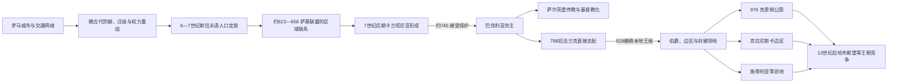

# 早期斯拉夫定居与卡兰塔尼亚

## 时间

史前—13世纪，重点为6—13世纪

## 概括

今斯洛文尼亚位于东阿尔卑斯、萨瓦河—德拉瓦河通道、潘诺尼亚平原和北亚得里亚海之间。罗马统治把该地分置于意大利、诺里库姆和潘诺尼亚等行政区，却用城镇、道路、税制和军防连接起来。西罗马国家结构衰退后，哥特人、匈人、伦巴第人、阿瓦人及其他群体相继活动，6—7世纪斯拉夫语人口沿河谷和山口进入并与原有居民融合。

7世纪萨莫领导的跨地区斯拉夫联盟曾与部分东阿尔卑斯社群发生联系；联盟解体后，卡兰塔尼亚成为较清楚可见的区域政体。其政治中心在今奥地利克拉根福附近，而不是现代斯洛文尼亚国境内。约8世纪中叶，卡兰塔尼亚为抵御阿瓦人接受巴伐利亚保护，继而被纳入法兰克宗主、传教和行政体系；828年前后，本地王侯被法兰克伯爵替代。此后的克恩顿公国、克拉尼斯卡边区、施蒂利亚等领地，是中世纪制度重组的结果，不是现代民族国家的连续王朝。

## 罗马与晚古代背景

### 行政和城市网络

| 区域或中心 | 罗马时期位置与功能 | 对后世的影响 |
|---|---|---|
| 埃莫纳（今卢布尔雅那） | 通常归入意大利东北部行政范围，控制卢布尔雅那盆地和通往亚得里亚海的道路 | 城市虽在晚古代衰退，交通节点与聚落重心长期延续。 |
| 波埃托维奥（今普图伊） | 潘诺尼亚的重要军营、河运和商业中心 | 德拉瓦河走廊继续连接阿尔卑斯与潘诺尼亚。 |
| 采列亚（今采列） | 诺里库姆的自治城市和贸易—手工业中心 | 萨维尼亚河谷成为后来贵族领地与城镇网络的重要轴线。 |
| 瑙波尔图斯、阿特兰斯、涅维奥杜努姆 | 转运站、道路驿站和萨瓦河沿线中心 | 显示今天国土从来不是孤立边缘，而是多个省区的接合部。 |
| 尤利安阿尔卑斯屏障 | 3—4世纪沿意大利东北入口修筑的堡垒、城墙和关隘体系 | 晚期帝国把山口视为保护意大利腹地的战略门槛。 |

4—6世纪的战乱、疫病和财政收缩削弱低地城市与边防，部分居民转向山地设防聚落。西哥特人、匈人、东哥特人和伦巴第人先后穿行或统治部分地区；568年伦巴第人进入意大利后，东阿尔卑斯权力真空扩大。旧居民没有整体消失，地名、农业技术、道路使用和基督教传统通过融合而保留。把这一时期写成“罗马人完全离开、斯拉夫人一次性取代”会掩盖考古所见的连续与断裂并存。

## 斯拉夫定居与萨莫联盟

### 定居过程

- **第一批活动**：6世纪中后期，斯拉夫语群体从多瑙河中游和巴尔干西北方向进入萨瓦、德拉瓦、穆拉河谷；不同路线、批次和地方联盟并存。
- **与阿瓦人的关系**：阿瓦汗国控制潘诺尼亚后，部分斯拉夫群体受其军事—贡赋体系支配，另一些则在阿尔卑斯谷地保持更大自主性。
- **与原居民融合**：罗马化人口、残留日耳曼群体和新来居民在农业、畜牧、地名及宗教上互动。后世斯洛文尼亚语社群由长期融合形成，不能追溯为单一“纯粹部族”。
- **空间变化**：早期斯拉夫语分布一度比今天更向北、向西延伸；中世纪巴伐利亚移民、领主开发和语言转换才逐步收缩边界。
- **身份限度**：当时文献使用“斯拉夫人”“卡兰塔尼亚人”等区域或政治称呼，没有现代民族、国籍和固定国界的含义。

约623年，法兰克商人萨莫领导多支斯拉夫群体反抗阿瓦权力，并在631年前后击退法兰克王达戈贝尔特一世的远征。编年史提到东阿尔卑斯的斯拉夫首领瓦卢克，说明部分当地社群可能与联盟协作；但联盟的组织程度、疆域和瓦卢克是否已经是“卡兰塔尼亚公爵”均不能确定。萨莫约658年去世后，联盟失去共同领导，东阿尔卑斯的卡兰塔尼亚与更南面的克拉尼斯卡分别发展。

## 卡兰塔尼亚的建立与崛起

### 形成条件

1. **山谷地形提供防御与自治空间**：德拉瓦上游、克拉根福盆地和周边山口便于控制牧场、道路和小型农业区。
2. **阿瓦压力促成军事联盟**：东部强权的贡赋与远征迫使地方首领组织更稳定的防御。
3. **萨莫联盟留下跨社群协作经验**：即使不存在机构上的直接继承，7世纪联盟政治仍改善了斯拉夫精英的动员能力。
4. **罗马道路和教会遗存提供资源**：旧交通线、要塞与聚落位置被重新利用。
5. **巴伐利亚和伦巴第之间的边境位置**：卡兰塔尼亚既可贸易和结盟，也不断面临军事干预。

卡兰塔尼亚约在7世纪后半叶成为可辨识的公国或王侯领。核心在克恩堡—戈斯波斯韦茨科波列一带，今天位于奥地利克恩顿；其影响可能伸入今斯洛文尼亚北部和东北部，但边界不固定。社会由王侯、武装随从、自由农民、依附人口和地方共同体构成。后来被称为科塞齐的特殊自由人群体与王侯军事—仪式职能相关，但其早期地位仍有争论。

## 可考王侯与史料限度

早期记载零散，主要依靠法兰克编年史、约870年成书且服务于萨尔茨堡教会权利主张的《巴伐利亚人与卡兰塔尼亚人皈依记》，以及更晚的仪式叙述。下表把“可靠见于早期材料”“名称可见但年代或身份不稳”“后世传统争议”分开，不把缺失年代补成虚假连续谱系。

| 顺序 | 姓名与常见译名 | 约在位或活动时间 | 与前任关系 | 史料等级 | 关键事件与说明 |
|---:|---|---|---|---|---|
| 1 | 瓦卢克（Walluc／Valuk） | 约630年代 | 不详 | 身份有争议 | 编年史称其为东阿尔卑斯“文德边区”的斯拉夫首领，并与萨莫联盟相关；是否统治后来意义上的卡兰塔尼亚不能确定。 |
| 2 | **博鲁特（Boruth／Borut）** | 约740—约750年 | 与瓦卢克的谱系不详 | 可靠 | 第一位有较清楚记载的卡兰塔尼亚王侯；在阿瓦压力下向巴伐利亚公爵奥迪洛求援，接受保护并交出贵族人质。 |
| 3 | 戈拉兹德（Cacatius／Gorazd） | 约750—752年 | 博鲁特之子 | 可靠 | 在巴伐利亚作为人质并接受基督教教育；经法兰克许可、应卡兰塔尼亚人请求返国即位，在位短。 |
| 4 | **霍蒂米尔（Cheitmar／Hotimir）** | 752—769年 | 博鲁特之侄、戈拉兹德堂兄弟 | 可靠 | 同样在巴伐利亚受洗；与萨尔茨堡传教体系合作，莫德斯图斯主教及传教士进入卡兰塔尼亚；新宗教与贡赋引发反抗。 |
| 5 | 瓦尔通（Waltunc／Valhun） | 约772—约788年 | 不详，可能非博鲁特家族 | 基本可见但年代约略 | 769年后反基督教起义一度阻断传教；772年巴伐利亚公爵塔西洛三世镇压反抗，此后瓦尔通与恢复传教相联系。 |
| 6 | 普里比斯拉夫（Priwizlauga／Pribislav） | 8世纪末—9世纪初，具体不详 | 不详 | 名称可见、排序有争议 | 常列入后期本地王侯，缺少足以确定精确年表的材料。 |
| 7 | 塞米卡（Semika） | 9世纪初，具体不详 | 不详 | 名称可见、排序有争议 | 处于法兰克直接控制加强时期；个人事迹不详。 |
| 8 | 斯托伊米尔（Stojmir） | 9世纪初，具体不详 | 不详 | 名称可见、排序有争议 | 不能确认与前任的亲属或即位关系。 |
| 9 | 埃特加尔（Etgar） | 9世纪初—约820年代 | 不详 | 名称可见、排序有争议 | 常被视为最后阶段本地王侯之一；828年法兰克重组后，本地王侯制被伯爵制取代。 |
| — | 多米蒂安（Domitian） | 传统称约8世纪末，卒年常作约802年 | 不详 | 后世传统争议 | 米尔施塔特相关圣人传统是否对应真实卡兰塔尼亚统治者，学界没有共识，故不纳入连续顺序。 |
| — | 英戈（Ingo） | 约8世纪末 | 不详 | 身份争议 | 传教叙事中的贵人或支配者；是否为王侯、伯爵或教会传统中的人物无法确定。 |

### 继承规则与外部批准

戈拉兹德和霍蒂米尔的回国都被叙述为“卡兰塔尼亚人请求”与法兰克—巴伐利亚统治者批准并存，说明本地精英认可和外部宗主权已相互嵌套。后世仪式常被解释为地方共同体保留的选择权，但不能据此推定所有王侯都由全民选举，更不能套用现代民主或宪政概念。

## 基督教化与地方反抗

约745年前后，博鲁特求援使卡兰塔尼亚成为巴伐利亚附属。其子戈拉兹德和侄霍蒂米尔被送往巴伐利亚，既是政治人质，也是基督教化精英。霍蒂米尔时期，萨尔茨堡方面派遣地区主教莫德斯图斯，兴建教堂并训练教士。阿奎莱亚宗主教区也从南面产生影响，东阿尔卑斯由此处在拉丁教会多个传教网络交界处。

基督教化不是单纯信仰传播。它连同新贡赋、教产、领主权和外来政治监督，改变地方资源分配，因此在8世纪发生多轮反抗。769年霍蒂米尔去世后起义驱逐部分传教人员，772年才被巴伐利亚力量压服。788年查理曼废黜巴伐利亚公爵塔西洛三世，巴伐利亚及卡兰塔尼亚直接进入加洛林帝国。795—796年法兰克摧毁阿瓦政治中心，又把潘诺尼亚西部纳入边疆体系。

## 王侯仪式：可知内容与不可知内容

- **仪式空间**：后世克恩顿公爵就任与王侯石、公爵椅和玛丽亚萨尔教堂等地点相连；各环节形成于不同年代。
- **语言与参与者**：中晚期记载描述一名代表地方自由人群体的农民以斯拉夫语盘问新公爵，再交付象征性权力。它反映地方习惯法和领地等级的协商，但完整叙述晚于卡兰塔尼亚数百年。
- **延续范围**：克恩顿公爵仪式一直举行到1414年，说明某些地方象征长期保留；这不证明程序自7世纪起完全不变。
- **史料偏差**：详细叙事由中世纪晚期作者写成，作者关注的是克恩顿公国法权，而非记录现代斯洛文尼亚民族国家的起源。
- **政治记忆**：19世纪民族运动和现代国家象征强化了卡兰塔尼亚的“早期国家”形象。它确是东阿尔卑斯斯拉夫政治的重要遗产，但奥地利克恩顿史、斯洛文尼亚民族史和中世纪帝国史都可合理研究这一共同遗产。

## 并入法兰克秩序与自主终结

### 分阶段过程

| 阶段 | 权力变化 | 结果 |
|---|---|---|
| 约745—788年 | 卡兰塔尼亚保留本地王侯，但接受巴伐利亚保护、提供人质并容纳传教 | 自主权被限制，继承须取得外部许可。 |
| 788—819年 | 巴伐利亚并入加洛林帝国，法兰克伯爵、教会和边疆军政加强 | 本地精英仍存在，但已处帝国行政体系内。 |
| 819—823年 | 萨瓦河流域的柳德维特·波萨夫斯基反抗法兰克边疆官员，部分卡兰塔尼亚人参加 | 法兰克多次远征，逐步击败联盟。 |
| 828年重组 | 路易“日耳曼人”一方撤换或取消斯拉夫本地王侯，以法兰克伯爵治理 | 卡兰塔尼亚作为具有本地王侯的政体终结。 |
| 9—10世纪 | 东法兰克王国、匈牙利袭扰和边疆重建相继发生 | 旧卡兰塔尼亚空间分化为公国与边区。 |

### 衰落因素与直接终结

- **结构因素**：人口与财政规模有限，难以长期对抗阿瓦、巴伐利亚和法兰克等更大军事政权；王侯权力又依赖地方精英共识。
- **制度因素**：人质教育、传教网络、伯爵监督和封建土地关系把统治精英逐步嵌入外部体系。
- **内部因素**：基督教化和新负担造成反复起义，削弱稳定的王朝继承。
- **外部压力**：查理曼兼并巴伐利亚并摧毁阿瓦汗国后，卡兰塔尼亚不再有在强权间平衡的空间。
- **直接触发**：819—823年反法兰克起义失败，使法兰克当局在828年用伯爵治理取代本地王侯。终结的是自主王侯制，不是当地斯拉夫人口或语言文化。

## 克恩顿、克拉尼斯卡与中世纪诸领地

### 从边区到公国

843年帝国分割后，东阿尔卑斯归东法兰克王国；9世纪末至10世纪初匈牙利骑兵袭扰破坏东部边区。955年莱希费尔德战役后，帝国重新组织东南边疆。976年，皇帝奥托二世把克恩顿从巴伐利亚分出，建立神圣罗马帝国公国；其范围一度包括多个边区，但后来不断分化。

克拉尼斯卡之名在973年的文书中可见，最初是防御与殖民性质的边区，约11世纪逐渐成为较稳定的侯国。今斯洛文尼亚语人口同时分布在克恩顿、施蒂利亚、克拉尼斯卡、戈里齐亚、伊斯特拉及匈牙利王国西缘。领主家族、主教区和修道院的边界彼此交错，没有一个机构代表所有语言人口。

### 统治结构

| 层级 | 主要角色 | 权力内容 |
|---|---|---|
| 帝国 | 神圣罗马皇帝与东法兰克／德意志国王 | 授予公爵、边伯和主教法权，实际控制随王朝能力变化。 |
| 公国与边区 | 克恩顿公爵、克拉尼斯卡边伯、施蒂利亚公爵等 | 军事防卫、司法、铸币、市场和领地封授；职位逐渐世袭化。 |
| 教会领 | 萨尔茨堡、阿奎莱亚、弗赖辛等教会机构 | 传教、什一税、土地经营、学校和书写文化。 |
| 地方贵族 | 埃彭施泰因、斯潘海姆、安德希斯、戈里齐亚等家族 | 通过城堡、婚姻、侍从和修道院建立领地网络。 |
| 城镇与市场 | 卢布尔雅那、克拉尼、普图伊、采列及沿海道路中心 | 取得市场权、城镇法和一定自治，连接阿尔卑斯与亚得里亚海贸易。 |
| 农村共同体 | 自由农、依附农民、庄园人口及科塞齐等特殊群体 | 承担租税、劳役和军役；地方习惯法继续影响土地关系。 |

### 语言与文化线索

约10—11世纪的弗赖辛手稿包含现存最早的长篇斯洛文尼亚语材料，内容属于拉丁教会牧灵实践。它证明地方斯拉夫语已经用于忏悔和宗教教导，却不等于当时已经形成统一标准语或民族行政。12—13世纪城镇、修道院、道路和庄园扩张促进经济，德语在贵族、城市和书写行政中增强，斯拉夫语在乡村和地方宗教生活中延续，两者并非始终严格分隔。

## 重要事件

| 时间 | 事件 | 过程与意义 |
|---|---|---|
| 前1世纪—4世纪 | 罗马整合与晚期防御体系 | 城镇、道路和尤利安阿尔卑斯屏障把地区纳入跨省交通与军政网络。 |
| 6—7世纪 | 斯拉夫语人口定居 | 多批迁徙与本地融合改变语言结构，并与阿瓦、伦巴第和巴伐利亚势力互动。 |
| 约623—658年 | 萨莫联盟 | 反阿瓦联盟击退法兰克远征；东阿尔卑斯社群的参与程度存在争议。 |
| 约741—745年 | 博鲁特向巴伐利亚求援 | 军援换取保护、贡属和人质，卡兰塔尼亚丧失完全独立。 |
| 752—769年 | 霍蒂米尔统治与传教 | 萨尔茨堡传教扩大，宗教与财政变化触发地方反抗。 |
| 772年 | 巴伐利亚镇压卡兰塔尼亚反抗 | 传教恢复，外部宗主控制加深。 |
| 788年 | 查理曼并吞巴伐利亚 | 卡兰塔尼亚进入加洛林直接统治。 |
| 819—823年 | 柳德维特反法兰克起义 | 部分卡兰塔尼亚人参战；失败为828年制度重组铺路。 |
| 828年 | 本地王侯制被伯爵制取代 | 卡兰塔尼亚自主政体的直接终点。 |
| 973、976年 | 克拉尼斯卡见于文书；克恩顿公国建立 | 东阿尔卑斯进入公国—边区的神圣罗马帝国秩序。 |
| 10—11世纪 | 弗赖辛手稿形成 | 保存早期斯洛文尼亚语宗教文本，显示拉丁教会与地方语言互动。 |
| 12—13世纪 | 城镇与领地发展 | 市场、城堡、修道院和地方贵族权力扩张，地区政治进一步分散。 |
| 1278—1282年 | 奥托卡二世战败，哈布斯堡取得奥地利和施蒂利亚 | 为哈布斯堡逐步控制多数斯洛文尼亚语领地打开通道。 |

## 演变关系

- 区域共同背景：[早期南斯拉夫人](/%E4%BA%BA%E6%96%87%E7%A7%91%E5%AD%A6/%E5%8E%86%E5%8F%B2/%E6%AC%A7%E6%B4%B2/%E4%B8%9C%E5%8D%97%E6%AC%A7%E4%B8%8E%E5%B7%B4%E5%B0%94%E5%B9%B2/%E5%8D%97%E6%96%AF%E6%8B%89%E5%A4%AB%E5%8E%86%E5%8F%B2/%E6%97%A9%E6%9C%9F%E5%8D%97%E6%96%AF%E6%8B%89%E5%A4%AB%E4%BA%BA.md)。
- 后一阶段：[哈布斯堡统治与斯洛文尼亚民族形成](/%E4%BA%BA%E6%96%87%E7%A7%91%E5%AD%A6/%E5%8E%86%E5%8F%B2/%E6%AC%A7%E6%B4%B2/%E4%B8%9C%E5%8D%97%E6%AC%A7%E4%B8%8E%E5%B7%B4%E5%B0%94%E5%B9%B2/%E6%96%AF%E6%B4%9B%E6%96%87%E5%B0%BC%E4%BA%9A/%E5%93%88%E5%B8%83%E6%96%AF%E5%A0%A1%E7%BB%9F%E6%B2%BB%E4%B8%8E%E6%96%AF%E6%B4%9B%E6%96%87%E5%B0%BC%E4%BA%9A%E6%B0%91%E6%97%8F%E5%BD%A2%E6%88%90.md)。
- 国家入口：[斯洛文尼亚历史](/%E4%BA%BA%E6%96%87%E7%A7%91%E5%AD%A6/%E5%8E%86%E5%8F%B2/%E6%AC%A7%E6%B4%B2/%E4%B8%9C%E5%8D%97%E6%AC%A7%E4%B8%8E%E5%B7%B4%E5%B0%94%E5%B9%B2/%E6%96%AF%E6%B4%9B%E6%96%87%E5%B0%BC%E4%BA%9A/README.md)。

## 关键辨析

- 卡兰塔尼亚的核心在今奥地利，不可按现代国界画成“第一版斯洛文尼亚”。
- 萨莫联盟是跨区域政治联合，东阿尔卑斯参与者与后来卡兰塔尼亚之间可能有联系，但没有完整机构继承证据。
- 博鲁特、戈拉兹德和霍蒂米尔较可靠；后期王侯名单、在位年及彼此亲属关系不完整，表中已逐项标注。
- 王侯石仪式的详细记录晚出，不能把14世纪程序无条件投射到7世纪。
- 828年以后不是“民族消失”，而是统治方式由本地王侯转为帝国伯爵、边伯、公爵和教会领主。
- 克恩顿、克拉尼斯卡和施蒂利亚是不同法权领地；它们的边界与现代斯洛文尼亚国界不重合。
