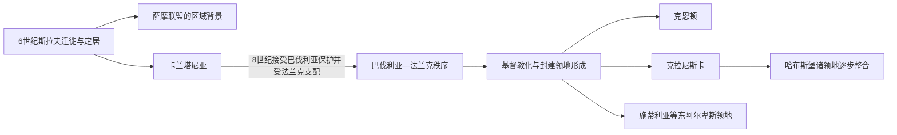

# 早期斯拉夫定居与卡兰塔尼亚

## 时间

6世纪—13世纪

## 概括

6世纪以后，斯拉夫语社群进入东阿尔卑斯地区，并在阿瓦人、巴伐利亚人、伦巴第人和法兰克人之间形成新的聚落与政治组织。7世纪出现的卡兰塔尼亚是这一地区最重要的早期斯拉夫政体；它后来进入巴伐利亚—法兰克政治和基督教化进程，继而分化为克恩顿、克拉尼斯卡、施蒂利亚等中世纪领地。

## 重要进程

- **斯拉夫定居**：迁徙并非一次完成；新来人口与当地罗马化居民、日耳曼和阿瓦势力发生长期互动。
- **卡兰塔尼亚**：其中心大致位于今奥地利克恩顿及周边，曾具有本地贵族和公爵推举仪式。它所覆盖的空间不能等同于现代斯洛文尼亚国界。
- **外部宗主与基督教化**：8世纪卡兰塔尼亚为应对阿瓦压力寻求巴伐利亚援助，随后受法兰克势力控制；来自萨尔茨堡等地的传教推动基督教化。
- **领地分化**：法兰克和神圣罗马帝国秩序下，东阿尔卑斯地区形成多个边区、公国和领地。斯洛文尼亚语人口分布在这些不同政治单位之中。
- **语言与身份**：早期居民与现代斯洛文尼亚人之间存在人口、语言和地域连续性，但经历了长期融合与身份重构，不能当作不变民族共同体。

## 演变关系

- 共同背景：[早期南斯拉夫人](/%E4%BA%BA%E6%96%87%E7%A7%91%E5%AD%A6/%E5%8E%86%E5%8F%B2/%E6%AC%A7%E6%B4%B2/%E4%B8%9C%E5%8D%97%E6%AC%A7%E4%B8%8E%E5%B7%B4%E5%B0%94%E5%B9%B2/%E5%8D%97%E6%96%AF%E6%8B%89%E5%A4%AB%E5%8E%86%E5%8F%B2/%E6%97%A9%E6%9C%9F%E5%8D%97%E6%96%AF%E6%8B%89%E5%A4%AB%E4%BA%BA.md)。
- 后一阶段：[哈布斯堡统治与斯洛文尼亚民族形成](/%E4%BA%BA%E6%96%87%E7%A7%91%E5%AD%A6/%E5%8E%86%E5%8F%B2/%E6%AC%A7%E6%B4%B2/%E4%B8%9C%E5%8D%97%E6%AC%A7%E4%B8%8E%E5%B7%B4%E5%B0%94%E5%B9%B2/%E6%96%AF%E6%B4%9B%E6%96%87%E5%B0%BC%E4%BA%9A/%E5%93%88%E5%B8%83%E6%96%AF%E5%A0%A1%E7%BB%9F%E6%B2%BB%E4%B8%8E%E6%96%AF%E6%B4%9B%E6%96%87%E5%B0%BC%E4%BA%9A%E6%B0%91%E6%97%8F%E5%BD%A2%E6%88%90.md)。
- 国家入口：[斯洛文尼亚历史](/%E4%BA%BA%E6%96%87%E7%A7%91%E5%AD%A6/%E5%8E%86%E5%8F%B2/%E6%AC%A7%E6%B4%B2/%E4%B8%9C%E5%8D%97%E6%AC%A7%E4%B8%8E%E5%B7%B4%E5%B0%94%E5%B9%B2/%E6%96%AF%E6%B4%9B%E6%96%87%E5%B0%BC%E4%BA%9A/README.md)。
