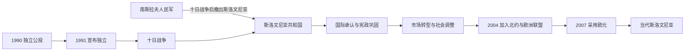

# 独立与当代斯洛文尼亚

## 时间

1991年至今

## 概括

斯洛文尼亚于1991年6月宣布独立。南斯拉夫人民军与斯洛文尼亚领土防御部队之间的十日战争很快结束，联邦军随后撤出；国际承认、民主制度和市场经济转型使斯洛文尼亚较早脱离南斯拉夫战争主战场，并在21世纪进入欧洲联盟和欧元区。

## 重要进程

- **十日战争**：独立声明后，联邦军试图控制边境设施；斯洛文尼亚领土防御部队和警察抵抗。布里俄尼协议暂缓独立措施，联邦军随后撤离。
- **战争范围**：战事相对短暂，与斯洛文尼亚境内塞族人口较少、共和国边界争议有限以及联邦军战略重心转移有关；它仍造成军人和平民伤亡。
- **国际承认**：1991年宪法确立议会民主框架；1992年起获得广泛国际承认并加入联合国。
- **经济政治转型**：私有化、产业重组和对欧洲市场开放改变社会结构；多党竞争与政权轮替逐步制度化。
- **欧洲整合**：2004年加入北约和欧洲联盟，2007年采用欧元并进入申根区。欧洲制度为贸易、流动和政策协调提供框架，也带来区域差距、公共服务和身份政治的新争论。
- **当代议题**：人口老龄化、移民、住房、环境治理、对外产业依存以及二战与社会主义时期记忆持续影响公共政治。

## 演变关系

- 前一阶段：[社会主义斯洛文尼亚](/%E4%BA%BA%E6%96%87%E7%A7%91%E5%AD%A6/%E5%8E%86%E5%8F%B2/%E6%AC%A7%E6%B4%B2/%E4%B8%9C%E5%8D%97%E6%AC%A7%E4%B8%8E%E5%B7%B4%E5%B0%94%E5%B9%B2/%E6%96%AF%E6%B4%9B%E6%96%87%E5%B0%BC%E4%BA%9A/%E7%A4%BE%E4%BC%9A%E4%B8%BB%E4%B9%89%E6%96%AF%E6%B4%9B%E6%96%87%E5%B0%BC%E4%BA%9A.md)。
- 共同背景：[南斯拉夫解体](/%E4%BA%BA%E6%96%87%E7%A7%91%E5%AD%A6/%E5%8E%86%E5%8F%B2/%E6%AC%A7%E6%B4%B2/%E4%B8%9C%E5%8D%97%E6%AC%A7%E4%B8%8E%E5%B7%B4%E5%B0%94%E5%B9%B2/%E5%8D%97%E6%96%AF%E6%8B%89%E5%A4%AB%E5%8E%86%E5%8F%B2/%E5%8D%97%E6%96%AF%E6%8B%89%E5%A4%AB%E8%A7%A3%E4%BD%93.md)。
- 国家入口：[斯洛文尼亚历史](/%E4%BA%BA%E6%96%87%E7%A7%91%E5%AD%A6/%E5%8E%86%E5%8F%B2/%E6%AC%A7%E6%B4%B2/%E4%B8%9C%E5%8D%97%E6%AC%A7%E4%B8%8E%E5%B7%B4%E5%B0%94%E5%B9%B2/%E6%96%AF%E6%B4%9B%E6%96%87%E5%B0%BC%E4%BA%9A/README.md)。

## 关键辨析

- 十日战争结束快，不等于南斯拉夫解体整体和平；克罗地亚、波斯尼亚和科索沃方向随后发生更长期战争。
- 斯洛文尼亚独立既源于民族政治，也与联邦宪制、经济利益、民主化和1980年代政治冲突有关。
