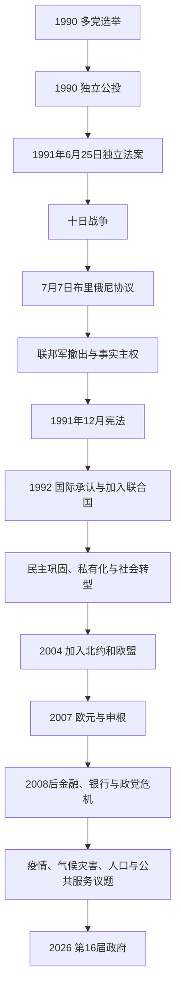

# 独立与当代斯洛文尼亚

## 时间

1990年至今；1991年6月25日起为独立国家

## 概括

斯洛文尼亚独立不是1991年6月的一次孤立宣布，而是1989年宪法修正、1990年多党选举、主权宣言和公投逐步累积的结果。独立法案生效后，南斯拉夫人民军试图控制边境和交通节点，斯洛文尼亚领土防御部队与警察进行阻击。十日战争以欧洲共同体斡旋的布里俄尼协议暂停独立措施，联邦军随后撤出；1991年末新宪法和1992年国际承认把事实主权转为稳定制度。

独立后的国家实行议会民主和直接选举总统制下的议会政府。经济采取相对渐进的私有化和对欧洲市场整合，保留较广公共福利；转型也产生所有权集中、被“删除”居民权利、地区与代际差距等问题。1990年代中期以后，加入欧洲联盟和北约成为跨党派战略，2004年完成入盟，2007年采用欧元并进入申根区。

2008年金融危机暴露银行、企业和政治网络的风险，2012—2013年紧缩与反腐抗议重塑政党体系。此后新党频繁兴起、联合政府更替加快，移民、新冠疫情、媒体与法治、住房、医疗和气候灾害成为政治主轴。2026年3月议会选举后，亚内兹·扬沙组建第16届政府；截至2026年7月14日，总统为娜塔莎·皮尔茨·穆萨尔，总理为亚内兹·扬沙。

## 独立的准备与民主授权

### 1990年多党选举

1990年4月，DEMOS反对派联盟赢得共和国议会多数，基督教民主党人阿洛伊兹／洛伊泽·彼得莱于5月组织政府；米兰·库昌在直接选举中当选共和国主席团主席。权力没有被一方完全垄断：政府和议会多数由反对派掌握，主席团主席来自改组后的前共产党阵营。这种“共治”迫使各机构在主权目标上合作，也为后来左右阵营竞争埋下基础。

南斯拉夫人民军在新政府就职前后要求收缴共和国领土防御部队武器。部分武器被移交，斯洛文尼亚政府随即秘密建立“国家保护机动结构”，把可靠的领土防御和警察人员重新编组、储存武器并建立指挥通信。1990年9月宪法修正使共和国更直接控制领土防御。因而十日战争中的抵抗并非临时自发，而是持续一年多的制度与后勤准备结果。

### 主权宣言与公投

1990年7月2日，议会宣称共和国法律在本地优先，并开始制定国籍、边界、国防、金融和外交过渡方案。反对派与执政联盟对独立速度、宪法形式和联邦谈判仍有分歧，但同意把最终决定交给选民。

12月23日公投中，约88.5%的全体登记选民、约95%的实际投票者支持独立。以全体选民而非只以有效票计算的高比例，使结果具有强政治合法性。12月26日正式公布后，议会承诺在六个月内实施。公投授权的是建立独立主权国家；政府仍尝试与其他共和国讨论松散邦联，说明独立和谈判并非完全互斥。

## 独立法案与十日战争

### 法律行动

1991年6月25日，斯洛文尼亚议会通过《独立和主权基本宪章》、实施宪法法及独立宣言，接管边境、海关和其他联邦职能；6月26日举行公开仪式。联邦政府认为共和国单方面改变边界和海关违法，命令南斯拉夫人民军协助联邦警察恢复边境控制。

### 战争阶段

| 时间 | 过程 | 关键结果 |
|---|---|---|
| 6月26—27日 | 联邦军装甲和机械化部队从斯洛文尼亚及克罗地亚驻地驶向边境、机场和海关 | 领土防御部队与警察设置路障、包围兵营并切断补给，战争全面开始。 |
| 6月27—30日 | 边境站、布尔尼克机场、梅德韦杰克、霍尔梅茨等地交火 | 联邦军控制部分据点，却难以保持道路和补给；双方人员和平民伤亡。 |
| 6月底—7月初 | 斯洛文尼亚动员地方防御、警察、广播和外交宣传，鼓励联邦军士兵投降 | 大批义务兵被围、投降或离队；共和国重新控制多数边境设施。 |
| 7月2—4日 | 多地停火与再交火，斯洛文尼亚在战场上取得优势 | 联邦领导层对扩大轰炸、增援或政治谈判意见分裂。 |
| 7月7日 | 欧洲共同体斡旋，各方在布里俄尼群岛达成协议 | 斯洛文尼亚和克罗地亚暂停独立措施三个月，交换俘虏并建立监督安排。 |
| 7月18日—10月25日 | 南斯拉夫联邦主席团决定把人民军撤出斯洛文尼亚，人员和装备分批离境 | 联邦军把战略重心转向克罗地亚；斯洛文尼亚取得完整事实控制。 |
| 10月8日 | 三个月冻结期结束 | 共和国全面执行独立法令，并引入托拉尔货币。 |

### 为什么战争较短

- **人口结构**：斯洛文尼亚境内没有大规模、集中且要求留在南斯拉夫的塞族自治区，内部领土争议少于克罗地亚和波黑。
- **地理与准备**：阿尔卑斯道路、隧道和边境点便于小型地方部队封锁；警察与领土防御已有秘密指挥和社会支持。
- **联邦军构成**：大量义务兵作战意愿低，驻军被分散包围，补给线穿过居民区。
- **政治目标**：斯洛文尼亚主要争取退出，不试图控制其他共和国人口；联邦军和塞尔维亚领导随后把战略重点转向克罗地亚。
- **国际斡旋**：欧洲共同体迅速介入，布里俄尼协议给各方提供降级渠道。
- **直接决定**：联邦主席团7月18日同意撤军，实际上放弃以军事方式恢复对斯洛文尼亚的控制。

战争约造成数十名军人、警察和外国平民死亡，具体统计因伤者后续死亡和身份口径略有差异。时间短不代表没有空袭、道路战、俘虏或平民风险，更不能用斯洛文尼亚经验概括其后克罗地亚和波黑战争。

## 国际承认与宪政建国

### 1991—1992年的制度步骤

| 时间 | 事件 | 意义 |
|---|---|---|
| 1991年10月8日 | 独立措施全面恢复、托拉尔取代南斯拉夫第纳尔 | 建立货币和财政主权。 |
| 1991年12月23日 | 通过新宪法 | 确立民主、法治、人权、社会国家、权力分立和议会政府。 |
| 1991年末—1992年1月 | 德国等先行承认，欧洲共同体成员国集体承认 | 独立由事实状态转为广泛国际法承认。 |
| 1992年5月22日 | 加入联合国 | 完成全球多边体系中的国家资格。 |
| 1993年5月14日 | 加入欧洲委员会 | 以人权、公民自由和法治标准锚定欧洲制度。 |

新宪法设90席国民议会，其中意大利族和匈牙利族各有保障席位；另设代表社会、地方和职业利益的国民委员会。总统由直选产生，主要代表国家；总理由总统提名后在国民议会以建设性方式形成多数，政府对议会负责。宪法法院在转型产权、少数权利、选举和行政争议中成为重要仲裁者。

完整总统、历届总理、社会主义法定职位与现任核验见[斯洛文尼亚国家元首与政府首脑表](/%E4%BA%BA%E6%96%87%E7%A7%91%E5%AD%A6/%E5%8E%86%E5%8F%B2/%E6%AC%A7%E6%B4%B2/%E4%B8%9C%E5%8D%97%E6%AC%A7%E4%B8%8E%E5%B7%B4%E5%B0%94%E5%B9%B2/%E6%96%AF%E6%B4%9B%E6%96%87%E5%B0%BC%E4%BA%9A/%E6%96%AF%E6%B4%9B%E6%96%87%E5%B0%BC%E4%BA%9A%E5%9B%BD%E5%AE%B6%E5%85%83%E9%A6%96%E4%B8%8E%E6%94%BF%E5%BA%9C%E9%A6%96%E8%84%91%E8%A1%A8.md)。

## 市场转型与所有权重组

### 渐进转型

斯洛文尼亚没有采用一次性全面放开所有价格和资产出售，而是在较稳定货币、企业内部所有权、代金券和国家基金之间推进私有化。1992年私有化立法允许职工、经理、公民凭证及基金持股；国有／社会所有企业逐步公司化。中央银行控制通胀，托拉尔成为稳定象征。

渐进方式保留工业能力和社会保障，失业与产出冲击相对部分东欧国家较轻；它也让经理、银行和政治网络利用信息优势集中资产。所有权证书、管理层收购、国家基金和返还原业主财产并行，造成长期诉讼及“谁真正创造或继承社会财产”的争论。

### “被删除者”问题

1992年，内务机关把未在期限内取得斯洛文尼亚国籍或特定外国人身份的约2.5万名前南斯拉夫其他共和国出身永久居民从常住登记中删除。许多人失去医疗、住房、工作或合法居留凭证。政府最初把问题视为行政后果，受影响者和人权团体则指出他们在没有个别程序的情况下被剥夺既有身份。

宪法法院、欧洲人权法院和后续立法逐步确认违法、恢复身份并建立赔偿机制，但落实不一。“被删除者”显示民族国家建构不仅保护主体民族，也可能把长期居民排除；它是独立成功叙事中不可省略的权利问题。

## 政治阶段与政党轮替

### 1992—2004年：德尔诺夫舍克时期

自由民主党领袖亚内兹·德尔诺夫舍克多次领导中间或跨阵营联盟，以渐进改革、社会协商和欧洲入盟为主。国家避免激进清算旧体制人员，工会、雇主和政府通过协商控制工资和福利改革。1997年后欧盟谈判推动法律、竞争、环境和行政标准调整。

这一时期稳定的条件包括：独立目标的社会共识、相对良好工业基础、外部欧洲市场、比例代表制下的中间联盟和德尔诺夫舍克个人协调。其弱点是国家、银行、企业和政党关系不透明，司法与媒体改革未消除精英网络。

### 2004—2008年：第一次中右完整任期与入盟深化

2004年，亚内兹·扬沙领导的民主党组阁，标志长期自由民主党主导结束。政府推进税制、企业和行政改革。2007年斯洛文尼亚成为首个采用欧元的2004年入盟国家，并于同年底进入申根；2008年上半年成为首个主持欧盟理事会的2004年扩员国家。

经济高速增长伴随信贷、房地产、企业杠杆和管理层收购。全球金融危机到来后，这些风险转化为银行坏账和公共财政压力，说明入欧和欧元本身不能替代国内金融监管。

### 2008—2014年：金融危机、紧缩与政党重组

帕霍尔政府应对出口崩落、失业和银行问题，联盟内部又就改革、公投和领导发生分裂。2011年提前选举后，扬沙第二届政府推行紧缩；2012—2013年反对地方腐败、中央政治精英和紧缩的示威扩散。反腐机构对多名主要领导人的财产说明提出质疑，联盟瓦解，阿连卡·布拉图舍克通过建设性不信任案组阁。

2013年政府对银行进行资产审查、注资和坏账转移，在没有申请完整国际救助方案的情况下稳定体系；代价包括公共债务上升、私有化压力和社会削减争论。危机削弱传统党，使围绕新领导人快速建立的政党反复赢得选举。

### 2014—2020年：新中间党与少数政府

米罗·采拉尔的现代中心党以法治和专业治理赢得2014年选举，后受大型基础设施、医疗和党内分化消耗。2015—2016年巴尔干迁徙路线使斯洛文尼亚在申根义务、人道接待和边境管控之间承压，并在克罗地亚边界设置临时障碍。

2018年民主党得票领先却未能组多数，马里扬·沙雷茨组建五党少数政府，并在一段时间依赖左翼外部支持。少数联盟因医疗、任命和预算协调困难于2020年初瓦解；国会内重新组合多数，使扬沙无需立即选举即可再次组阁。这体现议会制下“最大党不自动执政”和“辞职不必然触发选举”的规则。

### 2020—2022年：疫情与法治争论

扬沙第三届政府上台即面对新冠疫情，采取封控、边境和经济补助措施。公共卫生能力、老年护理和数字教育受到考验。政府支持者强调危机决策、经济援助和2021年欧盟理事会轮值主席国工作；反对者批评警务、媒体资金、任命和与欧盟法治机制的冲突。长期骑行抗议和政治极化显示疫情政策与既有历史—文化阵营重叠。

### 2022—2026年：戈洛布政府

罗伯特·戈洛布领导的自由运动在2022年选举中胜出，与社会民主党和左翼组阁，主张恢复机构信任、绿色能源和公共服务改革。2023年严重洪灾造成广泛基础设施和住宅损失，重建、河道治理、保险及气候适应成为政府中心任务。医疗、薪酬体系、住房和能源价格改革则因利益协调而进展不均。

斯洛文尼亚在2024—2025年担任联合国安全理事会非常任理事国，并继续支持西巴尔干加入欧盟。政府任期结束时，公共财政、医疗效率、重建和政治信任仍是选举争点。

### 2026年：第16届政府

2026年3月22日举行国民议会选举。民主党主席亚内兹·扬沙于5月22日获51票当选总理，6月4日完整内阁就职，取代戈洛布政府。执政联盟由民主党、安热·洛加尔的民主党、新斯洛文尼亚、FOKUS和斯洛文尼亚人民党组成；政府把经济增长、减税、行政精简和反腐列为重点。这里记录的是组阁事实而非对政策成败的预判。

截至2026年7月14日：

| 角色 | 现任 | 就任时间 | 制度位置 |
|---|---|---|---|
| 国家元首 | **娜塔莎·皮尔茨·穆萨尔** | 2022年12月23日 | 直选总统，代表国家并履行宪法职权，不领导日常内阁。 |
| 政府首脑 | **亚内兹·扬沙** | 总理于2026年5月22日当选，第16届政府6月4日就职 | 领导内阁，对国民议会负责。 |

## 欧洲—大西洋一体化

### 加入过程

| 时间 | 节点 | 国内选择与影响 |
|---|---|---|
| 1996—1998年 | 与欧盟建立联系并启动正式谈判 | 大规模修法、市场开放与行政能力建设。 |
| 2002年12月 | 完成欧盟谈判 | 入盟条件基本确定。 |
| 2003年3月23日 | 欧盟与北约公投 | 两项均获多数支持，欧盟支持度明显更高；安全中立仍有反对声音。 |
| 2004年3月29日 | 加入北约 | 国防从领土防御转向职业化、集体防御和海外任务。 |
| 2004年5月1日 | 加入欧洲联盟 | 市场、结构基金、人员流动和共同立法成为国内制度的一部分。 |
| 2007年1月1日 | 采用欧元 | 降低交易成本，同时失去独立汇率和货币政策。 |
| 2007年12月 | 进入申根区 | 奥意边界日常管制大幅减少；克罗地亚入申根后南部边界也改变。 |
| 2008年、2021年 | 两次主持欧盟理事会 | 展示小国协调能力，也把国内政治置于欧洲法治审视下。 |
| 2010年 | 加入经济合作与发展组织 | 完成另一项发达市场经济制度锚定。 |

### 收益与约束

欧盟扩大出口、投资、基础设施资金、教育和跨境就业，特别改善与奥地利、意大利、匈牙利和克罗地亚的日常联系。欧元降低小经济体汇率风险，却使2008年后无法通过本币贬值缓冲危机。申根带来自由流动，也要求共同边境、庇护和数据制度。北约提供集体防御，但军费和海外行动持续受争论。

## 与邻国的未竟问题

### 克罗地亚边界

南斯拉夫时期共和国边界在海上和部分河段未完全划定。独立后，皮兰湾、斯洛文尼亚通往公海的联系及陆地小段成为争议。两国2009年同意仲裁，2017年裁决大体划界并给予斯洛文尼亚特定海上联系安排；克罗地亚因仲裁程序泄密退出并拒绝执行，斯洛文尼亚坚持裁决有效。欧盟共同成员身份降低冲突风险，却未自动解决法理分歧。

### 少数族群和跨境社会

斯洛文尼亚宪法保障意大利族与匈牙利族代表权；罗姆人权利按地区和法律另有安排。奥地利克恩顿斯洛文尼亚人、意大利弗留利—威尼斯朱利亚斯洛文尼亚人及匈牙利拉包河地区社群则依邻国制度生活。开放边境促进学校、媒体和经济合作，但双语标志、教育资源和人口同化仍是长期议题。

## 当代社会与治理议题

- **人口老龄化**：养老金、长期照护、劳动力和代际财政成为跨党派压力。
- **医疗体系**：普遍覆盖是社会共识，排队、家庭医生短缺、公私服务边界和工资谈判持续争议。
- **住房**：卢布尔雅那和沿海房价、旅游短租与青年租赁负担扩大地区差距。
- **移民与融合**：来自前南斯拉夫、欧盟及其他地区的劳动移民支撑经济，也使语言教育、国籍和反歧视政策重要。
- **气候与环境**：2023年洪灾、河流治理、阿尔卑斯生态、核能与可再生能源政策相互关联。
- **产业依存**：出口制造与德奥意供应链带来高效率，也使小经济体易受欧洲需求和能源冲击。
- **媒体与法治**：公共广播、检察司法任命、反腐和欧盟规范常成为政府—反对派冲突。
- **历史记忆**：游击抵抗、合作、战后处决和社会主义评价仍塑造纪念日与党派身份。
- **联合政府稳定**：比例代表制鼓励多党，建设性不信任制避免权力真空，却也使联盟谈判和新党兴衰频繁。

## 独立国家的建立、巩固与风险分析

### 独立成功的条件

1. 1974年共和国制度留下议会、政府、警察和领土防御等准国家能力；
2. 公投提供跨阵营且可量化的民主授权；
3. 民族领土相对集中、内部武装反对规模有限；
4. 领土防御与警察完成秘密重组，能在关键道路和边境进行有限战争；
5. 欧洲共同体斡旋和冷战结束降低长期军事镇压的可行性；
6. 联邦军战略重点转向克罗地亚，使撤军成为可接受选择。

### 民主与经济巩固的条件

- 新宪法限制权力并建立宪法法院、少数保障和竞争性选举；
- 渐进转型降低社会崩溃，保留工业和福利国家；
- 欧洲委员会、欧盟、北约、欧元与申根形成外部制度锚；
- 政党虽然频繁重组，政府仍通过议会程序和平轮替；
- 地方政府、工会、媒体和公民团体维持多中心公共空间。

### 长期风险

- 经理收购、银行贷款与政治关系可能把公共财产转化为封闭精英资产；
- 小国媒体市场和国家广告容易受到政党或商业力量影响；
- 老龄化、住房与医疗压力可能削弱福利共识；
- 经济高度依赖欧洲出口和能源环境，外部冲击传导快；
- 二战与社会主义记忆分裂可被用于否定对手合法性；
- 频繁出现围绕个人的新党，可能降低组织经验和政策连续性；
- 气候灾害与基础设施重建要求跨任期财政和空间规划。

这些风险尚未构成国家“衰落或灭亡”过程。对当代仍存续国家，应区分已发生的制度挑战与未来预测，不把党派评价写成确定历史结论。

## 重要事件

| 时间 | 事件 | 结果与长期影响 |
|---|---|---|
| 1990年4—5月 | 多党选举和彼得莱政府 | 和平结束一党行政，建立主权化政府。 |
| 1990年12月 | 独立公投 | 以高参与和高赞成获得直接民主授权。 |
| 1991年6月25日 | 通过独立法案 | 法律上退出联邦。 |
| 1991年6月27日—7月7日 | 十日战争 | 阻止联邦军恢复边境控制，布里俄尼协议使冲突降级。 |
| 1991年10月25日 | 最后一批联邦军撤出 | 共和国完成事实领土控制。 |
| 1991年12月23日 | 新宪法 | 建立议会民主、直选总统和权利保障框架。 |
| 1992年1—5月 | 广泛承认、加入联合国 | 完成国际法建国。 |
| 1992年 | “被删除者”行政处理 | 暴露国籍建构与长期居民权利冲突，后经国内外司法纠正。 |
| 1993年 | 加入欧洲委员会 | 人权和法治纳入欧洲监督体系。 |
| 1998年 | 欧盟入盟谈判启动 | 推动大规模制度和法律调整。 |
| 2003年 | 欧盟与北约公投 | 为双重入盟提供选民授权。 |
| 2004年 | 加入北约和欧盟 | 安全和经济制度全面欧洲化。 |
| 2007年 | 采用欧元、进入申根 | 深化市场与人员流动整合。 |
| 2008—2013年 | 金融与银行危机 | 暴露杠杆和精英网络，触发紧缩、抗议与银行重组。 |
| 2015—2016年 | 欧洲迁徙路线危机 | 庇护、人道与边境政策成为长期政治议题。 |
| 2020—2022年 | 新冠疫情 | 检验公共卫生、数字治理和紧急权力边界。 |
| 2023年 | 严重洪灾 | 把重建、气候适应和空间规划推至国家议程核心。 |
| 2024—2025年 | 联合国安理会非常任理事国 | 提升多边外交能见度和责任。 |
| 2026年3—6月 | 议会选举与第16届政府就职 | 扬沙第四次出任总理，右中联盟接替戈洛布政府。 |

## 演变关系

- 前一阶段：[社会主义斯洛文尼亚](/%E4%BA%BA%E6%96%87%E7%A7%91%E5%AD%A6/%E5%8E%86%E5%8F%B2/%E6%AC%A7%E6%B4%B2/%E4%B8%9C%E5%8D%97%E6%AC%A7%E4%B8%8E%E5%B7%B4%E5%B0%94%E5%B9%B2/%E6%96%AF%E6%B4%9B%E6%96%87%E5%B0%BC%E4%BA%9A/%E7%A4%BE%E4%BC%9A%E4%B8%BB%E4%B9%89%E6%96%AF%E6%B4%9B%E6%96%87%E5%B0%BC%E4%BA%9A.md)。
- 南斯拉夫共同解体背景：[南斯拉夫解体](/%E4%BA%BA%E6%96%87%E7%A7%91%E5%AD%A6/%E5%8E%86%E5%8F%B2/%E6%AC%A7%E6%B4%B2/%E4%B8%9C%E5%8D%97%E6%AC%A7%E4%B8%8E%E5%B7%B4%E5%B0%94%E5%B9%B2/%E5%8D%97%E6%96%AF%E6%8B%89%E5%A4%AB%E5%8E%86%E5%8F%B2/%E5%8D%97%E6%96%AF%E6%8B%89%E5%A4%AB%E8%A7%A3%E4%BD%93.md)。
- 完整总统和政府序列：[斯洛文尼亚国家元首与政府首脑表](/%E4%BA%BA%E6%96%87%E7%A7%91%E5%AD%A6/%E5%8E%86%E5%8F%B2/%E6%AC%A7%E6%B4%B2/%E4%B8%9C%E5%8D%97%E6%AC%A7%E4%B8%8E%E5%B7%B4%E5%B0%94%E5%B9%B2/%E6%96%AF%E6%B4%9B%E6%96%87%E5%B0%BC%E4%BA%9A/%E6%96%AF%E6%B4%9B%E6%96%87%E5%B0%BC%E4%BA%9A%E5%9B%BD%E5%AE%B6%E5%85%83%E9%A6%96%E4%B8%8E%E6%94%BF%E5%BA%9C%E9%A6%96%E8%84%91%E8%A1%A8.md)。
- 国家入口：[斯洛文尼亚历史](/%E4%BA%BA%E6%96%87%E7%A7%91%E5%AD%A6/%E5%8E%86%E5%8F%B2/%E6%AC%A7%E6%B4%B2/%E4%B8%9C%E5%8D%97%E6%AC%A7%E4%B8%8E%E5%B7%B4%E5%B0%94%E5%B9%B2/%E6%96%AF%E6%B4%9B%E6%96%87%E5%B0%BC%E4%BA%9A/README.md)。

## 关键辨析

- 法案于1991年6月25日通过，公开庆典在6月26日，战争通常从6月27日算起；三个日期分别代表法律、象征和军事节点。
- 布里俄尼协议暂停实施三个月，不等于取消公投或让斯洛文尼亚永久回归联邦。
- 十日战争较短与人口、地理、准备、联邦军战略和欧洲斡旋共同有关，不能归因于单一将领。
- 彼得莱政府始于1990年的加盟共和国，连续跨越独立；独立后的“第一届政府”与1990年政府是同一内阁。
- 总统直选不等于总统制；日常行政由依赖国民议会多数的总理和内阁掌握。
- 欧盟、北约、欧元和申根是四个不同制度，加入日期和权利义务不能合并。
- “渐进转型较成功”不应掩盖被删除者、资产集中、银行风险和社会差距。
- 截至2026年7月14日，罗伯特·戈洛布已是前总理，现任总理为亚内兹·扬沙；总统仍为娜塔莎·皮尔茨·穆萨尔。
