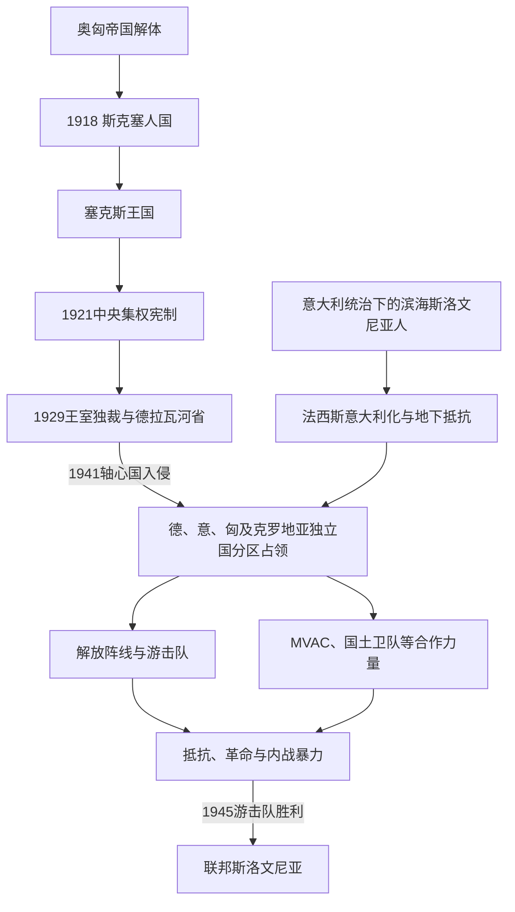

# 王国时期与第二次世界大战

## 时间

1918—1945年

## 概括

1918年10月，卢布尔雅那的斯洛文尼亚民族委员会和国民政府在哈布斯堡军政崩溃中接管地方权力，并加入短暂的斯洛文尼亚人、克罗地亚人和塞尔维亚人国；12月1日，该国与塞尔维亚王国合并。新共同国家结束多数斯洛文尼亚语中心区的哈布斯堡统治，却未实现全部语言人口统一：西部滨海、的里雅斯特和戈里齐亚归意大利，北部克恩顿部分经公投留在奥地利，普雷克穆列则从匈牙利转入王国。

王国推行中央集权，1929年起主要斯洛文尼亚地区组成德拉瓦河省。斯洛文尼亚政党在自治、天主教社会组织、王室独裁和中央政府合作之间调整；与此同时，意大利境内的斯洛文尼亚人遭受法西斯意大利化，并形成地下抵抗。1941年4月轴心国入侵后，斯洛文尼亚语地区被德国、意大利、匈牙利和克罗地亚独立国分割，没有建立统一的“斯洛文尼亚傀儡国”。

占领者推行吞并、禁用语言、驱逐、拘禁、强征兵和报复。共产党主导的解放阵线把反占领战争与社会革命结合；反共政治力量和武装则逐步与意大利、德国占领体系合作。战争因此同时具有外国占领、民族解放、革命和内战性质。1945年游击队取胜，合作武装及平民撤退后又发生遣返和大规模未经审判处决，新政权在解放与暴力清算并存中建立。

## 1918年的国家转换

### 接管地方权力

哈布斯堡军队在1918年秋瓦解，士兵、难民和粮食危机使治安成为首要问题。萨格勒布的南斯拉夫民族委员会宣布代表帝国内南斯拉夫地区，卢布尔雅那的斯洛文尼亚民族委员会建立国民政府，由约瑟普·波加奇尼克领导。它接管行政、警察、交通和粮食供应，但外交、军队和国际承认能力有限。

鲁道夫·迈斯特利用当地部队控制马里博尔及下施蒂利亚大部，解除德意志奥地利方面武装，为北部边界谈判创造事实条件。1919年克恩顿武装冲突中，南斯拉夫军队一度北进；协约国最终决定在争议区举行公投。普雷克穆列则在短暂的“共和国”及匈牙利复占之后，于1919年8月由南斯拉夫军队接管，1920年《特里亚农条约》确认其大部归属共同王国。

### 为什么迅速与塞尔维亚合并

- **安全真空**：意大利军队依伦敦条约沿亚得里亚海东岸推进，短暂国家缺乏可与之抗衡的军队。
- **粮食与行政危机**：旧帝国市场和财政中断，需要更大国家提供货币、铁路与供应。
- **南斯拉夫主义**：多数主要斯洛文尼亚政党已接受与克罗地亚人、塞尔维亚人组成共同国家。
- **国际承认**：协约国承认塞尔维亚，却尚未正式承认斯克塞人国。
- **直接触发**：萨格勒布代表团在缺少明确联邦条件的情况下赴贝尔格莱德，摄政王亚历山大于1918年12月1日宣布统一。

合并解决了即刻安全与承认问题，却没有预先约定联邦自治，成为后来中央集权争议的制度根源。

## 新边界与民族地域分割

| 时间 | 安排 | 具体结果 | 长期影响 |
|---|---|---|---|
| 1919年 | 圣日耳曼体系 | 奥地利共和国与南斯拉夫边界原则确定，克恩顿争议留待公投 | 语言、经济联系和地方归属相互冲突。 |
| 1920年10月 | 克恩顿公投 | A区多数选民选择奥地利；部分斯洛文尼亚语选民也因经济、地区认同等因素投奥 | 大批克恩顿斯洛文尼亚人留在奥地利，少数族群权利成为长期问题。 |
| 1920年11月 | 拉帕洛条约 | 意大利取得的里雅斯特、戈里齐亚、格拉迪斯卡、伊斯特拉及斯洛文尼亚滨海大部 | 约数十万斯洛文尼亚人和克罗地亚人进入意大利，遭后来的法西斯同化。 |
| 1920年 | 特里亚农条约 | 普雷克穆列大部从匈牙利转入南斯拉夫，小部分留匈 | 今斯洛文尼亚东北边界大体形成，匈牙利少数族群留在边境。 |
| 1924年 | 罗马条约及阜姆安排 | 意南边界进一步定型 | 斯洛文尼亚政治中心接受短期内无法实现全部民族地区统一。 |

克恩顿公投结果不能只解释为“民族背叛”：地方贸易流向克拉根福、奥地利社会政策承诺、对贝尔格莱德中央主义的疑虑以及双语身份均影响投票。西部边界则不是自由公投结果，而是大战秘密承诺、军事占领与列强谈判的产物。

## 王国统治结构

### 共同国家元首与政府

1918—1941年的君主、摄政和中央政府属于整个南斯拉夫，不在本页重复一套斯洛文尼亚君主表。完整共同国家序列见[南斯拉夫国家元首与政府首脑表](/%E4%BA%BA%E6%96%87%E7%A7%91%E5%AD%A6/%E5%8E%86%E5%8F%B2/%E6%AC%A7%E6%B4%B2/%E4%B8%9C%E5%8D%97%E6%AC%A7%E4%B8%8E%E5%B7%B4%E5%B0%94%E5%B9%B2/%E5%8D%97%E6%96%AF%E6%8B%89%E5%A4%AB%E5%8E%86%E5%8F%B2/%E5%8D%97%E6%96%AF%E6%8B%89%E5%A4%AB%E5%9B%BD%E5%AE%B6%E5%85%83%E9%A6%96%E4%B8%8E%E6%94%BF%E5%BA%9C%E9%A6%96%E8%84%91%E8%A1%A8.md)，宪制与王朝兴衰见[南斯拉夫王国](/%E4%BA%BA%E6%96%87%E7%A7%91%E5%AD%A6/%E5%8E%86%E5%8F%B2/%E6%AC%A7%E6%B4%B2/%E4%B8%9C%E5%8D%97%E6%AC%A7%E4%B8%8E%E5%B7%B4%E5%B0%94%E5%B9%B2/%E5%8D%97%E6%96%AF%E6%8B%89%E5%A4%AB%E5%8E%86%E5%8F%B2/%E5%8D%97%E6%96%AF%E6%8B%89%E5%A4%AB%E7%8E%8B%E5%9B%BD.md)。

| 层级 | 1918—1921年 | 1921—1929年 | 1929—1941年 |
|---|---|---|---|
| 国家元首 | 卡拉乔尔杰维奇王朝君主／摄政王 | 国王，受《维多夫丹宪法》形式限制 | 1929年后王室独裁；1931年恢复受控宪制，1934年后保罗亲王主持摄政 |
| 中央政府 | 贝尔格莱德政府，统一前制度并轨 | 议会内阁但政党冲突激烈，行政高度中央化 | 王室主导，后期逐步恢复政党协商 |
| 地方区划 | 卢布尔雅那国民政府及区域机关短暂保留 | 地方政府被撤，改为州和行政区，不按民族边界设计 | 德拉瓦河省覆盖主要斯洛文尼亚地区，由国王任命省长 |
| 斯洛文尼亚政治代表 | 斯洛文尼亚人民党等参与统一谈判 | 在自治诉求与参加中央内阁之间摇摆 | 党组织曾被限制，安东·科罗舍茨等又进入中央政府 |
| 实际矛盾 | 统一条件未明确 | 单一制与民族联邦诉求冲突 | 王室独裁压制矛盾但未解决，外部法西斯压力上升 |

### 1918—1923年地方行政首脑

地方机关名称和撤销日期随统一后的法令数次变化；下表按职位连续性列出主要行政负责人。1923年后行政分为卢布尔雅那、马里博尔等州，不再有覆盖主要斯洛文尼亚地区的单一地方政府首脑。

| 顺序 | 姓名 | 职位 | 任期 | 说明 |
|---:|---|---|---|---|
| 1 | **约瑟普·波加奇尼克** | 卢布尔雅那国民政府主席 | 1918年10月31日—1919年1月24日 | 接管奥匈地方机关，处理治安、边界和统一过渡。 |
| 2 | 扬科·布赖茨 | 斯洛文尼亚地方政府主席（第一次） | 1919年1月24日—11月6日 | 斯洛文尼亚人民党政治家；地方权限持续被中央压缩。 |
| 3 | 格雷戈尔·热尔亚夫 | 地方政府主席 | 1919年11月7日—1920年2月25日 | 自由派政治家，任内面对边界和行政整合。 |
| 4 | 扬科·布赖茨 | 地方政府主席（第二次） | 1920年2月25日—12月14日 | 复任；公投和拉帕洛边界在此时定型。 |
| 5 | 莱奥尼德·皮塔米茨 | 代理地方政府主席 | 1920年12月14日—1921年2月26日 | 法学家，在中央集权宪法制定前代理。 |
| 6 | 维尔科·巴尔蒂奇 | 地方政府主席 | 1921年2月26日—8月2日 | 《维多夫丹宪法》通过后，地方自治机构进一步削弱。 |
| 7 | 伊万·赫里巴尔 | 斯洛文尼亚省长 | 1921年8月2日—1923年3月29日 | 由中央任命主持过渡性省行政；此后单一斯洛文尼亚地区政府消失。 |

### 德拉瓦河省省长

| 顺序 | 姓名 | 任期 | 政治与行政特点 |
|---:|---|---|---|
| 1 | 杜尚·塞尔内茨 | 1929年10月9日—1930年12月4日 | 王室独裁初期首任省长，执行以河流命名、淡化民族区划的政策。 |
| 2 | **德拉戈·马鲁希奇** | 1930年12月4日—1935年2月8日 | 任期最长，推进道路、行政与文化事务，同时受中央政府控制。 |
| 3 | 丁科·普茨 | 1935年2月8日—9月10日 | 政党政治有限恢复期的短任省长。 |
| 4 | **马尔科·纳特拉琴** | 1935年9月10日—1941年4月16日 | 斯洛文尼亚人民党人物；轴心国入侵后主持短暂斯洛文尼亚民族委员会，随后在意大利占领区参与咨询机关。 |

## 中央集权、社会发展与政治竞争

### 1921年宪制

《维多夫丹宪法》以较小多数建立单一制君主国，行政区不按历史民族地区划分。斯洛文尼亚人民党主张自治，却常为影响政府、保护天主教学校和地方经济而参加中央内阁。安东·科罗舍茨成为最具影响力的斯洛文尼亚政治家，曾任内务大臣并于1928—1929年短任王国首相。参与中央政府既增加实际资源，也使自治承诺反复妥协。

斯洛文尼亚中心区相对工业化，拥有矿业、纺织、木材、银行和合作社网络。卢布尔雅那大学于1919年成立，斯洛文尼亚语教育与行政显著扩展，这是共同国家的重要成果。市场从奥地利方向转向巴尔干带来保护和新销路，也造成技术、资本和铁路网络重新适应。1929年世界经济危机使出口、就业和农产品价格下跌，社会矛盾加剧。

### 王室独裁及其失败

1928年克罗地亚农民党领袖斯捷潘·拉迪奇在议会中遇袭身亡后，议会制度陷入瘫痪。亚历山大一世于1929年1月废宪、禁党、改国名为南斯拉夫王国，并以九个河流省取代旧区划。德拉瓦河省在实践中接近斯洛文尼亚中心区，反而提供一定行政整合，但省长由王室任命，民族自治没有宪法保障。

1934年亚历山大在马赛遇刺，保罗亲王摄政逐步放松独裁。1939年建立克罗地亚省，显示中央开始承认民族领土妥协，却没有同时建立斯洛文尼亚自治省；战争爆发使后续谈判中断。王国衰落的结构原因是中央集权无法获得克罗地亚等民族政治长期认同，军队和官僚又由旧塞尔维亚王国网络占优势；外部压力来自意大利、德国和匈牙利的修正主义；直接触发是1941年3月政变后德国决定入侵。

## 意大利境内的斯洛文尼亚人

### 法西斯意大利化过程

1920年7月，法西斯团体焚毁的里雅斯特斯洛文尼亚民族会馆，象征战后暴力民族化。1922年墨索里尼上台后，意大利政府逐步关闭斯洛文尼亚语学校、协会和报刊，限制公共场合使用本名与语言，意大利化地名和姓氏，并把教师、公务员调离。教会内部使用斯洛文尼亚语也受压力。

政策导致三种主要反应：

- 数以万计居民迁往南斯拉夫或海外，包括教师、知识分子和专业人员；
- 家庭、教区和秘密文化网络维持语言；
- 1920年代形成“的里雅斯特—伊斯特拉—戈里齐亚—里耶卡革命组织”（TIGR），采取地下宣传、破坏乃至武装行动反抗法西斯。

1930年巴佐维察审判处决四名反法西斯者，成为斯洛文尼亚集体记忆节点。TIGR与后来共产党游击队既有反法西斯共同点，也存在组织和意识形态差异；不能把战间期全部抵抗都归为共产党领导。

## 1941年王国崩溃

1941年3月，摄政政府签署三国同盟，贝尔格莱德军官政变推翻安排。希特勒决定惩罚性进攻，4月6日德国及盟国入侵。南斯拉夫军队动员、指挥和族群政治信任均已崩坏，4月17日即投降。斯洛文尼亚地方没有能力单独维持王国防线。

### 崩溃原因

- **结构因素**：中央集权与民族矛盾削弱国家认同；军队装备、通讯和空防落后，指挥体系僵化。
- **政治因素**：1939年后的自治安排不完整，政变和外交急转造成上层分裂。
- **外部因素**：德国已控制奥地利和巴尔干交通，意大利、匈牙利、保加利亚及克罗地亚乌斯塔沙从多方向配合。
- **直接触发**：3月27日政变被德国视为三国同盟安排失败，4月6日全面进攻。
- **直接灭亡过程**：国王和政府撤离，中央军队投降，德、意、匈部队在斯洛文尼亚划区接管，德拉瓦河省行政终结。

## 分区占领及实际权力结构

| 占领区 | 主要范围 | 主权主张与政策 | 最高或主要行政首脑 | 结局 |
|---|---|---|---|---|
| 德国下施蒂利亚区 | 马里博尔、采列及东北大部 | 事实吞并纳粹德国，驱逐斯洛文尼亚精英、德意志化学校与地名、强征居民入德军 | 西格弗里德·于贝赖特尔，施蒂利亚大区长兼民政长官，1941年4月—1945年5月 | 1945年德军撤退，游击队接管。 |
| 德国克恩顿—克拉尼斯卡区 | 上克拉尼斯卡、梅扎河谷等北部地区 | 由克恩顿大区机构控制，推行吞并、驱逐和德意志化 | 弗朗茨·库切拉，1941年4—11月；**弗里德里希·赖纳**，1941年11月—1945年5月 | 随德国战败终结。 |
| 意大利卢布尔雅那省 | 卢布尔雅那及下克拉尼斯卡等中南部 | 1941年设省并并入意大利；初期尝试有限文化安抚，抵抗扩大后实行围城、焚村、处决和集中营 | 埃米利奥·格拉齐奥利，1941年5月—1943年6月；朱塞佩·隆布拉萨，1943年6—9月 | 1943年9月意大利投降后被德国接管。 |
| 德国“亚得里亚滨海作战区”内卢布尔雅那省 | 原意大利占领区 | 仍保留名义省行政，实际由党卫队、警察和赖纳的作战区机关支配 | **弗里德里希·赖纳**为最高专员；莱昂·鲁普尼克任省行政主席，1943年9月—1945年5月 | 国土卫队随德军撤退，省行政崩溃。 |
| 匈牙利占领区 | 普雷克穆列 | 正式并入匈牙利县制，学校与行政马扎尔化，犹太人1944年遭集中驱逐 | 匈牙利中央政府及沃什、佐洛县机关；不存在统一“斯洛文尼亚行政首脑” | 苏军和南斯拉夫游击队于1945年接管。 |
| 克罗地亚独立国区 | 东南边缘少数村落 | 并入乌斯塔沙国家，由萨格勒布政权和地方机关管治 | 克罗地亚独立国中央及地方官员 | 1945年随该政权灭亡。 |

### 意大利区的地方合作行政

| 姓名 | 职位与任期 | 权力限度与责任 |
|---|---|---|
| 马尔科·纳特拉琴 | 卢布尔雅那省咨询委员会主席，1941年5—9月 | 试图在占领下保留社会机构，委员会无主权；因不满意方政策辞职，1942年被共产党安全组织刺杀。 |
| 莱昂·鲁普尼克 | 咨询／地方行政负责人，1942年6月—1943年9月；省行政主席，1943年9月—1945年5月 | 在意大利末期参与反共行政；德国接管后成为合作政权公开首脑和国土卫队总监，但军警实权掌握在德国。 |
| 埃内斯特·彼得林等国土卫队军官 | 德占时期军事指挥岗位 | 部队受德国党卫队和警察体系监督，不能视为主权国家军队。 |

## 占领暴力与社会反应

### 德国占领区

纳粹计划把下施蒂利亚和上克拉尼斯卡彻底德意志化，解散斯洛文尼亚文化机构，驱逐神职人员、教师和知识分子，没收财产并安置德裔居民。大批被占领区居民遭驱逐至塞尔维亚、克罗地亚或德国，另有居民被强征入德国军队。游击活动扩大后，占领者采取枪决人质、焚村、集中营和连坐报复。

### 意大利占领区

意大利最初允许部分斯洛文尼亚语文化与行政，以争取合作；1941年下半年抵抗升级后转向军事镇压。卢布尔雅那被铁丝网包围，乡村清剿造成焚毁和处决，大量居民被送往拉布、戈纳尔斯等集中营，饥饿与疾病导致死亡。政策差异不意味着意大利占领“温和无害”，而是镇压方式和吞并目标与德国不同。

### 匈牙利占领区

匈牙利恢复战前县制并加强马扎尔语教育，驱逐部分1919年后迁入者。1944年德国占领匈牙利后，普雷克穆列犹太社群被集中、运往奥斯维辛等营地，绝大多数遇害。当地斯洛文尼亚人、匈牙利人、犹太人和罗姆人的战争经历不能并为单一叙事。

## 解放阵线、游击队与革命

### 建立与权力集中

1941年4月，斯洛文尼亚共产党、基督教社会主义者、左翼索科尔成员及文化人士在卢布尔雅那建立反占领联盟，最初名称和国际路线受德苏战争前共产党政策影响，德国进攻苏联后明确转为解放阵线。组织建立秘密委员会、情报、宣传、征税和武装网络，游击队在山区发展。

共产党拥有纪律严密的地下组织、南斯拉夫跨区联系和武装干部，因此逐步取得领导权。1943年《多洛米蒂宣言》要求基督教社会主义者和索科尔派放弃独立组织，解放阵线事实上成为共产党主导的政治联盟。民族解放目标与建立社会主义权力的革命目标由此更紧密结合。

### 主要政治—行政领导

| 姓名 | 机构与时间 | 角色 |
|---|---|---|
| 约热·鲁斯 | 解放阵线执行委员会主席，1941年9月—1943年1月 | 代表索科尔传统参与早期跨派联盟。 |
| **约瑟普·维德马尔** | 执行委员会主席，1943年1—10月；后任斯洛文尼亚民族解放委员会主席 | 文化人士出身，承担反法西斯合法性和共和国代表职能。 |
| **鲍里斯·基德里奇** | 共产党与解放阵线核心组织者；1945年任首届斯洛文尼亚政府主席 | 负责地下政治、经济和建政工作，是实际权力核心之一。 |
| 爱德华·卡德尔 | 斯洛文尼亚共产党及南斯拉夫共产党最高层 | 设计民族联邦和战后社会主义制度，影响超出共和国。 |
| 弗朗茨·罗兹曼“斯塔内” | 斯洛文尼亚游击队主要军事指挥官，1943—1944年 | 统一部分武装指挥，1944年事故身亡。 |

1943年10月科切维耶代表大会、1944年2月切尔诺梅利会议建立斯洛文尼亚民族解放委员会及其主席团，并确认斯洛文尼亚作为未来南斯拉夫联邦单位。它们兼具抵抗代表机关和革命政权性质；在占领区之外不能连续有效控制全部人口。

## 反共阵营与合作武装

### 形成过程

战前天主教保守派、自由派和部分军官最初希望等待西方盟军或流亡王国指令，担心过早起义招致报复。1941—1942年共产党安全组织暗杀被认定的告密者、政治对手和部分平民，加上土地与权力革命，使乡村反共自卫扩大。意大利军方利用这一恐惧，于1942年把村庄卫队等编入“反共志愿民兵”（MVAC）；少量亲王国切特尼克／“蓝卫队”也活动。

1943年意大利投降后，游击队在图尔雅克等地击溃部分MVAC和切特尼克单位。幸存反共力量在德国监督下组成斯洛文尼亚国土卫队。其领导人宣称防止共产主义革命，但接受德国武器、指挥和警务任务，并在1944年公开效忠希特勒，因此属于合作武装。德国从未授予其主权，鲁普尼克的省行政也无法独立决定外交、战略或占领政策。

### 暴力责任的区分

- **占领者暴力**源自吞并、种族和帝国政策，规模与制度资源居主导地位。
- **游击队抵抗**打击占领军和交通，构成反法西斯战争主力；其共产党领导机关也进行革命性处决、清洗和对平民的强制。
- **合作武装**以反共和地方自卫为理由进入占领者军警体系，参加搜捕、审讯、反游击行动并分享对平民的责任。
- **平民选择受强制限制**：地理、家庭安全、征兵、饥荒、报复和既有政治网络影响站队，不能把所有居民按战后阵营简单道德归类。
- **记忆政治**常把一方罪行用于否认另一方；更准确的分析应同时说明权力不对称、行动目的和具体责任。

## 1943—1945年的转折

1. **意大利投降**：1943年9月，游击队夺取武器和大片短期自由区，反共部队在图尔雅克失败；德国随即占领原意大利区。
2. **德国作战区**：亚得里亚滨海作战区把卢布尔雅那、的里雅斯特和伊斯特拉置于党卫队—警察体系，强力清剿，但仍利用本地行政及国土卫队。
3. **联邦建国方案**：南斯拉夫反法西斯人民解放委员会确认战后联邦制，斯洛文尼亚抵抗机关获得共和国地位承诺。
4. **1944—1945年战场变化**：盟军在意大利推进、苏军和南斯拉夫军在巴尔干胜利，德国补给线退向奥地利；游击队转为正规军。
5. **的里雅斯特竞逐**：1945年5月南斯拉夫部队与新西兰部队先后进入的里雅斯特，主权争议导致盟军与南斯拉夫紧张，为战后自由区安排埋下伏笔。
6. **合作阵营撤退**：国土卫队、官员及大量平民向奥地利撤离，希望向英军投降；许多人被遣返南斯拉夫。

## 战争终结、建政与战后清算

1945年5月5日，斯洛文尼亚民族解放委员会在阿伊多夫什契纳建立以鲍里斯·基德里奇为主席的共和国政府；5月9日游击队进入卢布尔雅那。德军和合作武装撤退，旧占领行政直接崩溃。新政府依靠共产党、游击队、秘密警察和群众组织控制行政，并把斯洛文尼亚置于新南斯拉夫联邦。

战争刚结束时，被英军遣返或在境内俘获的国土卫队成员、其他反共人员及部分平民遭未经公开审判的处决，主要地点包括科切夫斯基罗格、特哈尔耶周边等；同时发生财产没收、政治剥夺和监禁。这些行动既是对合作的惩罚，也是共产党清除潜在政治、军事对手的革命手段。遇难人数和个案责任需依档案继续核定，但大规模秘密处决本身不是争议性的“是否发生”问题。

### 王国与占领体系灭亡原因

| 类型 | 王国 | 轴心国占领和合作体系 |
|---|---|---|
| 结构因素 | 单一制无法稳定调和民族自治；军政现代化不足 | 依赖德国、意大利的总体战争能力；政策以暴力吞并和同化为基础，缺少被统治社会合法性 |
| 内部压力 | 政党、王室、军官和民族精英分裂 | 游击战、盟军情报与破坏、合作力量内部竞争 |
| 外部压力 | 德意匈从多方向军事包围 | 德国和意大利在各战场失败，苏军、西方盟军及南斯拉夫军推进 |
| 直接触发 | 1941年3月政变后德国于4月6日入侵 | 1943年意大利投降削弱占领；1945年德国无条件投降使剩余体系崩溃 |
| 继承关系 | 流亡王国名义延续至1945，后被废除 | 解放阵线—民族解放委员会转化为联邦共和国党国机关 |

## 重要事件

| 时间 | 事件 | 结果与长期影响 |
|---|---|---|
| 1918年10—12月 | 国民政府、斯克塞人国与共同王国 | 完成奥匈到南斯拉夫的权力转换，但未约定稳固联邦制。 |
| 1918—1919年 | 迈斯特控制马里博尔和下施蒂利亚 | 为北部边界建立事实基础。 |
| 1919—1920年 | 克恩顿冲突、公投与拉帕洛条约 | 斯洛文尼亚语人口被奥地利、意大利和南斯拉夫三国分割。 |
| 1919年 | 卢布尔雅那大学成立 | 斯洛文尼亚语高等教育和专业精英制度化。 |
| 1920年 | 的里雅斯特民族会馆被焚 | 预示意大利法西斯化和跨境民族冲突。 |
| 1921年 | 《维多夫丹宪法》 | 建立中央集权单一制，自治争议长期化。 |
| 1927年前后 | TIGR形成 | 西部反法西斯地下抵抗在共产党游击战前已存在。 |
| 1929年 | 王室独裁与德拉瓦河省 | 政党被压制，主要斯洛文尼亚地区获得行政整合但无自治主权。 |
| 1941年4月 | 轴心国入侵和瓜分 | 王国地方行政灭亡，多个占领制度并立。 |
| 1941年 | 解放阵线建立 | 形成全国性地下抵抗和未来建政核心。 |
| 1942年 | 意大利区大清剿、集中营与MVAC | 占领暴力和内战阵营同时扩大。 |
| 1943年3月 | 《多洛米蒂宣言》 | 共产党取得解放阵线唯一组织领导地位。 |
| 1943年9月 | 意大利投降、图尔雅克战斗和德国接管 | 反共武装重组为国土卫队，内战进入新阶段。 |
| 1943—1944年 | 科切维耶、切尔诺梅利会议 | 抵抗机关确立战后联邦斯洛文尼亚的制度主张。 |
| 1945年5月 | 游击队胜利和共和国政府建立 | 占领结束，社会主义政权接管。 |
| 1945年5—夏 | 撤退、遣返与未经审判处决 | 合作阵营被清除，留下长期压抑和政治化的记忆创伤。 |

## 演变关系

- 前一阶段：[哈布斯堡统治与斯洛文尼亚民族形成](/%E4%BA%BA%E6%96%87%E7%A7%91%E5%AD%A6/%E5%8E%86%E5%8F%B2/%E6%AC%A7%E6%B4%B2/%E4%B8%9C%E5%8D%97%E6%AC%A7%E4%B8%8E%E5%B7%B4%E5%B0%94%E5%B9%B2/%E6%96%AF%E6%B4%9B%E6%96%87%E5%B0%BC%E4%BA%9A/%E5%93%88%E5%B8%83%E6%96%AF%E5%A0%A1%E7%BB%9F%E6%B2%BB%E4%B8%8E%E6%96%AF%E6%B4%9B%E6%96%87%E5%B0%BC%E4%BA%9A%E6%B0%91%E6%97%8F%E5%BD%A2%E6%88%90.md)。
- 共同王国主线：[南斯拉夫王国](/%E4%BA%BA%E6%96%87%E7%A7%91%E5%AD%A6/%E5%8E%86%E5%8F%B2/%E6%AC%A7%E6%B4%B2/%E4%B8%9C%E5%8D%97%E6%AC%A7%E4%B8%8E%E5%B7%B4%E5%B0%94%E5%B9%B2/%E5%8D%97%E6%96%AF%E6%8B%89%E5%A4%AB%E5%8E%86%E5%8F%B2/%E5%8D%97%E6%96%AF%E6%8B%89%E5%A4%AB%E7%8E%8B%E5%9B%BD.md)。
- 共同战争主线：[第二次世界大战时期的南斯拉夫](/%E4%BA%BA%E6%96%87%E7%A7%91%E5%AD%A6/%E5%8E%86%E5%8F%B2/%E6%AC%A7%E6%B4%B2/%E4%B8%9C%E5%8D%97%E6%AC%A7%E4%B8%8E%E5%B7%B4%E5%B0%94%E5%B9%B2/%E5%8D%97%E6%96%AF%E6%8B%89%E5%A4%AB%E5%8E%86%E5%8F%B2/%E7%AC%AC%E4%BA%8C%E6%AC%A1%E4%B8%96%E7%95%8C%E5%A4%A7%E6%88%98%E6%97%B6%E6%9C%9F%E7%9A%84%E5%8D%97%E6%96%AF%E6%8B%89%E5%A4%AB.md)。
- 后一阶段：[社会主义斯洛文尼亚](/%E4%BA%BA%E6%96%87%E7%A7%91%E5%AD%A6/%E5%8E%86%E5%8F%B2/%E6%AC%A7%E6%B4%B2/%E4%B8%9C%E5%8D%97%E6%AC%A7%E4%B8%8E%E5%B7%B4%E5%B0%94%E5%B9%B2/%E6%96%AF%E6%B4%9B%E6%96%87%E5%B0%BC%E4%BA%9A/%E7%A4%BE%E4%BC%9A%E4%B8%BB%E4%B9%89%E6%96%AF%E6%B4%9B%E6%96%87%E5%B0%BC%E4%BA%9A.md)；1945年后的法定职位序列见[斯洛文尼亚国家元首与政府首脑表](/%E4%BA%BA%E6%96%87%E7%A7%91%E5%AD%A6/%E5%8E%86%E5%8F%B2/%E6%AC%A7%E6%B4%B2/%E4%B8%9C%E5%8D%97%E6%AC%A7%E4%B8%8E%E5%B7%B4%E5%B0%94%E5%B9%B2/%E6%96%AF%E6%B4%9B%E6%96%87%E5%B0%BC%E4%BA%9A/%E6%96%AF%E6%B4%9B%E6%96%87%E5%B0%BC%E4%BA%9A%E5%9B%BD%E5%AE%B6%E5%85%83%E9%A6%96%E4%B8%8E%E6%94%BF%E5%BA%9C%E9%A6%96%E8%84%91%E8%A1%A8.md)。
- 国家入口：[斯洛文尼亚历史](/%E4%BA%BA%E6%96%87%E7%A7%91%E5%AD%A6/%E5%8E%86%E5%8F%B2/%E6%AC%A7%E6%B4%B2/%E4%B8%9C%E5%8D%97%E6%AC%A7%E4%B8%8E%E5%B7%B4%E5%B0%94%E5%B9%B2/%E6%96%AF%E6%B4%9B%E6%96%87%E5%B0%BC%E4%BA%9A/README.md)。

## 关键辨析

- 1918年斯克塞人国只存在约一个月，不应与此后的王国或现代斯洛文尼亚共和国混同。
- 德拉瓦河省是南斯拉夫王国行政区，不是自治共和国；省长由中央任命。
- 意大利境内的法西斯同化是斯洛文尼亚战间期史的一部分，不能只写王国内中心区。
- 1941年没有统一“斯洛文尼亚傀儡国”；德国、意大利、匈牙利和克罗地亚独立国分别行使占领权。
- 鲁普尼克与国土卫队有地方行政和军事名义，但德国党卫队—警察机关掌握最高实权。
- 反法西斯抵抗、共产党革命、反共合作和占领者暴力是不同分析层级，既不能互相抵消，也不能混成等量责任。
- 1945年既是外国占领结束和联邦共和国建立，也是秘密处决与一党夺权开始；完整历史需同时呈现。
