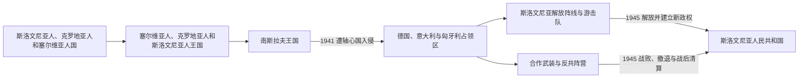

# 王国时期与第二次世界大战

## 时间

1918—1945年

## 概括

1918年，斯洛文尼亚地区先参加短暂的斯洛文尼亚人、克罗地亚人和塞尔维亚人国，随后进入塞尔维亚人、克罗地亚人和斯洛文尼亚人王国。战间期的边界、中央集权和少数族群问题尚未解决，1941年轴心国入侵后，斯洛文尼亚语地区又被德国、意大利和匈牙利瓜分；占领政策、抵抗运动、合作力量和革命性内战共同决定了战后政权。

## 王国时期

- 1918年共同王国建立后，斯洛文尼亚地区被纳入中央集权国家；克恩顿公投、拉帕洛条约和对意边界使许多斯洛文尼亚语人口留在奥地利和意大利境内。
- 1929年国家改称南斯拉夫王国，主要斯洛文尼亚地区组成德拉瓦河省。斯洛文尼亚人民党在自治诉求、天主教社会组织和中央政府合作之间调整。
- 王国为斯洛文尼亚教育、行政和经济整合提供了共同空间，但并未消除地方差异、边界争议和对中央集权的不满。

## 第二次世界大战

- 1941年轴心国击败南斯拉夫王国后，斯洛文尼亚语地区没有形成统一的傀儡国家，而是被纳粹德国、法西斯意大利和匈牙利分别占领。
- 占领当局推行吞并、驱逐、强制同化和镇压政策；不同占领区的制度与暴力强度并不完全相同。
- 斯洛文尼亚解放阵线及共产党领导的游击队把民族解放与社会革命结合。反共力量、天主教政治网络以及后来形成的斯洛文尼亚国土卫队与占领者合作，冲突兼有抵抗战争、内战和革命性质。
- 1945年前后发生大规模撤退、遣返和未经审判的处决，成为战后长期受压抑且后来高度政治化的记忆问题。
- 游击队胜利使斯洛文尼亚成为新南斯拉夫联邦的加盟共和国，并为战后边界调整提供政治基础。

## 演变关系

- 前一阶段：[哈布斯堡统治与斯洛文尼亚民族形成](/%E4%BA%BA%E6%96%87%E7%A7%91%E5%AD%A6/%E5%8E%86%E5%8F%B2/%E6%AC%A7%E6%B4%B2/%E4%B8%9C%E5%8D%97%E6%AC%A7%E4%B8%8E%E5%B7%B4%E5%B0%94%E5%B9%B2/%E6%96%AF%E6%B4%9B%E6%96%87%E5%B0%BC%E4%BA%9A/%E5%93%88%E5%B8%83%E6%96%AF%E5%A0%A1%E7%BB%9F%E6%B2%BB%E4%B8%8E%E6%96%AF%E6%B4%9B%E6%96%87%E5%B0%BC%E4%BA%9A%E6%B0%91%E6%97%8F%E5%BD%A2%E6%88%90.md)。
- 共同国家主线：[南斯拉夫王国](/%E4%BA%BA%E6%96%87%E7%A7%91%E5%AD%A6/%E5%8E%86%E5%8F%B2/%E6%AC%A7%E6%B4%B2/%E4%B8%9C%E5%8D%97%E6%AC%A7%E4%B8%8E%E5%B7%B4%E5%B0%94%E5%B9%B2/%E5%8D%97%E6%96%AF%E6%8B%89%E5%A4%AB%E5%8E%86%E5%8F%B2/%E5%8D%97%E6%96%AF%E6%8B%89%E5%A4%AB%E7%8E%8B%E5%9B%BD.md)。
- 战争共同主线：[第二次世界大战时期的南斯拉夫](/%E4%BA%BA%E6%96%87%E7%A7%91%E5%AD%A6/%E5%8E%86%E5%8F%B2/%E6%AC%A7%E6%B4%B2/%E4%B8%9C%E5%8D%97%E6%AC%A7%E4%B8%8E%E5%B7%B4%E5%B0%94%E5%B9%B2/%E5%8D%97%E6%96%AF%E6%8B%89%E5%A4%AB%E5%8E%86%E5%8F%B2/%E7%AC%AC%E4%BA%8C%E6%AC%A1%E4%B8%96%E7%95%8C%E5%A4%A7%E6%88%98%E6%97%B6%E6%9C%9F%E7%9A%84%E5%8D%97%E6%96%AF%E6%8B%89%E5%A4%AB.md)。
- 后一阶段：[社会主义斯洛文尼亚](/%E4%BA%BA%E6%96%87%E7%A7%91%E5%AD%A6/%E5%8E%86%E5%8F%B2/%E6%AC%A7%E6%B4%B2/%E4%B8%9C%E5%8D%97%E6%AC%A7%E4%B8%8E%E5%B7%B4%E5%B0%94%E5%B9%B2/%E6%96%AF%E6%B4%9B%E6%96%87%E5%B0%BC%E4%BA%9A/%E7%A4%BE%E4%BC%9A%E4%B8%BB%E4%B9%89%E6%96%AF%E6%B4%9B%E6%96%87%E5%B0%BC%E4%BA%9A.md)。
