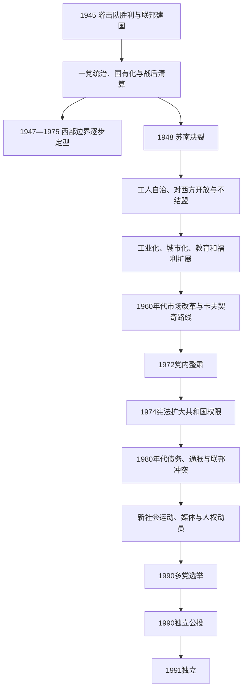

# 社会主义斯洛文尼亚

## 时间

1945—1991年

## 名称变化

| 时间 | 正式名称 | 国家地位 |
|---|---|---|
| 1944／1945—1946年2月 | 联邦斯洛文尼亚 | 在抵抗机关基础上形成的南斯拉夫联邦单位。 |
| 1946年2月—1963年4月 | 斯洛文尼亚人民共和国 | 南斯拉夫联邦人民共和国的加盟共和国。 |
| 1963年4月—1990年3月 | 斯洛文尼亚社会主义共和国 | 南斯拉夫社会主义联邦共和国的加盟共和国。 |
| 1990年3月—1991年6月 | 斯洛文尼亚共和国 | 已删除“社会主义”名称并实行多党制，但到1991年6月25日前仍在南斯拉夫联邦法权框架内。 |

## 概括

1945年游击队胜利后，抵抗机关转化为共和国政府、议会和群众组织。斯洛文尼亚在南斯拉夫联邦中获得共和国边界、斯洛文尼亚语公共制度和名义民族主权，却不是独立外交与国防主体。共产党通过干部任命、警察、军队联系和群众组织垄断政治；战后国有化、土地改革、对合作阵营的清算及政治审判迅速重塑社会。

1948年南斯拉夫与斯大林决裂后，国家没有放弃一党制，而是发展工人自治、较分权的联邦制度和对西方开放。斯洛文尼亚凭借原有工业、教育、交通、的里雅斯特—奥地利邻接和西方贸易，成为联邦人均产出和出口水平较高的共和国。工业化、城市化、教育、医疗、住房和女性就业显著扩展；市场改革、地区差距、环境污染、移民和政治表达限制也随之增加。

1974年宪法扩大共和国权限，既为后来主权化提供法理和机构资源，也使联邦经济协调更复杂。铁托1980年去世后，外债、通胀、紧缩、科索沃冲突和塞尔维亚再集中政治加剧。斯洛文尼亚媒体、知识界、朋克与艺术圈、和平、环境、人权及性少数运动扩大公共空间；1988年JBTZ军事审判把法治诉求转为群众动员。1990年多党选举和公投后，旧社会主义共和国通过制度性权力转移走向独立。

## 建政、清算与一党体制

### 从抵抗机关到共和国

1945年5月，斯洛文尼亚民族解放委员会成立共和国政府，鲍里斯·基德里奇任主席；战时解放阵线成为共产党领导的政治动员框架。1945年11月南斯拉夫废除君主制，1946年联邦和共和国宪法把斯洛文尼亚定义为联邦人民共和国之一。共和国拥有议会、政府、法院、教育文化机关和宪法，但联邦共产党、铁托领导、军队及安全机关构成最高权力中心。

完整法定元首、政府首脑和党组织第一负责人见[斯洛文尼亚国家元首与政府首脑表](/%E4%BA%BA%E6%96%87%E7%A7%91%E5%AD%A6/%E5%8E%86%E5%8F%B2/%E6%AC%A7%E6%B4%B2/%E4%B8%9C%E5%8D%97%E6%AC%A7%E4%B8%8E%E5%B7%B4%E5%B0%94%E5%B9%B2/%E6%96%AF%E6%B4%9B%E6%96%87%E5%B0%BC%E4%BA%9A/%E6%96%AF%E6%B4%9B%E6%96%87%E5%B0%BC%E4%BA%9A%E5%9B%BD%E5%AE%B6%E5%85%83%E9%A6%96%E4%B8%8E%E6%94%BF%E5%BA%9C%E9%A6%96%E8%84%91%E8%A1%A8.md)。理解人物时必须区分：

- **人民议会／共和国议会主席**在1974年前承担最高代表职能；
- **主席团主席**在1974年后代表集体元首机关；
- **执行委员会主席**相当于共和国政府首脑；
- **共产党／共产主义者联盟负责人**通过干部和政策体系掌握实际权力；
- **铁托与联邦领导层**控制国防、外交和全联邦党政，不能只从卢布尔雅那职位判断权力。

### 战后清算与政治压制

合作武装成员、旧精英、德意志族群及被视为阶级敌人的人遭处决、监禁、财产没收或驱逐。科切夫斯基罗格、特哈尔耶等秘密处决地点长期不许公开讨论。多数德语居民因集体归责和没收政策离开，边境人口结构显著改变。

1946—1948年反对党和独立团体被排除，新闻、社团和宗教活动受控制。1947年纳戈德审判把自由派知识分子和政治人物定为间谍或反国家分子；1948—1949年达豪审判又以战争经历为由迫害部分共产党干部和专业人士。天主教会的学校、财产和公共影响被压缩，神职人员受监控和审判。政治压制并非现代化的附带小节，而是党国建立和防止替代权力中心的机制。

## 土地、所有制与计划经济

| 措施 | 具体过程 | 社会后果 |
|---|---|---|
| 土地改革 | 没收大地产、教会和被定为敌产的土地，分配或纳入国营部门 | 削弱旧地主和教会经济基础，但小农经营仍大量存在。 |
| 国有化 | 银行、工业、交通、批发商业及较大私营企业转为国家／社会所有 | 国家可集中投资重工业，也消除独立资本与劳资谈判空间。 |
| 计划工业化 | 联邦和共和国计划配置投资、原料与价格 | 电力、金属、机械、化工和基础设施扩张；消费品与住房一度短缺。 |
| 农业合作化 | 1940年代末推动农民加入合作社 | 因产量、激励和抵抗问题在1950年代初大幅退却，南斯拉夫没有维持苏联式全面集体农庄。 |
| 社会所有与工人自治 | 1950年后企业名义由工人委员会参与管理 | 企业自主和地方财政扩大，但党、银行与政府仍能影响经理任命和投资。 |

斯洛文尼亚原有较强工业、工匠、铁路和教育基础，战争破坏又相对集中于特定地区，因此战后恢复较快。联邦市场提供原料、劳动力和销售地，斯洛文尼亚企业则向其他共和国输出机械、耐用品和技术。由此形成互相依赖，也产生“斯洛文尼亚贡献过多”与“发达共和国从共同市场获利”的相反叙事。

## 1948年苏南决裂

斯大林和共产党情报局批评南斯拉夫不服从苏联控制，铁托领导层拒绝让步，1948年被开除出情报局。斯洛文尼亚党组织清查亲苏或被怀疑亲苏者，部分人被送往戈利奥托克等监狱营。决裂的直接结果不是民主化，而是以民族独立名义加强党内纪律和安全控制。

中长期变化包括：

1. 南斯拉夫接受西方经济和军事援助，斯洛文尼亚靠近意大利、奥地利的地理优势上升；
2. 工人自治被提出为区别苏联中央计划的制度；
3. 南斯拉夫发展不结盟外交，在冷战两极间争取贷款、市场和政治空间；
4. 联邦逐步允许更大企业、地方和共和国权限；
5. 对苏联入侵的恐惧强化全民防御、领土防御和军队政治地位，后来这些机构在1991年又发生冲突。

## 西部边界与滨海重组

### 边界形成

| 时间 | 安排 | 结果 |
|---|---|---|
| 1945年5—6月 | 南斯拉夫军控制的里雅斯特和朱利亚边区，盟军要求分区 | 摩根线以西由英美管理、以东由南斯拉夫管理，避免直接军事冲突。 |
| 1947年《巴黎和约》 | 意大利割让伊斯特拉大部、戈里齐亚以东和斯洛文尼亚滨海给南斯拉夫；设的里雅斯特自由区 | 斯洛文尼亚获得科佩尔沿海和西部领土，的里雅斯特问题仍未解决。 |
| 1954年《伦敦备忘录》 | 自由区A区交意大利民政，B区交南斯拉夫民政 | 的里雅斯特归意大利、科佩尔及南部归南斯拉夫的事实边界形成。 |
| 1975年《奥西莫条约》 | 意大利与南斯拉夫正式确认边界和相关安排 | 结束自由区法律遗留，促进跨境贸易与少数族群安排。 |
| 1955年奥地利国家条约 | 条约第7条承诺克恩顿和施蒂利亚斯洛文尼亚少数族群权利 | 双语教育、标志和代表权的落实长期引起奥地利国内争议。 |

边界重组伴随意大利人和其他居民离开伊斯特拉、科佩尔等地，原因包括对共产党统治的恐惧、财产和国籍变化、民族压力及经济选择；斯洛文尼亚人也从意大利或内地迁入。把所有迁移简单归为自愿或单一强制都不准确。科佩尔后来发展为港口，为共和国提供不依赖的里雅斯特的海运出口。

## 工人自治与社会现代化

### 经济和城市化

1950—1970年代，卢布尔雅那、马里博尔、采列、克拉尼、新梅斯托、韦莱涅和科佩尔等工业中心扩张。乡村人口进入工厂和城市住宅区，公路、铁路、电网、自来水与公共交通改善。企业如汽车、电器、制药和机械制造进入联邦及西方市场。亚得里亚海旅游、边境购物和与奥地利、意大利的“小边境通行”使消费文化比多数东欧社会主义国家更开放。

现代化并不均衡。老工业区污染严重，煤矿和重工业劳动风险高；山区和边缘农村人口外流。企业贷款和地方投资竞争造成重复建设。联邦价格、外汇和发展基金安排不断在效率与地区再分配之间冲突。

### 教育、福利与日常生活

- 普及基础教育并扩大中等、职业和大学教育，卢布尔雅那大学及研究机构培养工程、医学和人文专业人员；
- 公共医疗、养老金、带薪休假、托幼和社会住房提高生活保障；
- 女性劳动参与和教育水平上升，但家庭照护与政治高层仍存在性别不平等；
- 斯洛文尼亚语成为共和国行政、学校、广播电视和出版的主要语言，1958年斯洛文尼亚语电视节目制度化；
- 1960年代起允许较自由出境，大量“客工”赴西德、奥地利等国，又把汇款、技术和消费文化带回；
- 来自波黑、塞尔维亚、克罗地亚、北马其顿等共和国的劳动者迁入斯洛文尼亚，支撑工业化，也在语言、住房和身份上面临差异待遇。

## 改革、卡夫契奇路线与1972年转折

1965年联邦经济改革试图让价格、银行、外汇和企业收益更接近市场机制。斯洛文尼亚政府首脑斯塔内·卡夫契奇主张公路、服务业、高附加值工业、企业自主和西方贸易，希望减少联邦行政直接配置。1969年前后的“公路事件”围绕国际贷款项目分配，表现共和国与联邦发展优先级冲突。

改革带来出口和消费机会，也扩大企业、地区及技术人员之间差距。党内保守派担心经理层自主、民族共和国权力和公开批评削弱党的统一；克罗地亚之春等运动又使联邦领导警惕民族化。1972年铁托推动全联邦反自由化整肃，卡夫契奇被迫辞职，媒体和干部空间收紧。

卡夫契奇下台的结构因素是市场化与一党干部控制之间矛盾；外部因素是全南斯拉夫民族政治和苏联1968年入侵捷克斯洛伐克后的安全焦虑；直接触发是铁托及共和国党领导要求清除“自由主义”。经济开放未被完全逆转，但政治边界重新划定。

## 1974年宪法与共和国权限

1974年南斯拉夫宪法把联邦描述为各共和国和自治省共同体，重大决定更多需要协商。斯洛文尼亚拥有自己的宪法、集体主席团、议会、政府、法院、警察、银行和领土防御体系，并可通过共和国代表参与联邦主席团。共和国边界变更需要其同意，语言与文化制度得到保障。

### 分权的双重结果

| 积极作用 | 潜在问题 |
|---|---|
| 允许共和国根据本地经济和文化条件制定政策 | 联邦宏观政策需多方一致，危机时决策缓慢 |
| 保障斯洛文尼亚语、教育和共和国机构 | 各共和国媒体和政治空间日益分离 |
| 为1990—1991年主权决策提供现成议会、警察和领土防御 | 联邦军队与共和国防御之间存在权力重叠 |
| 限制单一人口大共和国直接控制联邦 | 塞尔维亚政治力量认为国家过度分散，推动再集中 |
| 通过发展基金帮助较欠发达共和国 | 发达共和国质疑负担，欠发达共和国质疑交换与投资不公 |

1974年制度本身不是解体的单一原因。外债增长、石油危机、低效投资、政治合法性衰退和民族精英策略共同决定其结果；同一分权机制也曾在铁托晚年维持多民族妥协。

## 1980年代经济危机

铁托1980年去世后，集体联邦主席团失去个人仲裁中心。1970年代借贷、能源价格和出口竞争力问题在全球利率上升后暴露。国际货币基金组织支持的稳定化政策压低工资和进口，短缺、失业、通胀与外汇黑市影响日常生活。到年代末，恶性通胀和企业债务削弱工人自治的实际意义。

斯洛文尼亚既是联邦较富裕、出口导向的共和国，也依赖南斯拉夫市场、能源、劳动力和共同债务。要求减少发展基金和联邦转移支付的声音增强；其他共和国则批评斯洛文尼亚利用共同市场积累优势。经济争论迅速被民族政治语言解释。

## 公民社会、媒体与政治开放

### 新社会运动

1970年代末至1980年代，学生文化、朋克音乐、独立出版、实验艺术和“新斯洛文尼亚艺术”等拓展公共表达。和平运动反对军国主义和核武，环境团体关注工业污染，女权和1984年“马格努斯”同性恋文化活动挑战保守规范。天主教知识界、自由派共产党人和非党派社团也重新进入公共讨论。

周刊《青年》、广播、作家协会和大学圈批评联邦军队、官僚特权和民族主义。1987年《新评论》第57期发表多篇“斯洛文尼亚民族纲领”文章，提出主权、民主和制度重建；这不是唯一开端，却把分散议题集中到国家未来。

### JBTZ审判

1988年，亚内兹·扬沙、伊万·博尔什特纳、达维德·塔西奇和弗兰茨·扎夫尔因涉军方文件被南斯拉夫人民军逮捕并在卢布尔雅那军事法庭受审。审判使用塞尔维亚—克罗地亚语而非斯洛文尼亚语，且程序和军方权力受到质疑。保护人权委员会迅速汇集大量成员，示威把言论自由、法治、语言权与反军方控制结合起来。

审判并未由单一政党策划，却使此前文化运动转成广泛政治联盟。共和国共产党领导没有全面镇压抗议，并与联邦军方保持距离；这种有限容忍使转型与罗马尼亚等暴力革命路径不同。

## 与塞尔维亚领导层和联邦军队的冲突

1986年后，斯洛博丹·米洛舍维奇在塞尔维亚通过群众集会和党内改组推动再集中，取消科索沃、伏伊伏丁那大部分自治。斯洛文尼亚领导和舆论担心1974年共和国权力被逆转，并公开支持科索沃阿尔巴尼亚人的部分权利。1989年共和国宪法修正强调自决、经济主权和防止联邦紧急措施。

同年12月，塞尔维亚民族主义团体拟在卢布尔雅那举行“真相集会”。斯洛文尼亚警察在“北方行动”中阻止组织者和参与者进入，显示共和国安全机关已愿意抵制联邦—跨共和国政治压力。南斯拉夫人民军则日益把维护统一和社会主义视为自身使命，双方权力冲突公开化。

## 多党化、选举与公投

### 制度转换

| 时间 | 事件 | 作用 |
|---|---|---|
| 1989年 | 宪法修正和反对派组织合法化 | 为竞争性政党、主权条款和自由选举建立法理空间。 |
| 1990年1月 | 斯洛文尼亚代表团退出南共联盟第十四次特别代表大会 | 联邦执政党的统一组织事实上崩溃。 |
| 1990年4月 | 战后首次多党选举 | DEMOS联盟赢得议会多数；米兰·库昌当选共和国主席团主席。 |
| 1990年5月 | 彼得莱政府就职 | 共产党政府和平交权，多党行政开始。 |
| 1990年7月2日 | 共和国议会发表主权宣言 | 声称共和国法律优先，为与联邦谈判和独立立法铺路。 |
| 1990年12月23日 | 独立公投 | 约88.5%的全体登记选民、约95%的投票者赞成独立。 |
| 1990年12月26日 | 公布公投结果 | 共和国承诺在六个月内落实独立决定。 |
| 1991年6月25日 | 通过基本宪章和独立法案 | 加盟共和国阶段结束，现代独立国家阶段开始。 |

### 为什么一党体制终结

- **结构因素**：教育、城市化和跨境开放形成不能由旧审查完全控制的社会；1974年分权又给共和国制度以行动能力。
- **经济因素**：债务、通胀和失业破坏党以生活改善换取服从的合法性。
- **联邦因素**：塞尔维亚再集中、科索沃冲突和军方介入使斯洛文尼亚精英与民众把民主化同共和国主权联系起来。
- **国际因素**：东欧1989年革命、冷战缓和和欧洲共同体吸引力降低一党体制外部支撑。
- **内部政治选择**：库昌等共和国党领导接受竞争性选举，反对派组成DEMOS并选择通过公投和议会立法推进。
- **直接触发**：1990年自由选举完成政权轮替，12月公投给予政府退出联邦的明确授权。

## 兴起、鼎盛与衰落分析

### 建立和巩固条件

1. 游击队在反占领战争中形成武装、行政和群众组织；
2. 轴心国与合作政权失败，战后替代精英被清除或流亡；
3. 苏联及欧洲反法西斯胜利为共产党政权提供国际环境；
4. 联邦制满足斯洛文尼亚语公共制度和边界重组诉求；
5. 土地、工业和福利改革吸引部分工人、农民和青年。

### 相对鼎盛条件

1960年代至1970年代中期常被视为制度最有活力阶段：快速增长、就业、住房、教育、出境自由和西方消费品提高生活水平；工人自治、市场机制与联邦分权区别于苏联模式；斯洛文尼亚企业同时利用联邦市场与西方出口。但繁荣依赖外债、客工汇款、政治压制下的工资协调和不透明投资，不能只以怀旧生活经验评价。

### 衰落和终结

- **结构因素**：一党制度缺乏公开纠错和合法权力轮替；共和国分权与联邦统一之间没有最终仲裁机制。
- **经济因素**：外债、通胀、低效率和地区差距使联邦分配变为零和争议。
- **社会因素**：受教育公民、媒体和新运动要求言论、结社、人权及历史真相。
- **外部压力**：冷战结束、东欧民主化和欧洲一体化提供替代制度方向。
- **政治压力**：米洛舍维奇再集中路线、科索沃压制和军方政治化加深斯洛文尼亚安全焦虑。
- **直接触发**：1990年多党选举结束党垄断，独立公投与1991年法案结束加盟共和国身份。

终结的是一党社会主义和南斯拉夫加盟框架，不是共和国机构本身。议会、政府、主席团、警察和领土防御经过改造后成为独立国家机构，这种制度连续性解释了转型为何能迅速实施。

## 重要事件

| 时间 | 事件 | 结果与长期影响 |
|---|---|---|
| 1945年 | 共和国政府建立、战后清算 | 结束占领并确立共产党政权，同时造成秘密处决和政治排除。 |
| 1946年 | 人民共和国宪制与国有化 | 加盟共和国制度化，计划经济和一党统治巩固。 |
| 1947年 | 巴黎和约 | 斯洛文尼亚滨海大部并入，的里雅斯特自由区留下争议。 |
| 1948年 | 苏南决裂 | 转向独立社会主义、对西方开放和工人自治，同时清洗亲苏者。 |
| 1950年 | 工人自治立法 | 企业和地方管理机制改变，成为南斯拉夫制度标志。 |
| 1954年 | 伦敦备忘录 | 的里雅斯特与科佩尔的事实边界定型。 |
| 1965年 | 市场化经济改革 | 企业与出口自主扩大，地区和社会差距也上升。 |
| 1967—1972年 | 卡夫契奇政府 | 代表斯洛文尼亚经济自由化，终因党内整肃下台。 |
| 1974年 | 新联邦和共和国宪法 | 大幅扩大共和国权限，为后来主权化提供制度工具。 |
| 1975年 | 奥西莫条约 | 正式解决与意大利的战后边界。 |
| 1980年 | 铁托去世 | 联邦失去个人仲裁中心，债务和民族政治加速显现。 |
| 1987年 | 《新评论》第57期 | 系统讨论民族主权和民主重建。 |
| 1988年 | JBTZ审判及人权委员会 | 军方审判引发大规模法治与民主运动。 |
| 1989年 | 宪法修正与“北方行动” | 共和国主权和警察自主公开对抗再集中压力。 |
| 1990年1月 | 退出南共联盟代表大会 | 统一执政党组织瓦解。 |
| 1990年4—5月 | 多党选举与和平交权 | 一党体制终结，DEMOS政府就职。 |
| 1990年12月 | 独立公投 | 给予独立行动直接民主授权。 |
| 1991年6月 | 独立法案 | 社会主义加盟共和国历史正式结束。 |

## 演变关系

- 前一阶段：[王国时期与第二次世界大战](/%E4%BA%BA%E6%96%87%E7%A7%91%E5%AD%A6/%E5%8E%86%E5%8F%B2/%E6%AC%A7%E6%B4%B2/%E4%B8%9C%E5%8D%97%E6%AC%A7%E4%B8%8E%E5%B7%B4%E5%B0%94%E5%B9%B2/%E6%96%AF%E6%B4%9B%E6%96%87%E5%B0%BC%E4%BA%9A/%E7%8E%8B%E5%9B%BD%E6%97%B6%E6%9C%9F%E4%B8%8E%E7%AC%AC%E4%BA%8C%E6%AC%A1%E4%B8%96%E7%95%8C%E5%A4%A7%E6%88%98.md)。
- 联邦共同主线：[南斯拉夫社会主义联邦共和国](/%E4%BA%BA%E6%96%87%E7%A7%91%E5%AD%A6/%E5%8E%86%E5%8F%B2/%E6%AC%A7%E6%B4%B2/%E4%B8%9C%E5%8D%97%E6%AC%A7%E4%B8%8E%E5%B7%B4%E5%B0%94%E5%B9%B2/%E5%8D%97%E6%96%AF%E6%8B%89%E5%A4%AB%E5%8E%86%E5%8F%B2/%E5%8D%97%E6%96%AF%E6%8B%89%E5%A4%AB%E7%A4%BE%E4%BC%9A%E4%B8%BB%E4%B9%89%E8%81%94%E9%82%A6%E5%85%B1%E5%92%8C%E5%9B%BD.md)。
- 解体共同背景：[南斯拉夫解体](/%E4%BA%BA%E6%96%87%E7%A7%91%E5%AD%A6/%E5%8E%86%E5%8F%B2/%E6%AC%A7%E6%B4%B2/%E4%B8%9C%E5%8D%97%E6%AC%A7%E4%B8%8E%E5%B7%B4%E5%B0%94%E5%B9%B2/%E5%8D%97%E6%96%AF%E6%8B%89%E5%A4%AB%E5%8E%86%E5%8F%B2/%E5%8D%97%E6%96%AF%E6%8B%89%E5%A4%AB%E8%A7%A3%E4%BD%93.md)。
- 完整法定元首、政府和党领导序列：[斯洛文尼亚国家元首与政府首脑表](/%E4%BA%BA%E6%96%87%E7%A7%91%E5%AD%A6/%E5%8E%86%E5%8F%B2/%E6%AC%A7%E6%B4%B2/%E4%B8%9C%E5%8D%97%E6%AC%A7%E4%B8%8E%E5%B7%B4%E5%B0%94%E5%B9%B2/%E6%96%AF%E6%B4%9B%E6%96%87%E5%B0%BC%E4%BA%9A/%E6%96%AF%E6%B4%9B%E6%96%87%E5%B0%BC%E4%BA%9A%E5%9B%BD%E5%AE%B6%E5%85%83%E9%A6%96%E4%B8%8E%E6%94%BF%E5%BA%9C%E9%A6%96%E8%84%91%E8%A1%A8.md)。
- 后一阶段：[独立与当代斯洛文尼亚](/%E4%BA%BA%E6%96%87%E7%A7%91%E5%AD%A6/%E5%8E%86%E5%8F%B2/%E6%AC%A7%E6%B4%B2/%E4%B8%9C%E5%8D%97%E6%AC%A7%E4%B8%8E%E5%B7%B4%E5%B0%94%E5%B9%B2/%E6%96%AF%E6%B4%9B%E6%96%87%E5%B0%BC%E4%BA%9A/%E7%8B%AC%E7%AB%8B%E4%B8%8E%E5%BD%93%E4%BB%A3%E6%96%AF%E6%B4%9B%E6%96%87%E5%B0%BC%E4%BA%9A.md)。
- 国家入口：[斯洛文尼亚历史](/%E4%BA%BA%E6%96%87%E7%A7%91%E5%AD%A6/%E5%8E%86%E5%8F%B2/%E6%AC%A7%E6%B4%B2/%E4%B8%9C%E5%8D%97%E6%AC%A7%E4%B8%8E%E5%B7%B4%E5%B0%94%E5%B9%B2/%E6%96%AF%E6%B4%9B%E6%96%87%E5%B0%BC%E4%BA%9A/README.md)。

## 关键辨析

- 斯洛文尼亚共和国拥有宪法和政府，不等于1945—1991年已经是国际法上的独立国。
- 工人自治扩大企业参与，但共产党干部、银行和行政仍能决定重要投资与人事，不能等同多党经济民主。
- 1948年与苏联决裂使对外路线独立，却伴随对亲苏嫌疑人的监禁，不等于立即自由化。
- 经济较发达既来自自身工业、教育和西方贸易，也依靠联邦市场、劳动力和共同投资；“单方面供养”或“单方面剥削”都过度简化。
- 1974年宪法既保护共和国权力，也增加联邦协调成本；它是条件而非解体的唯一原因。
- 1990年删除“社会主义”名称后，斯洛文尼亚仍到1991年6月才宣布独立；两者不能写成同一日期。
- 多党化由反对派、公民社会、改革派共产党人和国际环境共同促成，不是单一人物突然“赐予”。
