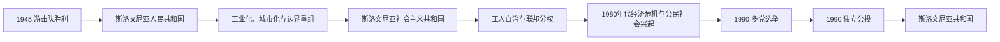

# 社会主义斯洛文尼亚

## 时间

1945—1991年

## 概括

战后斯洛文尼亚先为人民共和国，1963年改称社会主义共和国，是南斯拉夫联邦六个加盟共和国之一。共和国在联邦市场、自主管理制度和对西方开放的环境中实现工业化与城市化，并保持相对较高的发展水平；与此同时，共产党一党体制、战后清算和联邦内部财政政治矛盾也构成其历史的重要部分。

## 重要进程

- **联邦地位**：斯洛文尼亚拥有共和国宪法、议会和行政机构，但共产党联盟长期垄断政治权力；1974年宪法扩大共和国自主权。
- **边界与滨海**：战后南斯拉夫取得伊斯特拉和斯洛文尼亚滨海的大部分地区；的里雅斯特及其周边经过自由区和1954年安排，1975年条约进一步确认边界。
- **经济社会**：工业化、教育普及和跨共和国劳动力流动改变社会结构。斯洛文尼亚与奥地利、意大利相邻，较早参与对西方贸易和旅游，并成为联邦较发达地区之一。
- **文化与记忆**：斯洛文尼亚语在共和国公共生活中制度化；战时合作、战后处决、教会关系和政治异议则长期受到限制。
- **1980年代转折**：铁托去世后，经济危机、科索沃问题和联邦权力争论加剧。斯洛文尼亚媒体、知识界和新社会运动要求言论自由、政治多元及更松散的联邦。
- **走向独立**：1990年举行多党选举；同年12月公投以压倒性多数支持独立，为1991年宣布独立提供直接政治授权。

## 演变关系

- 前一阶段：[王国时期与第二次世界大战](/%E4%BA%BA%E6%96%87%E7%A7%91%E5%AD%A6/%E5%8E%86%E5%8F%B2/%E6%AC%A7%E6%B4%B2/%E4%B8%9C%E5%8D%97%E6%AC%A7%E4%B8%8E%E5%B7%B4%E5%B0%94%E5%B9%B2/%E6%96%AF%E6%B4%9B%E6%96%87%E5%B0%BC%E4%BA%9A/%E7%8E%8B%E5%9B%BD%E6%97%B6%E6%9C%9F%E4%B8%8E%E7%AC%AC%E4%BA%8C%E6%AC%A1%E4%B8%96%E7%95%8C%E5%A4%A7%E6%88%98.md)。
- 联邦主线：[南斯拉夫社会主义联邦共和国](/%E4%BA%BA%E6%96%87%E7%A7%91%E5%AD%A6/%E5%8E%86%E5%8F%B2/%E6%AC%A7%E6%B4%B2/%E4%B8%9C%E5%8D%97%E6%AC%A7%E4%B8%8E%E5%B7%B4%E5%B0%94%E5%B9%B2/%E5%8D%97%E6%96%AF%E6%8B%89%E5%A4%AB%E5%8E%86%E5%8F%B2/%E5%8D%97%E6%96%AF%E6%8B%89%E5%A4%AB%E7%A4%BE%E4%BC%9A%E4%B8%BB%E4%B9%89%E8%81%94%E9%82%A6%E5%85%B1%E5%92%8C%E5%9B%BD.md)。
- 解体背景：[南斯拉夫解体](/%E4%BA%BA%E6%96%87%E7%A7%91%E5%AD%A6/%E5%8E%86%E5%8F%B2/%E6%AC%A7%E6%B4%B2/%E4%B8%9C%E5%8D%97%E6%AC%A7%E4%B8%8E%E5%B7%B4%E5%B0%94%E5%B9%B2/%E5%8D%97%E6%96%AF%E6%8B%89%E5%A4%AB%E5%8E%86%E5%8F%B2/%E5%8D%97%E6%96%AF%E6%8B%89%E5%A4%AB%E8%A7%A3%E4%BD%93.md)。
- 后一阶段：[独立与当代斯洛文尼亚](/%E4%BA%BA%E6%96%87%E7%A7%91%E5%AD%A6/%E5%8E%86%E5%8F%B2/%E6%AC%A7%E6%B4%B2/%E4%B8%9C%E5%8D%97%E6%AC%A7%E4%B8%8E%E5%B7%B4%E5%B0%94%E5%B9%B2/%E6%96%AF%E6%B4%9B%E6%96%87%E5%B0%BC%E4%BA%9A/%E7%8B%AC%E7%AB%8B%E4%B8%8E%E5%BD%93%E4%BB%A3%E6%96%AF%E6%B4%9B%E6%96%87%E5%B0%BC%E4%BA%9A.md)。
