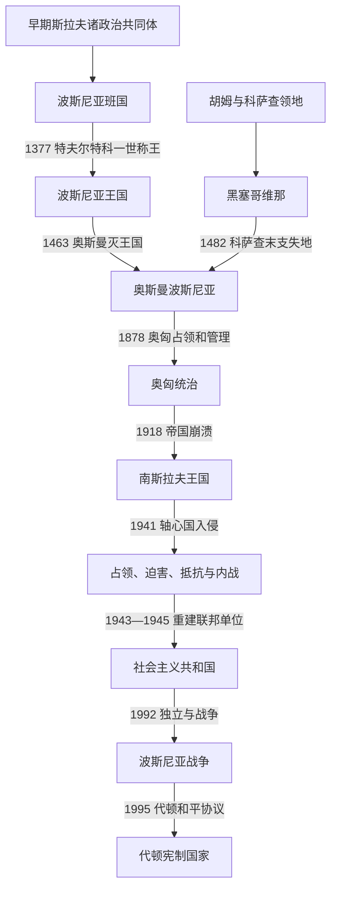

# 波斯尼亚和黑塞哥维那历史

## 概括

波斯尼亚和黑塞哥维那的历史主线不是一个民族国家连续扩张的故事，而是同一片山地—河谷空间在中世纪王权、奥斯曼边疆行省、奥匈共同领地、两代南斯拉夫和代顿国家之间反复重组的过程。现代边界大体承接奥斯曼末期与奥匈时期的行政空间；“波斯尼亚”“黑塞哥维那”、国家公民身份、三个构成民族和宗教共同体则属于不同层次，不能相互替代。

## 历史主线

- **中世纪国家形成**：12世纪的班在匈牙利宗主权主张和地方贵族之间取得实际自主；科特罗曼尼奇家族在14世纪扩张，1377年建立王国。王位选立、强大领主、外部干预和奥斯曼军事压力共同导致王国瓦解。
- **奥斯曼行省社会**：1463年王国灭亡，黑塞哥维那至1482年陆续并入。桑贾克、行省、蒂玛尔和边防军制改变政治经济；伊斯兰化、城市化与天主教、东正教、犹太社群的长期共存共同塑造社会。
- **奥匈占领与吞并**：1878年后奥斯曼仍保留名义主权，奥匈却掌握实际行政；1908年吞并后名义与实际主权合一。官僚化、铁路和教育扩展与土地矛盾、政治管控及民族组织化同步发生。
- **南斯拉夫与世界大战**：1918年进入统一王国，历史领土被省区重划。1941年大部被置于轴心国附庸“克罗地亚独立国”统治下，乌斯塔沙迫害、切特尼克暴力、占领军镇压、游击战争和多方内战交叠。
- **社会主义联邦单位**：ZAVNOBiH在1943年确认波黑作为共同家园和联邦单位；战后工业化、城市化、工人自治和民族承认深化共和国制度，1980年代经济危机与民族主义竞争却使联邦共识崩解。
- **独立、战争与代顿体系**：1992—1995年战争中，塞族、克族和共和国政府方面的军政机构争夺领土；各方均有战争罪，系统而广泛的族群清洗主要由波黑塞族力量针对波什尼亚克与克族平民实施，斯雷布雷尼察杀戮被国际法院认定为种族灭绝。代顿协议结束战争，建立两实体、布尔奇科特区、共同国家机构与外部和平监督并存的架构。

## 历史阶段导航

| 顺序 | 阶段 | 时间 | 核心问题 |
|---:|---|---|---|
| 1 | [波斯尼亚中世纪国家](/%E4%BA%BA%E6%96%87%E7%A7%91%E5%AD%A6/%E5%8E%86%E5%8F%B2/%E6%AC%A7%E6%B4%B2/%E4%B8%9C%E5%8D%97%E6%AC%A7%E4%B8%8E%E5%B7%B4%E5%B0%94%E5%B9%B2/%E6%B3%A2%E6%96%AF%E5%B0%BC%E4%BA%9A%E5%92%8C%E9%BB%91%E5%A1%9E%E5%93%A5%E7%BB%B4%E9%82%A3/%E6%B3%A2%E6%96%AF%E5%B0%BC%E4%BA%9A%E4%B8%AD%E4%B8%96%E7%BA%AA%E5%9B%BD%E5%AE%B6.md) | 约12世纪—1463年；地方余脉至1482年 | 班国如何扩张为王国，以及贵族政治和奥斯曼压力怎样终结王权。 |
| 2 | [波斯尼亚中世纪统治者世系表](/%E4%BA%BA%E6%96%87%E7%A7%91%E5%AD%A6/%E5%8E%86%E5%8F%B2/%E6%AC%A7%E6%B4%B2/%E4%B8%9C%E5%8D%97%E6%AC%A7%E4%B8%8E%E5%B7%B4%E5%B0%94%E5%B9%B2/%E6%B3%A2%E6%96%AF%E5%B0%BC%E4%BA%9A%E5%92%8C%E9%BB%91%E5%A1%9E%E5%93%A5%E7%BB%B4%E9%82%A3/%E6%B3%A2%E6%96%AF%E5%B0%BC%E4%BA%9A%E4%B8%AD%E4%B8%96%E7%BA%AA%E7%BB%9F%E6%B2%BB%E8%80%85%E4%B8%96%E7%B3%BB%E8%A1%A8.md) | 约1154—1482年 | 班、国王、复位者、对立王和黑塞哥维那公爵的连续序列。 |
| 3 | [奥斯曼统治下的波斯尼亚](/%E4%BA%BA%E6%96%87%E7%A7%91%E5%AD%A6/%E5%8E%86%E5%8F%B2/%E6%AC%A7%E6%B4%B2/%E4%B8%9C%E5%8D%97%E6%AC%A7%E4%B8%8E%E5%B7%B4%E5%B0%94%E5%B9%B2/%E6%B3%A2%E6%96%AF%E5%B0%BC%E4%BA%9A%E5%92%8C%E9%BB%91%E5%A1%9E%E5%93%A5%E7%BB%B4%E9%82%A3/%E5%A5%A5%E6%96%AF%E6%9B%BC%E7%BB%9F%E6%B2%BB%E4%B8%8B%E7%9A%84%E6%B3%A2%E6%96%AF%E5%B0%BC%E4%BA%9A.md) | 1463—1878年 | 征服、行省制度、社会转型、改革与1875—1878年东方危机。 |
| 4 | [奥匈统治下的波斯尼亚和黑塞哥维那](/%E4%BA%BA%E6%96%87%E7%A7%91%E5%AD%A6/%E5%8E%86%E5%8F%B2/%E6%AC%A7%E6%B4%B2/%E4%B8%9C%E5%8D%97%E6%AC%A7%E4%B8%8E%E5%B7%B4%E5%B0%94%E5%B9%B2/%E6%B3%A2%E6%96%AF%E5%B0%BC%E4%BA%9A%E5%92%8C%E9%BB%91%E5%A1%9E%E5%93%A5%E7%BB%B4%E9%82%A3/%E5%A5%A5%E5%8C%88%E7%BB%9F%E6%B2%BB%E4%B8%8B%E7%9A%84%E6%B3%A2%E6%96%AF%E5%B0%BC%E4%BA%9A%E5%92%8C%E9%BB%91%E5%A1%9E%E5%93%A5%E7%BB%B4%E9%82%A3.md) | 1878—1918年 | 占领、吞并、现代化、有限宪政、民族政治与一战。 |
| 5 | [奥匈时期行政首脑表](/%E4%BA%BA%E6%96%87%E7%A7%91%E5%AD%A6/%E5%8E%86%E5%8F%B2/%E6%AC%A7%E6%B4%B2/%E4%B8%9C%E5%8D%97%E6%AC%A7%E4%B8%8E%E5%B7%B4%E5%B0%94%E5%B9%B2/%E6%B3%A2%E6%96%AF%E5%B0%BC%E4%BA%9A%E5%92%8C%E9%BB%91%E5%A1%9E%E5%93%A5%E7%BB%B4%E9%82%A3/%E5%A5%A5%E5%8C%88%E6%97%B6%E6%9C%9F%E8%A1%8C%E6%94%BF%E9%A6%96%E8%84%91%E8%A1%A8.md) | 1878—1918年 | 共同财政部长、萨拉热窝地方政府与军政长官的权力分工。 |
| 6 | [南斯拉夫王国与第二次世界大战时期](/%E4%BA%BA%E6%96%87%E7%A7%91%E5%AD%A6/%E5%8E%86%E5%8F%B2/%E6%AC%A7%E6%B4%B2/%E4%B8%9C%E5%8D%97%E6%AC%A7%E4%B8%8E%E5%B7%B4%E5%B0%94%E5%B9%B2/%E6%B3%A2%E6%96%AF%E5%B0%BC%E4%BA%9A%E5%92%8C%E9%BB%91%E5%A1%9E%E5%93%A5%E7%BB%B4%E9%82%A3/%E5%8D%97%E6%96%AF%E6%8B%89%E5%A4%AB%E7%8E%8B%E5%9B%BD%E4%B8%8E%E7%AC%AC%E4%BA%8C%E6%AC%A1%E4%B8%96%E7%95%8C%E5%A4%A7%E6%88%98%E6%97%B6%E6%9C%9F.md) | 1918—1945年 | 中央集权和省区拆分，以及占领、迫害、抵抗和内战。 |
| 7 | [社会主义南斯拉夫时期的波斯尼亚和黑塞哥维那](/%E4%BA%BA%E6%96%87%E7%A7%91%E5%AD%A6/%E5%8E%86%E5%8F%B2/%E6%AC%A7%E6%B4%B2/%E4%B8%9C%E5%8D%97%E6%AC%A7%E4%B8%8E%E5%B7%B4%E5%B0%94%E5%B9%B2/%E6%B3%A2%E6%96%AF%E5%B0%BC%E4%BA%9A%E5%92%8C%E9%BB%91%E5%A1%9E%E5%93%A5%E7%BB%B4%E9%82%A3/%E7%A4%BE%E4%BC%9A%E4%B8%BB%E4%B9%89%E5%8D%97%E6%96%AF%E6%8B%89%E5%A4%AB%E6%97%B6%E6%9C%9F%E7%9A%84%E6%B3%A2%E6%96%AF%E5%B0%BC%E4%BA%9A%E5%92%8C%E9%BB%91%E5%A1%9E%E5%93%A5%E7%BB%B4%E9%82%A3.md) | 1943/1945—1992年 | 共和国制度、经济社会转型、民族承认与联邦崩解。 |
| 8 | [独立、战争与代顿体系](/%E4%BA%BA%E6%96%87%E7%A7%91%E5%AD%A6/%E5%8E%86%E5%8F%B2/%E6%AC%A7%E6%B4%B2/%E4%B8%9C%E5%8D%97%E6%AC%A7%E4%B8%8E%E5%B7%B4%E5%B0%94%E5%B9%B2/%E6%B3%A2%E6%96%AF%E5%B0%BC%E4%BA%9A%E5%92%8C%E9%BB%91%E5%A1%9E%E5%93%A5%E7%BB%B4%E9%82%A3/%E7%8B%AC%E7%AB%8B%E3%80%81%E6%88%98%E4%BA%89%E4%B8%8E%E4%BB%A3%E9%A1%BF%E4%BD%93%E7%B3%BB.md) | 1992年至今 | 战争过程、和平安排、两实体和国际监督的实际关系。 |
| 9 | [现代国家领导与权力结构表](/%E4%BA%BA%E6%96%87%E7%A7%91%E5%AD%A6/%E5%8E%86%E5%8F%B2/%E6%AC%A7%E6%B4%B2/%E4%B8%9C%E5%8D%97%E6%AC%A7%E4%B8%8E%E5%B7%B4%E5%B0%94%E5%B9%B2/%E6%B3%A2%E6%96%AF%E5%B0%BC%E4%BA%9A%E5%92%8C%E9%BB%91%E5%A1%9E%E5%93%A5%E7%BB%B4%E9%82%A3/%E7%8E%B0%E4%BB%A3%E5%9B%BD%E5%AE%B6%E9%A2%86%E5%AF%BC%E4%B8%8E%E6%9D%83%E5%8A%9B%E7%BB%93%E6%9E%84%E8%A1%A8.md) | 1943年至今 | 法定国家首脑、政府首脑、主席团轮值、实体现任领导与高级代表。 |

## 重要转折与时间节点

| 时间 | 转折 | 长期意义 |
|---|---|---|
| 1189年 | 库林班向杜布罗夫尼克颁发特许状 | 显示稳定的地方统治、书面行政和亚得里亚海贸易联系。 |
| 1377年 | 特夫尔特科一世加冕 | 班国转为王国，科特罗曼尼奇权势达高峰。 |
| 1463年 | 奥斯曼征服王国核心 | 王室国家终结，帝国行省制度逐步取代贵族王权。 |
| 1580年 | 波斯尼亚行省建立 | 波斯尼亚成为独立于鲁米利亚的边疆军政中心。 |
| 1831—1832年 | 侯赛因·格拉达什切维奇领导自治运动 | 地方军政精英抵抗中央集权，失败后伊斯坦布尔加速整顿。 |
| 1875—1878年 | 黑塞哥维那起义与东方危机 | 社会矛盾国际化，奥匈取得占领和管理权。 |
| 1908年 | 奥匈正式吞并 | 奥斯曼名义主权终止，吞并危机加剧列强与民族主义冲突。 |
| 1914年 | 萨拉热窝刺杀 | 成为一战危机链的直接触发事件，但不是大战唯一原因。 |
| 25—26日11月1943年 | ZAVNOBiH第一次会议 | 确立波黑作为多民族共同联邦单位的政治原则。 |
| 29日2月—1日3月1992年 | 独立公投 | 在塞族政治力量抵制下产生独立授权，政治冲突迅速军事化。 |
| 11日7月1995年以后 | 斯雷布雷尼察种族灭绝 | 波黑塞族军警系统处决八千余名波什尼亚克男子和男孩，成为国际刑法核心判例。 |
| 14日12月1995年 | 代顿和平总框架协议签署 | 终止战争并把战时领土妥协转化为高度分权宪制。 |
| 2009年 | 欧洲人权法院作出“塞伊迪奇和芬齐案”判决 | 确认只允许三个构成民族竞争部分国家职位构成歧视，改革至今未完成。 |
| 2022—2024年 | 获欧盟候选国地位、欧洲理事会决定开启入盟谈判 | 欧洲一体化成为共同政策方向，但执行受层级否决与政治危机制约。 |

## 关键辨析

- **波斯尼亚与黑塞哥维那是历史区域，波黑是国家**；黑塞哥维那没有独立的代顿实体。
- **波斯尼亚人可指地区居民或公民，波什尼亚克人是现代民族名称**；宗教标签不能机械换算为民族。
- **两个实体不是两个主权国家**；国家在国际法上连续存在，实体权限来自国家宪法和和平安排。
- **主席团主席不是独任总统**；三名成员集体行使国家元首职能，主席每八个月轮换。
- **高级代表不是国家元首或政府首脑**；其权力来自代顿协议附件十及和平执行机制，属于外部民事执行监督。
- **说明各方犯罪不等于抹平规模、组织性和司法结论的差异**；战争罪应按具体行为、责任链和法院判决表述。

## 跨目录分工

跨共和国的共同进程由[南斯拉夫历史](/%E4%BA%BA%E6%96%87%E7%A7%91%E5%AD%A6/%E5%8E%86%E5%8F%B2/%E6%AC%A7%E6%B4%B2/%E4%B8%9C%E5%8D%97%E6%AC%A7%E4%B8%8E%E5%B7%B4%E5%B0%94%E5%B9%B2/%E5%8D%97%E6%96%AF%E6%8B%89%E5%A4%AB%E5%8E%86%E5%8F%B2/README.md)维护；本目录聚焦波黑空间内的制度、社会、暴力过程和国家连续性，避免在多个国家目录复制同一套南斯拉夫君主或联邦领导人表。

## 相关入口

- [东南欧与巴尔干历史](/%E4%BA%BA%E6%96%87%E7%A7%91%E5%AD%A6/%E5%8E%86%E5%8F%B2/%E6%AC%A7%E6%B4%B2/%E4%B8%9C%E5%8D%97%E6%AC%A7%E4%B8%8E%E5%B7%B4%E5%B0%94%E5%B9%B2/README.md)
- [克罗地亚历史](/%E4%BA%BA%E6%96%87%E7%A7%91%E5%AD%A6/%E5%8E%86%E5%8F%B2/%E6%AC%A7%E6%B4%B2/%E4%B8%9C%E5%8D%97%E6%AC%A7%E4%B8%8E%E5%B7%B4%E5%B0%94%E5%B9%B2/%E5%85%8B%E7%BD%97%E5%9C%B0%E4%BA%9A/README.md)
- [塞尔维亚历史](/%E4%BA%BA%E6%96%87%E7%A7%91%E5%AD%A6/%E5%8E%86%E5%8F%B2/%E6%AC%A7%E6%B4%B2/%E4%B8%9C%E5%8D%97%E6%AC%A7%E4%B8%8E%E5%B7%B4%E5%B0%94%E5%B9%B2/%E5%A1%9E%E5%B0%94%E7%BB%B4%E4%BA%9A/README.md)
