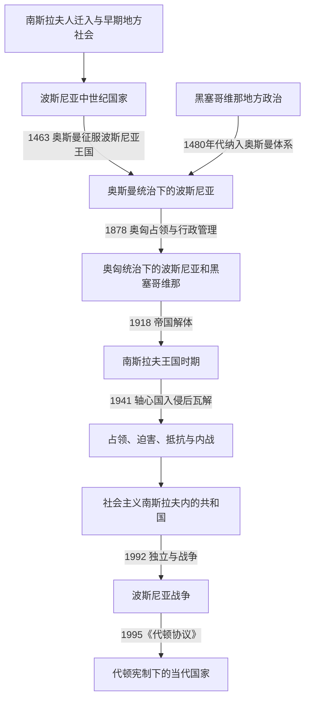

# 波斯尼亚和黑塞哥维那历史

## 概括

波斯尼亚和黑塞哥维那历史可按“中世纪波斯尼亚政治传统 → 奥斯曼征服与行省社会 → 奥匈占领、行政整合与民族政治 → 南斯拉夫王国和第二次世界大战 → 社会主义联邦共和国时期 → 独立、战争与代顿体系”来理解。现代国家的边界承接奥斯曼和奥匈时期形成的波斯尼亚—黑塞哥维那行政空间，但国家、地区、宗教共同体和现代民族身份并非始终重合。

## 历史阶段导航

| 顺序 | 阶段 | 时间 | 历史走向 |
|---:|---|---|---|
| 1 | [波斯尼亚中世纪国家](/%E4%BA%BA%E6%96%87%E7%A7%91%E5%AD%A6/%E5%8E%86%E5%8F%B2/%E6%AC%A7%E6%B4%B2/%E4%B8%9C%E5%8D%97%E6%AC%A7%E4%B8%8E%E5%B7%B4%E5%B0%94%E5%B9%B2/%E6%B3%A2%E6%96%AF%E5%B0%BC%E4%BA%9A%E5%92%8C%E9%BB%91%E5%A1%9E%E5%93%A5%E7%BB%B4%E9%82%A3/%E6%B3%A2%E6%96%AF%E5%B0%BC%E4%BA%9A%E4%B8%AD%E4%B8%96%E7%BA%AA%E5%9B%BD%E5%AE%B6.md) | 12世纪—1463年 | 波斯尼亚 Banate 与王国发展，在匈牙利、塞尔维亚、克罗地亚和亚得里亚海网络之间保持地方政治传统。 |
| 2 | [奥斯曼统治下的波斯尼亚](/%E4%BA%BA%E6%96%87%E7%A7%91%E5%AD%A6/%E5%8E%86%E5%8F%B2/%E6%AC%A7%E6%B4%B2/%E4%B8%9C%E5%8D%97%E6%AC%A7%E4%B8%8E%E5%B7%B4%E5%B0%94%E5%B9%B2/%E6%B3%A2%E6%96%AF%E5%B0%BC%E4%BA%9A%E5%92%8C%E9%BB%91%E5%A1%9E%E5%93%A5%E7%BB%B4%E9%82%A3/%E5%A5%A5%E6%96%AF%E6%9B%BC%E7%BB%9F%E6%B2%BB%E4%B8%8B%E7%9A%84%E6%B3%A2%E6%96%AF%E5%B0%BC%E4%BA%9A.md) | 1463年—1878年 | 征服、伊斯兰化、城市与行省建制重塑社会，宗教共同体并存。 |
| 3 | [奥匈统治下的波斯尼亚和黑塞哥维那](/%E4%BA%BA%E6%96%87%E7%A7%91%E5%AD%A6/%E5%8E%86%E5%8F%B2/%E6%AC%A7%E6%B4%B2/%E4%B8%9C%E5%8D%97%E6%AC%A7%E4%B8%8E%E5%B7%B4%E5%B0%94%E5%B9%B2/%E6%B3%A2%E6%96%AF%E5%B0%BC%E4%BA%9A%E5%92%8C%E9%BB%91%E5%A1%9E%E5%93%A5%E7%BB%B4%E9%82%A3/%E5%A5%A5%E5%8C%88%E7%BB%9F%E6%B2%BB%E4%B8%8B%E7%9A%84%E6%B3%A2%E6%96%AF%E5%B0%BC%E4%BA%9A%E5%92%8C%E9%BB%91%E5%A1%9E%E5%93%A5%E7%BB%B4%E9%82%A3.md) | 1878年—1918年 | 奥匈占领并于1908年吞并，推进行政、交通和教育建设，同时面对民族政治竞争。 |
| 4 | [南斯拉夫王国与第二次世界大战时期](/%E4%BA%BA%E6%96%87%E7%A7%91%E5%AD%A6/%E5%8E%86%E5%8F%B2/%E6%AC%A7%E6%B4%B2/%E4%B8%9C%E5%8D%97%E6%AC%A7%E4%B8%8E%E5%B7%B4%E5%B0%94%E5%B9%B2/%E6%B3%A2%E6%96%AF%E5%B0%BC%E4%BA%9A%E5%92%8C%E9%BB%91%E5%A1%9E%E5%93%A5%E7%BB%B4%E9%82%A3/%E5%8D%97%E6%96%AF%E6%8B%89%E5%A4%AB%E7%8E%8B%E5%9B%BD%E4%B8%8E%E7%AC%AC%E4%BA%8C%E6%AC%A1%E4%B8%96%E7%95%8C%E5%A4%A7%E6%88%98%E6%97%B6%E6%9C%9F.md) | 1918年—1945年 | 进入南斯拉夫王国，二战时遭占领并卷入大规模迫害、抵抗和内战。 |
| 5 | [社会主义南斯拉夫时期的波斯尼亚和黑塞哥维那](/%E4%BA%BA%E6%96%87%E7%A7%91%E5%AD%A6/%E5%8E%86%E5%8F%B2/%E6%AC%A7%E6%B4%B2/%E4%B8%9C%E5%8D%97%E6%AC%A7%E4%B8%8E%E5%B7%B4%E5%B0%94%E5%B9%B2/%E6%B3%A2%E6%96%AF%E5%B0%BC%E4%BA%9A%E5%92%8C%E9%BB%91%E5%A1%9E%E5%93%A5%E7%BB%B4%E9%82%A3/%E7%A4%BE%E4%BC%9A%E4%B8%BB%E4%B9%89%E5%8D%97%E6%96%AF%E6%8B%89%E5%A4%AB%E6%97%B6%E6%9C%9F%E7%9A%84%E6%B3%A2%E6%96%AF%E5%B0%BC%E4%BA%9A%E5%92%8C%E9%BB%91%E5%A1%9E%E5%93%A5%E7%BB%B4%E9%82%A3.md) | 1945年—1992年 | 成为六个共和国之一，工业化、城市化与多民族共和国制度同步发展。 |
| 6 | [独立、战争与代顿体系](/%E4%BA%BA%E6%96%87%E7%A7%91%E5%AD%A6/%E5%8E%86%E5%8F%B2/%E6%AC%A7%E6%B4%B2/%E4%B8%9C%E5%8D%97%E6%AC%A7%E4%B8%8E%E5%B7%B4%E5%B0%94%E5%B9%B2/%E6%B3%A2%E6%96%AF%E5%B0%BC%E4%BA%9A%E5%92%8C%E9%BB%91%E5%A1%9E%E5%93%A5%E7%BB%B4%E9%82%A3/%E7%8B%AC%E7%AB%8B%E3%80%81%E6%88%98%E4%BA%89%E4%B8%8E%E4%BB%A3%E9%A1%BF%E4%BD%93%E7%B3%BB.md) | 1992年至今 | 独立伴随战争和族群清洗；1995年后形成高度分权的代顿宪制。 |

## 与南斯拉夫共同主线的分工

本目录只维护波斯尼亚和黑塞哥维那的地区与国家视角。跨共和国共同进程由[南斯拉夫历史](/%E4%BA%BA%E6%96%87%E7%A7%91%E5%AD%A6/%E5%8E%86%E5%8F%B2/%E6%AC%A7%E6%B4%B2/%E4%B8%9C%E5%8D%97%E6%AC%A7%E4%B8%8E%E5%B7%B4%E5%B0%94%E5%B9%B2/%E5%8D%97%E6%96%AF%E6%8B%89%E5%A4%AB%E5%8E%86%E5%8F%B2/README.md)维护，尤其参见[南斯拉夫王国](/%E4%BA%BA%E6%96%87%E7%A7%91%E5%AD%A6/%E5%8E%86%E5%8F%B2/%E6%AC%A7%E6%B4%B2/%E4%B8%9C%E5%8D%97%E6%AC%A7%E4%B8%8E%E5%B7%B4%E5%B0%94%E5%B9%B2/%E5%8D%97%E6%96%AF%E6%8B%89%E5%A4%AB%E5%8E%86%E5%8F%B2/%E5%8D%97%E6%96%AF%E6%8B%89%E5%A4%AB%E7%8E%8B%E5%9B%BD.md)、[第二次世界大战时期的南斯拉夫](/%E4%BA%BA%E6%96%87%E7%A7%91%E5%AD%A6/%E5%8E%86%E5%8F%B2/%E6%AC%A7%E6%B4%B2/%E4%B8%9C%E5%8D%97%E6%AC%A7%E4%B8%8E%E5%B7%B4%E5%B0%94%E5%B9%B2/%E5%8D%97%E6%96%AF%E6%8B%89%E5%A4%AB%E5%8E%86%E5%8F%B2/%E7%AC%AC%E4%BA%8C%E6%AC%A1%E4%B8%96%E7%95%8C%E5%A4%A7%E6%88%98%E6%97%B6%E6%9C%9F%E7%9A%84%E5%8D%97%E6%96%AF%E6%8B%89%E5%A4%AB.md)、[南斯拉夫社会主义联邦共和国](/%E4%BA%BA%E6%96%87%E7%A7%91%E5%AD%A6/%E5%8E%86%E5%8F%B2/%E6%AC%A7%E6%B4%B2/%E4%B8%9C%E5%8D%97%E6%AC%A7%E4%B8%8E%E5%B7%B4%E5%B0%94%E5%B9%B2/%E5%8D%97%E6%96%AF%E6%8B%89%E5%A4%AB%E5%8E%86%E5%8F%B2/%E5%8D%97%E6%96%AF%E6%8B%89%E5%A4%AB%E7%A4%BE%E4%BC%9A%E4%B8%BB%E4%B9%89%E8%81%94%E9%82%A6%E5%85%B1%E5%92%8C%E5%9B%BD.md)和[南斯拉夫解体](/%E4%BA%BA%E6%96%87%E7%A7%91%E5%AD%A6/%E5%8E%86%E5%8F%B2/%E6%AC%A7%E6%B4%B2/%E4%B8%9C%E5%8D%97%E6%AC%A7%E4%B8%8E%E5%B7%B4%E5%B0%94%E5%B9%B2/%E5%8D%97%E6%96%AF%E6%8B%89%E5%A4%AB%E5%8E%86%E5%8F%B2/%E5%8D%97%E6%96%AF%E6%8B%89%E5%A4%AB%E8%A7%A3%E4%BD%93.md)。

## 重要转折与时间节点

| 时间 | 转折 | 意义 |
|---|---|---|
| 1180年以后 | 库林 Ban 统治 | 中世纪波斯尼亚地方政治趋于稳定。 |
| 1377年 | 特夫尔特科一世加冕为王 | 波斯尼亚王国进入强盛期。 |
| 1463年 | 奥斯曼征服波斯尼亚王国 | 波斯尼亚进入奥斯曼帝国体系。 |
| 1878年 | 柏林会议授权奥匈占领和管理 | 行政与经济制度转向中欧帝国体系。 |
| 1908年 | 奥匈正式吞并 | 国际危机与南斯拉夫民族政治加剧。 |
| 1914年 | 萨拉热窝刺杀事件 | 成为第一次世界大战爆发链条中的直接触发事件。 |
| 1943年 | 反法西斯机构确认共和国地位 | 战后波斯尼亚和黑塞哥维那联邦单位的制度基础形成。 |
| 1992年 | 宣布独立并爆发战争 | 南斯拉夫解体进入最严重的武装冲突阶段之一。 |
| 1995年 | 《代顿协议》 | 战争结束，建立现行高度分权的国家结构。 |

## 关键辨析

- **波斯尼亚、黑塞哥维那与现代国家不是同一层次**：二者是有历史差异的区域，现代国家把它们组合在同一政治框架中。
- **波斯尼亚人不等于波什尼亚克人**：“波斯尼亚人”可指地区或公民身份；“波什尼亚克人”是现代民族名称。
- **宗教共同体不能机械等同现代民族**：伊斯兰教、东正教、天主教与现代波什尼亚克、塞尔维亚、克罗地亚身份之间关系经历长期政治建构。
- **中世纪国家不是现代民族国家的无间断前身**：奥斯曼、奥匈和两代南斯拉夫制度都深刻改变人口、行政与身份。
- **代顿体系结束战争但没有消除政治分歧**：国家由复杂层级和权力分享机制构成，不能只用单一中央政府模型理解。

## 相关入口

- [东南欧与巴尔干历史](/%E4%BA%BA%E6%96%87%E7%A7%91%E5%AD%A6/%E5%8E%86%E5%8F%B2/%E6%AC%A7%E6%B4%B2/%E4%B8%9C%E5%8D%97%E6%AC%A7%E4%B8%8E%E5%B7%B4%E5%B0%94%E5%B9%B2/README.md)
- [克罗地亚历史](/%E4%BA%BA%E6%96%87%E7%A7%91%E5%AD%A6/%E5%8E%86%E5%8F%B2/%E6%AC%A7%E6%B4%B2/%E4%B8%9C%E5%8D%97%E6%AC%A7%E4%B8%8E%E5%B7%B4%E5%B0%94%E5%B9%B2/%E5%85%8B%E7%BD%97%E5%9C%B0%E4%BA%9A/README.md)
- [塞尔维亚历史](/%E4%BA%BA%E6%96%87%E7%A7%91%E5%AD%A6/%E5%8E%86%E5%8F%B2/%E6%AC%A7%E6%B4%B2/%E4%B8%9C%E5%8D%97%E6%AC%A7%E4%B8%8E%E5%B7%B4%E5%B0%94%E5%B9%B2/%E5%A1%9E%E5%B0%94%E7%BB%B4%E4%BA%9A/README.md)
