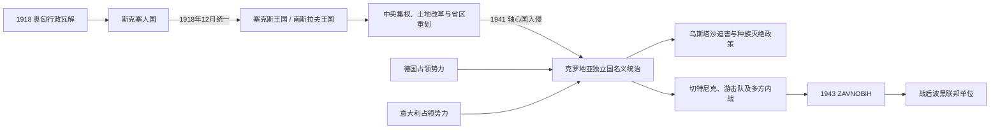

# 南斯拉夫王国与第二次世界大战时期

## 时间

1918—1945年；王国时期为1918—1941年，轴心国占领、附庸统治和解放战争为1941—1945年

## 概括

奥匈解体后，波斯尼亚和黑塞哥维那先由萨拉热窝民族委员会接管，进入短暂的斯洛文尼亚人、克罗地亚人和塞尔维亚人国，1918年12月并入塞尔维亚人、克罗地亚人和斯洛文尼亚人王国。中央集权、土地改革和行政重划逐步拆解波黑整体性。1941年轴心国侵略后，整个波黑名义上划入乌斯塔沙统治的“克罗地亚独立国”，实际又分属德国、意大利军事势力范围；乌斯塔沙种族灭绝政策、切特尼克针对穆斯林和克族平民的屠杀、占领军报复、游击队抵抗及各方内战交错。共产党领导的多民族游击队最终胜出，ZAVNOBiH在战争中重建波黑作为联邦单位的政治主体。

## 1918年的政权转换

1918年10月，奥匈在战争失败和民族委员会接管中瓦解。萨拉热窝的波黑民族委员会与斯克塞人国的萨格勒布中央机构相连；旧军政长官不再能有效指挥。12月1日，斯克塞人国与塞尔维亚王国统一，组成新王国。波黑没有作为独立国家签署这一统一，而是作为前奥匈领地的一部分进入。

战后初期同时存在治安真空、返乡军人、农民夺地和针对穆斯林地主及平民的暴力。贝尔格莱德政府以军警恢复秩序，并推行土地改革，取消大部分旧地主—佃农关系。改革缓解部分农民问题，却因执行、补偿和暴力环境而具有强烈族群政治后果。

## 王国时期的制度和政治

### 维持边界与中央集权

1921年《维多夫丹宪法》建立中央集权君主制。南斯拉夫穆斯林组织领袖穆罕默德·斯帕霍以议会支持换取宪法第135条等安排，使波黑在初期行政区划中大体维持历史外部边界，内部划为六个州。这不是波黑自治政府，地方仍受中央任命体系控制。

主要政治力量多按宗教—民族网络组织：南斯拉夫穆斯林组织争取土地补偿和波黑整体性；塞尔维亚激进党、民主党及后来的塞族组织支持不同程度中央主义；克罗地亚农民党推动克罗地亚政治自治；共产党在1921年后被禁，转入地下。

### 1929年独裁与领土拆分

1928年议会枪击造成克罗地亚农民党领袖斯捷潘·拉迪奇死亡，国家危机加剧。亚历山大一世于1929年1月6日废宪、解散议会并禁党，国名改为南斯拉夫王国。以河流命名的九个巴诺维纳刻意跨越历史边界，波黑被分入弗尔巴斯、德里纳、泽塔和滨海四区，失去单一行政范围。

1934年国王遇刺后，保罗亲王为首的摄政维持君主制。1939年茨韦特科维奇—马切克协议建立克罗地亚巴诺维纳，波黑北部、中部和黑塞哥维那若干县划入其中，其余地区未来归属未决。穆斯林政治人士提出建立统一“波斯尼亚巴诺维纳”，战争爆发前没有实现。

## 1941年的国家瓦解和占领结构

1941年3月王国加入三国同盟，贝尔格莱德政变后，德国及盟军于4月入侵，王国军队迅速崩溃。整个波黑被纳入“克罗地亚独立国”（NDH）宣称版图，但该政权是依赖德国、意大利的轴心国附庸：

| 层次 | 名义或实际权力 | 波黑境内作用 |
|---|---|---|
| NDH政权 | 安特·帕韦利奇领导的乌斯塔沙政府 | 设置大区和警察，实施种族法律、强制同化、驱逐、集中营和屠杀。 |
| 德国 | 军事、经济与安全机关 | 控制北部和战略交通，组织反游击行动，后期扩大直接军事存在。 |
| 意大利 | 1941—1943年南部军事区 | 在达尔马提亚—黑塞哥维那方向驻军，有时限制乌斯塔沙、也与切特尼克合作镇压游击队。 |
| 乌斯塔沙与地方编制 | NDH军队、警察、民兵 | 对塞族、犹太人、罗姆人和反对者实施系统迫害；把波黑穆斯林宣布为“克罗地亚人”但未消除其不安全。 |
| 切特尼克 | 以塞族君主主义为核心的多支武装 | 部分早期抗轴，许多部队后来与意军或轴心机关合作反共，并屠杀穆斯林、克族平民。 |
| 南斯拉夫游击队 | 共产党领导的多民族抵抗军 | 同时对抗占领军、NDH和切特尼克，逐步建立解放区和新政治机构。 |

## 迫害、暴力与社会选择

乌斯塔沙将塞族、犹太人和罗姆人列为种族—政治敌人，对塞族实施杀戮、驱逐和强制改宗，波黑大量犹太人被送入亚塞诺瓦茨等营地或德国灭绝体系。塞族平民是NDH暴力的最大受害群体之一。

切特尼克在东波斯尼亚、福查、维舍格勒等地对穆斯林与克族村庄实施大规模屠杀和驱逐，追求塞族控制区。部分穆斯林地方民兵和NDH部队也参与对塞族平民的暴力；游击队在革命战争、惩治“合作者”和战后清算中同样有未经正当程序的杀戮。具体责任必须按部队、地点和时间判断，不能以“所有人一样”抹平政策规模与组织结构。

1941年多座城市的穆斯林名流发布“穆斯林决议”，谴责乌斯塔沙暴行并要求安全。部分人加入NDH机关或德国组建的党卫军“汉德沙尔”师，另有越来越多人加入游击队。塞族、克族也在合作、被迫服役、民族主义武装与游击队之间分化；共同体不等同单一政治选择。

## 重要事件

| 时间 | 事件 | 过程与影响 |
|---|---|---|
| 1918年10—12月 | 民族委员会接管与南斯拉夫统一 | 奥匈统治结束；波黑经斯克塞人国进入统一王国。 |
| 1919—1921年 | 土地改革与制宪 | 旧土地关系被逐步取消；斯帕霍以议会交易维护波黑外部边界，但没有取得自治。 |
| 1929年 | 一月六日独裁 | 国王废宪禁党，波黑被拆入四个巴诺维纳，中央强制“南斯拉夫主义”失败。 |
| 1934年 | 亚历山大一世遇刺 | 摄政时期开始，中央集权与民族妥协问题仍未解决。 |
| 1939年 | 茨韦特科维奇—马切克协议 | 克罗地亚巴诺维纳取得波黑大片地区，波黑整体性和穆斯林政治地位再次成为争议。 |
| 4月1941年 | 轴心国入侵与NDH建立 | 王国军队瓦解；波黑名义归NDH、实际受德意军事体系制约。 |
| 1941年夏起 | 乌斯塔沙系统迫害与武装起义 | 对塞族、犹太人、罗姆人等的国家暴力引发逃亡和起义，抵抗很快分化为游击队与切特尼克。 |
| 1942年 | 科扎拉战役及报复 | 德国、NDH部队围剿游击区，大量平民被杀、拘押或送入营地。 |
| 1943年5—6月 | 苏捷斯卡战役 | 轴心军围剿游击队主力未能将其消灭，游击运动扩大政治影响。 |
| 25—26日11月1943年 | ZAVNOBiH第一次会议 | 在姆尔科尼奇格勒确认波黑既非塞族、克族或穆斯林任何一方的专属地，而是三者共同家园和联邦单位。 |
| 29—30日11月1943年 | AVNOJ第二次会议 | 在亚伊采确立联邦南斯拉夫和战后新政府框架，王室流亡政府被边缘化。 |
| 30日6月—2日7月1944年 | ZAVNOBiH第二次会议 | 自定为最高立法机关，并通过公民权利宣言；战争现实与后来的党国制度并未完全实现宣言自由。 |
| 1945年4—5月 | 解放与共产党接管 | 游击队控制全境，NDH和切特尼克体系瓦解；ZAVNOBiH转为人民议会，建立共和国政府。 |

## 王国崛起与崩溃原因

### 统一国家的支撑

- 一战后南斯拉夫统一理念、塞尔维亚王国的军政机构和协约国支持提供建国条件。
- 共同市场、铁路与军队把波黑纳入更大国家，部分精英把统一视为摆脱哈布斯堡统治的方案。
- 王室、中央官僚和军官集团能够在短期压制地方分离与社会动荡。

### 结构性衰落

- 宪法把塞尔维亚王国制度直接扩展为中央国家，未能在塞、克、斯、穆斯林及其他群体间建立稳定联邦契约。
- 选举操纵、禁共、警察压制和国王独裁削弱议会合法性。
- 土地和发展问题与民族代表权叠加；波黑被当作塞克妥协的可分割空间。
- 经济发展不均、世界经济危机和国际法西斯势力扩张加剧脆弱性。

### 外部压力与直接终结

轴心国在1941年4月同时从多方向入侵，王国军队指挥混乱、装备落后且部分部队拒战；克罗地亚民族危机和第五纵队加速瓦解。直接终结来自军事征服，但失败根植于长期宪制失衡。二战后的王国未恢复，则因游击队取得军事与政治优势、盟国转而承认其领导、王室政府失去国内基础。

## 演变关系

- 前一节点：[奥匈统治下的波斯尼亚和黑塞哥维那](/%E4%BA%BA%E6%96%87%E7%A7%91%E5%AD%A6/%E5%8E%86%E5%8F%B2/%E6%AC%A7%E6%B4%B2/%E4%B8%9C%E5%8D%97%E6%AC%A7%E4%B8%8E%E5%B7%B4%E5%B0%94%E5%B9%B2/%E6%B3%A2%E6%96%AF%E5%B0%BC%E4%BA%9A%E5%92%8C%E9%BB%91%E5%A1%9E%E5%93%A5%E7%BB%B4%E9%82%A3/%E5%A5%A5%E5%8C%88%E7%BB%9F%E6%B2%BB%E4%B8%8B%E7%9A%84%E6%B3%A2%E6%96%AF%E5%B0%BC%E4%BA%9A%E5%92%8C%E9%BB%91%E5%A1%9E%E5%93%A5%E7%BB%B4%E9%82%A3.md)
- 后一节点：[社会主义南斯拉夫时期的波斯尼亚和黑塞哥维那](/%E4%BA%BA%E6%96%87%E7%A7%91%E5%AD%A6/%E5%8E%86%E5%8F%B2/%E6%AC%A7%E6%B4%B2/%E4%B8%9C%E5%8D%97%E6%AC%A7%E4%B8%8E%E5%B7%B4%E5%B0%94%E5%B9%B2/%E6%B3%A2%E6%96%AF%E5%B0%BC%E4%BA%9A%E5%92%8C%E9%BB%91%E5%A1%9E%E5%93%A5%E7%BB%B4%E9%82%A3/%E7%A4%BE%E4%BC%9A%E4%B8%BB%E4%B9%89%E5%8D%97%E6%96%AF%E6%8B%89%E5%A4%AB%E6%97%B6%E6%9C%9F%E7%9A%84%E6%B3%A2%E6%96%AF%E5%B0%BC%E4%BA%9A%E5%92%8C%E9%BB%91%E5%A1%9E%E5%93%A5%E7%BB%B4%E9%82%A3.md)
- 共同主线：[南斯拉夫王国](/%E4%BA%BA%E6%96%87%E7%A7%91%E5%AD%A6/%E5%8E%86%E5%8F%B2/%E6%AC%A7%E6%B4%B2/%E4%B8%9C%E5%8D%97%E6%AC%A7%E4%B8%8E%E5%B7%B4%E5%B0%94%E5%B9%B2/%E5%8D%97%E6%96%AF%E6%8B%89%E5%A4%AB%E5%8E%86%E5%8F%B2/%E5%8D%97%E6%96%AF%E6%8B%89%E5%A4%AB%E7%8E%8B%E5%9B%BD.md)、[第二次世界大战时期的南斯拉夫](/%E4%BA%BA%E6%96%87%E7%A7%91%E5%AD%A6/%E5%8E%86%E5%8F%B2/%E6%AC%A7%E6%B4%B2/%E4%B8%9C%E5%8D%97%E6%AC%A7%E4%B8%8E%E5%B7%B4%E5%B0%94%E5%B9%B2/%E5%8D%97%E6%96%AF%E6%8B%89%E5%A4%AB%E5%8E%86%E5%8F%B2/%E7%AC%AC%E4%BA%8C%E6%AC%A1%E4%B8%96%E7%95%8C%E5%A4%A7%E6%88%98%E6%97%B6%E6%9C%9F%E7%9A%84%E5%8D%97%E6%96%AF%E6%8B%89%E5%A4%AB.md)
- 总览：[波斯尼亚和黑塞哥维那历史](/%E4%BA%BA%E6%96%87%E7%A7%91%E5%AD%A6/%E5%8E%86%E5%8F%B2/%E6%AC%A7%E6%B4%B2/%E4%B8%9C%E5%8D%97%E6%AC%A7%E4%B8%8E%E5%B7%B4%E5%B0%94%E5%B9%B2/%E6%B3%A2%E6%96%AF%E5%B0%BC%E4%BA%9A%E5%92%8C%E9%BB%91%E5%A1%9E%E5%93%A5%E7%BB%B4%E9%82%A3/README.md)
