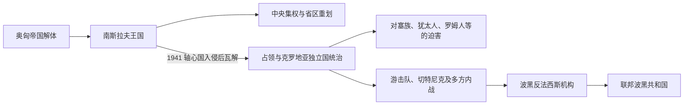

# 南斯拉夫王国与第二次世界大战时期

## 时间

1918年—1945年

## 概括

1918年以后，波斯尼亚和黑塞哥维那进入塞尔维亚人、克罗地亚人和斯洛文尼亚人王国，后改称南斯拉夫王国。旧波黑行政空间在中央集权和省区重划中被拆分。1941年轴心国入侵后，该地大部被划入克罗地亚独立国，种族迫害、抵抗运动和内战交织；反法西斯运动最终恢复波黑作为联邦单位的地位。

## 演进图

## 王国时期

- 1918年波黑进入新的南斯拉夫统一国家，土地改革、中央集权和民族代表权成为主要争议。
- 1929年后王国按河流命名的省区重划行政边界，波黑不再作为单一单位存在。
- 塞尔维亚、克罗地亚和穆斯林政治力量对国家制度、地方自治和土地问题持不同立场。

## 第二次世界大战

- 1941年轴心国瓜分南斯拉夫，波黑大部被纳入乌斯塔沙统治的克罗地亚独立国。
- 乌斯塔沙政权实施大规模迫害和屠杀；同时存在针对穆斯林、克罗地亚人和其他平民的报复暴力。
- 共产党领导的游击队、塞尔维亚民族主义切特尼克和各占领势力之间既抵抗又内战，地方选择随地区和时期变化。
- 1943年波黑反法西斯民族解放委员会确认波黑不是某一民族的专属领地，而是共同共和国；这一原则成为战后联邦地位基础。

## 演变关系

- 前一节点：[奥匈统治下的波斯尼亚和黑塞哥维那](/%E4%BA%BA%E6%96%87%E7%A7%91%E5%AD%A6/%E5%8E%86%E5%8F%B2/%E6%AC%A7%E6%B4%B2/%E4%B8%9C%E5%8D%97%E6%AC%A7%E4%B8%8E%E5%B7%B4%E5%B0%94%E5%B9%B2/%E6%B3%A2%E6%96%AF%E5%B0%BC%E4%BA%9A%E5%92%8C%E9%BB%91%E5%A1%9E%E5%93%A5%E7%BB%B4%E9%82%A3/%E5%A5%A5%E5%8C%88%E7%BB%9F%E6%B2%BB%E4%B8%8B%E7%9A%84%E6%B3%A2%E6%96%AF%E5%B0%BC%E4%BA%9A%E5%92%8C%E9%BB%91%E5%A1%9E%E5%93%A5%E7%BB%B4%E9%82%A3.md)
- 后一节点：[社会主义南斯拉夫时期的波斯尼亚和黑塞哥维那](/%E4%BA%BA%E6%96%87%E7%A7%91%E5%AD%A6/%E5%8E%86%E5%8F%B2/%E6%AC%A7%E6%B4%B2/%E4%B8%9C%E5%8D%97%E6%AC%A7%E4%B8%8E%E5%B7%B4%E5%B0%94%E5%B9%B2/%E6%B3%A2%E6%96%AF%E5%B0%BC%E4%BA%9A%E5%92%8C%E9%BB%91%E5%A1%9E%E5%93%A5%E7%BB%B4%E9%82%A3/%E7%A4%BE%E4%BC%9A%E4%B8%BB%E4%B9%89%E5%8D%97%E6%96%AF%E6%8B%89%E5%A4%AB%E6%97%B6%E6%9C%9F%E7%9A%84%E6%B3%A2%E6%96%AF%E5%B0%BC%E4%BA%9A%E5%92%8C%E9%BB%91%E5%A1%9E%E5%93%A5%E7%BB%B4%E9%82%A3.md)
- 共同主线：[南斯拉夫王国](/%E4%BA%BA%E6%96%87%E7%A7%91%E5%AD%A6/%E5%8E%86%E5%8F%B2/%E6%AC%A7%E6%B4%B2/%E4%B8%9C%E5%8D%97%E6%AC%A7%E4%B8%8E%E5%B7%B4%E5%B0%94%E5%B9%B2/%E5%8D%97%E6%96%AF%E6%8B%89%E5%A4%AB%E5%8E%86%E5%8F%B2/%E5%8D%97%E6%96%AF%E6%8B%89%E5%A4%AB%E7%8E%8B%E5%9B%BD.md)、[第二次世界大战时期的南斯拉夫](/%E4%BA%BA%E6%96%87%E7%A7%91%E5%AD%A6/%E5%8E%86%E5%8F%B2/%E6%AC%A7%E6%B4%B2/%E4%B8%9C%E5%8D%97%E6%AC%A7%E4%B8%8E%E5%B7%B4%E5%B0%94%E5%B9%B2/%E5%8D%97%E6%96%AF%E6%8B%89%E5%A4%AB%E5%8E%86%E5%8F%B2/%E7%AC%AC%E4%BA%8C%E6%AC%A1%E4%B8%96%E7%95%8C%E5%A4%A7%E6%88%98%E6%97%B6%E6%9C%9F%E7%9A%84%E5%8D%97%E6%96%AF%E6%8B%89%E5%A4%AB.md)
