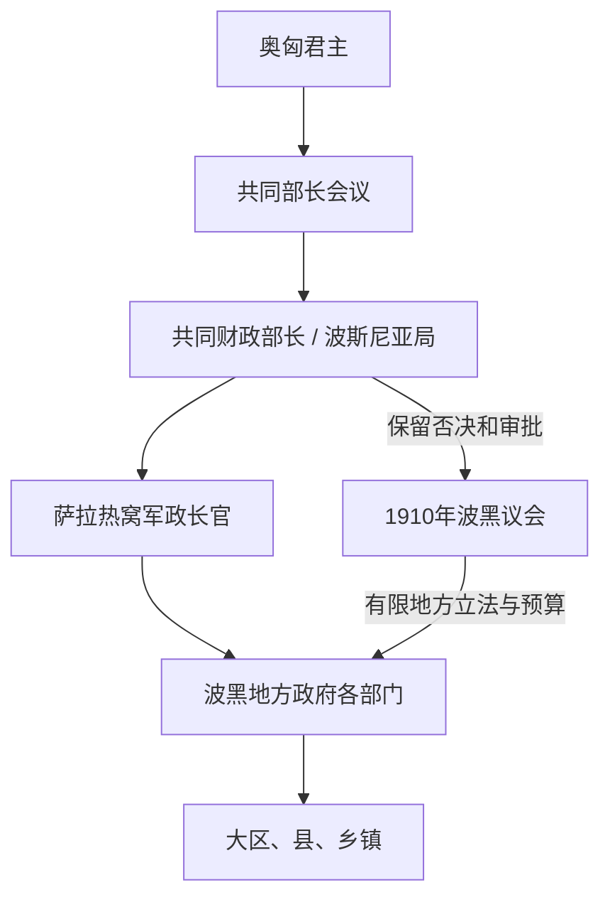

# 奥匈时期行政首脑表

## 时间

1878—1918年

## 概括

波黑的最高行政不是一条君主世系，而是三个层次：奥匈君主提供最高任命权；维也纳的共同财政部长自1879年起主管波黑民政；萨拉热窝的军政长官兼任地方政府首脑。1878—1908年奥斯曼保留名义主权，但不掌握这些实际行政职位。下表完整列出占领后至帝国解体前的地方军政长官，并列出对波黑负最高民政责任的共同财政部长。

## 地方军政长官完整表

| 顺序 | 姓名 | 任期 | 身份 / 与前任关系 | 关键事项 |
|---:|---|---|---|---|
| 1 | **约瑟普·菲利波维奇** | 13日7月—18日11月1878年 | 奥匈占领军司令；首任临时行政首脑 | 指挥军事占领并镇压地方抵抗，建立最初军政机关；完成主要战役后离任。 |
| 2 | 符腾堡的威廉·尼古拉 | 18日11月1878年—6日4月1881年 | 接管常态化地方政府的军政长官 | 将战时占领转为常设行政，推进治安、税务和官署接收。 |
| 3 | 赫尔曼·达伦·冯·奥拉堡 | 6日4月1881年—9日8月1882年 | 继任军政长官 | 任内推行征兵，引发1881—1882年黑塞哥维那起事；危机后更换。 |
| 4 | **约翰·冯·阿佩尔** | 9日8月1882年—8日12月1903年 | 卡莱时期长期军政长官 | 与共同财政部长卡莱配合，扩展官僚、铁路、警察与教育；任期最长。 |
| 5 | 欧根·冯·阿尔博里 | 8日12月1903年—25日6月1907年 | 阿佩尔继任者 | 卡莱去世后过渡至较宽松的社团和政党政治；仍维持军政合一。 |
| 6 | 安东·冯·温佐尔 | 30日6月1907年—7日3月1909年 | 阿尔博里继任者；跨越1908年吞并 | 在任时发生正式吞并和国际危机；法理从占领管理转为帝国共同领地。 |
| 7 | 马里扬·瓦雷沙宁 | 7日3月1909年—10日5月1911年 | 温佐尔继任者 | 主持1910年宪法和议会初期；1910年遭刺未遂，政治安全趋紧。 |
| 8 | **奥斯卡·波蒂奥雷克** | 10日5月1911年—22日12月1914年 | 瓦雷沙宁继任者；兼军队司令 | 负责皇储1914年访萨安全；刺杀后推动强硬路线，指挥对塞尔维亚战争失败后被撤。 |
| 9 | 斯捷潘·萨尔科蒂奇 | 22日12月1914年—3日11月1918年 | 波蒂奥雷克继任者；末任军政长官 | 战时扩大治安、征发和政治审判；1918年民族委员会接管后职权终止。 |

## 共同财政部长与波黑最高民政责任

共同财政部长从26日2月1879年起正式主管波黑行政。下表从实际占领时在任者列到帝国解体；短期代理和复任均单列。

| 顺序 | 姓名 | 任期 | 波黑治理意义 |
|---:|---|---|---|
| 1 | 利奥波德·弗里德里希·冯·霍夫曼 | 14日8月1876年—8日4月1880年 | 占领时在任；1879年起承担波黑共同民政责任，奠定共同财政部管理框架。 |
| 2 | 约瑟夫·斯拉维 | 8日4月1880年—4日6月1882年 | 面对征兵和行政改革引起的起事；任末转向更强硬集中治理。 |
| 3 | **本雅明·卡莱** | 4日6月1882年—13日7月1903年 | 直接主导二十一年“卡莱体制”，结合建设、警察控制和自上而下的波斯尼亚主义。 |
| 4 | 阿盖诺尔·戈乌霍夫斯基 | 14—24日7月1903年，代理 | 卡莱死后短期代管共同财政部。 |
| 5 | **伊什特万·布里安** | 24日7月1903年—12日2月1912年 | 放宽部分政治组织；处理1908年吞并、1910年宪法及议会运作。 |
| 6 | 莱昂·比林斯基 | 12日2月1912年—7日2月1915年 | 推动投资计划；任内发生刺杀、七月危机和一战初期军事统治。 |
| 7 | 恩斯特·冯·克尔伯 | 7日2月1915年—28日10月1916年 | 战时预算、征发与行政延续；民政空间受军方压缩。 |
| 8 | 伊什特万·布里安 | 28日10月—2日12月1916年，代理 | 克尔伯离职后短期复任代管。 |
| 9 | 康拉德·祖·霍恩洛厄-席林斯菲尔斯特 | 2—22日12月1916年 | 极短任期，反映卡尔一世即位后的高层重组。 |
| 10 | 伊什特万·布里安 | 22日12月1916年—7日9月1918年 | 再次主管；1918年4月起兼外相并代管共同财政部，面对帝国全面危机。 |
| 11 | 亚历山大·施皮茨米勒 | 7日9月—4日11月1918年 | 末任正式共同财政部长；任内波黑地方权力被民族委员会接收。 |
| — | 保罗·库-赫罗巴克 | 4日11月1918年起临时代管清算 | 帝国实际已瓦解，只负责共同财政部清算，不再对波黑实施有效统治。 |

## 权力关系与不能混同的职位

| 职位 | 任命 / 责任 | 是否波黑国家元首 |
|---|---|---|
| 奥匈皇帝兼匈牙利国王 | 任命共同部长和高级军政官；掌握战争与最高行政 | 是帝国君主，但波黑并无独立王位。 |
| 共同财政部长 | 对奥匈共同制度负责，主管波黑民政预算、法律和官员 | 否，是帝国行政首脑。 |
| 地方军政长官 | 由君主任命，兼驻军司令和萨拉热窝政府首脑 | 否，是地方行政与军事负责人。 |
| 波黑议会议长 | 1910年后主持有限代表机关 | 否，议会不掌握行政和主权。 |
| 奥斯曼苏丹 | 1878—1908年保留名义主权 | 在此阶段是法理宗主，但没有实际地方行政权。 |

## 任期交叉说明

- 共同财政部长负责政策审批，军政长官负责地方执行；两条任期线并行，不能串成一个单线“总督世系”。
- 阿佩尔与卡莱长期配合，是1882—1903年行政连续性的核心；之后首脑更换加快。
- 温佐尔任期跨越1908年吞并，说明法理改变不等于地方官署立刻重建。
- 1910年议会没有产生对议会负责的首相，故不另造“波黑政府首脑”序列。
- 1918年萨尔科蒂奇失去实际控制在先，帝国共同部门清算在后；11月的清算官不属于波黑统治者。

## 相关笔记

- 制度与过程：[奥匈统治下的波斯尼亚和黑塞哥维那](/%E4%BA%BA%E6%96%87%E7%A7%91%E5%AD%A6/%E5%8E%86%E5%8F%B2/%E6%AC%A7%E6%B4%B2/%E4%B8%9C%E5%8D%97%E6%AC%A7%E4%B8%8E%E5%B7%B4%E5%B0%94%E5%B9%B2/%E6%B3%A2%E6%96%AF%E5%B0%BC%E4%BA%9A%E5%92%8C%E9%BB%91%E5%A1%9E%E5%93%A5%E7%BB%B4%E9%82%A3/%E5%A5%A5%E5%8C%88%E7%BB%9F%E6%B2%BB%E4%B8%8B%E7%9A%84%E6%B3%A2%E6%96%AF%E5%B0%BC%E4%BA%9A%E5%92%8C%E9%BB%91%E5%A1%9E%E5%93%A5%E7%BB%B4%E9%82%A3.md)
- 前期：[奥斯曼统治下的波斯尼亚](/%E4%BA%BA%E6%96%87%E7%A7%91%E5%AD%A6/%E5%8E%86%E5%8F%B2/%E6%AC%A7%E6%B4%B2/%E4%B8%9C%E5%8D%97%E6%AC%A7%E4%B8%8E%E5%B7%B4%E5%B0%94%E5%B9%B2/%E6%B3%A2%E6%96%AF%E5%B0%BC%E4%BA%9A%E5%92%8C%E9%BB%91%E5%A1%9E%E5%93%A5%E7%BB%B4%E9%82%A3/%E5%A5%A5%E6%96%AF%E6%9B%BC%E7%BB%9F%E6%B2%BB%E4%B8%8B%E7%9A%84%E6%B3%A2%E6%96%AF%E5%B0%BC%E4%BA%9A.md)
- 后期：[南斯拉夫王国与第二次世界大战时期](/%E4%BA%BA%E6%96%87%E7%A7%91%E5%AD%A6/%E5%8E%86%E5%8F%B2/%E6%AC%A7%E6%B4%B2/%E4%B8%9C%E5%8D%97%E6%AC%A7%E4%B8%8E%E5%B7%B4%E5%B0%94%E5%B9%B2/%E6%B3%A2%E6%96%AF%E5%B0%BC%E4%BA%9A%E5%92%8C%E9%BB%91%E5%A1%9E%E5%93%A5%E7%BB%B4%E9%82%A3/%E5%8D%97%E6%96%AF%E6%8B%89%E5%A4%AB%E7%8E%8B%E5%9B%BD%E4%B8%8E%E7%AC%AC%E4%BA%8C%E6%AC%A1%E4%B8%96%E7%95%8C%E5%A4%A7%E6%88%98%E6%97%B6%E6%9C%9F.md)
- 总览：[波斯尼亚和黑塞哥维那历史](/%E4%BA%BA%E6%96%87%E7%A7%91%E5%AD%A6/%E5%8E%86%E5%8F%B2/%E6%AC%A7%E6%B4%B2/%E4%B8%9C%E5%8D%97%E6%AC%A7%E4%B8%8E%E5%B7%B4%E5%B0%94%E5%B9%B2/%E6%B3%A2%E6%96%AF%E5%B0%BC%E4%BA%9A%E5%92%8C%E9%BB%91%E5%A1%9E%E5%93%A5%E7%BB%B4%E9%82%A3/README.md)
