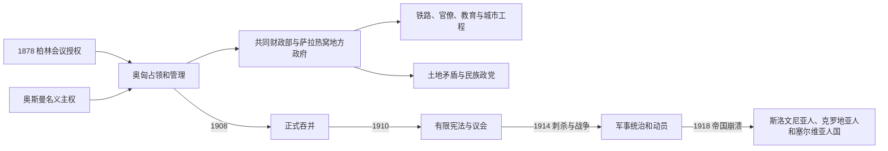

# 奥匈统治下的波斯尼亚和黑塞哥维那

## 时间

1878—1918年；1878—1908年为奥匈实际占领管理、奥斯曼保留名义主权，1908—1918年为正式吞并

## 概括

奥匈把波斯尼亚和黑塞哥维那置于共同财政部而非奥地利或匈牙利任何一方之下，以军政长官和萨拉热窝地方政府实施统治。道路、窄轨铁路、学校、医院、统计、地籍和城市工程显著扩张，但预算自给、治安监控、外来官僚和未彻底解决的土地关系使这种“现代化”带有明显帝国控制性质。1908年吞并、1910年有限宪政和1914年刺杀事件把本地民族政治与欧洲大国危机连接起来；一战军事统治、征发、饥荒和帝国崩溃在1918年直接结束该制度。

## 占领过程与法理地位

1878年《柏林条约》第25条准许奥匈“占领和管理”波斯尼亚和黑塞哥维那，同时允许其在新帕扎尔桑贾克驻军。奥斯曼的名义主权仍在，因此1878—1908年不能简写为领土已经法理割让。

奥匈原以为接管只是警务行动，却遭萨拉热窝、图兹拉、莫斯塔尔等地武装抵抗。约20万占领军分路推进，经过数月战斗才控制主要城市；抵抗的核心包括不愿失去政治地位的穆斯林军人与市民，也有其他反占领者，不能归结为单一民族运动。

1879年奥匈与奥斯曼签订协定，进一步确认行政安排。共同财政部在维也纳设置波斯尼亚事务部门，萨拉热窝地方政府由兼任驻军司令的军政长官领导。波黑由奥地利、匈牙利共同统治，既非奥地利王国，也非匈牙利圣冠领。

## 行政与经济建设

### 官僚和法制

新政权大体保留奥斯曼末期六个大区的框架，改用县、区和乡镇官署，并建立地籍、人口登记、警察、法院与专业部门。伊斯兰教法庭继续处理穆斯林婚姻继承，宗教共同体的学校、基金和等级组织受到国家监督。官僚多来自帝国其他地区，语言、资格与忠诚审查成为地方人进入高级职位的门槛。

### 交通、财政与产业

窄轨铁路首先服务驻军与资源运输，随后连接萨拉热窝、莫斯塔尔、布罗德、图兹拉和边境。道路、邮电、供水、医院、政府建筑与现代市政改变城市面貌。煤、盐、木材、烟草、钢铁和林业获得投资，萨拉热窝、泽尼察、图兹拉等地形成新的工人群体。

当局要求波黑财政尽量自给，通过烟草专卖、间接税、森林和矿业收入维持行政。工业增长确实存在，却也把原料和市场纳入帝国经济；城乡、地区和共同体之间收益不均。

### 土地问题

奥匈没有立即废除奥斯曼时代的地主—佃农关系，担心强制土地改革疏远穆斯林土地所有者并破坏秩序。政府鼓励佃农以贷款赎买，但进展缓慢。多数佃农为东正教徒，也有天主教徒和穆斯林；土地矛盾与民族政治相互叠加，却不能简单视为纯民族冲突。

## 卡莱时期与“波斯尼亚主义”

1882年抵抗征兵和行政的起事被镇压后，共同财政部长本雅明·卡莱掌握近乎最高民政权至1903年。他试图培养超越塞族、克族和穆斯林宗教界线的“波斯尼亚”政治忠诚，同时限制塞尔维亚与克罗地亚民族组织、新闻和学校网络。

这一政策依托考古、博物馆、教育和符号建构，也有抑制邻国民族主义的帝国目的。它没有消除共同体政治：东正教团体争取教会学校自治，穆斯林精英反对宗教基金与教育受控，天主教层级及克罗地亚政治网络扩张。1903年后当局允许更多政党和社团活动。

## 吞并、宪政与民族政治

1908年青年土耳其革命使伊斯坦布尔可能重开波黑代表权问题，奥匈遂正式吞并。奥斯曼经谈判承认并获赔偿，塞尔维亚、俄罗斯等反对者最终被迫接受，吞并危机加剧列强对抗。

1910年宪法建立波黑议会，议席按宗教—社会等级分配，并设有限选举。议会可处理部分地方立法和预算，却无权决定军队、外交、关税及帝国共同事务；军政长官和共同财政部长仍能控制政府。穆斯林民族组织、塞族人民组织、克族政党和社会民主力量进入合法政治，同时青年南斯拉夫主义与革命民族主义在学生中传播。

## 重要事件

| 时间 | 事件 | 过程与结果 |
|---|---|---|
| 1878年7—10月 | 奥匈武装占领 | 遭到超出预期的地方抵抗；占领军控制主要城市后建立军政政府。 |
| 1879年 | 奥奥协定 | 奥斯曼保留名义主权，奥匈掌握实际行政和驻军，确立双重法理。 |
| 1881—1882年 | 征兵法与黑塞哥维那起事 | 东正教与穆斯林武装共同反对征兵和新行政；镇压后卡莱展开长期集权统治。 |
| 1882—1903年 | 卡莱治理 | 推进铁路、官僚、教育和“波斯尼亚主义”，同时严密限制民族政治和新闻。 |
| 1885年 | 波斯尼亚和黑塞哥维那国家博物馆筹设 | 以学术、文物和帝国知识体系建构地方身份，1888年正式开放。 |
| 1890年代 | 宗教教育自治运动 | 塞族教会学校与穆斯林瓦克夫—教育自治诉求扩大，迫使当局与组织化精英谈判。 |
| 1906年 | 萨拉热窝烟草厂罢工及政党合法化 | 工人政治进入公共空间；穆斯林、塞族、克族组织逐步形成现代政党。 |
| 1908年10月 | 正式吞并 | 奥斯曼名义主权终结，引发国际危机并强化塞尔维亚与南斯拉夫民族主义。 |
| 1910年 | 宪法与波黑议会 | 建立有限代表制度，但行政首脑不对议会负责，帝国共同事务不在其权限内。 |
| 28日6月1914年 | 萨拉热窝刺杀 | 青年波斯尼亚成员加夫里洛·普林齐普刺杀皇储斐迪南夫妇；奥匈对塞尔维亚最后通牒触发七月危机。 |
| 1914—1918年 | 战时动员与镇压 | 波黑士兵在奥匈军中作战；当局拘禁和处置被视为不忠的塞族平民，征发和粮荒冲击全社会。 |
| 1917—1918年 | 南斯拉夫统一方案竞争 | 流亡委员会、南斯拉夫议员团和地方民族委员会分别提出未来制度；帝国失败使统一方案取得现实基础。 |
| 1918年10—11月 | 帝国行政瓦解 | 萨拉热窝民族委员会接管权力，波黑加入斯洛文尼亚人、克罗地亚人和塞尔维亚人国，继而进入塞克斯王国。 |

## 统治结构

| 层次 | 机构 | 实际权限 |
|---|---|---|
| 皇帝与共同事务 | 奥匈君主、共同部长会议 | 决定最高政治、任命和战争；奥地利与匈牙利两政府共同制衡。 |
| 波黑最高民政 | 共同财政部长及其波斯尼亚局 | 审批地方预算、法律、官员和发展政策，是实际最高行政枢纽。 |
| 地方军政 | 萨拉热窝地方政府、军政长官 / Landeschef | 同时负责驻军与行政，以下设内政、财政、司法、建设、教育等部门。 |
| 1910年议会 | 波黑议会和选民团 | 可讨论有限地方事务；不掌握行政问责、军队、外交和关税。 |
| 宗教共同体 | 伊斯兰、东正教、天主教、犹太组织 | 管理部分宗教、慈善、学校和身份事务，但均接受帝国监管。 |
| 政党与社团 | 民族组织、社会民主党、青年团体 | 代表土地、宗教自治、民族和阶级诉求；合法空间与警察监控并存。 |

完整军政长官与共同财政部长名单见[奥匈时期行政首脑表](/%E4%BA%BA%E6%96%87%E7%A7%91%E5%AD%A6/%E5%8E%86%E5%8F%B2/%E6%AC%A7%E6%B4%B2/%E4%B8%9C%E5%8D%97%E6%AC%A7%E4%B8%8E%E5%B7%B4%E5%B0%94%E5%B9%B2/%E6%B3%A2%E6%96%AF%E5%B0%BC%E4%BA%9A%E5%92%8C%E9%BB%91%E5%A1%9E%E5%93%A5%E7%BB%B4%E9%82%A3/%E5%A5%A5%E5%8C%88%E6%97%B6%E6%9C%9F%E8%A1%8C%E6%94%BF%E9%A6%96%E8%84%91%E8%A1%A8.md)。

## 现代化的条件与统治终结

### 建设得以推进的条件

- 共同财政部能够跨越奥地利—匈牙利内部边界集中规划波黑。
- 军事战略需要推动铁路、道路、通信、测绘和公共卫生投资。
- 烟草、森林、矿产和关税为预算提供相对稳定收入。
- 原有奥斯曼官署、商人和宗教机构被选择性保留，使接管不必从零开始。

### 结构性限制

- 波黑缺乏对最高行政负责的政府，1910年议会也不能控制核心权力。
- 土地改革缓慢，乡村贫困和地主—佃农矛盾持续。
- “波斯尼亚主义”由帝国自上而下推行，难以取代已制度化的宗教和民族网络。
- 经济强调资源、军运和预算自给，发展成果区域分配不均。

### 外部压力与直接终结

塞尔维亚崛起、俄奥竞争、南斯拉夫主义和欧洲联盟对抗使波黑成为安全前沿。刺杀触发七月危机后，战争军事化扩大镇压和征发；到1918年，前线失败、粮食短缺、军队瓦解和各民族委员会接管同时发生。地方政权的直接终结来自奥匈整体崩溃，而非波黑议会通过独立程序。

## 演变关系

- 前一节点：[奥斯曼统治下的波斯尼亚](/%E4%BA%BA%E6%96%87%E7%A7%91%E5%AD%A6/%E5%8E%86%E5%8F%B2/%E6%AC%A7%E6%B4%B2/%E4%B8%9C%E5%8D%97%E6%AC%A7%E4%B8%8E%E5%B7%B4%E5%B0%94%E5%B9%B2/%E6%B3%A2%E6%96%AF%E5%B0%BC%E4%BA%9A%E5%92%8C%E9%BB%91%E5%A1%9E%E5%93%A5%E7%BB%B4%E9%82%A3/%E5%A5%A5%E6%96%AF%E6%9B%BC%E7%BB%9F%E6%B2%BB%E4%B8%8B%E7%9A%84%E6%B3%A2%E6%96%AF%E5%B0%BC%E4%BA%9A.md)
- 后一节点：[南斯拉夫王国与第二次世界大战时期](/%E4%BA%BA%E6%96%87%E7%A7%91%E5%AD%A6/%E5%8E%86%E5%8F%B2/%E6%AC%A7%E6%B4%B2/%E4%B8%9C%E5%8D%97%E6%AC%A7%E4%B8%8E%E5%B7%B4%E5%B0%94%E5%B9%B2/%E6%B3%A2%E6%96%AF%E5%B0%BC%E4%BA%9A%E5%92%8C%E9%BB%91%E5%A1%9E%E5%93%A5%E7%BB%B4%E9%82%A3/%E5%8D%97%E6%96%AF%E6%8B%89%E5%A4%AB%E7%8E%8B%E5%9B%BD%E4%B8%8E%E7%AC%AC%E4%BA%8C%E6%AC%A1%E4%B8%96%E7%95%8C%E5%A4%A7%E6%88%98%E6%97%B6%E6%9C%9F.md)
- 总览：[波斯尼亚和黑塞哥维那历史](/%E4%BA%BA%E6%96%87%E7%A7%91%E5%AD%A6/%E5%8E%86%E5%8F%B2/%E6%AC%A7%E6%B4%B2/%E4%B8%9C%E5%8D%97%E6%AC%A7%E4%B8%8E%E5%B7%B4%E5%B0%94%E5%B9%B2/%E6%B3%A2%E6%96%AF%E5%B0%BC%E4%BA%9A%E5%92%8C%E9%BB%91%E5%A1%9E%E5%93%A5%E7%BB%B4%E9%82%A3/README.md)
