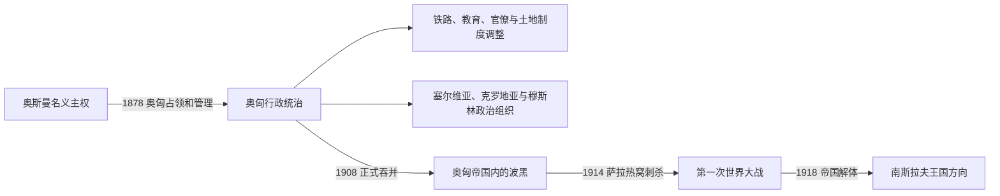

# 奥匈统治下的波斯尼亚和黑塞哥维那

## 时间

1878年—1918年；1908年以前由奥匈占领和管理，1908年后正式吞并

## 概括

奥匈帝国在1878年占领波斯尼亚和黑塞哥维那，试图以统一行政、基础设施与跨宗教的地方认同稳定这一前奥斯曼边疆。现代化建设与殖民式管控并存，塞尔维亚、克罗地亚和穆斯林政治组织逐渐发展；1908年吞并及1914年萨拉热窝刺杀又把该地置于欧洲帝国竞争中心。

## 演进图

## 说明

- 奥匈保留部分奥斯曼土地和宗教制度，同时建设铁路、道路、学校、城市公共设施及现代官僚机构。
- 帝国当局尝试培育跨宗教的“波斯尼亚”忠诚，但塞尔维亚、克罗地亚与穆斯林社团各自形成政党、教育和文化网络。
- 农业人口、土地关系和移民问题并未因行政现代化消失；发展在城乡与地区间很不均衡。
- 1908年正式吞并引发国际危机，也加深南斯拉夫主义和反帝国政治。
- 1914年加夫里洛·普林齐普在萨拉热窝刺杀奥匈皇储斐迪南大公，事件成为一战爆发链条中的直接触发点；不能把大战原因缩减为单一刺杀。

## 统治结构

| 层次 | 机构 / 力量 | 说明 |
|---|---|---|
| 帝国共同管理 | 奥地利与匈牙利共同财政部门 | 波黑不直接归奥地利或匈牙利一方，而由共同机构管理。 |
| 地方行政 | 行政长官、官僚与警察体系 | 统一此前不同地区的治理并强化国家控制。 |
| 宗教共同体 | 伊斯兰、东正教、天主教、犹太社群 | 保有组织与教育空间，同时受到帝国监管。 |
| 政治团体 | 塞族、克族、穆斯林政党及南斯拉夫青年运动 | 代表不同社会与国家想象。 |

## 演变关系

- 前一节点：[奥斯曼统治下的波斯尼亚](/%E4%BA%BA%E6%96%87%E7%A7%91%E5%AD%A6/%E5%8E%86%E5%8F%B2/%E6%AC%A7%E6%B4%B2/%E4%B8%9C%E5%8D%97%E6%AC%A7%E4%B8%8E%E5%B7%B4%E5%B0%94%E5%B9%B2/%E6%B3%A2%E6%96%AF%E5%B0%BC%E4%BA%9A%E5%92%8C%E9%BB%91%E5%A1%9E%E5%93%A5%E7%BB%B4%E9%82%A3/%E5%A5%A5%E6%96%AF%E6%9B%BC%E7%BB%9F%E6%B2%BB%E4%B8%8B%E7%9A%84%E6%B3%A2%E6%96%AF%E5%B0%BC%E4%BA%9A.md)
- 后一节点：[南斯拉夫王国与第二次世界大战时期](/%E4%BA%BA%E6%96%87%E7%A7%91%E5%AD%A6/%E5%8E%86%E5%8F%B2/%E6%AC%A7%E6%B4%B2/%E4%B8%9C%E5%8D%97%E6%AC%A7%E4%B8%8E%E5%B7%B4%E5%B0%94%E5%B9%B2/%E6%B3%A2%E6%96%AF%E5%B0%BC%E4%BA%9A%E5%92%8C%E9%BB%91%E5%A1%9E%E5%93%A5%E7%BB%B4%E9%82%A3/%E5%8D%97%E6%96%AF%E6%8B%89%E5%A4%AB%E7%8E%8B%E5%9B%BD%E4%B8%8E%E7%AC%AC%E4%BA%8C%E6%AC%A1%E4%B8%96%E7%95%8C%E5%A4%A7%E6%88%98%E6%97%B6%E6%9C%9F.md)
- 跨区域背景：[奥斯曼—哈布斯堡分治与民族运动](/%E4%BA%BA%E6%96%87%E7%A7%91%E5%AD%A6/%E5%8E%86%E5%8F%B2/%E6%AC%A7%E6%B4%B2/%E4%B8%9C%E5%8D%97%E6%AC%A7%E4%B8%8E%E5%B7%B4%E5%B0%94%E5%B9%B2/%E5%8D%97%E6%96%AF%E6%8B%89%E5%A4%AB%E5%8E%86%E5%8F%B2/%E5%A5%A5%E6%96%AF%E6%9B%BC%E2%80%94%E5%93%88%E5%B8%83%E6%96%AF%E5%A0%A1%E5%88%86%E6%B2%BB%E4%B8%8E%E6%B0%91%E6%97%8F%E8%BF%90%E5%8A%A8.md)
