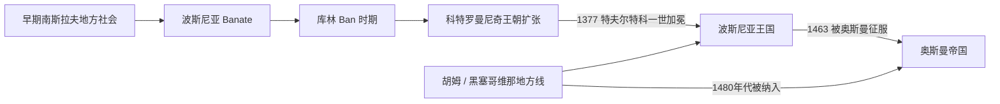

# 波斯尼亚中世纪国家

## 时间

约12世纪—1463年；黑塞哥维那部分地方政权延续至1480年代

## 概括

波斯尼亚中世纪国家位于巴尔干西部山区，是南斯拉夫历史中连接塞尔维亚、克罗地亚、匈牙利与亚得里亚海网络的重要区域。波斯尼亚先形成 Banate，14世纪后期发展为王国；它具有相对独立的地方政治传统，宗教生活同时受到天主教、东正教与本地波斯尼亚教会影响。

## 演进图

## 政治发展

- 12世纪以后，波斯尼亚 Ban 在匈牙利宗主权主张、拜占庭影响和地方贵族之间争取实际自主。
- 库林 Ban 时期贸易和地方统治趋于稳定，波斯尼亚与杜布罗夫尼克等亚得里亚海城市保持往来。
- 科特罗曼尼奇家族扩张领土；特夫尔特科一世于1377年加冕为王，王国一度控制波斯尼亚、达尔马提亚与塞尔维亚邻近地区。
- 王位继承、贵族割据、匈牙利干预和奥斯曼压力削弱王国。1463年奥斯曼征服波斯尼亚王国，黑塞哥维那部分地方势力稍后也被纳入。

## 统治结构与代表人物

| 类型 | 人物 / 机构 | 时间 | 说明 |
|---|---|---|---|
| Ban | 库林 | 1180—1204年 | 稳定地方统治并发展对外贸易。 |
| 王朝 | 科特罗曼尼奇家族 | 13—15世纪 | 从 Banate 发展到王国的核心家族。 |
| 国王 | **特夫尔特科一世** | 1353—1391年；1377年称王 | 推动王国扩张，是中世纪波斯尼亚强盛期代表。 |
| 地方贵族 | 科萨查等家族 | 14—15世纪 | 掌握大片领地；“黑塞哥维那”名称与“赫尔采格”称号有关。 |
| 末代国王 | 斯捷潘·托马舍维奇 | 1461—1463年 | 奥斯曼征服时被俘杀，王国终结。 |

## 宗教与身份辨析

- 波斯尼亚教会的性质、教义与社会影响长期存在争论，不能简单等同某一种异端或现代宗教共同体。
- 天主教、东正教和地方教会传统并存，政治效忠与宗教归属也并非完全一致。
- 中世纪“波斯尼亚人”首先是地区与政治身份，不能直接套用19—20世纪民族分类。

## 演变关系

- 前一节点：[早期南斯拉夫人](/%E4%BA%BA%E6%96%87%E7%A7%91%E5%AD%A6/%E5%8E%86%E5%8F%B2/%E6%AC%A7%E6%B4%B2/%E4%B8%9C%E5%8D%97%E6%AC%A7%E4%B8%8E%E5%B7%B4%E5%B0%94%E5%B9%B2/%E5%8D%97%E6%96%AF%E6%8B%89%E5%A4%AB%E5%8E%86%E5%8F%B2/%E6%97%A9%E6%9C%9F%E5%8D%97%E6%96%AF%E6%8B%89%E5%A4%AB%E4%BA%BA.md)
- 后一节点：[奥斯曼统治下的波斯尼亚](/%E4%BA%BA%E6%96%87%E7%A7%91%E5%AD%A6/%E5%8E%86%E5%8F%B2/%E6%AC%A7%E6%B4%B2/%E4%B8%9C%E5%8D%97%E6%AC%A7%E4%B8%8E%E5%B7%B4%E5%B0%94%E5%B9%B2/%E6%B3%A2%E6%96%AF%E5%B0%BC%E4%BA%9A%E5%92%8C%E9%BB%91%E5%A1%9E%E5%93%A5%E7%BB%B4%E9%82%A3/%E5%A5%A5%E6%96%AF%E6%9B%BC%E7%BB%9F%E6%B2%BB%E4%B8%8B%E7%9A%84%E6%B3%A2%E6%96%AF%E5%B0%BC%E4%BA%9A.md)
- 共同背景：[南斯拉夫历史](/%E4%BA%BA%E6%96%87%E7%A7%91%E5%AD%A6/%E5%8E%86%E5%8F%B2/%E6%AC%A7%E6%B4%B2/%E4%B8%9C%E5%8D%97%E6%AC%A7%E4%B8%8E%E5%B7%B4%E5%B0%94%E5%B9%B2/%E5%8D%97%E6%96%AF%E6%8B%89%E5%A4%AB%E5%8E%86%E5%8F%B2/README.md)
