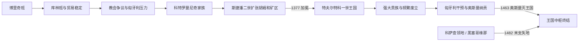

# 波斯尼亚中世纪国家

## 时间

约12世纪中叶—1463年；黑塞哥维那地方政治余脉延续至1482年

## 概括

中世纪波斯尼亚从名义上处于匈牙利王权势力范围的班国发展为事实自主的政治共同体，并在科特罗曼尼奇家族统治下扩张为王国。其力量来自山地防御、矿产和杜布罗夫尼克贸易、王室婚姻外交及邻国权力真空；弱点则是没有固定长子继承制、领主会议能够废立君主、地方大贵族拥有独立外交与军力。奥斯曼并非在一个瞬间取代完整国家，而是利用数十年内战、纳贡关系和对立王，最终在1463年摧毁王国中枢，再逐步吞并北部要塞与科萨查领地。

## 建立背景

- 早期中世纪的“波斯尼亚”首先指波斯纳河上游的一片区域，先后受到塞尔维亚、克罗地亚、拜占庭和匈牙利政治影响；11世纪以前的统治者谱系零散，不能拼成可靠王朝表。
- 12世纪中叶，博里奇以“波斯尼亚班”身份进入同时代记录；“班”既反映地方统治权，也暗示匈牙利王室所主张的宗主关系。
- 拜占庭皇帝曼努埃尔一世去世后，巴尔干力量重新分配。约1180年起，库林班在匈牙利、塞尔维亚和杜布罗夫尼克之间维持较大自主。
- 1189年库林特许状保障杜布罗夫尼克商人活动，显示波斯尼亚已有宫廷、书记和可执行的贸易秩序。矿山、牲畜、蜡和金属贸易后来成为王权扩张的财政基础。

## 分阶段发展

### 班国的稳定与宗教政治

库林时期的稳定使波斯尼亚成为地区贸易节点。罗马教廷和匈牙利统治者把本地基督教礼仪与组织视为异端问题；1203年比利诺波列会议后，一批教士承诺遵循罗马教会规范，但宗教争议没有结束。1230年代匈牙利支持的十字军远征及教区重组反而强化地方抵抗，马泰·尼诺斯拉夫在战争与谈判间保存班权。

“波斯尼亚教会”究竟在教义上与鲍格米勒派有多大关系，学界存在争议。可以确认的是，它有自己的教士等级并与部分贵族和王室保持联系；同时方济各会天主教、东部地区的东正教及沿海天主教网络也持续存在。

### 科特罗曼尼奇崛起

普里耶兹达一世以后，科特罗曼尼奇家族成为核心王族。13世纪末克罗地亚的舒比奇家族一度控制班位；1322年舒比奇势力失败后，斯捷潘二世恢复实际统治。他利用匈牙利支持、塞尔维亚帝国扩张与沿海领主竞争，取得胡姆、乌索拉、索利和矿区，并以婚姻把王室接入匈牙利王族网络。

斯捷潘二世的崛起机制包括：控制银矿与关税以支付军队和宫廷；向杜布罗夫尼克商人提供特许；在不同宗教与外部势力之间保持弹性；把亲族安排进地方统治。这使继承人特夫尔特科获得比早期班更大的资源基础。

### 王国建立与鼎盛

特夫尔特科一世1353年继班位，早期受匈牙利国王路易一世和国内贵族限制，1366—1367年还曾被废逐，复位后才逐步集权。塞尔维亚尼曼雅王朝绝嗣后，他凭母系血缘与占领的塞尔维亚西部领土，于1377年加冕为“塞尔维亚人、波斯尼亚及沿海之王”等复合头衔的君主。

1380年代，王国控制波斯尼亚核心、胡姆、德里纳河流域及部分达尔马提亚城市；新设海港新镇（今新海尔采格）、矿业和海运贸易提高王室收入。1388年弗拉特科·武科维奇在比莱恰击败奥斯曼军，波斯尼亚军队也参加1389年科索沃战役。特夫尔特科的扩张依赖盟友和地方领主，因而“鼎盛”并不等于中央官僚国家。

### 贵族政治、并立国王与衰落

1391年特夫尔特科死后，王位由王族成员在斯塔纳克贵族会议和大领主支持下选立。赫尔沃耶·武克契奇、桑达利·赫拉尼奇、帕夫洛维奇和科萨查家族能决定废立，国王常以土地、关税和特权换取支持。

1398—1420年奥斯托亚、特夫尔特科二世和奥斯托伊奇多次废立、复位或并立。匈牙利国王西吉斯蒙德以宗主权和十字军名义干预；奥斯曼则通过军事远征、贡赋与扶植对立王扩大影响。1415年多博伊战役后匈牙利影响下降，奥斯曼成为王位竞争中更直接的仲裁者。

斯捷潘·武克契奇·科萨查在1448年采用“圣萨瓦公爵”等赫尔采格头衔，其领地由此逐渐被称为“黑塞哥维那”。他并非现代意义的黑塞哥维那国家元首，而是名义上属于王国、实际上高度自主的大领主。

## 统治结构

| 层次 | 机构或资源 | 实际作用 |
|---|---|---|
| 君主 | 班、后来的国王及宫廷 | 发特许状、铸币、任命宫廷职位、统率王室军和缔结外交，但权力取决于直属领地。 |
| 斯塔纳克 | 大贵族会议 | 参与选王、废立、领土处置和重大外交；是王位不稳定的制度背景。 |
| 大领主 | 赫尔沃耶、帕夫洛维奇、科萨查等家族 | 自有城堡、军队、关税和外交关系，必要时可支持对立王。 |
| 地方贵族 | 领地主、要塞长官及附庸 | 提供兵役和地方治理，效忠往往随利益变化。 |
| 教会与修会 | 波斯尼亚教会、方济各会、东正教机构 | 维系书写、外交见证、地方网络和宗教合法性。 |
| 城市和矿区 | 杜布罗夫尼克商人、新布尔多联系、斯雷布雷尼察等矿区 | 提供白银、关税、信用和对外贸易，是王权与贵族竞争的财政来源。 |

## 重要事件

| 时间 | 事件 | 过程与结果 |
|---|---|---|
| 1189年 | 库林特许状 | 保障杜布罗夫尼克贸易，成为地方行政与商业秩序成熟的证据。 |
| 1203年 | 比利诺波列会议 | 本地教士在教廷压力下承诺改革，未能终止后续“异端”争议和匈牙利干预。 |
| 1235—1241年 | 匈牙利支持的远征 | 以宗教整顿为名推进征服，蒙古入侵匈牙利后压力减弱，尼诺斯拉夫恢复地位。 |
| 1322年 | 舒比奇霸权瓦解 | 斯捷潘二世确立班权，随后向胡姆和矿区扩张。 |
| 1353—1367年 | 特夫尔特科继位、被逐与复位 | 显示贵族和匈牙利对班权的制约；复位后开始重建直属权力。 |
| 1377年 | 特夫尔特科加冕 | 王国建立，以科特罗曼尼奇血缘、塞尔维亚王统象征和波斯尼亚领土结合合法性。 |
| 1388—1389年 | 比莱恰与科索沃战事 | 波斯尼亚成为抗击奥斯曼扩张的区域参与者，但没有形成持久共同防线。 |
| 1404—1409年 | 特夫尔特科二世与奥斯托亚并立 | 大贵族和匈牙利分别扶持候选人，王位竞争公开国际化。 |
| 1415年 | 多博伊战役 | 奥斯曼与波斯尼亚贵族击败匈牙利军，奥斯曼干预转为长期结构性压力。 |
| 1433—1435年 | 拉迪沃伊对立王 | 由部分大贵族和奥斯曼支持挑战特夫尔特科二世，显示王国主权已被外部势力切割。 |
| 1448年 | 斯捷潘·武克契奇采用赫尔采格头衔 | 加深科萨查领地独立化，“黑塞哥维那”地名由此发展。 |
| 1461—1463年 | 托马舍维奇终局外交 | 末王停止纳贡并寻求教廷、匈牙利援助；援军未到，奥斯曼大军迅速夺取波博瓦茨、亚伊采等地。 |
| 1463年5—6月 | 王国灭亡 | 托马舍维奇在克柳奇投降后被处决；北部亚伊采防区一度被匈牙利夺回，但不等于王国恢复。 |
| 1482年 | 科萨查末支失去主要领地 | 赫尔采格·弗拉特科撤离，奥斯曼完成对今日波黑大部的整合。 |

## 兴盛与衰亡原因

### 崛起与鼎盛条件

- 山地要塞和多中心地理降低邻国直接占领的能力。
- 银、铅等矿产以及杜布罗夫尼克贸易为君主和领主提供现金税源。
- 匈牙利、塞尔维亚、克罗地亚诸领主与威尼斯相互制衡，使熟练外交者能够扩张。
- 科特罗曼尼奇通过婚姻、血缘宣称和宗教弹性积累合法性。
- 斯捷潘二世与特夫尔特科一世能把外部战争中的临时占领转化为王室头衔和贡税。

### 结构性衰落

- 无固定继承规则，贵族会议与大领主可反复换王，复位和对立王削弱王室连续性。
- 王室直属军政资源有限，大领主控制要塞、道路和收入，中央无法稳定征税和动员。
- 宗教争议为匈牙利、教廷干预提供借口，也使王室在争取西方援助时承受改宗与整顿压力。
- 达尔马提亚和塞尔维亚扩张成果依赖特夫尔特科个人威望，死后迅速流失。

### 外部压力与直接触发

- 匈牙利把宗主权主张用于选王和军事干预；奥斯曼则以贡赋、驻军、劫掠和扶植候选人逐步嵌入内政。
- 1459年塞尔维亚专制国灭亡后，波斯尼亚失去东部缓冲。
- 托马舍维奇停止纳贡，希望获得西方十字军援助，却使穆罕默德二世在1463年发动决战。
- 要塞相继孤立、贵族缺乏统一指挥且外援未到，造成王国在数周内失去中枢；这是长期解体后的直接终结，而非单一君主“无能”。

## 王朝世系

班、国王、两次复位、对立王与科萨查公爵的连续名单见[波斯尼亚中世纪统治者世系表](/%E4%BA%BA%E6%96%87%E7%A7%91%E5%AD%A6/%E5%8E%86%E5%8F%B2/%E6%AC%A7%E6%B4%B2/%E4%B8%9C%E5%8D%97%E6%AC%A7%E4%B8%8E%E5%B7%B4%E5%B0%94%E5%B9%B2/%E6%B3%A2%E6%96%AF%E5%B0%BC%E4%BA%9A%E5%92%8C%E9%BB%91%E5%A1%9E%E5%93%A5%E7%BB%B4%E9%82%A3/%E6%B3%A2%E6%96%AF%E5%B0%BC%E4%BA%9A%E4%B8%AD%E4%B8%96%E7%BA%AA%E7%BB%9F%E6%B2%BB%E8%80%85%E4%B8%96%E7%B3%BB%E8%A1%A8.md)。

## 演变关系

- 前一节点：[早期南斯拉夫人](/%E4%BA%BA%E6%96%87%E7%A7%91%E5%AD%A6/%E5%8E%86%E5%8F%B2/%E6%AC%A7%E6%B4%B2/%E4%B8%9C%E5%8D%97%E6%AC%A7%E4%B8%8E%E5%B7%B4%E5%B0%94%E5%B9%B2/%E5%8D%97%E6%96%AF%E6%8B%89%E5%A4%AB%E5%8E%86%E5%8F%B2/%E6%97%A9%E6%9C%9F%E5%8D%97%E6%96%AF%E6%8B%89%E5%A4%AB%E4%BA%BA.md)
- 后一节点：[奥斯曼统治下的波斯尼亚](/%E4%BA%BA%E6%96%87%E7%A7%91%E5%AD%A6/%E5%8E%86%E5%8F%B2/%E6%AC%A7%E6%B4%B2/%E4%B8%9C%E5%8D%97%E6%AC%A7%E4%B8%8E%E5%B7%B4%E5%B0%94%E5%B9%B2/%E6%B3%A2%E6%96%AF%E5%B0%BC%E4%BA%9A%E5%92%8C%E9%BB%91%E5%A1%9E%E5%93%A5%E7%BB%B4%E9%82%A3/%E5%A5%A5%E6%96%AF%E6%9B%BC%E7%BB%9F%E6%B2%BB%E4%B8%8B%E7%9A%84%E6%B3%A2%E6%96%AF%E5%B0%BC%E4%BA%9A.md)
- 总览：[波斯尼亚和黑塞哥维那历史](/%E4%BA%BA%E6%96%87%E7%A7%91%E5%AD%A6/%E5%8E%86%E5%8F%B2/%E6%AC%A7%E6%B4%B2/%E4%B8%9C%E5%8D%97%E6%AC%A7%E4%B8%8E%E5%B7%B4%E5%B0%94%E5%B9%B2/%E6%B3%A2%E6%96%AF%E5%B0%BC%E4%BA%9A%E5%92%8C%E9%BB%91%E5%A1%9E%E5%93%A5%E7%BB%B4%E9%82%A3/README.md)
