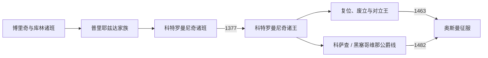

# 波斯尼亚中世纪统治者世系表

## 时间

约1154年—1463年；征服后的附庸称王与黑塞哥维那公爵线列至1482年

## 概括

本表按同时代材料较能确认的班和国王排列；复位分次列出，共治、被废、对立王及征服后由奥斯曼或匈牙利扶植的“波斯尼亚王”另作说明。11世纪以前只见于较晚编年史的地方统治者不并入连续世系。中世纪姓名、起讫年和亲属关系在史料中常有差异，故用“约”“不详”或年份区间明确表示不确定性。

## 班国统治者

| 顺序 | 姓名 | 家族 / 称号 | 在位 | 与前任关系 | 关键事件与备注 |
|---:|---|---|---|---|---|
| 1 | 博里奇 | 班；家族不详 | 约1154—1163年 | 首位有可靠同时代记录的波斯尼亚班 | 作为匈牙利阵营人物参与对拜占庭战争；1160年代政治变化后失势。 |
| 2 | 库林 | 班；家族归属不确定 | 约1180—1204年 | 非明确直系继承 | 在拜占庭势力退潮后稳定统治；1189年贸易特许状；1203年比利诺波列会议。 |
| 3 | 斯捷潘·库利尼奇 | 班；通常视为库林之子 | 约1204—1232年 | 子 | 倾向天主教改革，遭地方力量推翻；具体起讫年有争议。 |
| 4 | 马泰·尼诺斯拉夫 | 班；家族不详 | 约1232—1250年 | 经贵族拥立 | 抵抗1230年代匈牙利支持的远征，多次向杜布罗夫尼克发特许状。 |
| — | 普里耶兹达一世早期任职 | 班；科特罗曼尼奇先祖 | 约1250年代前段，可能与尼诺斯拉夫晚期重叠 | 匈牙利支持的候选人 | 早期在位年代不统一；1254年后统治较确定。 |
| 5 | **普里耶兹达一世** | 班；科特罗曼尼奇家族奠基者 | 约1254—1287年 | 非明确直系继承 | 接受匈牙利宗主关系，以世袭家族取代此前不稳定班位；晚年退位或与诸子分权。 |
| 6 | 普里耶兹达二世 | 班；科特罗曼尼奇 | 1287—约1290年 | 普里耶兹达一世之子；与斯捷潘一世共治 | 1290年教廷文书同时称两人为波斯尼亚班；其后失载。 |
| 7 | 斯捷潘一世·科特罗曼 | 班；科特罗曼尼奇 | 1287—1314年 | 普里耶兹达一世之子；普里耶兹达二世之弟或兄 | 与塞尔维亚尼曼雅家族联姻；1299年后受舒比奇势力压制，仍保留王朝权利。 |
| 8 | 姆拉登一世·舒比奇 | “波斯尼亚领主” / 班 | 1302—1304年 | 克罗地亚大领主帕瓦奥一世之弟，以征服取得 | 代表舒比奇家族直接统治，围攻波斯尼亚教会支持者时战死。 |
| 9 | 姆拉登二世·舒比奇 | 克罗地亚与波斯尼亚班 | 1304—1322年 | 姆拉登一世之侄 | 以斯捷潘二世为附庸恢复科特罗曼尼奇地方地位；1322年被反舒比奇联盟击败。 |
| 10 | **斯捷潘二世·科特罗曼尼奇** | 班；科特罗曼尼奇 | 约1314年名义继承，1322—1353年独立掌权 | 斯捷潘一世之子 | 取得胡姆、乌索拉、索利和矿区；发展杜布罗夫尼克贸易；为王国奠定领土财政基础。 |
| 11 | **特夫尔特科一世** | 班；1377年后为王 | 1353—1366年 | 斯捷潘二世之侄 | 少年继位，受母亲耶莱娜和贵族辅政；与匈牙利国王冲突后被废。 |
| 12 | 武克·科特罗曼尼奇 | 对立班 | 1366—1367年 | 特夫尔特科一世之弟 | 在部分贵族支持下取代兄长，未能长期控制全国；兄长复位。 |
| 13 | **特夫尔特科一世** | 复位班 | 1367—1377年 | 复位 | 重建王权、向东扩张；1377年加冕为王，班国由此转为王国。 |

## 波斯尼亚王国君主

| 顺序 | 姓名 | 王室 | 在位 | 与前任关系 | 关键事件 / 废立 / 并立 |
|---:|---|---|---|---|---|
| 1 | **斯捷潘·特夫尔特科一世** | 科特罗曼尼奇 | 1377—1391年 | 由班升格为王 | 以尼曼雅母系血统和领土占有取得复合王号；扩张至达尔马提亚，王国达到最大范围。 |
| 2 | 斯捷潘·达比沙 | 科特罗曼尼奇 | 1391—1395年 | 亲属，确切亲等有争议 | 放弃部分沿海扩张；承受匈牙利国王西吉斯蒙德压力；王位继承协议未获贵族长期接受。 |
| 3 | **耶莱娜·格鲁巴** | 尼科利奇出身，达比沙王后 | 1395—1398年 | 遗孀，由贵族拥立 | 少见的独立女王；大贵族权势上升，1398年被废。 |
| 4 | 斯捷潘·奥斯托亚 | 科特罗曼尼奇 | 1398—1404年 | 王族旁支，贵族拥立 | 在赫尔沃耶等领主支持下即位；对杜布罗夫尼克战争失利后被废。 |
| 5 | 斯捷潘·特夫尔特科二世 | 科特罗曼尼奇 | 1404—1409年 | 特夫尔特科一世之子，身世细节曾有争议 | 由反奥斯托亚贵族拥立；1408—1409年匈牙利干预后失去大部权力。 |
| 6 | 斯捷潘·奥斯托亚 | 科特罗曼尼奇 | 1409—1418年，第二次在位 | 复位；1409年前后与特夫尔特科二世局部并立 | 获西吉斯蒙德支持复位；1415年后转入奥斯曼影响增强的环境。 |
| 7 | 斯捷潘·奥斯托伊奇 | 科特罗曼尼奇 | 1418—1420年 | 奥斯托亚之子 | 由部分贵族承认；与桑达利·赫拉尼奇等冲突，遭废后失载。 |
| 8 | 斯捷潘·特夫尔特科二世 | 科特罗曼尼奇 | 1420—1443年，第二次在位 | 复位 | 在匈牙利与奥斯曼之间求存；1433—1435年受拉迪沃伊对立王挑战；指定托马什为继承者。 |
| — | 拉迪沃伊·奥斯托伊奇 | 科特罗曼尼奇；对立王 | 1432/1433—1435年；此后仍使用王号至1446年前后 | 奥斯托亚私生子；奥斯托伊奇之弟 | 获桑达利等大贵族、塞尔维亚专制公及奥斯曼支持；未取得全境，是必须与正统在位表分开的竞争者。 |
| 9 | 斯捷潘·托马什 | 科特罗曼尼奇 | 1443—1461年 | 奥斯托亚私生子；特夫尔特科二世指定或由贵族承认 | 改宗并强化天主教合法性；与科萨查家族时战时和；承受奥斯曼贡赋。 |
| 10 | **斯捷潘·托马舍维奇** | 科特罗曼尼奇 | 1461—1463年 | 托马什之子 | 1459年曾短暂任塞尔维亚专制公；停止向奥斯曼纳贡，1463年被俘处决，为独立王国末王。 |

## 1463年后的附庸与竞争称王者

这些人物没有恢复1463年前的统一王国；其称号依赖奥斯曼或匈牙利控制区，须与独立王国世系分开。

| 姓名 | 支持者 / 控制区 | 使用称号时间 | 身份与结局 |
|---|---|---|---|
| 马蒂亚·拉迪沃耶维奇 | 奥斯曼；波斯尼亚中部小型缓冲领地 | 约1465—1471年 | 拉迪沃伊之子，被苏丹立为附庸“波斯尼亚王”；后被撤换或失载。 |
| 马蒂亚·沃伊萨利奇 | 奥斯曼；部分旧赫尔沃耶家领地 | 约1471—1476年 | 赫尔瓦蒂尼奇家族成员；试图联络匈牙利后遭奥斯曼进攻，领地消失。 |
| 尼古拉·伊洛奇基 | 匈牙利；亚伊采等北部防区 | 1471—1477年 | 匈牙利国王马加什一世授予“波斯尼亚王”头衔；实际是匈牙利边防领主，不是科特罗曼尼奇继承王。 |

## 胡姆—黑塞哥维那的科萨查统治线

| 顺序 | 姓名 | 称号 | 掌权 | 继承关系 | 关键事件与备注 |
|---:|---|---|---|---|---|
| 1 | 弗拉特科·武科维奇 | 大公 | 14世纪后期—1392年 | 科萨查家族前代领主 | 1388年比莱恰战胜奥斯曼军；其领地由侄辈继承。 |
| 2 | 桑达利·赫拉尼奇·科萨查 | 波斯尼亚大公 | 1392—1435年 | 弗拉特科之侄 | 参与多次废立国王，控制胡姆大部并经营杜布罗夫尼克关系。 |
| 3 | **斯捷潘·武克契奇·科萨查** | 大公；1448年起赫尔采格 | 1435—1466年 | 桑达利之侄 | 在国王、奥斯曼、威尼斯和杜布罗夫尼克之间独立行事；其头衔促成“黑塞哥维那”地名。1463年王国亡后仍控制部分南部。 |
| 4 | 弗拉特科·赫尔采戈维奇 | 赫尔采格 | 1466—约1482年 | 斯捷潘·武克契奇之子 | 继承残余领地，在奥斯曼进攻下逐步失去要塞；约1482年撤离，地方政权终结。 |
| — | 弟兄与分支 | 弗拉迪斯拉夫、斯捷潘等 | 与父兄部分重叠 | 科萨查家族成员 | 曾分割领地或投向不同强权，不构成统一、连续的独立公爵序列；斯捷潘改宗后成为奥斯曼高官赫尔塞克利·艾哈迈德帕夏。 |

## 继承制度说明

- 班国和王国都没有始终有效的长子继承制；血缘资格、君主指定、斯塔纳克贵族认可和外部强权支持共同决定即位。
- 1366—1367年、1404—1409年及1430年代存在废立或并立，表中按实际控制与称号分别标示，不能把复位者合并成一段。
- 王名常带“斯捷潘 / 斯特凡”尊号；本表用中文常见转写区分个人，不据称号误判为同一人。
- 1463年后的附庸王和匈牙利授衔者只控制碎片化地区，不应将王国灭亡日期推迟到1476或1477年。
- 黑塞哥维那线是强大领主的地方统治，不等同现代国家或代顿实体。

## 相关笔记

- 主文：[波斯尼亚中世纪国家](/%E4%BA%BA%E6%96%87%E7%A7%91%E5%AD%A6/%E5%8E%86%E5%8F%B2/%E6%AC%A7%E6%B4%B2/%E4%B8%9C%E5%8D%97%E6%AC%A7%E4%B8%8E%E5%B7%B4%E5%B0%94%E5%B9%B2/%E6%B3%A2%E6%96%AF%E5%B0%BC%E4%BA%9A%E5%92%8C%E9%BB%91%E5%A1%9E%E5%93%A5%E7%BB%B4%E9%82%A3/%E6%B3%A2%E6%96%AF%E5%B0%BC%E4%BA%9A%E4%B8%AD%E4%B8%96%E7%BA%AA%E5%9B%BD%E5%AE%B6.md)
- 后继：[奥斯曼统治下的波斯尼亚](/%E4%BA%BA%E6%96%87%E7%A7%91%E5%AD%A6/%E5%8E%86%E5%8F%B2/%E6%AC%A7%E6%B4%B2/%E4%B8%9C%E5%8D%97%E6%AC%A7%E4%B8%8E%E5%B7%B4%E5%B0%94%E5%B9%B2/%E6%B3%A2%E6%96%AF%E5%B0%BC%E4%BA%9A%E5%92%8C%E9%BB%91%E5%A1%9E%E5%93%A5%E7%BB%B4%E9%82%A3/%E5%A5%A5%E6%96%AF%E6%9B%BC%E7%BB%9F%E6%B2%BB%E4%B8%8B%E7%9A%84%E6%B3%A2%E6%96%AF%E5%B0%BC%E4%BA%9A.md)
- 总览：[波斯尼亚和黑塞哥维那历史](/%E4%BA%BA%E6%96%87%E7%A7%91%E5%AD%A6/%E5%8E%86%E5%8F%B2/%E6%AC%A7%E6%B4%B2/%E4%B8%9C%E5%8D%97%E6%AC%A7%E4%B8%8E%E5%B7%B4%E5%B0%94%E5%B9%B2/%E6%B3%A2%E6%96%AF%E5%B0%BC%E4%BA%9A%E5%92%8C%E9%BB%91%E5%A1%9E%E5%93%A5%E7%BB%B4%E9%82%A3/README.md)
