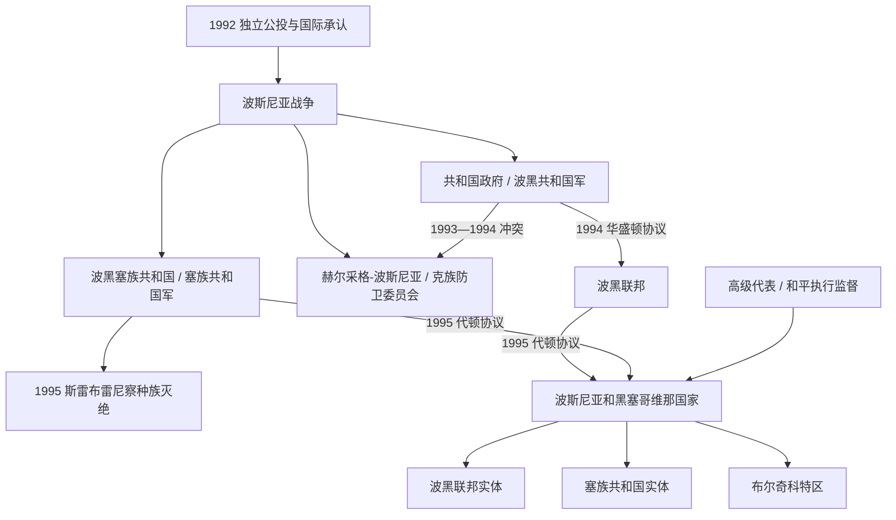

# 独立、战争与代顿体系

## 时间

1992年至今；波斯尼亚战争为1992—1995年，现任信息核验截止2026年7月14日

## 概括

波斯尼亚和黑塞哥维那在南斯拉夫解体中通过公投和国际承认成为独立国家，但共和国机构、塞族平行政权、克族平行共同体、南斯拉夫人民军遗留力量及邻国介入很快把主权争议转为战争。波黑塞族军政领导以建立连续塞族领土为目标，对非塞族人口实施系统、广泛的迫害与强制迁徙；波黑克族力量和波黑政府军也在各自控制区犯下战争罪。1995年斯雷布雷尼察对波什尼亚克男子和男孩的有组织处决被国际刑事法庭和国际法院认定为种族灭绝。代顿协议保存单一国际法主体，却把国内权力分置于国家、两个实体、十个州、布尔奇科特区和国际监督机制，结束战争的结构也成为治理僵局的来源。

## 独立与战争爆发

1991年南斯拉夫联邦瓦解时，波黑塞族民主党组织塞族自治地区，并于1992年1月宣布“波斯尼亚和黑塞哥维那塞族共和国”；1991年11月波黑克罗地亚民主联盟地方领导则建立“赫尔采格-波斯尼亚克族共同体”。这些平行结构先于国际承认形成。

29日2月—1日3月1992年公投在塞族政治力量抵制下举行，约三分之二选民投票，投票者几乎都赞成独立。欧洲共同体与美国4月承认，波黑5月加入联合国。承认没有产生统一武装垄断：南斯拉夫人民军正式撤出时将大量武器、人员和指挥体系转给新成立的塞族共和国军，并获塞尔维亚 / 南联盟重要支持；共和国政府仓促组建波黑共和国军；克族防卫委员会在克罗地亚支持下控制西部与南部地区。

## 参战方与实际权力

| 政治—军事力量 | 名义目标 | 实际控制与外部关系 |
|---|---|---|
| 波斯尼亚和黑塞哥维那共和国 | 维护国际承认边界内的统一国家 | 以萨拉热窝政府和波黑共和国军为核心，早期多民族成分随战争和驱逐而收缩；获得部分伊斯兰国家援助，受联合国武器禁运限制。 |
| 波黑塞族共和国，后称塞族共和国 | 使塞族控制区留在南斯拉夫或实现塞族领土统一 | 领导人为拉多万·卡拉季奇，军队由拉特科·姆拉迪奇指挥；继承南人民军资源，并获塞尔维亚政治、人员、财政和后勤支持。 |
| 赫尔采格-波斯尼亚与克族防卫委员会 | 建立克族自治并与克罗地亚保持特殊联系 | 以莫斯塔尔等地为中心，获克罗地亚支持；先与共和国军合作，1993—1994年在中部和黑塞哥维那交战。 |
| 西波斯尼亚自治省 | 菲克雷特·阿布迪奇的地方自治政权 | 1993—1995年控制大克拉杜沙一带，与塞族及克罗地亚力量合作，对抗共和国政府第五军。 |
| 联合国与北约 | 人道救援、停火、安全区和后期强制和平 | 联保部队授权和兵力有限；安全区未能保护斯雷布雷尼察，1995年北约空袭改变军事外交环境。 |

## 战争阶段

### 1992年：领土夺取与系统迫害

塞族共和国军凭重武器优势迅速控制约三分之二国土，围困萨拉热窝，并在普里耶多尔、福查、维舍格勒、兹沃尔尼克等地通过杀戮、拘禁营、强奸、财产掠夺和驱逐清除非塞族人口。奥马尔斯卡、克拉泰尔姆和特尔诺波列等营地成为国际关注焦点。波黑塞族方面的迫害是战争中规模最大、最系统的族群清洗行动。

共和国政府和克族力量在最初共同抵抗中也出现任意拘押、杀害和驱逐塞族平民的案件。联合国对整个前南斯拉夫实施的武器禁运延续，使继承人民军武库的塞族一方拥有明显初始优势。

### 1993—1994年：三方战争与华盛顿协议

围绕领土、补给线和未来国家结构，克族防卫委员会与共和国军在中波斯尼亚和莫斯塔尔开战。克族部队在拉什瓦河谷实施迫害，阿赫米奇村屠杀成为典型；黑利奥德罗姆、德雷泰利等拘禁设施关押和虐待波什尼亚克人。共和国军也在格拉博维察、乌兹多尔等地杀害克族平民，并对部分村庄强制迁移。

1993年“赫尔采格-波斯尼亚克罗地亚共和国”自称成立，但未获国际承认。美国斡旋的1994年华盛顿协议结束波什尼亚克—克族战争，将双方控制区组成波斯尼亚和黑塞哥维那联邦，并提出与克罗地亚邦联的设想；这为后期联合进攻和代顿两实体结构奠定一半基础。

### 1995年：种族灭绝、军事转折与和平

联合国把斯雷布雷尼察等地宣布为“安全区”，却未解除围困或建立足够防御。1995年7月塞族共和国军攻占斯雷布雷尼察，分离男子与男孩，强制转移妇女、儿童和老人，并在多个地点有组织处决八千余名波什尼亚克男子和男孩，随后转移尸体掩盖证据。国际刑事法庭和国际法院均确认这一事件构成种族灭绝；这一法律结论特指斯雷布雷尼察，同时不否认其他地区存在反人类罪和战争罪。

8月第二次马尔卡莱市场炮击后，北约发动“审慎力量行动”打击波黑塞族军事目标。克罗地亚“风暴行动”击败克拉伊纳塞族政权后，克罗地亚军、克族防卫委员会和共和国军在西部推进；大量塞族平民逃离，进攻中也发生针对塞族平民的犯罪。前线变化与美国、俄罗斯、欧洲外交共同迫使各方谈判。

## 暴行与司法责任的表述原则

- 各方均有个人和组织因战争罪、反人类罪被定罪；平民身份不因所属民族或控制区而改变。
- 司法事实显示，波黑塞族政治军事领导发动的族群清洗在地域、规模和制度协调上最为广泛；不能用“相互暴行”取消这一差异。
- 前南刑庭认定赫尔采格-波斯尼亚六名高级领导参加共同犯罪计划，目标是建立由克族支配的实体并迫害波什尼亚克人；克罗地亚的参与和控制须按具体判决表述。
- 波黑共和国军成员也因针对塞、克平民和战俘的杀害、虐待获罪；责任不自动上推到某一民族整体。
- 斯雷布雷尼察种族灭绝是确定的国际司法结论，否认或淡化不属于普通“观点争议”。

## 重要事件

| 时间 | 事件 | 结果与长期影响 |
|---|---|---|
| 1991年11月—1992年1月 | 克族与塞族平行政治实体建立 | 共和国权力在国际承认前已被领土化组织切割。 |
| 29日2月—1日3月1992年 | 独立公投 | 产生独立授权，但塞族抵制造成合法性认知分裂。 |
| 5—6日4月1992年起 | 国际承认与萨拉热窝围城 | 战争全面化；围城持续至1996年初，狙击和炮击构成针对平民的恐怖行动。 |
| 5—8月1992年 | 普里耶多尔等地拘禁营曝光 | 世界看到系统拘禁、虐待和族群清洗；推动国际刑事司法压力。 |
| 1993年5月 | 前南斯拉夫问题国际刑事法庭成立 | 首个由联合国安理会建立的国际刑事法庭，随后起诉各方高级责任人。 |
| 1993年4月 | 阿赫米奇屠杀 | 克族防卫委员会杀害波什尼亚克平民，成为波什尼亚克—克族战争核心案件。 |
| 1994年3月 | 华盛顿协议 | 结束波什尼亚克—克族战争，建立波黑联邦实体。 |
| 11—16日7月1995年 | 斯雷布雷尼察种族灭绝 | 波黑塞族军警处决八千余人并强制转移居民，暴露安全区制度失败。 |
| 8—9月1995年 | 北约空袭与西部地面攻势 | 削弱塞族军事优势并稳定大致51:49的领土谈判框架。 |
| 21日11月 / 14日12月1995年 | 代顿协议草签 / 正式签署 | 停战，确认国家连续性、两实体结构和国际和平执行。 |
| 1996年 | 首次战后选举 | 战时民族政党在高度分离的人口结构中延续权力。 |
| 1997年 | 和平执行委员会确认“波恩权力” | 高级代表开始可颁布决定、撤换阻碍和平执行的官员，外部监督显著增强。 |
| 1999—2000年 | 布尔奇科仲裁终局裁决与特区成立 | 两实体原有权力在特区范围内被移交，形成国家主权下的特殊地方自治。 |
| 2003—2006年 | 间接税、司法和国防改革 | 建立统一间接税机构、国家司法机关及统一武装部队，部分职权由实体上移。 |
| 2009年 | “塞伊迪奇和芬齐案” | 欧洲人权法院认定主席团与民族院资格制度歧视“其他人”，至2026年仍未全面执行。 |
| 2016—2024年 | 欧盟申请、候选国与开启谈判决定 | 欧盟整合成为改革框架；国内否决、法治和选举改革使推进反复。 |
| 2025—2026年 | 塞族共和国总统职位危机与提前选举 | 米洛拉德·多迪克因拒不执行高级代表决定被终审定罪并失去总统任期；西尼沙·卡兰经提前选举于2026年2月就任，国家—实体权力冲突仍在。 |
| 1日7月2026年 | 代理高级代表交接 | 克里斯蒂安·施密特辞任，路易斯·克里肖克代理；截至7月14日可核实信息仍为代理状态。 |

## 代顿宪制与实际权力

| 层级 | 组成与权限 | 不能误解为 |
|---|---|---|
| 国家 | 三人主席团、两院议会、部长会议、宪法法院；负责外交、货币、对外贸易、移民及后来上移的国防、间接税等 | 不是仅负责礼仪的空壳，也不是单一多数决中央政府。 |
| 波黑联邦实体 | 设总统、副总统、两院议会和政府；内部十个州各有政府和议会 | 不是“波什尼亚克国家”；克族及其他公民亦在其中，州权很大。 |
| 塞族共和国实体 | 设总统、国民议会、政府及市镇 | 不是主权国家，也不是塞尔维亚领土；其法律须服从波黑宪法。 |
| 布尔奇科特区 | 国家主权下的单一地方自治单位，实体把原有治理权委托给特区 | 不是第三实体；国际监督与本地民选机构并存。 |
| 高级代表 | 监督代顿民事执行，可依和平执行机制采取具有约束力的措施 | 不是国家元首、政府首脑或民选官员。 |
| 欧盟部队 | 接替北约维和任务，维持安全环境 | 不是日常行政政府。 |

国家元首、政府首脑、主席团轮值、实体现任领导和高级代表完整表见[现代国家领导与权力结构表](/%E4%BA%BA%E6%96%87%E7%A7%91%E5%AD%A6/%E5%8E%86%E5%8F%B2/%E6%AC%A7%E6%B4%B2/%E4%B8%9C%E5%8D%97%E6%AC%A7%E4%B8%8E%E5%B7%B4%E5%B0%94%E5%B9%B2/%E6%B3%A2%E6%96%AF%E5%B0%BC%E4%BA%9A%E5%92%8C%E9%BB%91%E5%A1%9E%E5%93%A5%E7%BB%B4%E9%82%A3/%E7%8E%B0%E4%BB%A3%E5%9B%BD%E5%AE%B6%E9%A2%86%E5%AF%BC%E4%B8%8E%E6%9D%83%E5%8A%9B%E7%BB%93%E6%9E%84%E8%A1%A8.md)。

## 战后成果与结构性困境

### 和平得以维持的条件

- 明确停火线、国际维和与外部安全保障降低复战能力。
- 难民返乡、财产返还和战争罪审判逐步恢复个人权利并削弱公开逃罪空间。
- 统一货币、中央银行、间接税、军队和边境制度形成共同国家基础。
- 欧盟与欧洲委员会条件使跨实体合作获得外部激励。

### 结构性僵局

- 族群否决、实体表决和多层政府能保护共同体，也使普通政策被主权争议绑架。
- 战时驱逐后的居住格局与教育、媒体、政党分割相互强化。
- 主席团与民族院选举把族群和居住地绑定，排除“其他人”及部分不在指定实体居住者。
- 高级代表干预能打破僵局，却也使本地政治人物把责任外包或质疑制度合法性。
- 人口外流、青年失业、腐败和国企政治化削弱公共服务，经济问题常被民族议题遮蔽。

## 截至2026年7月14日的国家运行

主席团三名成员为丹尼斯·贝契罗维奇、热利科·科姆希奇和热利卡·茨维亚诺维奇，贝契罗维奇自2026年3月16日起任八个月轮值主席；主席没有凌驾于另外两名成员之上的独任总统权。部长会议主席为博里亚娜·克里什托。波黑联邦总统为莉迪娅·布拉达拉、总理为内尔明·尼克希奇；塞族共和国总统为西尼沙·卡兰、总理为萨沃·米尼奇；布尔奇科区长为西尼沙·米利奇。路易斯·J·克里肖克为代理高级代表并兼布尔奇科国际监督员；这些实体或国际职位都不是波黑国家元首。

## 演变关系

- 前一节点：[社会主义南斯拉夫时期的波斯尼亚和黑塞哥维那](/%E4%BA%BA%E6%96%87%E7%A7%91%E5%AD%A6/%E5%8E%86%E5%8F%B2/%E6%AC%A7%E6%B4%B2/%E4%B8%9C%E5%8D%97%E6%AC%A7%E4%B8%8E%E5%B7%B4%E5%B0%94%E5%B9%B2/%E6%B3%A2%E6%96%AF%E5%B0%BC%E4%BA%9A%E5%92%8C%E9%BB%91%E5%A1%9E%E5%93%A5%E7%BB%B4%E9%82%A3/%E7%A4%BE%E4%BC%9A%E4%B8%BB%E4%B9%89%E5%8D%97%E6%96%AF%E6%8B%89%E5%A4%AB%E6%97%B6%E6%9C%9F%E7%9A%84%E6%B3%A2%E6%96%AF%E5%B0%BC%E4%BA%9A%E5%92%8C%E9%BB%91%E5%A1%9E%E5%93%A5%E7%BB%B4%E9%82%A3.md)
- 共同背景：[南斯拉夫解体](/%E4%BA%BA%E6%96%87%E7%A7%91%E5%AD%A6/%E5%8E%86%E5%8F%B2/%E6%AC%A7%E6%B4%B2/%E4%B8%9C%E5%8D%97%E6%AC%A7%E4%B8%8E%E5%B7%B4%E5%B0%94%E5%B9%B2/%E5%8D%97%E6%96%AF%E6%8B%89%E5%A4%AB%E5%8E%86%E5%8F%B2/%E5%8D%97%E6%96%AF%E6%8B%89%E5%A4%AB%E8%A7%A3%E4%BD%93.md)
- 国家总览：[波斯尼亚和黑塞哥维那历史](/%E4%BA%BA%E6%96%87%E7%A7%91%E5%AD%A6/%E5%8E%86%E5%8F%B2/%E6%AC%A7%E6%B4%B2/%E4%B8%9C%E5%8D%97%E6%AC%A7%E4%B8%8E%E5%B7%B4%E5%B0%94%E5%B9%B2/%E6%B3%A2%E6%96%AF%E5%B0%BC%E4%BA%9A%E5%92%8C%E9%BB%91%E5%A1%9E%E5%93%A5%E7%BB%B4%E9%82%A3/README.md)
