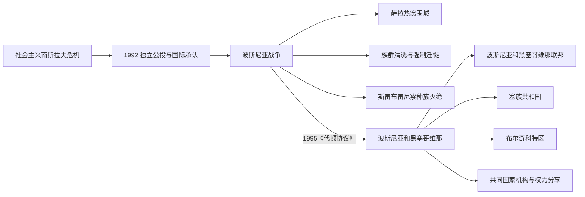

# 独立、战争与代顿体系

## 时间

1992年至今；波斯尼亚战争为1992—1995年

## 概括

波斯尼亚和黑塞哥维那在南斯拉夫解体中宣布独立，随即发生围绕领土、主权和族群控制的战争。围城、强制迁徙、族群清洗和种族灭绝造成严重人道灾难。1995年《代顿协议》结束战争，并建立由两个主要实体、中央机构和国际监督机制共同组成的复杂宪制。

## 演进图

## 战争与和平进程

- 1992年独立公投在塞族政治力量抵制下举行，国际承认后战争迅速扩大。
- 波黑政府、波黑塞族力量、波黑克族力量以及南斯拉夫和克罗地亚等外部力量在不同时期形成复杂战争与联盟关系。
- 萨拉热窝长期被围；大规模拘禁、强奸、驱逐和屠杀使多地人口结构被强行改变。
- 1995年斯雷布雷尼察屠杀被国际司法机构认定为种族灭绝。
- 《代顿协议》承认波黑为单一国际法主体，同时设置高度分权的实体和权力分享结构。

## 代顿后的国家结构

| 层次 | 机构 / 单位 | 说明 |
|---|---|---|
| 国家 | 波斯尼亚和黑塞哥维那 | 设集体主席团、议会和部长会议等共同机构。 |
| 实体 | 波斯尼亚和黑塞哥维那联邦 | 内部又分州，主要由波什尼亚克人与克罗地亚人构成。 |
| 实体 | 塞族共和国 | 具有自身政府、议会和行政体系。 |
| 特区 | 布尔奇科特区 | 在国家主权下具有特殊自治地位。 |
| 国际机制 | 和平协议高级代表等 | 监督民事执行并在特定条件下行使广泛权力。 |

## 关键辨析

- 波黑不是两个独立国家的松散联盟；两个实体处于同一主权国家之内。
- “三个构成民族”的权力分享保障代表性，也可能固化族群分类并限制不属于三者者的平等参政。
- 战争责任不能用“古老民族仇恨”解释；国家瓦解、政治动员、军事组织和外部介入都是关键。
- 战后返乡、司法追责与社会和解持续进行，但行政分割和战争记忆仍影响政治。

## 演变关系

- 前一节点：[社会主义南斯拉夫时期的波斯尼亚和黑塞哥维那](/%E4%BA%BA%E6%96%87%E7%A7%91%E5%AD%A6/%E5%8E%86%E5%8F%B2/%E6%AC%A7%E6%B4%B2/%E4%B8%9C%E5%8D%97%E6%AC%A7%E4%B8%8E%E5%B7%B4%E5%B0%94%E5%B9%B2/%E6%B3%A2%E6%96%AF%E5%B0%BC%E4%BA%9A%E5%92%8C%E9%BB%91%E5%A1%9E%E5%93%A5%E7%BB%B4%E9%82%A3/%E7%A4%BE%E4%BC%9A%E4%B8%BB%E4%B9%89%E5%8D%97%E6%96%AF%E6%8B%89%E5%A4%AB%E6%97%B6%E6%9C%9F%E7%9A%84%E6%B3%A2%E6%96%AF%E5%B0%BC%E4%BA%9A%E5%92%8C%E9%BB%91%E5%A1%9E%E5%93%A5%E7%BB%B4%E9%82%A3.md)
- 共同背景：[南斯拉夫解体](/%E4%BA%BA%E6%96%87%E7%A7%91%E5%AD%A6/%E5%8E%86%E5%8F%B2/%E6%AC%A7%E6%B4%B2/%E4%B8%9C%E5%8D%97%E6%AC%A7%E4%B8%8E%E5%B7%B4%E5%B0%94%E5%B9%B2/%E5%8D%97%E6%96%AF%E6%8B%89%E5%A4%AB%E5%8E%86%E5%8F%B2/%E5%8D%97%E6%96%AF%E6%8B%89%E5%A4%AB%E8%A7%A3%E4%BD%93.md)
- 国家总览：[波斯尼亚和黑塞哥维那历史](/%E4%BA%BA%E6%96%87%E7%A7%91%E5%AD%A6/%E5%8E%86%E5%8F%B2/%E6%AC%A7%E6%B4%B2/%E4%B8%9C%E5%8D%97%E6%AC%A7%E4%B8%8E%E5%B7%B4%E5%B0%94%E5%B9%B2/%E6%B3%A2%E6%96%AF%E5%B0%BC%E4%BA%9A%E5%92%8C%E9%BB%91%E5%A1%9E%E5%93%A5%E7%BB%B4%E9%82%A3/README.md)
