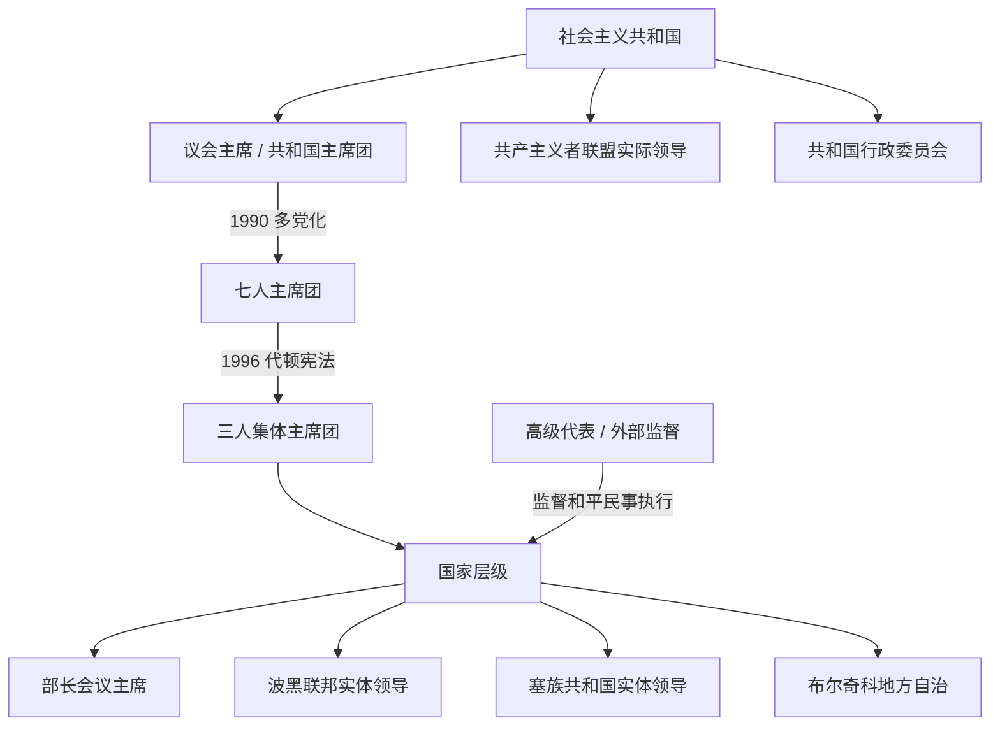

# 现代国家领导与权力结构表

## 时间

1943年至今；现任信息核验截止2026年7月14日

## 概括

本表把法定国家首脑、政府首脑、执政党实际权力、代顿后的实体领导和国际监督分开。1943—1990年的议会主席或集体主席团主席是共和国法定代表，波黑共产主义者联盟领导层才是党国权力核心；1990—1996年为七人集体主席团，战争使成员退出、补任并增加当然成员；1996年以后只有三人主席团集体构成国家元首，轮值主席不拥有独任总统地位。高级代表可作出约束性决定，却不属于波黑国家元首或政府序列。

## 社会主义共和国法定首脑

| 顺序 | 姓名 | 职位 | 任期 | 关键说明 |
|---:|---|---|---|---|
| 1 | 沃伊斯拉夫·克茨马诺维奇 | ZAVNOBiH主席 | 25日11月1943年—26日4月1945年 | 战时最高代表机关主席，主持联邦单位政治奠基。 |
| 2 | 沃伊斯拉夫·克茨马诺维奇 | 人民议会主席团主席 | 26日4月1945年—11月1946年 | 战时机关转为共和国常设法定代表。 |
| 3 | 久罗·普察尔 | 人民议会主席团主席 | 11月1946年—9月1948年 | 同时为共产党核心干部；法定与党内影响并存。 |
| 4 | 弗拉多·舍格尔特 | 人民议会主席团主席 | 9月1948年—3月1953年 | 苏南决裂与早期工业化时期的法定首脑。 |
| 5 | 久罗·普察尔 | 人民议会主席 | 12月1953年—6月1963年 | 1953年制度调整后由议长承担共和国代表职能。 |
| 6 | 拉托米尔·杜贡尼奇 | 人民议会主席 | 6月1963年—7月1967年 | 1963年改称社会主义共和国。 |
| 7 | 杰马尔·比耶迪奇 | 人民议会主席 | 1967年—7月1971年 | 后任南斯拉夫联邦行政委员会主席。 |
| 8 | 哈姆迪亚·波兹德拉茨 | 人民议会主席 | 7月1971年—29日4月1974年 | 穆斯林民族承认和共和国权力加强时期。 |
| 9 | 拉托米尔·杜贡尼奇 | 共和国主席团主席 | 29日4月1974年—27日4月1978年 | 1974年宪法建立常设集体主席团。 |
| 10 | 拉伊夫·迪兹达雷维奇 | 共和国主席团主席 | 27日4月1978年—27日4月1982年 | 后任南斯拉夫联邦主席团主席。 |
| 11 | 布兰科·米库利奇 | 共和国主席团主席 | 27日4月1982年—26日4月1983年 | 任期后转入联邦高层；不同简表常误写至1984年。 |
| 12 | 米兰科·雷诺维察 | 共和国主席团主席 | 26日4月1983年—26日4月1985年 | 经济紧缩初期的集体领导。 |
| 13 | 穆尼尔·梅西霍维奇 | 共和国主席团主席 | 26日4月1985年—27日4月1987年 | 任内发生阿格罗科默茨危机前期。 |
| 14 | 马托·安德里奇 | 共和国主席团主席 | 27日4月1987年—27日4月1988年 | 党内危机与干部更替加快。 |
| 15 | 尼古拉·菲利波维奇 | 共和国主席团主席 | 27日4月1988年—27日4月1989年 | 卸任后至5月18日主席职位短暂空缺，由主席团维持职能。 |
| 16 | 奥布拉德·皮利亚克 | 共和国主席团主席 | 18日5月1989年—20日12月1990年 | 最后一位一党时期主席。 |
| 17 | 阿利雅·伊泽特贝戈维奇 | 多党制共和国主席团主席 | 20日12月1990年—8日4月1992年 | 七人主席团从成员中选为主席；随后继续任独立共和国战时主席团主席。 |

## 社会主义共和国政府首脑完整表

| 顺序 | 姓名 | 职位 | 任期 | 说明 |
|---:|---|---|---|---|
| 1 | 罗多柳布·乔拉科维奇 | 总理 | 27日4月1945年—9月1948年 | 组建战后第一届共和国政府。 |
| 2 | 久罗·普察尔 | 总理；1953年后短期为行政委员会主席 | 9月1948年—12月1953年 | 苏南决裂、国有化和工人自治初期。 |
| 3 | 阿夫多·胡莫 | 行政委员会主席 | 12月1953年—1956年 | 执行去集中化和工人自治改革。 |
| 4 | 奥斯曼·卡拉贝戈维奇 | 行政委员会主席 | 1956—1963年 | 工业化、城市化加速。 |
| 5 | 哈桑·布尔基奇 | 行政委员会主席 | 1963年—14日6月1965年 | 1963年宪制转型后首批政府之一，任内去世。 |
| 6 | 鲁迪·科拉克 | 行政委员会主席 | 14日6月1965年—1967年 | 市场化改革与企业自主扩张时期。 |
| 7 | 布兰科·米库利奇 | 行政委员会主席 | 1967—1969年 | 后成为共和国和联邦高层。 |
| 8 | 德拉古廷·科索瓦茨 | 行政委员会主席 | 1969年—4月1974年 | 穆斯林民族确认与1974年宪法准备期。 |
| 9 | 米兰科·雷诺维察 | 行政委员会主席 | 4月1974年—28日4月1982年 | 1974年体制下任期最长，依靠外债投资维持增长。 |
| 10 | 塞伊德·马格莱利亚 | 行政委员会主席 | 28日4月1982年—28日4月1984年 | 经济稳定计划与紧缩初期。 |
| 11 | 戈伊科·乌比帕里普 | 行政委员会主席 | 28日4月1984年—4月1986年 | 冬奥会后投资、债务和就业压力并存。 |
| 12 | 约西普·洛夫雷诺维奇 | 行政委员会主席 | 4月1986年—4月1988年 | 阿格罗科默茨丑闻爆发并冲击共和国领导层。 |
| 13 | 马尔科·切拉尼奇 | 行政委员会主席 | 4月1988年—20日12月1990年 | 最后一位共产党政府首脑，多党选举后交权。 |
| 14 | 尤雷·佩利万 | 行政委员会主席 / 1992年后总理 | 20日12月1990年—9日11月1992年 | 克族政党成员；多党联合政府在主权危机中瓦解，独立后续任总理。 |

## 1990—1996年的七人主席团与战时增员

### 1990年民选七名成员

| 代表类别 | 成员 | 任职变化 |
|---|---|---|
| 穆斯林代表 | 菲克雷特·阿布迪奇、阿利雅·伊泽特贝戈维奇 | 阿布迪奇得票较高，但主席团推选伊泽特贝戈维奇为主席；阿布迪奇1993年转而建立西波斯尼亚自治省。 |
| 塞族代表 | 比利亚娜·普拉夫希奇、尼古拉·科列维奇 | 1992年4月退出萨拉热窝主席团，转入波黑塞族平行机构。 |
| 克族代表 | 斯捷潘·克柳伊奇、弗拉尼奥·博拉斯 | 克柳伊奇与克罗地亚民主联盟领导分裂；博拉斯任至1993年改组前后。 |
| “其他 / 南斯拉夫人”代表 | 埃尤普·加尼奇 | 整个战争期留在共和国主席团，曾代理主持职务。 |

战争状态下，共和国制度把议会议长、政府总理和领土防御 / 共和国军最高军事负责人纳入扩大主席团，1993年又以尼亚兹·杜拉科维奇、伊沃·科姆希奇、米尔科·佩亚诺维奇、塔季扬娜·柳伊奇-米亚托维奇等替补或增补已退出、倒向平行政权的成员。这个战时机关代表国际承认的共和国政府，但在塞族共和国和赫尔采格-波斯尼亚控制区没有实际行政权。代顿宪法生效和1996年选举后，七人及当然成员制度由三人主席团取代。

## 独立共和国政府首脑

| 顺序 | 姓名 | 任期 | 继任原因与关键事项 |
|---:|---|---|---|
| 1 | 尤雷·佩利万 | 3日3月—9日11月1992年 | 从社会主义共和国行政委员会延续；战争爆发后辞职。 |
| 2 | 米莱·阿克马季奇 | 9日11月1992年—25日10月1993年 | 克族总理；波什尼亚克—克族战争扩大时离任。 |
| 3 | 哈里斯·西拉伊季奇 | 25日10月1993年—30日1月1996年 | 战时外交与政府协调，参与华盛顿和代顿和平进程。 |
| 4 | 哈桑·穆拉托维奇 | 30日1月1996年—3日1月1997年 | 负责从共和国政府向代顿国家部长会议过渡。 |

## 代顿初期共同政府首脑

| 任期 | 联邦实体一方共同主席 | 塞族共和国一方共同主席 | 说明 |
|---|---|---|---|
| 3日1月1997年—3日2月1999年 | 哈里斯·西拉伊季奇 | 博罗·博西奇 | 宪法过渡期以两名共同主席分享政府首脑职能。 |
| 3日2月1999年—6日6月2000年 | 哈里斯·西拉伊季奇 | 斯韦托扎尔·米哈伊洛维奇 | 第二组共同主席；2000年法律改为单一部长会议主席。 |

## 部长会议主席完整表

| 顺序 | 姓名 | 任期 | 身份与关键说明 |
|---:|---|---|---|
| 1 | 斯帕索耶·图舍夫利亚克 | 6日6月—18日10月2000年 | 首位单一主席，塞族；新《部长会议法》实施。 |
| 2 | 马丁·拉古日 | 18日10月2000年—22日2月2001年 | 克族；短期过渡政府。 |
| 3 | 博日达尔·马蒂奇 | 22日2月—18日7月2001年 | 克族；“变革联盟”政府首任主席。 |
| 4 | 兹拉特科·拉古姆季亚 | 18日7月2001年—15日3月2002年 | 波什尼亚克；兼任外交部长阶段。 |
| 5 | 德拉甘·米克雷维奇 | 15日3月—23日12月2002年 | 塞族；完成2000年选举周期。 |
| 6 | 阿德南·泰尔齐奇 | 23日12月2002年—11日1月2007年 | 波什尼亚克；国家层级间接税、国防与警务改革高峰。 |
| 7 | 尼古拉·什皮里奇 | 11日1月2007年—20日2月2008年 | 塞族；2007年一度辞职后以看守身份继续。 |
| 8 | 尼古拉·什皮里奇 | 20日2月2008年—12日1月2012年 | 重新任命；独立国家联盟与民族政党联合执政。 |
| 9 | 弗耶科斯拉夫·贝万达 | 12日1月2012年—31日3月2015年 | 克族；长期组阁僵局后上任。 |
| 10 | 丹尼斯·兹维兹迪奇 | 31日3月2015年—23日12月2019年 | 波什尼亚克；2016年递交欧盟入盟申请。 |
| 11 | 佐兰·泰盖尔蒂亚 | 23日12月2019年—25日1月2023年 | 塞族；疫情和欧盟候选国申请推进期。 |
| 12 | **博里亚娜·克里什托** | 25日1月2023年至今 | 克族；首位女性部长会议主席，截至2026年7月14日在任。 |

## 1996年以来三人主席团完整组成

| 届次 | 任期 | 波什尼亚克成员 | 塞族成员 | 克族成员 | 更替与备注 |
|---:|---|---|---|---|---|
| 1 | 1996—1998年 | 阿利雅·伊泽特贝戈维奇 | 莫姆契洛·克拉伊什尼克 | 克雷希米尔·祖巴克 | 首次战后直选；伊泽特贝戈维奇任整届主席。 |
| 2 | 1998—2002年 | 伊泽特贝戈维奇；14日10月2000日起哈利德·根亚茨；30日3月2001日起贝里兹·贝尔基奇 | 日夫科·拉迪希奇 | 安特·耶拉维奇；7日3月2001日起约佐·克里扎诺维奇 | 伊泽特贝戈维奇退休，根亚茨临时代职后议会选贝尔基奇；高级代表撤换耶拉维奇，议会补选克里扎诺维奇。 |
| 3 | 2002—2006年 | 苏莱曼·蒂希奇 | 米尔科·沙罗维奇；11日4月2003日起博里斯拉夫·帕拉瓦茨 | 德拉甘·乔维奇；9日5月2005日起伊沃·米罗·约维奇 | 沙罗维奇辞职；乔维奇3月被高级代表撤换，席位短暂空缺后补选。 |
| 4 | 2006—2010年 | 哈里斯·西拉伊季奇 | 内博伊沙·拉德马诺维奇 | 热利科·科姆希奇 | 第一届固定八个月轮值模式完整运行。 |
| 5 | 2010—2014年 | 巴基尔·伊泽特贝戈维奇 | 内博伊沙·拉德马诺维奇 | 热利科·科姆希奇 | 科姆希奇连任，克族代表性争议持续。 |
| 6 | 2014—2018年 | 巴基尔·伊泽特贝戈维奇 | 姆拉登·伊万尼奇 | 德拉甘·乔维奇 | 2016年波黑递交欧盟申请。 |
| 7 | 2018—2022年 | 谢菲克·扎费罗维奇 | 米洛拉德·多迪克 | 热利科·科姆希奇 | 国家—实体权限及北约合作争议频繁导致机构抵制。 |
| 8 | 2022—2026年 | **丹尼斯·贝契罗维奇** | **热利卡·茨维亚诺维奇** | **热利科·科姆希奇** | 截至2026年7月14日三人均在任；贝契罗维奇为当前轮值主席。 |

## 主席团轮值主席完整表

| 顺序 | 轮值主席 | 任期 |
|---:|---|---|
| 1 | 阿利雅·伊泽特贝戈维奇 | 10月1996年—10月1998年 |
| 2 | 日夫科·拉迪希奇 | 10月1998年—6月1999年 |
| 3 | 安特·耶拉维奇 | 6月1999年—2月2000年 |
| 4 | 阿利雅·伊泽特贝戈维奇 | 2月—10月2000年 |
| 5 | 日夫科·拉迪希奇 | 10月2000年—6月2001年 |
| 6 | 约佐·克里扎诺维奇 | 6月2001年—2月2002年 |
| 7 | 贝里兹·贝尔基奇 | 2月—10月2002年 |
| 8 | 米尔科·沙罗维奇 | 10月2002年—4月2003年 |
| 9 | 博里斯拉夫·帕拉瓦茨 | 4月—6月2003年，接替辞职者完成轮值 |
| 10 | 德拉甘·乔维奇 | 6月2003年—2月2004年 |
| 11 | 苏莱曼·蒂希奇 | 2月—10月2004年 |
| 12 | 博里斯拉夫·帕拉瓦茨 | 10月2004年—6月2005年 |
| 13 | 伊沃·米罗·约维奇 | 6月2005年—2月2006年 |
| 14 | 苏莱曼·蒂希奇 | 2月—11月2006年 |
| 15 | 内博伊沙·拉德马诺维奇 | 11月2006年—7月2007年 |
| 16 | 热利科·科姆希奇 | 7月2007年—3月2008年 |
| 17 | 哈里斯·西拉伊季奇 | 3月—11月2008年 |
| 18 | 内博伊沙·拉德马诺维奇 | 11月2008年—7月2009年 |
| 19 | 热利科·科姆希奇 | 7月2009年—3月2010年 |
| 20 | 哈里斯·西拉伊季奇 | 3月—11月2010年 |
| 21 | 内博伊沙·拉德马诺维奇 | 11月2010年—7月2011年 |
| 22 | 热利科·科姆希奇 | 7月2011年—3月2012年 |
| 23 | 巴基尔·伊泽特贝戈维奇 | 3月—11月2012年 |
| 24 | 内博伊沙·拉德马诺维奇 | 11月2012年—7月2013年 |
| 25 | 热利科·科姆希奇 | 7月2013年—3月2014年 |
| 26 | 巴基尔·伊泽特贝戈维奇 | 3月—11月2014年 |
| 27 | 姆拉登·伊万尼奇 | 11月2014年—7月2015年 |
| 28 | 德拉甘·乔维奇 | 7月2015年—3月2016年 |
| 29 | 巴基尔·伊泽特贝戈维奇 | 3月—11月2016年 |
| 30 | 姆拉登·伊万尼奇 | 11月2016年—7月2017年 |
| 31 | 德拉甘·乔维奇 | 7月2017年—3月2018年 |
| 32 | 巴基尔·伊泽特贝戈维奇 | 3月—11月2018年 |
| 33 | 米洛拉德·多迪克 | 11月2018年—7月2019年 |
| 34 | 热利科·科姆希奇 | 7月2019年—3月2020年 |
| 35 | 谢菲克·扎费罗维奇 | 3月—11月2020年 |
| 36 | 米洛拉德·多迪克 | 11月2020年—7月2021年 |
| 37 | 热利科·科姆希奇 | 7月2021年—3月2022年 |
| 38 | 谢菲克·扎费罗维奇 | 3月—11月2022年 |
| 39 | 热利卡·茨维亚诺维奇 | 16日11月2022年—16日7月2023年 |
| 40 | 热利科·科姆希奇 | 16日7月2023年—16日3月2024年 |
| 41 | 丹尼斯·贝契罗维奇 | 16日3月—16日11月2024年 |
| 42 | 热利卡·茨维亚诺维奇 | 16日11月2024年—16日7月2025年 |
| 43 | 热利科·科姆希奇 | 16日7月2025年—16日3月2026年 |
| 44 | **丹尼斯·贝契罗维奇** | **16日3月2026年起，计划至16日11月2026年** |

主席只是会议主持和对外礼仪上的轮值位置；任何成员未经另外两人同意，不能把个人立场自动表述为整个主席团决定。

## 高级代表完整表

| 顺序 | 姓名 | 任期 | 身份与主要制度节点 |
|---:|---|---|---|
| 1 | 卡尔·比尔特 | 14日12月1995年—17日6月1997年 | 首任高级代表，建立民事执行协调机构。 |
| 2 | 卡洛斯·韦斯滕多普 | 18日6月1997年—17日8月1999年 | 1997年“波恩权力”后开始广泛颁布决定和撤换官员；确定国家旗帜等。 |
| 3 | 沃尔夫冈·佩特里奇 | 18日8月1999年—26日5月2002年 | 推动财产返还、布尔奇科制度和国家机构建设；2001年撤换安特·耶拉维奇。 |
| 4 | 帕迪·阿什当 | 27日5月2002年—31日1月2006年 | 国家职权上移高峰，推动国防、税收、司法和情报改革；大量使用撤职权。 |
| 5 | 克里斯蒂安·施瓦茨-席林 | 1日2月2006年—1日7月2007年 | 试图减少干预、强化本地主导，机构关闭条件未达成。 |
| 6 | 米罗斯拉夫·莱恰克 | 2日7月2007年—26日3月2009年 | 处理部长会议决策规则和警务改革争议。 |
| 7 | 瓦伦丁·因茨科 | 26日3月2009年—31日7月2021年 | 任期最长；离任前颁布禁止否认种族灭绝及美化战犯的刑法修正。 |
| 8 | 克里斯蒂安·施密特 | 1日8月2021年—30日6月2026年 | 由和平执行委员会指导委员会任命；塞族共和国领导、俄罗斯和中国质疑其未经安理会确认。曾干预选举法与实体组阁。 |
| 9 | **路易斯·J·克里肖克** | **1日7月2026年至今，代理** | 由和平执行委员会指导委员会任代理高级代表，同时任首席副高级代表和布尔奇科国际监督员；截至7月14日尚未核实正式继任者上任。 |

高级代表的授权来自《代顿协议》附件十及和平执行委员会后续解释，不是波黑选举；该职位对和平民事执行具有强权力，但不能列入波黑国家元首世系。

## 截至2026年7月14日的现任权力结构

| 层级 | 职位 | 现任 | 权力性质 |
|---|---|---|---|
| 国家 | 主席团波什尼亚克成员、轮值主席 | 丹尼斯·贝契罗维奇 | 三名集体国家元首之一；自16日3月2026年主持八个月。 |
| 国家 | 主席团塞族成员 | 热利卡·茨维亚诺维奇 | 三名集体国家元首之一，由塞族共和国选民选出。 |
| 国家 | 主席团克族成员 | 热利科·科姆希奇 | 三名集体国家元首之一，与波什尼亚克成员同由联邦实体选民选出。 |
| 国家 | 部长会议主席 | 博里亚娜·克里什托 | 国家政府首脑，须在多党、多民族联盟中协调部长会议。 |
| 波黑联邦实体 | 总统 | 莉迪娅·布拉达拉 | 实体元首，与两名副总统共同参与政府任命；不是国家元首。 |
| 波黑联邦实体 | 副总统 | 雷菲克·伦多、伊戈尔·斯托亚诺维奇 | 分别来自不同构成民族，与总统形成权力分享。 |
| 波黑联邦实体 | 总理 | 内尔明·尼克希奇 | 实体政府首脑；联邦实体另有十个州政府。 |
| 塞族共和国实体 | 总统 | 西尼沙·卡兰 | 2025年提前选举后于17日2月2026年宣誓；不是国家元首。 |
| 塞族共和国实体 | 副总统 | 查米尔·杜拉科维奇、达沃尔·普拉尼奇 | 波什尼亚克和克族副总统，权限不同于国家主席团。 |
| 塞族共和国实体 | 总理 | 萨沃·米尼奇 | 2026年政府重组与重新提名后继续在任，6月官方政府活动仍确认其职务。 |
| 布尔奇科特区 | 区长 | 西尼沙·米利奇 | 由特区议会选举的地方政府首脑；特区不是第三实体。 |
| 国际监督 | 代理高级代表、布尔奇科监督员 | 路易斯·J·克里肖克 | 外部和平执行职位，不是波黑官员或国家元首。 |

## 选举与代表性限制

- 联邦实体选民共同投票选一名波什尼亚克成员和一名克族成员，塞族共和国选民选一名塞族成员；制度没有给每名选民三票。
- 自称“其他人”或不愿声明三个构成民族身份者不能竞选主席团相应席位；塞族居住在联邦、波什尼亚克或克族居住在塞族共和国也受到地域资格限制。
- 欧洲人权法院2009年“塞伊迪奇和芬齐案”确认这些资格构成歧视；截至核验日仍未完成根本宪法修正。
- 主席团、部长会议、两个实体和高级代表之间没有一条单线“最高领导人”链；实际政策取决于宪法权限、党派联盟、族群否决、实体合作及外部监督。

## 相关笔记

- 制度过程：[独立、战争与代顿体系](/%E4%BA%BA%E6%96%87%E7%A7%91%E5%AD%A6/%E5%8E%86%E5%8F%B2/%E6%AC%A7%E6%B4%B2/%E4%B8%9C%E5%8D%97%E6%AC%A7%E4%B8%8E%E5%B7%B4%E5%B0%94%E5%B9%B2/%E6%B3%A2%E6%96%AF%E5%B0%BC%E4%BA%9A%E5%92%8C%E9%BB%91%E5%A1%9E%E5%93%A5%E7%BB%B4%E9%82%A3/%E7%8B%AC%E7%AB%8B%E3%80%81%E6%88%98%E4%BA%89%E4%B8%8E%E4%BB%A3%E9%A1%BF%E4%BD%93%E7%B3%BB.md)
- 社会主义阶段：[社会主义南斯拉夫时期的波斯尼亚和黑塞哥维那](/%E4%BA%BA%E6%96%87%E7%A7%91%E5%AD%A6/%E5%8E%86%E5%8F%B2/%E6%AC%A7%E6%B4%B2/%E4%B8%9C%E5%8D%97%E6%AC%A7%E4%B8%8E%E5%B7%B4%E5%B0%94%E5%B9%B2/%E6%B3%A2%E6%96%AF%E5%B0%BC%E4%BA%9A%E5%92%8C%E9%BB%91%E5%A1%9E%E5%93%A5%E7%BB%B4%E9%82%A3/%E7%A4%BE%E4%BC%9A%E4%B8%BB%E4%B9%89%E5%8D%97%E6%96%AF%E6%8B%89%E5%A4%AB%E6%97%B6%E6%9C%9F%E7%9A%84%E6%B3%A2%E6%96%AF%E5%B0%BC%E4%BA%9A%E5%92%8C%E9%BB%91%E5%A1%9E%E5%93%A5%E7%BB%B4%E9%82%A3.md)
- 总览：[波斯尼亚和黑塞哥维那历史](/%E4%BA%BA%E6%96%87%E7%A7%91%E5%AD%A6/%E5%8E%86%E5%8F%B2/%E6%AC%A7%E6%B4%B2/%E4%B8%9C%E5%8D%97%E6%AC%A7%E4%B8%8E%E5%B7%B4%E5%B0%94%E5%B9%B2/%E6%B3%A2%E6%96%AF%E5%B0%BC%E4%BA%9A%E5%92%8C%E9%BB%91%E5%A1%9E%E5%93%A5%E7%BB%B4%E9%82%A3/README.md)
