# 社会主义南斯拉夫时期的波斯尼亚和黑塞哥维那

## 时间

政治奠基始于1943年，正式共和国政府自1945年建立；社会主义共和国制度至1992年4月终结

## 概括

ZAVNOBiH在反法西斯战争中恢复波斯尼亚和黑塞哥维那的政治整体，并把它定义为塞族、穆斯林、克族及全体公民共同的联邦单位。共产党一党统治、土地改革、国有化、工业化和工人自治重建了战争废墟，萨拉热窝、泽尼察、图兹拉、巴尼亚卢卡等城市迅速扩张；波黑因居联邦中央和拥有军工、矿能资源而具战略地位。1960—1970年代对“穆斯林”民族身份的正式承认和1974年宪法强化共和国主权。1980年代债务、失业、通胀、党内丑闻与塞克民族主义竞逐破坏联邦妥协，1990年多党选举产生的三民族政党联盟又在主权问题上决裂，最终走向独立与战争。

```mermaid
flowchart LR
  ZAVNOBiH["1943 ZAVNOBiH"] --> PR["1945 联邦单位 / 1946 人民共和国"]
  PR --> Reconstruction["土地改革、国有化与重建"]
  Reconstruction --> SelfManagement["工人自治、工业化与城市化"]
  SelfManagement --> Recognition["1960—1970年代穆斯林民族承认"]
  Recognition --> Constitution["1974 宪法与共和国权力扩大"]
  Constitution --> Crisis["1980年代经济与联邦危机"]
  Crisis --> Multiparty["1990 多党选举"]
  Multiparty --> Sovereignty["1991 主权分裂"]
  Sovereignty -->|1992| Independence["独立与战争"]
```

## 建国与一党体制

1943年ZAVNOBiH第一次会议、1944年第二次会议和1945年第三次会议，使战时代表机关转化为人民议会并成立政府。1946年名称为波斯尼亚和黑塞哥维那人民共和国，1963年改称社会主义共和国。它是南斯拉夫六个共和国之一，有宪法、议会、行政委员会、法院和确定边界，不是塞尔维亚或克罗地亚的下属区域。

实际权力长期由波黑共产党、后称波黑共产主义者联盟掌握。干部任命通过“民族钥匙”兼顾主要群体与地区，但竞争不自由，安全机关压制反共组织、宗教政治和党内异议。1946年审判“青年穆斯林”等案件、征收宗教财产以及对神职人员的控制体现早期高压；后来宗教实践空间有所放宽，一党垄断仍持续到1990年。

## 经济与社会转型

### 重建和工业化

战后土地改革、国有化和五年计划打破旧地主与私营资本结构。1948年苏南决裂后，南斯拉夫转向工人自治、对西方开放和不结盟。波黑获得钢铁、煤矿、铝业、化工、能源、林业和军工业投资：泽尼察钢铁、图兹拉煤盐、莫斯塔尔铝业、伊格曼及中部军工共同构成工业带。

联邦把部分战略工业置于内陆山地，既创造就业，也使波黑经济依赖大型国企、联邦订单和跨共和国供应链。农村人口涌入城市，教育、医疗、住房和妇女就业扩大；同时山区贫困、外出劳工和地区差距持续。

### 工人自治的实际机制

企业名义由工人委员会参与决策，地方市镇与共和国银行在投资中有重要作用。市场化改革提高企业自主，也带来软预算、重复建设和地区借贷。1970年代外债支持增长，1980年代利率、能源与出口条件恶化后转化为通胀、停产和失业危机。

### 城市化与公共文化

萨拉热窝成为联邦行政、大学、媒体和文化中心，1984年冬奥会象征开放与现代化。巴尼亚卢卡在1969年地震后重建；莫斯塔尔、图兹拉、泽尼察和新萨拉热窝发展工业社区。跨民族居住、工作与通婚在城市较常见，但乡村地区和制度代表仍保有明显共同体结构。

## 民族政策和共和国认同

战时文书并列“塞族、穆斯林和克族”，但1943年AVNOJ最初认可的联邦“民族”名单没有把穆斯林列为单独民族。战后人口登记曾出现“未定民族的穆斯林”“南斯拉夫人”等类别。1960年代波黑党内精英推动承认，1968年前后“穆斯林”作为民族地位得到政治确认，1971年人口普查可按民族意义登记。

这种承认使波黑不再被描述为塞、克两民族之间的空白，也加强共和国平衡；“穆斯林”当时是民族名称，不仅指宗教虔诚者。1990年代“波什尼亚克”逐渐取代其作为现代民族自称。与此同时，塞族、克族文化机构和与邻近共和国的联系仍然存在，“南斯拉夫人”身份亦被部分城市居民采用。

## 1974年制度与1980年代危机

1974年南斯拉夫宪法强化共和国和自治省权力，联邦重大决策更依赖共识。波黑拥有自己的集体主席团、议会和行政委员会，并参与联邦轮值机构。“民族钥匙”保障高层平衡，却主要在党内协商，不等于自由竞争。

铁托1980年去世后，联邦缺乏能最终仲裁的个人权威。外债、紧缩、失业和高通胀削弱生活水平。1987年阿格罗科默茨票据丑闻导致企业崩溃并牵连哈姆迪亚·波兹德拉茨等波黑高层，既暴露地方—银行—党组织的责任不清，也削弱能维护共和国妥协的干部集团。

塞尔维亚领导人斯洛博丹·米洛舍维奇推动联邦再集中，斯洛文尼亚、克罗地亚要求更松散邦联。波黑党组织在两端之间失去空间。媒体开放使历史暴力、受害记忆和民族安全话语重新政治化；不能把危机解释为被压抑的“古老仇恨”自动复发。

## 重要事件

| 时间 | 事件 | 过程与意义 |
|---|---|---|
| 25—26日11月1943年 | ZAVNOBiH第一次会议 | 确认波黑为平等民族共同联邦单位，形成战后国家日传统。 |
| 1945—1946年 | 人民政府与共和国宪制建立 | ZAVNOBiH转为议会，成立政府；1946年共和国宪法纳入南斯拉夫联邦。 |
| 1945—1948年 | 土地改革、国有化和战后审判 | 重建经济并消灭旧阶级基础，同时伴随政治清算和一党权力固化。 |
| 1948年 | 苏南决裂 | 清洗亲苏派后转向独立社会主义道路，为西方援助和工人自治铺路。 |
| 1950年代 | 工人自治和工业投资 | 企业、矿能和军工扩张，推动大规模农村—城市迁移。 |
| 1961—1971年 | 穆斯林民族类别逐步确立 | 从人口登记过渡到政治承认，1971年普查形成明确民族类别。 |
| 1969年 | 巴尼亚卢卡地震 | 大规模灾害促成联邦援助和城市重建，也显示跨共和国资源动员。 |
| 1974年 | 新宪法 | 共和国权力、集体主席团与共识机制加强，波黑制度主体性提升。 |
| 1980年 | 铁托去世 | 轮值集体领导取代个人仲裁；经济危机和共和国分歧更难调解。 |
| 1984年 | 萨拉热窝冬季奥运会 | 展现城市现代化、不结盟开放和多民族公共文化的高峰。 |
| 1987年 | 阿格罗科默茨事件 | 金融丑闻和政治斗争重创波黑党内领导层，加深对制度的不信任。 |
| 1990年11—12月 | 首次多党选举和联合政府 | 民主行动党、塞尔维亚民主党、波黑克罗地亚民主联盟胜出，以民族配额分权，却对国家前途没有共同方案。 |
| 1991年10月 | 共和国主权备忘录 | 塞族议员退场后通过；塞族政治力量建立平行议会和自治区域。 |
| 29日2月—1日3月1992年 | 独立公投 | 投票率约三分之二，投票者绝大多数赞成，塞族选民广泛抵制；主权争议随即军事化。 |
| 8日4月1992年 | 去除“社会主义”国名 | 独立获承认、战争爆发时改称波斯尼亚和黑塞哥维那共和国，社会主义阶段正式终结。 |

## 统治结构与实际权力

| 层次 | 法定机构 | 实际运作 |
|---|---|---|
| 联邦 | 南斯拉夫联邦主席团、议会、行政委员会、军队 | 负责国防、外交、货币和跨共和国协调；1974年后需更多共和国共识。 |
| 共和国 | 波黑议会、主席团、行政委员会 | 处理共和国立法、经济、教育、治安与地方制度；完整法定首脑见专表。 |
| 执政党 | 波黑共产主义者联盟 | 干部任命、政策和安全事务的实际核心；党政职位不可简单等同。 |
| 市镇与企业 | 市镇议会、工人委员会、基本联合劳动组织 | 承担公共服务和企业管理，但信贷与任命仍受党政网络影响。 |
| 国防体系 | 南斯拉夫人民军、领土防御 | 波黑为军工和纵深防御重地；1991—1992年对武器、营房的控制成为战争前置条件。 |

完整法定国家首脑、共和国政府首脑及多党转型时期任职见[现代国家领导与权力结构表](/%E4%BA%BA%E6%96%87%E7%A7%91%E5%AD%A6/%E5%8E%86%E5%8F%B2/%E6%AC%A7%E6%B4%B2/%E4%B8%9C%E5%8D%97%E6%AC%A7%E4%B8%8E%E5%B7%B4%E5%B0%94%E5%B9%B2/%E6%B3%A2%E6%96%AF%E5%B0%BC%E4%BA%9A%E5%92%8C%E9%BB%91%E5%A1%9E%E5%93%A5%E7%BB%B4%E9%82%A3/%E7%8E%B0%E4%BB%A3%E5%9B%BD%E5%AE%B6%E9%A2%86%E5%AF%BC%E4%B8%8E%E6%9D%83%E5%8A%9B%E7%BB%93%E6%9E%84%E8%A1%A8.md)。

## 发展条件与制度终结

### 发展条件

- 战后联邦转移、军工战略和丰富矿能资源集中资本投资。
- 工人自治与对外开放结合，使南斯拉夫能同时接触东西方市场。
- 共和国多民族结构促使干部平衡和共同公共文化成为制度利益。
- 1960—1970年代教育普及、人口红利和海外劳工汇款支持消费与城市建设。

### 结构性衰落

- 大型国企依赖联邦订单、外债和软预算，市场竞争与技术更新不足。
- 复杂自治结构使债务、投资和通胀责任在企业、市镇、共和国、联邦间相互推卸。
- 一党体制缺乏公开解决民族、财政和宪法争议的可信程序。
- “民族钥匙”能平衡精英席位，却无法在大众政治开放后阻止竞争者以安全恐惧动员。

### 外部压力与直接终结

东欧剧变、冷战结束、国际信贷紧缩与邻近共和国分离改变了联邦外部环境。直接触发是斯洛文尼亚、克罗地亚独立后，波黑塞族政治力量主张留在缩小的南斯拉夫，波什尼亚克和多数克族领导则选择独立。平行区域、军队武器控制、公投抵制和国际承认把宪法冲突转为武装冲突；社会主义制度并非自然演化为代顿国家，而是在国家解体和战争中断裂。

## 演变关系

- 前一节点：[南斯拉夫王国与第二次世界大战时期](/%E4%BA%BA%E6%96%87%E7%A7%91%E5%AD%A6/%E5%8E%86%E5%8F%B2/%E6%AC%A7%E6%B4%B2/%E4%B8%9C%E5%8D%97%E6%AC%A7%E4%B8%8E%E5%B7%B4%E5%B0%94%E5%B9%B2/%E6%B3%A2%E6%96%AF%E5%B0%BC%E4%BA%9A%E5%92%8C%E9%BB%91%E5%A1%9E%E5%93%A5%E7%BB%B4%E9%82%A3/%E5%8D%97%E6%96%AF%E6%8B%89%E5%A4%AB%E7%8E%8B%E5%9B%BD%E4%B8%8E%E7%AC%AC%E4%BA%8C%E6%AC%A1%E4%B8%96%E7%95%8C%E5%A4%A7%E6%88%98%E6%97%B6%E6%9C%9F.md)
- 后一节点：[独立、战争与代顿体系](/%E4%BA%BA%E6%96%87%E7%A7%91%E5%AD%A6/%E5%8E%86%E5%8F%B2/%E6%AC%A7%E6%B4%B2/%E4%B8%9C%E5%8D%97%E6%AC%A7%E4%B8%8E%E5%B7%B4%E5%B0%94%E5%B9%B2/%E6%B3%A2%E6%96%AF%E5%B0%BC%E4%BA%9A%E5%92%8C%E9%BB%91%E5%A1%9E%E5%93%A5%E7%BB%B4%E9%82%A3/%E7%8B%AC%E7%AB%8B%E3%80%81%E6%88%98%E4%BA%89%E4%B8%8E%E4%BB%A3%E9%A1%BF%E4%BD%93%E7%B3%BB.md)
- 完整联邦史：[南斯拉夫社会主义联邦共和国](/%E4%BA%BA%E6%96%87%E7%A7%91%E5%AD%A6/%E5%8E%86%E5%8F%B2/%E6%AC%A7%E6%B4%B2/%E4%B8%9C%E5%8D%97%E6%AC%A7%E4%B8%8E%E5%B7%B4%E5%B0%94%E5%B9%B2/%E5%8D%97%E6%96%AF%E6%8B%89%E5%A4%AB%E5%8E%86%E5%8F%B2/%E5%8D%97%E6%96%AF%E6%8B%89%E5%A4%AB%E7%A4%BE%E4%BC%9A%E4%B8%BB%E4%B9%89%E8%81%94%E9%82%A6%E5%85%B1%E5%92%8C%E5%9B%BD.md)
- 总览：[波斯尼亚和黑塞哥维那历史](/%E4%BA%BA%E6%96%87%E7%A7%91%E5%AD%A6/%E5%8E%86%E5%8F%B2/%E6%AC%A7%E6%B4%B2/%E4%B8%9C%E5%8D%97%E6%AC%A7%E4%B8%8E%E5%B7%B4%E5%B0%94%E5%B9%B2/%E6%B3%A2%E6%96%AF%E5%B0%BC%E4%BA%9A%E5%92%8C%E9%BB%91%E5%A1%9E%E5%93%A5%E7%BB%B4%E9%82%A3/README.md)
