# 科索沃历史

科索沃位于迪纳里克山区、沙尔山地与摩拉瓦—瓦尔达尔交通走廊之间。它既是古代达尔达尼亚的重要部分，也是中世纪塞尔维亚国家的政治与宗教中心之一；奥斯曼统治、阿尔巴尼亚民族运动、南斯拉夫联邦自治、20世纪末战争和国际管理，又使其成为巴尔干国家形成与民族边界不重合问题的集中案例。

“科索沃”在不同语境中可能指历史地理区域、奥斯曼时期范围远大于今日的科索沃维拉耶特、南斯拉夫与塞尔维亚的自治单位，或2008年宣布独立的共和国。本目录以今日科索沃范围为叙事中心，同时在涉及跨境政权、人口流动和外交争议时说明相邻地区背景。古代族群、近代人口变化和国家地位均存在强烈争议，笔记区分可以确认的制度变迁、各方政治主张与尚无共识的解释。

```mermaid
flowchart LR
    A["古代达尔达尼亚与罗马统治"] --> B["拜占庭、保加利亚与斯拉夫定居"]
    B --> C["中世纪塞尔维亚诸国"]
    C -->|1455 奥斯曼完成征服| D["奥斯曼统治"]
    D -->|1912 巴尔干战争| E["塞尔维亚与南斯拉夫王国统治"]
    E -->|1941 轴心国肢解南斯拉夫| F["第二次世界大战时期"]
    F -->|1945 建立自治单位| G["社会主义南斯拉夫自治省"]
    G -->|1989—1990 自治被大幅削减| H["平行体制、危机与战争"]
    H -->|1999 安理会第1244号决议| I["UNMIK与KFOR时期"]
    I -->|2008 宣布独立| J["科索沃共和国"]
    J --> K["地位争议、对话与欧洲一体化"]
```

## 历史主线

科索沃盆地自史前时代就是连接亚得里亚海、摩拉瓦河谷和爱琴海世界的通道。罗马征服后，乌尔皮亚纳等城市、矿业和道路网络把当地纳入帝国体系；晚期古代以后，拜占庭、保加利亚与塞尔维亚政权反复争夺这一地区。12世纪末至15世纪，中世纪塞尔维亚国家把科索沃、梅托希亚和邻近山地建设为王权、矿业与正教会中心。1389年科索沃战役后来被不同民族叙事赋予远超战役本身的象征意义，但奥斯曼对全区的控制是在15世纪中叶才基本完成。

奥斯曼统治延续约四个半世纪。帝国的行政边界、宗教共同体、税役、城市贸易和跨区域迁徙不断重塑人口与社会。近代民族主义兴起后，塞尔维亚民族复兴与阿尔巴尼亚民族运动都把科索沃纳入各自的历史空间。1878年普里兹伦联盟、1910—1912年阿尔巴尼亚起义与巴尔干战争使帝国秩序瓦解；1912年塞尔维亚和黑山占领大部分地区，1913年国际安排使科索沃留在新成立阿尔巴尼亚国界之外。

在塞尔维亚王国及南斯拉夫王国时期，土地改革、殖民安置、治安行动、卡查克抵抗和同化政策加深了阿尔巴尼亚居民对中央国家的不信任。第二次世界大战中，轴心国把科索沃分割给意大利控制的阿尔巴尼亚、保加利亚和德军控制区，合作、抵抗、族群报复与人口驱逐交织。1945年共产党胜利后，科索沃成为塞尔维亚共和国境内的自治单位；1960年代后自治扩大，1974年宪制给予其接近共和国的联邦参与权，却没有共和国地位和退出联邦的权利。

1981年抗议、经济落差、失业、人口流动和民族不安全感侵蚀联邦妥协。1989—1990年塞尔维亚当局大幅削减自治并解散阿尔巴尼亚主导的机构。科索沃阿尔巴尼亚社会先以易卜拉欣·鲁戈瓦领导的非暴力平行体制回应，后因政治僵局与镇压转向包括科索沃解放军在内的武装路线。1998—1999年战争造成大规模杀戮、失踪、驱逐与基础设施破坏；北约空袭、库马诺沃军事技术协定和联合国安理会第1244号决议结束贝尔格莱德的现场统治，UNMIK取得临时行政权，KFOR承担国际安全职责。

2008年2月17日，科索沃议会代表宣布建立独立共和国。美国及多数欧盟成员等承认其独立，塞尔维亚、俄罗斯、中国以及五个欧盟成员国等不予承认。国际法院2010年咨询意见只判断该份独立宣言本身没有违反国际法，并未裁定普遍的分离权，也未要求各国承认。此后国家建设、少数族群保障、北部塞族占多数地区治理、与塞尔维亚关系正常化及国际组织成员资格一直相互牵连。

## 分期导航

| 顺序 | 阶段 | 时间 | 主线 |
|---:|---|---|---|
| 1 | [古代与中世纪科索沃](/%E4%BA%BA%E6%96%87%E7%A7%91%E5%AD%A6/%E5%8E%86%E5%8F%B2/%E6%AC%A7%E6%B4%B2/%E4%B8%9C%E5%8D%97%E6%AC%A7%E4%B8%8E%E5%B7%B4%E5%B0%94%E5%B9%B2/%E7%A7%91%E7%B4%A2%E6%B2%83/%E5%8F%A4%E4%BB%A3%E4%B8%8E%E4%B8%AD%E4%B8%96%E7%BA%AA%E7%A7%91%E7%B4%A2%E6%B2%83.md) | 史前—1455年 | 达尔达尼亚、罗马与拜占庭遗产，斯拉夫定居，中世纪塞尔维亚国家、教会与矿业中心。 |
| 2 | [奥斯曼统治下的科索沃](/%E4%BA%BA%E6%96%87%E7%A7%91%E5%AD%A6/%E5%8E%86%E5%8F%B2/%E6%AC%A7%E6%B4%B2/%E4%B8%9C%E5%8D%97%E6%AC%A7%E4%B8%8E%E5%B7%B4%E5%B0%94%E5%B9%B2/%E7%A7%91%E7%B4%A2%E6%B2%83/%E5%A5%A5%E6%96%AF%E6%9B%BC%E7%BB%9F%E6%B2%BB%E4%B8%8B%E7%9A%84%E7%A7%91%E7%B4%A2%E6%B2%83.md) | 1455—1912年 | 帝国行政、宗教和土地制度，人口流动，普里兹伦联盟与阿尔巴尼亚民族运动。 |
| 3 | [塞尔维亚王国与南斯拉夫王国时期](/%E4%BA%BA%E6%96%87%E7%A7%91%E5%AD%A6/%E5%8E%86%E5%8F%B2/%E6%AC%A7%E6%B4%B2/%E4%B8%9C%E5%8D%97%E6%AC%A7%E4%B8%8E%E5%B7%B4%E5%B0%94%E5%B9%B2/%E7%A7%91%E7%B4%A2%E6%B2%83/%E5%A1%9E%E5%B0%94%E7%BB%B4%E4%BA%9A%E7%8E%8B%E5%9B%BD%E4%B8%8E%E5%8D%97%E6%96%AF%E6%8B%89%E5%A4%AB%E7%8E%8B%E5%9B%BD%E6%97%B6%E6%9C%9F.md) | 1912—1941年 | 巴尔干战争后的并入、第一次世界大战、王国治理、土地改革与卡查克抵抗。 |
| 4 | [第二次世界大战时期的科索沃](/%E4%BA%BA%E6%96%87%E7%A7%91%E5%AD%A6/%E5%8E%86%E5%8F%B2/%E6%AC%A7%E6%B4%B2/%E4%B8%9C%E5%8D%97%E6%AC%A7%E4%B8%8E%E5%B7%B4%E5%B0%94%E5%B9%B2/%E7%A7%91%E7%B4%A2%E6%B2%83/%E7%AC%AC%E4%BA%8C%E6%AC%A1%E4%B8%96%E7%95%8C%E5%A4%A7%E6%88%98%E6%97%B6%E6%9C%9F%E7%9A%84%E7%A7%91%E7%B4%A2%E6%B2%83.md) | 1941—1945年 | 轴心国分割、合作与抵抗、族群暴力、布亚尼会议和共产党重建秩序。 |
| 5 | [社会主义南斯拉夫自治省时期](/%E4%BA%BA%E6%96%87%E7%A7%91%E5%AD%A6/%E5%8E%86%E5%8F%B2/%E6%AC%A7%E6%B4%B2/%E4%B8%9C%E5%8D%97%E6%AC%A7%E4%B8%8E%E5%B7%B4%E5%B0%94%E5%B9%B2/%E7%A7%91%E7%B4%A2%E6%B2%83/%E7%A4%BE%E4%BC%9A%E4%B8%BB%E4%B9%89%E5%8D%97%E6%96%AF%E6%8B%89%E5%A4%AB%E8%87%AA%E6%B2%BB%E7%9C%81%E6%97%B6%E6%9C%9F.md) | 1945—1989年 | 自治层级逐步提高、1974年宪制、教育工业化、1981年危机及民族政治。 |
| 6 | [自治撤销与科索沃战争](/%E4%BA%BA%E6%96%87%E7%A7%91%E5%AD%A6/%E5%8E%86%E5%8F%B2/%E6%AC%A7%E6%B4%B2/%E4%B8%9C%E5%8D%97%E6%AC%A7%E4%B8%8E%E5%B7%B4%E5%B0%94%E5%B9%B2/%E7%A7%91%E7%B4%A2%E6%B2%83/%E8%87%AA%E6%B2%BB%E6%92%A4%E9%94%80%E4%B8%8E%E7%A7%91%E7%B4%A2%E6%B2%83%E6%88%98%E4%BA%89.md) | 1989—1999年 | 宪制冲突、平行共和国、非暴力抵抗、武装升级、北约干预与战争结束。 |
| 7 | [联合国临时管理时期](/%E4%BA%BA%E6%96%87%E7%A7%91%E5%AD%A6/%E5%8E%86%E5%8F%B2/%E6%AC%A7%E6%B4%B2/%E4%B8%9C%E5%8D%97%E6%AC%A7%E4%B8%8E%E5%B7%B4%E5%B0%94%E5%B9%B2/%E7%A7%91%E7%B4%A2%E6%B2%83/%E8%81%94%E5%90%88%E5%9B%BD%E4%B8%B4%E6%97%B6%E7%AE%A1%E7%90%86%E6%97%B6%E6%9C%9F.md) | 1999—2008年 | 第1244号决议、UNMIK—KFOR体系、临时自治机构、2004年骚乱和最终地位谈判。 |
| 8 | [独立后的科索沃](/%E4%BA%BA%E6%96%87%E7%A7%91%E5%AD%A6/%E5%8E%86%E5%8F%B2/%E6%AC%A7%E6%B4%B2/%E4%B8%9C%E5%8D%97%E6%AC%A7%E4%B8%8E%E5%B7%B4%E5%B0%94%E5%B9%B2/%E7%A7%91%E7%B4%A2%E6%B2%83/%E7%8B%AC%E7%AB%8B%E5%90%8E%E7%9A%84%E7%A7%91%E7%B4%A2%E6%B2%83.md) | 2008年至今 | 独立宣言、宪政建设、承认争议、布鲁塞尔对话、北部治理与2025—2026年政治僵局。 |
| 9 | [科索沃国家领导人与国际行政首脑表](/%E4%BA%BA%E6%96%87%E7%A7%91%E5%AD%A6/%E5%8E%86%E5%8F%B2/%E6%AC%A7%E6%B4%B2/%E4%B8%9C%E5%8D%97%E6%AC%A7%E4%B8%8E%E5%B7%B4%E5%B0%94%E5%B9%B2/%E7%A7%91%E7%B4%A2%E6%B2%83/%E7%A7%91%E7%B4%A2%E6%B2%83%E5%9B%BD%E5%AE%B6%E9%A2%86%E5%AF%BC%E4%BA%BA%E4%B8%8E%E5%9B%BD%E9%99%85%E8%A1%8C%E6%94%BF%E9%A6%96%E8%84%91%E8%A1%A8.md) | 1990年至今 | 平行共和国、临时自治机构、共和国总统与总理、UNMIK特别代表及实际权力结构。 |

## 重要转折与时间节点

| 时间 | 转折 | 历史意义 |
|---|---|---|
| 约公元前1世纪—公元4世纪 | 罗马征服并设置达尔达尼亚行省 | 城市、道路、矿业和基督教网络奠定晚期古代区域格局。 |
| 12世纪末 | 尼曼雅王朝控制科索沃大部 | 科索沃成为中世纪塞尔维亚国家、王室庄园和正教会的重要核心。 |
| 1389年 | 科索沃战役 | 未立即终结塞尔维亚政权，却成为塞尔维亚政治记忆和巴尔干权力转移的象征。 |
| 1455年 | 奥斯曼攻取新布尔多等据点 | 奥斯曼对今日科索沃大部的征服基本完成。 |
| 1878年 | 普里兹伦联盟成立 | 阿尔巴尼亚政治组织首次以跨行省方式反对领土瓜分并提出自治诉求。 |
| 1912—1913年 | 巴尔干战争与伦敦安排 | 奥斯曼统治终结，科索沃大部归塞尔维亚，西部部分归黑山。 |
| 1945年 | 科索沃—梅托希亚自治区建立 | 科索沃在塞尔维亚共和国之内获得有限自治，形成战后制度起点。 |
| 1974年 | 南斯拉夫新宪法生效 | 自治省取得联邦代表权和广泛自治，但仍非共和国。 |
| 1989—1990年 | 自治被削减、议会与政府被解散 | 双重制度与长期政治对抗形成。 |
| 1998—1999年 | 科索沃战争与北约空袭 | 大规模人道灾难后，南联盟和塞尔维亚安全力量撤出，国际管理开始。 |
| 2004年3月 | 大规模族群骚乱 | 暴露少数族群安全、回返和国际管理的严重缺口。 |
| 2008年2月17日 | 宣布独立 | 形成部分承认国家，同时延续与塞尔维亚及联合国层面的地位争议。 |
| 2013年 | 布鲁塞尔协议 | 以整合北部警务司法和建立塞族市镇共同体为核心，执行长期不完整。 |
| 2023年 | 正常化路径协议、北部冲突与班尼斯卡事件 | 对话承诺与现场安全恶化并存。 |
| 2025—2026年 | 连续选举、组阁和总统选举危机 | 暴露议会多数、跨党派总统门槛与看守政府制度之间的张力。 |

## 阅读提示

- 中世纪王权和教会沿革可与[塞尔维亚历史](/%E4%BA%BA%E6%96%87%E7%A7%91%E5%AD%A6/%E5%8E%86%E5%8F%B2/%E6%AC%A7%E6%B4%B2/%E4%B8%9C%E5%8D%97%E6%AC%A7%E4%B8%8E%E5%B7%B4%E5%B0%94%E5%B9%B2/%E5%A1%9E%E5%B0%94%E7%BB%B4%E4%BA%9A/README.md)对读；阿尔巴尼亚民族运动可参照[阿尔巴尼亚](/%E4%BA%BA%E6%96%87%E7%A7%91%E5%AD%A6/%E5%8E%86%E5%8F%B2/%E6%AC%A7%E6%B4%B2/%E4%B8%9C%E5%8D%97%E6%AC%A7%E4%B8%8E%E5%B7%B4%E5%B0%94%E5%B9%B2/%E9%98%BF%E5%B0%94%E5%B7%B4%E5%B0%BC%E4%BA%9A.md)。
- 南斯拉夫联邦的共同制度背景见[南斯拉夫历史](/%E4%BA%BA%E6%96%87%E7%A7%91%E5%AD%A6/%E5%8E%86%E5%8F%B2/%E6%AC%A7%E6%B4%B2/%E4%B8%9C%E5%8D%97%E6%AC%A7%E4%B8%8E%E5%B7%B4%E5%B0%94%E5%B9%B2/%E5%8D%97%E6%96%AF%E6%8B%89%E5%A4%AB%E5%8E%86%E5%8F%B2/README.md)。
- 本目录中的“共和国”与“政府”需结合其有效控制理解：1990年代平行共和国主要由社会网络和海外筹资维持；1999—2008年本地机构的权限受UNMIK保留权制约；2008年后共和国机构在多数地区行使权力，但北部治理、国际承认和外部安全存在仍具有特殊性。
