# 独立后的科索沃

## 时间

2008年至今

## 概括

2008年2月17日，科索沃民选代表宣布建立独立、主权和多民族共和国，并承诺执行阿赫蒂萨里方案。新宪法于同年6月生效。美国、英国、法国、德国等许多国家承认科索沃，塞尔维亚、俄罗斯、中国及五个欧盟成员国等不承认；科索沃因此能加入部分国际组织，却仍不是联合国会员国。国家建设、塞族少数群体权利、北部有效治理、战争遗产、与塞尔维亚关系正常化和国际承认始终相互牵连。到2026年7月14日，连续议会选举与总统选举失败使国家由代理总统阿尔布莱娜·哈吉乌和看守总理阿尔宾·库尔蒂履职，新一届议会与正式政府仍在组建过程中。

```mermaid
flowchart LR
    A["2008-02-17 宣布独立"] --> B["宪法生效与受监督独立"]
    B -->|2010| C["国际法院咨询意见"]
    C -->|2012| D["受监督独立结束"]
    D -->|2013| E["布鲁塞尔协议"]
    E --> F["北部警务与司法逐步整合"]
    F -->|2020| G["政府更迭与宪法危机"]
    G -->|2021| H["库尔蒂政府与奥斯马尼总统"]
    H -->|2022—2023| I["塞族退出机构、北部冲突与班尼斯卡事件"]
    I -->|2023| J["正常化路径协议与奥赫里德执行附件"]
    J -->|2025—2026| K["选举、组阁与总统选举连续僵局"]
    K --> L["2026-07-14 代理总统与看守政府"]
```

## 独立宣言与宪法国家

独立宣言把科索沃描述为所有公民的多民族国家，而不是单一阿尔巴尼亚民族国家。它接受阿赫蒂萨里方案提出的社区权利、地方分权、正教遗产保护、国际监督和禁止同其他国家合并等安排。宪法确立议会共和制，阿尔巴尼亚语和塞尔维亚语为中央层面官方语言，社区语言在地方依法使用。

| 机构 | 产生方式 | 主要权限 | 制衡 |
|---|---|---|---|
| 总统 | 由120席议会选举，任期五年 | 代表国家、公布法律、任命若干高级职位、提名总理、外交与安全相关宪定职责 | 通常需跨党派多数；由宪法法院审查严重违宪争议。 |
| 议会 | 比例代表制选举 | 立法、预算、选举总统和政府、监督行政 | 20席保障非多数族群，其中10席保障塞族、10席保障其他社区。 |
| 政府 | 总统提名总理人选后由议会表决 | 日常行政、内外政策、预算和安全部门管理 | 对议会负责，倒阁或选举后可进入看守状态。 |
| 宪法法院 | 依宪法由多机构参与产生 | 审查法律、机构争议、选举和政府组成 | 多次直接决定总统、议会和政府任期。 |
| 市镇 | 地方选举 | 教育、医疗、土地和地方服务等 | 塞族占多数市镇享有扩展权限并可接受透明的塞尔维亚财政支持。 |

共和国制度把少数族群保障写入权力分配，但保留席位不能自动产生政治整合。塞族名单常在贝尔格莱德支持下主导塞族席位，参加中央政府与抵制机构之间的转换使议会多数和地方治理均受塞科关系影响。

## 受监督独立

2008—2012年，国际民事代表监督阿赫蒂萨里方案执行，可要求纠正违背方案的法律与决定。欧盟法治特派团在警察、司法和海关领域承担监督、辅导及部分执行权；KFOR继续负责安全；UNMIK依据第1244号决议保留地位中立任务。共和国机构因此不是从国际管理一步转为完全无外部约束，而是进入多层权力过渡。

独立初期的主要任务包括制定宪法配套法、建立外交与安全机构、下放市镇权限、保护塞尔维亚正教遗产、发行护照并争取承认。国际指导小组在2012年认定阿赫蒂萨里方案实质执行，结束受监督独立；国际民事代表办公室关闭。EULEX、KFOR和UNMIK并未同时撤出，各自依据不同授权继续存在。

## 承认争议与国际法

塞尔维亚宣布独立宣言无效，并在联合国推动请求国际法院咨询。国际法院2010年裁定，2008年2月17日的宣言没有违反一般国际法、第1244号决议或当时适用的宪制框架。意见处理的是“宣言行为是否被禁止”，没有裁定存在普遍分离权，没有判定所有国家必须承认，也没有直接解决国家继承和边界的一切问题。

地位分歧形成多层后果：

- 科索沃加入国际货币基金组织、世界银行、国际奥委会、欧洲足球协会联盟和国际足联等机构。
- 它仍未加入联合国，俄罗斯和中国在安理会的立场构成重要障碍。
- 欧盟内部有五个成员国不承认，欧盟文件常使用不预断地位的标注。
- 塞尔维亚宪法仍把科索沃和梅托希亚视为自治省，同时自1999年后不在大部地区行使日常行政。
- 承认与所谓“撤回承认”的数字存在外交争议，判断现状应看具体国家行为而非只采用一方统计。

## 2008—2014年：萨奇时代与国家制度奠基

哈希姆·萨奇领导的科索沃民主党主导独立初期政府。国家建立外交部、情报机构和科索沃安全部队，推行市镇分权并争取承认。经济依赖侨汇、公共建设、进口和国际援助，私有化、政府采购、政党 patronage 与腐败指控成为持续问题。

2009年加入国际货币基金组织和世界银行提高财政与国际能见度。2010年国际法院意见后，联合国大会支持欧盟推动贝尔格莱德—普里什蒂纳对话。2011年技术对话处理民事登记、海关印章、人员流动和学历等问题；科索沃政府试图控制北部边界口岸时发生冲突和路障，显示共和国法定制度与北部实际控制仍不一致。

## 2013年布鲁塞尔协议

2013年萨奇与塞尔维亚总理伊维察·达契奇在欧盟斡旋下达成《关系正常化第一原则协议》。核心是把北部塞族警察、司法和市镇选举纳入科索沃法律框架，同时建立塞族占多数市镇共同体／协会。

| 承诺 | 进展 | 未决问题 |
|---|---|---|
| 警察整合 | 原塞尔维亚支持的人员进入科索沃警察，北部设区域指挥安排 | 2022年塞族集体退出后出现新一轮人员与信任缺口。 |
| 司法整合 | 北米特罗维察法院及检察体系逐步并入科索沃司法 | 人员退出、案件执行和双方法律承认持续困难。 |
| 科索沃地方选举 | 北部市镇参加科索沃组织的选举 | 抵制、低投票率和市长合法性危机反复。 |
| 塞族市镇共同体 | 双方同意建立协调教育、医疗和地方服务的框架 | 权限是否具有行政层级、与宪法相容性及设立次序长期争执。 |
| 欧洲一体化互不阻碍 | 欧盟把正常化与双方入欧道路挂钩 | 塞尔维亚反对科索沃国际组织成员资格，科索沃要求事实承认。 |

协议不是正式相互承认，却把“谁拥有主权”暂时转化为“如何让两套机构合并并保障塞族自治”的执行问题。共同体迟迟未成立，成为之后每轮对话的核心。

## 2014—2020年：联盟政府、边界与关税冲突

2014年选举后出现数月组阁僵局，宪法法院裁决最大议会党团对总理提名程序的重要权利。民主联盟的伊萨·穆斯塔法最终与科索沃民主党组阁。2015年科索沃签署欧盟稳定与联系协定；同年与塞尔维亚达成市镇共同体原则文件，宪法法院认为若干原则需调整以符合宪法。反对派以催泪瓦斯等激烈手段阻挠议会，政治分裂加深。

2017年拉穆什·哈拉迪纳伊组成依赖小党和少数族群支持的政府。与黑山的边界协议在长期抗议后于2018年获批准，为欧盟签证自由化条件之一。同年政府对塞尔维亚和波黑商品征收100%关税，理由包括塞尔维亚阻碍国际承认；措施冻结欧盟对话并引起美国压力。

2019年哈拉迪纳伊因海牙问询辞职，提前选举使自决运动和民主联盟崛起。阿尔宾·库尔蒂于2020年2月首次任总理，但围绕关税、对塞政策、总统萨奇权力及新冠疫情紧急状态的联盟争执导致3月不信任案。阿夫杜拉·霍蒂6月组阁；宪法法院年底认定一名支持政府的议员因刑事定罪不具有效授权，政府多数无效，触发新选举。

## 专门法庭与战争遗产

科索沃议会2015年通过宪法修正和法律，设立以科索沃法律为基础、设在海牙并由国际人员组成的专门分庭与特别检察官办公室，调查1998—2000年与科索沃解放军有关的战争罪和反人类罪指控。设在境外旨在保护证人和减少政治干预，却被许多科索沃阿尔巴尼亚人批评为只聚焦一方。

2020年哈希姆·萨奇在担任总统期间因起诉确认辞职并赴海牙。专门法庭不代表对科索沃解放军整体或科索沃独立目标作集体定罪，其审判对象是个人刑事责任。与此同时，塞尔维亚军警罪行、失踪者、性暴力受害者和被转移遗体的追责仍不完整，社会对“正义是否对称”争论强烈。

## 2021年后的权力重组

2021年提前选举中，自决运动及盟友获得压倒性优势，库尔蒂再次任总理，维约萨·奥斯马尼当选总统。新政府强调反腐、社会政策、国家对北部的法治覆盖和与塞尔维亚“对等”。比过去更稳定的议会多数提高政策执行力，也使对话方式与西方伙伴发生摩擦。

政府推动把塞尔维亚车牌、身份证、能源支付、货币和地方机构纳入共和国统一规则。目标符合建立单一法制的国家逻辑，但实施时序、过渡期和与国际伙伴协调不足，多次引发路障和安全危机。塞族居民担忧医疗、教育、工资和社会保障突然中断，贝尔格莱德则利用机构网络维持政治影响。

## 2022—2023年北部危机

2022年11月，因车牌政策和对一名塞族警察指挥官的处分，塞族代表集体退出科索沃中央与北部地方机构、警察和司法。2023年4月北部地方选举遭塞族大规模抵制，阿尔巴尼亚族候选人在极低投票率下当选。政府让新市长进入市政大楼，引发抗议；5月冲突造成多名KFOR人员及平民受伤，欧盟和美国批评单方面升级。

2023年9月24日，武装塞族团体在班尼斯卡附近伏击科索沃警察，造成一名警察死亡；随后交火中三名武装人员死亡。团体使用大量武器并进入修道院区域，塞族名单副主席米兰·拉多伊契奇承认组织行动。科索沃指责塞尔维亚国家支持，贝尔格莱德否认直接指挥。事件使北部从制度抵制升级为严重武装安全危机。

## 2023年正常化路径协议

2023年2月的正常化路径协议及3月奥赫里德执行附件要求双方发展正常睦邻关系、相互承认文件和国家象征、不得以武力解决争端；塞尔维亚不反对科索沃加入国际组织，科索沃为塞族社区提供适当程度自我管理并执行既有协议。欧盟宣布文本及附件对双方具有约束力，并把执行纳入入欧条件。

双方没有正式签署同一文本，对承诺优先次序也相反：科索沃要求塞尔维亚停止反对其国际地位，塞尔维亚要求先设塞族市镇共同体。2023年安全事件、国内政治成本和互不信任使执行有限。失踪人员联合机制等技术领域偶有进展，核心政治交换仍未完成。

## 2024年的一体化与争议

2024年1月，科索沃护照持有人进入申根区短期免签，结束长期区域孤立。政府同时推动以欧元为唯一现金支付货币、关闭或接管塞尔维亚资助的邮政、银行和地方行政设施。科索沃方面强调这些机构未经许可、维护平行主权；国际伙伴和塞族社区则批评过渡不足，可能切断养老金、工资和基本服务。国家统一与少数群体生活保障之间的次序问题成为新冲突点。

## 2025—2026年政治僵局

2025年2月议会选举后，没有政党单独取得多数。议会长期无法完整组成领导机构，正式组阁被拖延，看守政府继续运作。年底再次提前选举后，自决运动改善席位并联合若干非多数族群政党组阁；2026年2月11日，议会选举阿尔布莱娜·哈吉乌为议长并通过库尔蒂新政府。

总统奥斯马尼任期将于4月4日结束，宪法要求议会以高门槛选出继任者。各党未就候选人和法定人数达成共识。奥斯马尼于3月6日发布解散议会法令，宪法诉讼一度延长议会选举总统的期限，但最终仍未选出。4月4日任期届满后，议长哈吉乌依法代理总统；她于4月30日宣布6月7日举行提前议会选举。

6月7日选举后，自决运动继续为第一大政治力量，但仍需协商议会领导、政府多数和总统人选。最终选举结果于7月8日获认证。到本笔记核验截止日2026年7月14日：

- **代理总统**：阿尔布莱娜·哈吉乌，因总统职位空缺而由议长身份代理。
- **看守总理**：阿尔宾·库尔蒂，政府官网和公开公务均使用“代理／看守总理”称谓。
- **议会与政府状态**：新选举结果已认证，政党正在协商组建新机构，尚不应把任何拟议联盟或候选人写成已就职。
- **联合国驻地负责人**：UNMIK特别代表彼得·N·杜埃；任务已不直接统治科索沃，但仍按第1244号决议保持地位中立存在。
- **国际安全**：KFOR继续驻留，2026年7月公开履职的指挥官为厄兹坎·乌卢塔什少将。
- **权力判断**：共和国政府控制多数日常行政；北部制度整合、塞尔维亚资金网络、KFOR安全职责和国际承认限制仍使主权运行具有多层性。

领导人完整任期见[科索沃国家领导人与国际行政首脑表](/%E4%BA%BA%E6%96%87%E7%A7%91%E5%AD%A6/%E5%8E%86%E5%8F%B2/%E6%AC%A7%E6%B4%B2/%E4%B8%9C%E5%8D%97%E6%AC%A7%E4%B8%8E%E5%B7%B4%E5%B0%94%E5%B9%B2/%E7%A7%91%E7%B4%A2%E6%B2%83/%E7%A7%91%E7%B4%A2%E6%B2%83%E5%9B%BD%E5%AE%B6%E9%A2%86%E5%AF%BC%E4%BA%BA%E4%B8%8E%E5%9B%BD%E9%99%85%E8%A1%8C%E6%94%BF%E9%A6%96%E8%84%91%E8%A1%A8.md)。

## 社会经济与国家能力

科索沃人口年轻，侨民网络庞大，欧元化和汇款支撑消费与住房。服务业、建筑、信息技术和公共投资增长，矿业与能源基础仍受老旧设备、产权和环境问题限制。高失业、非正规经济、技能外流和进口依赖使经济容易受外部冲击。

治理改革改善部分税收、数字服务和警务能力，但司法积案、党政任用、公共采购与地方服务差距仍存在。阿尔巴尼亚人与塞族居民常处于不同媒体、教育、医疗和经济网络，法律统一并不自动产生共同公共空间。

## 发展与受阻因素

### 国家巩固的条件

- 多数居民对独立具有稳定政治认同。
- 美国、主要欧盟国家和北约成员提供长期外交、安全与财政支持。
- 宪法以保留席位、语言权和市镇分权保护非多数族群。
- 警察、海关、税务和选举机构逐步形成独立运作能力。
- 侨汇、区域贸易和欧洲一体化为社会提供外部锚点。

### 持续受阻的结构因素

- 国际承认不完整，无法加入联合国且欧盟内部立场不一。
- 塞尔维亚坚持主权主张并维持对塞族社区的财政、教育和医疗支持。
- 北部有效控制、机构合法性和塞族市镇共同体问题未解决。
- 战争罪、失踪人员、财产权与流离失所者回返尚未完成。
- 议会碎片化、总统高门槛和宪法程序易造成长期看守状态。
- 经济规模小、能源老化和青年外流削弱国家承载力。

### 直接危机触发

车牌、货币、市镇选举、警察部署和关闭塞尔维亚机构等措施常成为危机触发点。它们表面是技术行政，实质涉及谁拥有合法主权、谁为居民提供服务以及国际伙伴是否认可行动节奏。

## 重要事件

| 时间 | 事件 | 影响 |
|---|---|---|
| 2008年2月17日 | 宣布独立 | 建立共和国主张并接受阿赫蒂萨里框架。 |
| 2008年6月 | 宪法生效 | 多民族议会共和制度正式运行。 |
| 2010年7月 | 国际法院咨询意见 | 确认独立宣言本身未违反国际法，但未解决承认义务。 |
| 2012年9月 | 受监督独立结束 | 国际民事代表办公室关闭，共和国承担更多主权职责。 |
| 2013年4月 | 布鲁塞尔协议 | 北部警务司法整合与塞族市镇共同体成为正常化核心。 |
| 2015年 | 欧盟稳定与联系协定、专门法庭制度 | 欧洲一体化和战争罪追责同时制度化。 |
| 2018年 | 黑山边界协议批准、对塞商品加征关税 | 满足一项欧洲条件，却使塞科对话冻结。 |
| 2020年 | 两次政府更迭与宪法裁决 | 显示联盟脆弱和法院在政权交接中的关键作用。 |
| 2021年 | 库尔蒂再任总理、奥斯马尼任总统 | 自决运动主导新政治周期。 |
| 2022年11月 | 塞族集体退出机构 | 北部警务、司法与地方治理整合倒退。 |
| 2023年2—3月 | 正常化路径协议与奥赫里德附件 | 建立事实正常化义务，执行依然有限。 |
| 2023年5月 | 北部市政冲突 | 低投票率治理与KFOR安全风险暴露。 |
| 2023年9月 | 班尼斯卡武装事件 | 北部危机升级为致命安全冲突。 |
| 2024年1月 | 申根短期免签 | 欧洲人员流动取得重要进展。 |
| 2025—2026年 | 连续选举和总统选举失败 | 共和国进入代理总统与看守政府并存的宪政过渡。 |
| 2026年7月8日 | 6月议会选举最终结果获认证 | 启动新一轮组阁与总统共识谈判。 |

## 演变关系

- 前一阶段：[联合国临时管理时期](/%E4%BA%BA%E6%96%87%E7%A7%91%E5%AD%A6/%E5%8E%86%E5%8F%B2/%E6%AC%A7%E6%B4%B2/%E4%B8%9C%E5%8D%97%E6%AC%A7%E4%B8%8E%E5%B7%B4%E5%B0%94%E5%B9%B2/%E7%A7%91%E7%B4%A2%E6%B2%83/%E8%81%94%E5%90%88%E5%9B%BD%E4%B8%B4%E6%97%B6%E7%AE%A1%E7%90%86%E6%97%B6%E6%9C%9F.md)。
- 领导与国际行政：[科索沃国家领导人与国际行政首脑表](/%E4%BA%BA%E6%96%87%E7%A7%91%E5%AD%A6/%E5%8E%86%E5%8F%B2/%E6%AC%A7%E6%B4%B2/%E4%B8%9C%E5%8D%97%E6%AC%A7%E4%B8%8E%E5%B7%B4%E5%B0%94%E5%B9%B2/%E7%A7%91%E7%B4%A2%E6%B2%83/%E7%A7%91%E7%B4%A2%E6%B2%83%E5%9B%BD%E5%AE%B6%E9%A2%86%E5%AF%BC%E4%BA%BA%E4%B8%8E%E5%9B%BD%E9%99%85%E8%A1%8C%E6%94%BF%E9%A6%96%E8%84%91%E8%A1%A8.md)。
- 对话另一方：[当代塞尔维亚](/%E4%BA%BA%E6%96%87%E7%A7%91%E5%AD%A6/%E5%8E%86%E5%8F%B2/%E6%AC%A7%E6%B4%B2/%E4%B8%9C%E5%8D%97%E6%AC%A7%E4%B8%8E%E5%B7%B4%E5%B0%94%E5%B9%B2/%E5%A1%9E%E5%B0%94%E7%BB%B4%E4%BA%9A/%E5%BD%93%E4%BB%A3%E5%A1%9E%E5%B0%94%E7%BB%B4%E4%BA%9A.md)。
- 地区总览：[东南欧与巴尔干](/%E4%BA%BA%E6%96%87%E7%A7%91%E5%AD%A6/%E5%8E%86%E5%8F%B2/%E6%AC%A7%E6%B4%B2/%E4%B8%9C%E5%8D%97%E6%AC%A7%E4%B8%8E%E5%B7%B4%E5%B0%94%E5%B9%B2/README.md)。
- 返回：[科索沃历史](/%E4%BA%BA%E6%96%87%E7%A7%91%E5%AD%A6/%E5%8E%86%E5%8F%B2/%E6%AC%A7%E6%B4%B2/%E4%B8%9C%E5%8D%97%E6%AC%A7%E4%B8%8E%E5%B7%B4%E5%B0%94%E5%B9%B2/%E7%A7%91%E7%B4%A2%E6%B2%83/README.md)。
