# 社会主义南斯拉夫自治省时期

## 时间

1945—1989年

## 别称

科索沃—梅托希亚自治区、科索沃—梅托希亚自治省、科索沃社会主义自治省

## 概括

战后科索沃作为塞尔维亚共和国境内自治单位进入社会主义南斯拉夫。自治经历“有限地方行政—逐步扩权—接近共和国权限—被重新收紧”的曲线：1945年制度权限很弱，1963年升格为自治省，1968年名称与象征空间改变，1974年宪法赋予其自己的宪法、议会、政府、法院、警察及联邦代表权。它仍不是共和国，没有宪定分离权，形式上属于塞尔维亚。经济现代化、阿尔巴尼亚语教育和精英本地化提升社会机会，却未消除贫困、失业和民族不安全感；1981年抗议和1980年代政治动员最终击穿自治妥协。

```mermaid
flowchart LR
    A["1945 科索沃—梅托希亚自治区"] --> B["安全控制、重建与有限自治"]
    B -->|1963| C["科索沃—梅托希亚自治省"]
    C -->|1966 兰科维奇倒台| D["权力下放与阿尔巴尼亚干部上升"]
    D -->|1968 抗议与修宪| E["科索沃自治省"]
    E -->|1974 宪法| F["社会主义自治省高自治"]
    F --> G["教育扩张、工业化与联邦补贴"]
    G -->|1981 抗议| H["镇压与长期政治危机"]
    H -->|1987—1989| I["米洛舍维奇动员与塞尔维亚修宪"]
    I --> J["自治被大幅削减"]
```

## 1945年的制度起点

1945年塞尔维亚人民议会设置科索沃—梅托希亚自治区，归塞尔维亚人民共和国。自治区拥有地方议会和行政机构，但党、军、警察和重大经济政策受塞尔维亚及南斯拉夫中央领导。名称同时使用“科索沃”和“梅托希亚”，反映塞尔维亚国家对历史地理和正教修道院土地传统的强调；许多阿尔巴尼亚人更偏好只称科索沃。

新政权接管时面临武装抵抗、战时合作清算、土地归属与大规模贫困。军政当局镇压德雷尼察等地反抗，处决或监禁被认定为合作者和民族主义者。1945年一项临时禁令阻止部分战间期殖民者立即返回，随后委员会区分原住居民、合法土地权与殖民分配；部分土地返还，部分重新分配，争议长期存在。

## 党国治理与1948年后的边境化

战后初期，南斯拉夫共产党一度与阿尔巴尼亚共产党紧密合作，并讨论更广泛的巴尔干联邦。1948年铁托与斯大林决裂后，阿尔巴尼亚站在苏联一边，科索沃成为敏感边境。国家安全部门加强对被怀疑亲阿、亲苏或民族主义者的监视。

亚历山大·兰科维奇掌握的安全体系强调统一和治安。武器搜缴、政治审判和警察滥权在科索沃造成深刻恐惧，阿尔巴尼亚干部在高层比例有限。1956年普里兹伦审判把一批干部和知识分子指控为受阿尔巴尼亚支持的间谍，后来被视为安全机关构造案件和压制地方精英的代表。

1950—1960年代许多穆斯林居民移居土耳其。迁移同时受到南斯拉夫—土耳其安排、经济机会、宗教和家庭网络以及安全压力影响；把所有迁移描述为完全自愿或单一强制都过于简化。

## 自治扩大的过程

| 时间 | 制度变化 | 实际意义 |
|---|---|---|
| 1945年 | 科索沃—梅托希亚自治区 | 有地方机构，核心权力由塞尔维亚和联邦党国掌握。 |
| 1953年后 | 工人自治与地方经济机构扩展 | 企业和市镇获得一定管理空间，但安全与干部任命仍集中。 |
| 1963年 | 升为自治省 | 地位高于一般自治区，仍明显从属于塞尔维亚。 |
| 1966年 | 兰科维奇倒台 | 安全部门滥权被批判，权力下放和阿尔巴尼亚干部本地化加速。 |
| 1968—1971年 | 联邦与塞尔维亚修宪 | 删除正式名称中的“梅托希亚”，允许更广泛使用阿尔巴尼亚民族象征，自治机关权限提高。 |
| 1974年 | 新宪法 | 自治省直接参与联邦机构，对塞尔维亚修宪和联邦决策有重要权力。 |

1968年示威要求共和国地位、阿尔巴尼亚语权利、大学和民族象征。政府镇压部分抗议者，同时接受若干文化教育诉求。1969年普里什蒂纳大学建立，1970年正式办学，成为阿尔巴尼亚语高等教育、专业干部培养和政治讨论中心。

## 1974年宪制与实际权力结构

1974年南斯拉夫和塞尔维亚宪法使科索沃拥有自己的宪法、议会、执行委员会、最高法院、宪法法院、警察与国民银行分支，并在联邦主席团、联邦议会和党组织中直接派代表。塞尔维亚在涉及自治省地位的修宪上受到省级同意制约，贝尔格莱德难以单方面改变省内制度。

然而，科索沃仍缺少共和国的若干核心属性：

- 宪法将其列为塞尔维亚境内自治省，而不是组成联邦的共和国。
- “民族”与“民族成分”的南斯拉夫分类把阿尔巴尼亚人视为已有邻国母国的民族成分，官方据此拒绝共和国地位。
- 省级领导由共产主义者联盟干部体系产生，不是竞争性多党政治。
- 南斯拉夫人民军、外交和总体货币框架属于联邦。
- 联邦、塞尔维亚与省级法律权限重叠，冲突在铁托去世后不断扩大。

因此，科索沃在功能上接近共和国，却在象征、退出权和最终宪法归属上低一层，这一不对称是1980年代争端的制度核心。

## 经济现代化及其限制

联邦发展基金、塞尔维亚预算和企业投资用于特雷普查矿业、能源、道路、住房、医疗和教育。普里什蒂纳从省城迅速扩张为大学、行政和工业中心，农村人口进入城市与工厂。妇女教育和就业机会增加，阿尔巴尼亚语专业阶层形成。

但科索沃长期是南斯拉夫最贫困地区：

- 人口增长快，就业创造赶不上劳动年龄人口。
- 投资偏重采矿、能源和原料，附加值高的制造业不足。
- 企业管理效率、基础设施和职业技能存在缺口。
- 联邦转移支付缓解差距，也使其他共和国政治人物把科索沃描述为财政负担。
- 大量居民到南斯拉夫其他地区或西欧成为客工，家庭经济依赖汇款。

经济问题逐渐被民族化：阿尔巴尼亚人把失业与政治不平等相连，塞尔维亚民族主义者则把联邦补贴和人口变化描述为塞尔维亚利益受损。

## 教育、语言与文化

阿尔巴尼亚语从被压缩的公共语言发展为行政、传媒和大学教学语言。普里什蒂纳大学与地拉那大学合作，引入教材和教师；文化机构、出版社和学术研究迅速扩张。塞尔维亚语仍为共同官方语言，塞族社区拥有学校、媒体和教会网络。

扩张也产生平行化倾向。阿尔巴尼亚语与塞尔维亚语学生在不同教学网络中成长，对共同历史的理解愈发分离。教材、国旗、与阿尔巴尼亚的文化联系以及大学干部任命不断引发政治争议。国家在“承认民族文化”与“防止跨境民族主义”之间摇摆。

## 人口变化与相互不安全感

战后阿尔巴尼亚人口比例上升、塞尔维亚人和黑山人比例下降。原因包括生育率差异、城市化、经济迁移、1960年代前后的土耳其移民、塞黑居民向南斯拉夫较发达地区迁移，以及部分个案中的歧视、骚扰和财产压力。不同政治力量对各因素权重争论激烈。

许多离开的塞族家庭主要追求就业和住房，也有家庭报告受到威胁或制度性不公；阿尔巴尼亚居民则经历过安全机关压制、就业偏见和对其民族诉求的刑事化。承认两种不安全感同时存在，不等于把国家镇压、个体犯罪和有组织驱逐视作同一层级。

## 1981年抗议

1981年3月，普里什蒂纳大学学生因食堂与生活条件抗议，运动迅速扩大到要求就业、平等和“科索沃共和国”。警方与军队恢复秩序，实施紧急措施、逮捕和政治清洗。官方把抗议定性为阿尔巴尼亚民族主义和反革命，许多阿尔巴尼亚人则视其为共和国诉求和社会不满的表达。

抗议成为转折点：

1. 省级自治没有被立即取消，但联邦安全监督增强。
2. 大学、媒体和党组织清查“民族主义”，大量人员受处分。
3. 塞族居民迁出和遭歧视的申诉获得全国关注。
4. 塞尔维亚知识界与政治人物开始系统批评1974年宪法造成“塞尔维亚被分割”。
5. 阿尔巴尼亚青年对党内改革失望，地下民族主义组织继续活动。

## 米洛舍维奇崛起与自治收紧

1986年塞尔维亚科学院备忘录草案泄露，其中关于科索沃塞族受压的论述推动全国争论。1987年斯洛博丹·米洛舍维奇在科索沃波列对聚集的塞族人表示“不许任何人打你们”，借此建立保卫塞尔维亚民族利益的政治形象。他通过所谓“反官僚革命”动员群众，促使伏伊伏丁那、黑山和科索沃领导层更换。

1988年科索沃阿尔巴尼亚矿工和群众反对撤换省级领导。1989年2月特雷普查矿工在井下罢工，要求维护1974年自治和地方干部；联邦宣布紧急状态。3月塞尔维亚修宪扩大共和国对警察、司法、经济和教育的控制。科索沃议会在军警包围和强大压力下表决通过修正案，其自由程度与程序合法性一直受到争议。

自治并未在一天内法律上完全消失，但其关键否决权、警务和政策独立性被实质削弱。1990年塞尔维亚进一步解散省议会和政府，才完成制度断裂。

## 衰落原因

### 结构因素

- 1974年宪法给予高度自治，却没有解决共和国地位和最终主权归属。
- 联邦依赖共产主义者联盟协调，没有独立法院或民主程序处理中央—省权力争端。
- 经济差距、青年失业和人口增长使分配冲突持续。
- 语言教育网络分离，减少跨族群社会联系。

### 外部与联邦压力

- 阿尔巴尼亚与南斯拉夫关系变化使文化联系不断被安全化。
- 铁托1980年去世后，联邦缺少具有最终权威的仲裁者。
- 南斯拉夫债务危机和紧缩削弱联邦转移支付及共同认同。
- 各共和国民族主义政治竞争把科索沃变成动员工具。

### 直接触发

1981年抗议后的长期镇压、塞族申诉政治化、米洛舍维奇权力斗争、1988—1989年领导层更换及塞尔维亚修宪共同终结高自治秩序。

## 重要事件

| 时间 | 事件 | 影响 |
|---|---|---|
| 1945年 | 自治区成立 | 确立科索沃在塞尔维亚内的战后地位。 |
| 1948年 | 南阿关系破裂 | 边境安全化，政治监控加强。 |
| 1956年 | 普里兹伦审判 | 成为安全机关压制阿尔巴尼亚干部的象征。 |
| 1966年 | 兰科维奇倒台 | 开启地方化、干部本地化和自治扩张。 |
| 1968年 | 示威与修宪 | 共和国诉求出现，阿尔巴尼亚语文化权利扩大。 |
| 1969—1970年 | 普里什蒂纳大学建立 | 培养本地精英，也成为政治动员中心。 |
| 1974年 | 新宪法 | 科索沃取得接近共和国的自治和联邦代表权。 |
| 1981年 | 学生抗议扩大 | 镇压、清洗和民族政治升级。 |
| 1987年 | 米洛舍维奇在科索沃波列崛起 | 科索沃问题成为塞尔维亚权力重组核心。 |
| 1989年 | 矿工罢工、紧急状态与修宪 | 高自治被大幅削弱。 |

## 演变关系

- 前一阶段：[第二次世界大战时期的科索沃](/%E4%BA%BA%E6%96%87%E7%A7%91%E5%AD%A6/%E5%8E%86%E5%8F%B2/%E6%AC%A7%E6%B4%B2/%E4%B8%9C%E5%8D%97%E6%AC%A7%E4%B8%8E%E5%B7%B4%E5%B0%94%E5%B9%B2/%E7%A7%91%E7%B4%A2%E6%B2%83/%E7%AC%AC%E4%BA%8C%E6%AC%A1%E4%B8%96%E7%95%8C%E5%A4%A7%E6%88%98%E6%97%B6%E6%9C%9F%E7%9A%84%E7%A7%91%E7%B4%A2%E6%B2%83.md)。
- 后一阶段：[自治撤销与科索沃战争](/%E4%BA%BA%E6%96%87%E7%A7%91%E5%AD%A6/%E5%8E%86%E5%8F%B2/%E6%AC%A7%E6%B4%B2/%E4%B8%9C%E5%8D%97%E6%AC%A7%E4%B8%8E%E5%B7%B4%E5%B0%94%E5%B9%B2/%E7%A7%91%E7%B4%A2%E6%B2%83/%E8%87%AA%E6%B2%BB%E6%92%A4%E9%94%80%E4%B8%8E%E7%A7%91%E7%B4%A2%E6%B2%83%E6%88%98%E4%BA%89.md)。
- 联邦背景：[南斯拉夫社会主义联邦共和国](/%E4%BA%BA%E6%96%87%E7%A7%91%E5%AD%A6/%E5%8E%86%E5%8F%B2/%E6%AC%A7%E6%B4%B2/%E4%B8%9C%E5%8D%97%E6%AC%A7%E4%B8%8E%E5%B7%B4%E5%B0%94%E5%B9%B2/%E5%8D%97%E6%96%AF%E6%8B%89%E5%A4%AB%E5%8E%86%E5%8F%B2/%E5%8D%97%E6%96%AF%E6%8B%89%E5%A4%AB%E7%A4%BE%E4%BC%9A%E4%B8%BB%E4%B9%89%E8%81%94%E9%82%A6%E5%85%B1%E5%92%8C%E5%9B%BD.md)、[南斯拉夫国家框架下的塞尔维亚](/%E4%BA%BA%E6%96%87%E7%A7%91%E5%AD%A6/%E5%8E%86%E5%8F%B2/%E6%AC%A7%E6%B4%B2/%E4%B8%9C%E5%8D%97%E6%AC%A7%E4%B8%8E%E5%B7%B4%E5%B0%94%E5%B9%B2/%E5%A1%9E%E5%B0%94%E7%BB%B4%E4%BA%9A/%E5%8D%97%E6%96%AF%E6%8B%89%E5%A4%AB%E5%9B%BD%E5%AE%B6%E6%A1%86%E6%9E%B6%E4%B8%8B%E7%9A%84%E5%A1%9E%E5%B0%94%E7%BB%B4%E4%BA%9A.md)。
- 返回：[科索沃历史](/%E4%BA%BA%E6%96%87%E7%A7%91%E5%AD%A6/%E5%8E%86%E5%8F%B2/%E6%AC%A7%E6%B4%B2/%E4%B8%9C%E5%8D%97%E6%AC%A7%E4%B8%8E%E5%B7%B4%E5%B0%94%E5%B9%B2/%E7%A7%91%E7%B4%A2%E6%B2%83/README.md)。
