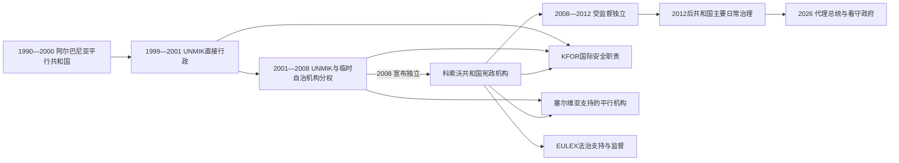

# 科索沃国家领导人与国际行政首脑表

## 范围与口径

本表区分四种不能混为一谈的权力：

1. **1990年代平行共和国**：由科索沃阿尔巴尼亚社会建立，具有选举、教育、医疗和海外筹资网络，却不控制警察、边境和主要国家机关。
2. **1999—2008年联合国临时管理**：联合国秘书长特别代表最初拥有最终立法、行政和司法权；2002年后本地总统与总理属于临时自治机构，权限受特别代表保留权约束。
3. **2008年后的共和国机构**：依科索沃宪法行使日常国家权力；国际承认不完整，国际安全和法治任务继续存在。
4. **短期代理与看守状态**：代理总统、代理总理、临时行政负责人都按实际任期单列，不把他们并入前后正式任职者。

联合国文件可能分别采用任命日、到任日、交接日或任务结束日，个别特别代表日期相差一两天。本表优先采用UNMIK历任负责人名录和公开履职日期，并在现任负责人处明确到任口径。现任信息核验截止到2026年7月14日。

## 1990年代平行共和国

### 总统

| 顺序 | 姓名 | 身份／政治基础 | 任期 | 产生与继承 | 关键事件与权力边界 |
|---:|---|---|---|---|---|
| 1 | **易卜拉欣·鲁戈瓦** | 科索沃民主联盟；平行共和国总统 | 1992-05-24—2000-02-01 | 1992年平行选举当选，1998年再次当选；平行机构并入联合临时行政结构后终止这一任职形态 | 领导非暴力抵抗、国际游说和教育医疗平行网络；不控制塞尔维亚警察、军队和边境。2002年又在UNMIK宪制框架下当选总统，属于另一制度任期。 |

1990年7月共和国宣言和9月卡恰尼克宪法通过后，平行制度尚未举行总统选举，因此1990—1992年不虚构总统任职者。鲁戈瓦的“历史总统”地位跨越不同制度，但表中把平行共和国与2002年后的临时自治总统分开。

### 政府首脑

| 顺序 | 姓名 | 政府形态 | 任期 | 与前任关系 | 关键事件与权力边界 |
|---:|---|---|---|---|---|
| 1 | 优素福·泽伊努拉胡 | 从原省级执行机构转入共和国过渡政府 | 约1990-09—1991-10 | 1989—1990年曾任科索沃省执行委员会主席，后参与平行共和国制度 | 任期起止在不同名录中有数日差异；为海外政府完全成形前的过渡首脑，实际控制有限。 |
| 2 | **布亚尔·布科希** | 共和国流亡／平行政府总理 | 1991-10-12—2000-02-01 | 由鲁戈瓦任命，接续过渡政府 | 主要在德国运作，以侨民捐款维持教育、医疗和外交网络；战争后随各平行机构协议解散。 |
| 并立 | **哈希姆·萨奇** | 科索沃解放军支持的临时政府总理 | 1999-04-02—2000-02-01 | 朗布依埃进程后由科索沃解放军政治系统建立，并非布科希政府的正常继承者 | 战争及战后初期与鲁戈瓦—布科希体系竞争代表权；在UNMIK建立联合临时行政结构后解散。 |

1999年同时存在布科希平行政府、萨奇临时政府、科索沃解放军地方指挥体系和UNMIK新行政。任何单一“总理名单”都不能说明谁控制警察、武装和公共机关，因此并立关系必须保留。

## 临时自治机构与共和国总统

| 顺序 | 姓名 | 身份 | 任期 | 产生／继承关系 | 关键事件与备注 |
|---:|---|---|---|---|---|
| 1 | **易卜拉欣·鲁戈瓦** | 临时自治机构总统 | 2002-03-04—2006-01-21 | 议会经跨党派协议选出；2004年议会选举后连任 | 在UNMIK保留最终权力下代表科索沃；主张独立和非暴力路线，在任内病逝。 |
| 代理 | 内杰特·达奇 | 议会议长、代理总统 | 2006-01-21—2006-02-10 | 因鲁戈瓦去世依法代理 | 维持总统职务连续，直至议会选出塞伊迪乌。 |
| 2 | **法特米尔·塞伊迪乌** | 临时自治机构总统；2008年后共和国总统 | 2006-02-10—2010-09-27 | 议会选出，跨越独立宣言与宪法生效 | 参与最终地位谈判、独立宣言和宪法国家建立；宪法法院认定兼任党魁与总统不相容后辞职。 |
| 代理 | 雅库普·克拉斯尼奇 | 议会议长、代理总统 | 2010-09-27—2011-02-22 | 塞伊迪乌辞职后代理 | 主持至新总统选出。 |
| 3 | 贝赫杰特·帕措利 | 共和国总统 | 2011-02-22—2011-03-30 | 议会选出 | 宪法法院认定选举程序违宪后离职，任期虽短仍单列。 |
| 代理 | 雅库普·克拉斯尼奇 | 议会议长、第二次代理总统 | 2011-03-30—2011-04-07 | 帕措利离职后再次代理 | 政党协商产生共识总统后交接。 |
| 4 | **阿蒂费特·亚希亚加** | 共和国总统 | 2011-04-07—2016-04-07 | 主要政党协商后由议会选出 | 首位女性总统；任内受监督独立结束、布鲁塞尔对话推进并建立专门法庭制度。 |
| 5 | **哈希姆·萨奇** | 共和国总统 | 2016-04-07—2020-11-05 | 议会选出，接替亚希亚加 | 推动与塞尔维亚最终协议讨论；专门检察官起诉获确认后辞职赴海牙。 |
| 代理 | 维约萨·奥斯马尼 | 议会议长、代理总统 | 2020-11-05—2021-03-22 | 萨奇辞职后依法代理 | 在政府合法性和提前选举期间履职；新议会选出议长后代理身份结束。 |
| 代理 | 格劳克·科纽夫察 | 新任议会议长、代理总统 | 2021-03-22—2021-04-04 | 因议长更替接续代理 | 仅履职至议会选出奥斯马尼。 |
| 6 | **维约萨·奥斯马尼** | 共和国总统 | 2021-04-04—2026-04-04 | 议会选出，完成五年任期 | 与库尔蒂政府共同经历北部危机、正常化对话和2025—2026年宪政僵局；议会未能选出继任者。 |
| 代理 | **阿尔布莱娜·哈吉乌** | 议会议长、代理总统 | 2026-04-04—今（截至2026-07-14） | 奥斯马尼任期届满且继任者未选出，由议长依法代理 | 宣布2026年6月7日提前议会选举；截至核验日仍以代理总统身份公开履职。 |

## 临时自治机构与共和国政府首脑

| 顺序 | 姓名 | 政党／身份 | 任期 | 产生／继承关系 | 关键事件与备注 |
|---:|---|---|---|---|---|
| 1 | **巴伊拉姆·雷杰皮** | 科索沃民主党 | 2002-03-04—2004-12-03 | UNMIK宪制框架下首个议会政府 | 建立部委与多党分权政府；2004年族群骚乱暴露本地与国际治理缺口。 |
| 2 | 拉穆什·哈拉迪纳伊 | 科索沃未来联盟 | 2004-12-03—2005-03-08 | 选举后联盟组阁 | 因前南刑庭起诉辞职并自愿赴海牙。 |
| 代理 | 阿德姆·萨利哈伊 | 科索沃民主联盟；副总理代行 | 2005-03-08—2005-03-25 | 哈拉迪纳伊辞职后的短期代理 | 在新总理获议会支持前维持政府运行。 |
| 3 | 巴伊拉姆·科苏米 | 科索沃议会党／未来联盟阵营 | 2005-03-25—2006-03-10 | 联盟内部继任 | 最终地位进程启动前后因执政支持下降辞职。 |
| 4 | 阿吉姆·切库 | 无党派／未来联盟支持 | 2006-03-10—2008-01-09 | 联盟推举 | 参与阿赫蒂萨里谈判和最终地位准备。 |
| 5 | **哈希姆·萨奇** | 科索沃民主党 | 2008-01-09—2014-12-09 | 2007年选举后组阁；2008年后成为共和国总理 | 宣读独立宣言，建立独立国家机构；任内推进国际承认、2011年技术对话和2013年布鲁塞尔协议。 |
| 6 | 伊萨·穆斯塔法 | 科索沃民主联盟 | 2014-12-09—2017-09-09 | 长期组阁僵局后与民主党联合 | 签署欧盟稳定与联系协定，推进塞族市镇共同体原则和黑山边界议题；政府遭不信任案。 |
| 7 | 拉穆什·哈拉迪纳伊 | 科索沃未来联盟 | 2017-09-09—2020-02-03 | 多党联盟组阁 | 批准黑山边界协议，对塞尔维亚商品加征100%关税；2019年因海牙问询辞职后看守至新政府成立。 |
| 8 | 阿尔宾·库尔蒂 | 自决运动；第一次政府 | 2020-02-03—2020-06-03 | 2019年选举后与民主联盟组阁 | 围绕关税、疫情紧急权和联盟关系遭不信任案；倒阁后看守至霍蒂政府就职。 |
| 9 | 阿夫杜拉·霍蒂 | 科索沃民主联盟 | 2020-06-03—2021-03-22 | 议会另组多数 | 参与华盛顿经济正常化安排；宪法法院认定关键支持票议员资格无效，触发提前选举。 |
| 10 | **阿尔宾·库尔蒂** | 自决运动；第二次政府 | 2021-03-22—2026-02-11 | 2021年选举后以稳定多数组阁 | 推动反腐、社会政策和北部法制统一；2022年塞族退出机构、2023年北部与班尼斯卡危机。2025年议会任期结束及组阁僵局期间转为看守，但同一内阁延续至2026年2月。 |
| 11 | **阿尔宾·库尔蒂** | 自决运动；第三次政府 | 2026-02-11—2026-03-06 | 2025年12月提前选举后获议会66票通过 | 新政府短暂正式履职；议会因总统选举失败进入解散争议。 |
| 看守 | **阿尔宾·库尔蒂** | 看守／代理总理 | 2026-03-06—今（截至2026-07-14） | 议会被解散后，原政府继续处理日常事务 | 2026年6月7日选举结果于7月8日获认证；截至核验日官方仍称其为代理总理，新政府尚未就职。 |

同一人因内阁重新获得议会授权或转为看守而分列，不把“政府任期”与个人连续在办公室的时间混为一谈。

## UNMIK历任最高负责人

联合国秘书长特别代表（SRSG）兼UNMIK负责人在1999—2008年是国际临时行政最高负责人。2008年后职位继续存在，但直接行政权显著缩减，主要承担地位中立的安全稳定、人权、社区沟通和国际联络任务。

| 顺序 | 姓名 | 国家／身份 | 任期 | 正式或代理 | 权力阶段与关键事项 |
|---:|---|---|---|---|---|
| 过渡 | **塞尔日奥·维埃拉·德梅洛** | 巴西 | 1999-06-11—1999-07-14 | 临时特别代表 | 在第1244号决议通过后建立任务基本架构和最初行政权。 |
| 1 | **贝尔纳·库什内** | 法国 | 1999-07-15—2001-01-12 | 正式 | 发布早期行政条例、建立四支柱与联合临时行政结构，处理回返和报复暴力。 |
| 2 | 汉斯·哈克鲁普 | 丹麦 | 2001-01-13—2001-12-31 | 正式 | 颁布2001年宪制框架，举行议会选举并准备临时自治机构。 |
| 代理 | 查尔斯·H·布雷肖 | 英国／联合国官员 | 2002-01-01—2002-02-14 | 代理 | 在哈克鲁普离任与施泰纳到任之间主持任务。 |
| 3 | 迈克尔·施泰纳 | 德国 | 2002-02-14—2003-07-08 | 正式 | 首届总统与政府形成，提出“标准先于地位”，扩大警察司法和回返工作。 |
| 代理 | 查尔斯·H·布雷肖 | 英国／联合国官员 | 2003-07-08—2003-08-25 | 代理 | 施泰纳离任后的第一次再代理。 |
| 4 | 哈里·霍尔克里 | 芬兰 | 2003-08-25—2004-06-11 | 正式 | 推动与贝尔格莱德技术对话；任内发生2004年3月骚乱，后因健康原因离任。 |
| 代理 | 查尔斯·H·布雷肖 | 英国／联合国官员 | 2004-06-11—2004-08-16 | 代理 | 在骚乱后重建与任务交接期第三次代理。 |
| 5 | 索伦·耶森-彼得森 | 丹麦 | 2004-08-16—2006-06-30 | 正式 | 从“标准先于地位”转向启动最终地位谈判，扩大本地机构权限。 |
| 代理 | 史蒂文·P·舒克 | 美国／联合国官员 | 2006-06-30—2006-08-31 | 代理 | 阿赫蒂萨里谈判期间维持任务运行。 |
| 6 | 约阿希姆·吕克尔 | 德国 | 2006-09-01—2008-06-20 | 正式 | 管理最终地位谈判末期、独立宣言和共和国宪法生效前后的过渡。 |
| 7 | 兰贝托·赞尼尔 | 意大利 | 2008-06-20—2011-07-01 | 正式 | UNMIK重组，直接行政权缩减，EULEX展开；在北部和不承认国家之间维持地位中立联络。 |
| 代理 | 罗伯特·E·索伦森 | 联合国官员 | 2011-07-01—2011-08-03 | 代理／负责人 | 北部边界危机初期主持任务，公开呼吁各方克制。 |
| 8 | 法里德·扎里夫 | 阿富汗 | 2011-08-03—2015-08-31 | 先代理后正式 | 处理北部危机、2013年布鲁塞尔协议及UNMIK缩编后的政治任务。 |
| 代理 | 西莫娜·米库莱斯库 | 罗马尼亚／联合国官员 | 2015-09-01—2015-10-09 | 代理 | 扎里夫离任与塔宁到任之间主持任务。 |
| 9 | 扎希尔·塔宁 | 阿富汗 | 2015-10-09—2021-11-04 | 正式 | 在布鲁塞尔协议执行、关税争端、2020年政府危机和疫情期间领导任务。 |
| 代理 | 巴里·琳恩·弗里曼 | 联合国官员 | 2021-11-04—2022-01-17 | 代理／负责人 | 塔宁离任后至齐亚德到任前主持任务。 |
| 10 | 卡罗琳·齐亚德 | 黎巴嫩 | 2022-01-17—2025-08-31 | 正式 | 关注北部机构退出、2023年冲突、班尼斯卡事件、社区信任和人权。 |
| 代理 | 米尔伯特·东俊·申 | 联合国官员 | 2025-09-01—2026年1月初 | 代理／副特别代表主持 | 齐亚德离任与杜埃到任之间维持任务；具体交接日公开口径不一，故以月初标示。 |
| 11 | **彼得·N·杜埃** | 丹麦 | 2026年1月初—今（截至2026-07-14） | 正式；2025-11-10公布任命，2026年1月初到任 | 现任UNMIK负责人；任务已不取代共和国政府，重点是对话、社区信任、人权和安理会报告。 |

## 2008—2012年国际民事监督

| 姓名 | 职位 | 任期 | 权限与终止 |
|---|---|---|---|
| **彼得·费特** | 国际民事代表，同时兼任欧盟特别代表 | 2008-02—2012-09-10 | 监督阿赫蒂萨里方案，可要求纠正不相容决定；国际指导小组宣布受监督独立结束后职位与办公室终止。 |

国际民事代表与UNMIK特别代表不是同一职位：前者以承认科索沃的国际指导小组和阿赫蒂萨里方案为基础，后者以联合国第1244号决议为基础并保持地位中立。

## 各阶段实际权力结构

| 阶段 | 国家元首／政治代表 | 政府首脑 | 最终行政权 | 安全权 | 关键限制 |
|---|---|---|---|---|---|
| 1990—1998年 | 鲁戈瓦及平行议会 | 布科希流亡政府 | 塞尔维亚共和国与南联盟机关掌握正式行政 | 塞尔维亚警察与南联盟军队 | 平行体制依赖社会服从和侨民资金。 |
| 1998—1999年战争 | 鲁戈瓦体系与科索沃解放军政治代表并立 | 布科希与萨奇政府并立 | 战区控制随军警和游击队变化 | 南联盟军警占优势，科索沃解放军控制部分乡村 | 无单一阿尔巴尼亚政治中心。 |
| 1999—2001年 | 本地政治领袖进入咨询／联合机构 | 无宪制总理 | UNMIK特别代表 | KFOR；UNMIK国际警察逐步建立 | 塞族飞地与北部另有塞尔维亚支持机构。 |
| 2002—2008年 | 临时自治总统 | 临时自治总理 | UNMIK特别代表保留最终权，本地政府管理日常部门 | KFOR、UNMIK警察与逐步扩大的科索沃警察 | 外交、最终地位和关键法治事务由国际机构保留。 |
| 2008—2012年 | 共和国总统 | 共和国总理 | 共和国机构行使主要行政；国际民事代表具有纠正权 | 科索沃警察、安全部队与KFOR并存 | 受监督独立、EULEX执行权及承认分歧。 |
| 2012—2026年 | 共和国总统；空缺时由议长代理 | 共和国总理；议会解散后可看守 | 共和国政府控制多数地区和日常政策 | 科索沃警察与安全部队；KFOR保持国际安全职责 | 北部整合、塞尔维亚资助网络、EULEX及UNMIK仍构成多层环境。 |
| 2026-04—2026-07-14 | 代理总统哈吉乌 | 看守总理库尔蒂 | 新议会和政府组建前由代理／看守机构维持连续 | 科索沃安全机构与KFOR | 总统职位空缺、6月选举结果刚获认证，不能把谈判中的人选视为就职。 |

## 现任核验摘要

| 角色 | 截至2026-07-14的在任者 | 核验口径 |
|---|---|---|
| 国家元首 | **阿尔布莱娜·哈吉乌，代理总统** | 总统府7月公开活动继续使用代理总统称谓；她由议长身份代理。 |
| 政府首脑 | **阿尔宾·库尔蒂，看守／代理总理** | 总理府7月新闻继续使用代理总理称谓；6月选举后新政府尚未就职。 |
| UNMIK负责人 | **彼得·N·杜埃** | UNMIK和联合国2026年领导名录及安理会简报。 |
| KFOR指挥官 | **厄兹坎·乌卢塔什少将** | 科索沃总理府2026年7月8日公开会晤所用现职称谓。 |
| 制度状态 | 新议会选举结果已于2026-07-08认证 | 组建议会、政府及选举正式总统仍需后续程序；本表不预判结果。 |

## 双向导航

- 历史过程：[自治撤销与科索沃战争](/%E4%BA%BA%E6%96%87%E7%A7%91%E5%AD%A6/%E5%8E%86%E5%8F%B2/%E6%AC%A7%E6%B4%B2/%E4%B8%9C%E5%8D%97%E6%AC%A7%E4%B8%8E%E5%B7%B4%E5%B0%94%E5%B9%B2/%E7%A7%91%E7%B4%A2%E6%B2%83/%E8%87%AA%E6%B2%BB%E6%92%A4%E9%94%80%E4%B8%8E%E7%A7%91%E7%B4%A2%E6%B2%83%E6%88%98%E4%BA%89.md)、[联合国临时管理时期](/%E4%BA%BA%E6%96%87%E7%A7%91%E5%AD%A6/%E5%8E%86%E5%8F%B2/%E6%AC%A7%E6%B4%B2/%E4%B8%9C%E5%8D%97%E6%AC%A7%E4%B8%8E%E5%B7%B4%E5%B0%94%E5%B9%B2/%E7%A7%91%E7%B4%A2%E6%B2%83/%E8%81%94%E5%90%88%E5%9B%BD%E4%B8%B4%E6%97%B6%E7%AE%A1%E7%90%86%E6%97%B6%E6%9C%9F.md)、[独立后的科索沃](/%E4%BA%BA%E6%96%87%E7%A7%91%E5%AD%A6/%E5%8E%86%E5%8F%B2/%E6%AC%A7%E6%B4%B2/%E4%B8%9C%E5%8D%97%E6%AC%A7%E4%B8%8E%E5%B7%B4%E5%B0%94%E5%B9%B2/%E7%A7%91%E7%B4%A2%E6%B2%83/%E7%8B%AC%E7%AB%8B%E5%90%8E%E7%9A%84%E7%A7%91%E7%B4%A2%E6%B2%83.md)。
- 国家总览：[科索沃历史](/%E4%BA%BA%E6%96%87%E7%A7%91%E5%AD%A6/%E5%8E%86%E5%8F%B2/%E6%AC%A7%E6%B4%B2/%E4%B8%9C%E5%8D%97%E6%AC%A7%E4%B8%8E%E5%B7%B4%E5%B0%94%E5%B9%B2/%E7%A7%91%E7%B4%A2%E6%B2%83/README.md)。
- 共同国家领导背景：[南斯拉夫国家元首与政府首脑表](/%E4%BA%BA%E6%96%87%E7%A7%91%E5%AD%A6/%E5%8E%86%E5%8F%B2/%E6%AC%A7%E6%B4%B2/%E4%B8%9C%E5%8D%97%E6%AC%A7%E4%B8%8E%E5%B7%B4%E5%B0%94%E5%B9%B2/%E5%8D%97%E6%96%AF%E6%8B%89%E5%A4%AB%E5%8E%86%E5%8F%B2/%E5%8D%97%E6%96%AF%E6%8B%89%E5%A4%AB%E5%9B%BD%E5%AE%B6%E5%85%83%E9%A6%96%E4%B8%8E%E6%94%BF%E5%BA%9C%E9%A6%96%E8%84%91%E8%A1%A8.md)。
- 塞尔维亚对话方领导：[塞尔维亚近现代国家元首与政府首脑表](/%E4%BA%BA%E6%96%87%E7%A7%91%E5%AD%A6/%E5%8E%86%E5%8F%B2/%E6%AC%A7%E6%B4%B2/%E4%B8%9C%E5%8D%97%E6%AC%A7%E4%B8%8E%E5%B7%B4%E5%B0%94%E5%B9%B2/%E5%A1%9E%E5%B0%94%E7%BB%B4%E4%BA%9A/%E5%A1%9E%E5%B0%94%E7%BB%B4%E4%BA%9A%E8%BF%91%E7%8E%B0%E4%BB%A3%E5%9B%BD%E5%AE%B6%E5%85%83%E9%A6%96%E4%B8%8E%E6%94%BF%E5%BA%9C%E9%A6%96%E8%84%91%E8%A1%A8.md)。
