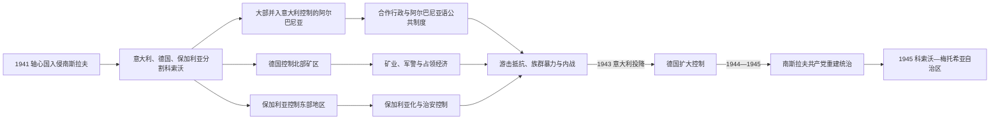

# 第二次世界大战时期的科索沃

## 时间

1941—1945年

## 概括

1941年轴心国肢解南斯拉夫后，科索沃没有成为单一占领区。大部分地区并入意大利控制的阿尔巴尼亚，北部矿区受德国占领的塞尔维亚行政体系控制，东部若干地区归保加利亚。对许多阿尔巴尼亚人而言，与阿尔巴尼亚合并意味着学校、行政和旗帜的民族化；对塞族、黑山族殖民者以及其他少数群体而言，这一变化伴随驱逐、暴力和财产丧失。合作、抵抗、内战、族群报复和列强战略相互叠加，不能用单一“解放”或“占领”叙事概括。

## 轴心国分割

1941年4月南斯拉夫王国迅速战败。意大利把科索沃大部与其1939年占领的阿尔巴尼亚合并，建立由阿尔巴尼亚官员参与的行政、警察和学校体系。德国保留对特雷普查矿山和通往塞尔维亚交通线至关重要的北部地区，保加利亚则控制东南部若干县区。边界随军事需要调整，本地居民可能在短距离内面对不同法律、货币和征用制度。

| 占领区 | 统治方式 | 关键目标 |
|---|---|---|
| 意大利—阿尔巴尼亚区 | 意大利最高权力下的阿尔巴尼亚民政、宪兵和地方精英合作 | 扩大意大利保护国的合法性，利用“大阿尔巴尼亚”动员。 |
| 德国区 | 军事占领与塞尔维亚傀儡行政并存，重视矿山、铁路和治安 | 确保特雷普查铅锌矿及战争工业供应。 |
| 保加利亚区 | 保加利亚军政和教育制度 | 控制通往马其顿与保加利亚的战略走廊，推进保加利亚化。 |

这种分割导致同一族群在不同占领区采取不同策略。合作可能出于民族目标、反共、地方自保或获得职位；抵抗也可能来自共产主义、保皇主义、塞尔维亚民族主义或反征用诉求。

## 合并“大阿尔巴尼亚”与地方行政

意大利支持的合并取消了战间期许多塞尔维亚行政安排，扩大阿尔巴尼亚语教育和公务员任用，允许阿尔巴尼亚国旗及文化组织。部分流亡者返回，地方精英接管被驱逐者或殖民者的土地。对长期被排除在公共机构之外的阿尔巴尼亚居民，这些变化具有真实吸引力；但最终主权属于意大利法西斯政权，军粮、劳役和安全行动仍服务占领战争。

战间期定居的塞族和黑山族殖民者成为报复目标，数万人逃离或被逐出；一些本地塞族村庄也遭袭击和财产侵占。确切人数因“殖民者”、战前居民、临时逃亡者与永久离境者的界定不同而有差异。与此同时，轴心当局也镇压反对者和共产主义者，阿尔巴尼亚居民并非统一受益者。

## 抵抗力量与内部冲突

南斯拉夫共产党最初在科索沃的组织较弱，原因包括阿尔巴尼亚居民对恢复战前南斯拉夫秩序的警惕、民族自决承诺不清、地方党员人数有限以及占领当局镇压。随着战争发展，阿尔巴尼亚和塞尔维亚游击队网络逐步扩大，并与阿尔巴尼亚民族解放运动及马其顿部队联系。

塞尔维亚保皇派切特尼克力量在北部及邻近地区活动，其目标通常是恢复君主制南斯拉夫并维护塞尔维亚领土；部分部队也参与针对穆斯林和阿尔巴尼亚平民的报复。阿尔巴尼亚民族主义武装则包括地方民兵、巴利·孔贝塔尔支持者和占领当局招募单位，既与共产党作战，也保护或扩张地方权力。阵营会因地区、家族和战局变化而转换。

## 1943年后的德国占领

1943年9月意大利投降后，德国迅速接管原意大利区，维持与阿尔巴尼亚合并的行政外观，以较小兵力依靠地方合作力量守卫交通和矿山。1944年建立的党卫军“斯坎德培”师主要在科索沃招募阿尔巴尼亚人，训练、纪律和战斗力有限，参与反游击行动，并有成员卷入迫害塞族、罗姆人、犹太人和政治反对者。大量逃亡和德国战略撤退使该师很快瓦解。

科索沃的犹太居民和从塞尔维亚逃来的犹太人命运因占领区而异。一些人得到阿尔巴尼亚家庭或游击网络保护，另一些人在德国接管后被捕、转运并遇害。以“全部获救”或“普遍合作”概括都会抹去地区差异与具体受害者。

## 布亚尼会议与自决承诺

1943年12月31日至1944年1月2日，科索沃和杜卡吉尼民族解放委员会在布亚尼举行会议。与会者宣称科索沃及杜卡吉尼居民多数为阿尔巴尼亚人，希望在反法西斯胜利后依据民族自决与阿尔巴尼亚统一。文件同时把实现这一目标与参加南斯拉夫和阿尔巴尼亚共产党领导的共同战争联系起来。

南斯拉夫共产党中央领导没有接受把科索沃并入阿尔巴尼亚的结论，强调边界问题应在战争后处理。布亚尼决议后来成为科索沃阿尔巴尼亚政治记忆中的重要承诺，也成为关于共产党是否背弃自决原则的争论核心。它不是得到盟国或南斯拉夫最高机构确认的国际条约，却真实反映当地游击组织为争取群众支持所作的政治表达。

## 1944年解放、征服与新冲突

1944年秋德军从巴尔干撤退，南斯拉夫游击队、阿尔巴尼亚游击队和保加利亚倒戈后的军队从不同方向进入科索沃。共产党将这一过程称为解放和恢复联邦秩序；反对者则担心战前塞尔维亚统治复归。部分阿尔巴尼亚民族主义武装拒绝缴械，德雷尼察、费里扎伊等地爆发战斗。

沙班·波卢扎最初与游击队合作，后反对把科索沃部队调往斯雷姆前线，并要求优先保护当地阿尔巴尼亚村庄。1945年初德雷尼察冲突被新南斯拉夫军队镇压，波卢扎死亡。新政权实行军事管理、逮捕合作人员和反对者，过程中发生未经审判处决和报复；同时也追究部分战争罪行、解除民兵并恢复交通。

## 战时暴力与人口后果

- 塞族与黑山族殖民者及部分本地居民遭驱逐、杀害或失去土地。
- 阿尔巴尼亚平民在保加利亚、德国、切特尼克和南斯拉夫军队的治安行动中伤亡。
- 罗姆人、犹太人及被指为合作者或共产党人的居民受到不同占领力量迫害。
- 1944—1945年政权转换引发新的清算、失踪和监禁。
- 战前土地所有权被多次重新分配，返乡者、占有人和新政权之间的冲突延续到战后。

受害统计受战争档案不全、政治宣传和身份分类影响。负责任的叙述应同时承认轴心占领体系、地方合作暴力、反法西斯抵抗以及战后清算，而不以一方受害否定另一方。

## 战后地位的决定

南斯拉夫共产党没有恢复王国时期完全相同的中央制度，也没有执行科索沃并入阿尔巴尼亚的主张。1945年，科索沃—梅托希亚自治区被置于南斯拉夫联邦内的塞尔维亚人民共和国。选择有限自治的原因包括：

- 承认科索沃阿尔巴尼亚人口及战争动员需要某种制度安排。
- 塞尔维亚共产党和南斯拉夫领导层坚持共和国边界与战前国际边界，不愿把领土交给阿尔巴尼亚。
- 铁托最初设想更广泛巴尔干联邦，允许边界问题暂缓，但南斯拉夫—阿尔巴尼亚关系1948年破裂后这一前景消失。
- 中央担心民族主义、边境安全和反共武装，因而把自治与强力安全控制结合。

1945年的自治区权限很有限，真正的高自治要到1960年代末和1974年宪制改革后才出现。

## 重要事件

| 时间 | 事件 | 影响 |
|---|---|---|
| 1941年4月 | 轴心国入侵并分割科索沃 | 南斯拉夫国家权力崩溃，不同占领制度同时存在。 |
| 1941—1943年 | 大部与意大利控制的阿尔巴尼亚合并 | 阿尔巴尼亚语公共制度扩张，塞黑殖民者遭大规模驱逐。 |
| 1943年9月 | 意大利投降、德国接管 | 占领更依赖地方民兵和民族主义组织。 |
| 1943年末—1944年初 | 布亚尼会议 | 提出战后自决与同阿尔巴尼亚统一愿望，未获南共最高领导接受。 |
| 1944年 | “斯坎德培”师组建并迅速瓦解 | 成为合作、反游击与迫害少数群体的争议象征。 |
| 1944年秋 | 德军撤退、共产党军队进入 | 轴心统治结束，关于“解放”还是“再征服”的记忆分裂。 |
| 1945年初 | 德雷尼察冲突与波卢扎抵抗 | 新政权以军事手段压制拒绝调动和反对恢复南斯拉夫统治的武装。 |
| 1945年 | 建立科索沃—梅托希亚自治区 | 科索沃留在塞尔维亚内，获得有限自治。 |

## 演变关系

- 前一阶段：[塞尔维亚王国与南斯拉夫王国时期](/%E4%BA%BA%E6%96%87%E7%A7%91%E5%AD%A6/%E5%8E%86%E5%8F%B2/%E6%AC%A7%E6%B4%B2/%E4%B8%9C%E5%8D%97%E6%AC%A7%E4%B8%8E%E5%B7%B4%E5%B0%94%E5%B9%B2/%E7%A7%91%E7%B4%A2%E6%B2%83/%E5%A1%9E%E5%B0%94%E7%BB%B4%E4%BA%9A%E7%8E%8B%E5%9B%BD%E4%B8%8E%E5%8D%97%E6%96%AF%E6%8B%89%E5%A4%AB%E7%8E%8B%E5%9B%BD%E6%97%B6%E6%9C%9F.md)。
- 后一阶段：[社会主义南斯拉夫自治省时期](/%E4%BA%BA%E6%96%87%E7%A7%91%E5%AD%A6/%E5%8E%86%E5%8F%B2/%E6%AC%A7%E6%B4%B2/%E4%B8%9C%E5%8D%97%E6%AC%A7%E4%B8%8E%E5%B7%B4%E5%B0%94%E5%B9%B2/%E7%A7%91%E7%B4%A2%E6%B2%83/%E7%A4%BE%E4%BC%9A%E4%B8%BB%E4%B9%89%E5%8D%97%E6%96%AF%E6%8B%89%E5%A4%AB%E8%87%AA%E6%B2%BB%E7%9C%81%E6%97%B6%E6%9C%9F.md)。
- 共同背景：[第二次世界大战时期的南斯拉夫](/%E4%BA%BA%E6%96%87%E7%A7%91%E5%AD%A6/%E5%8E%86%E5%8F%B2/%E6%AC%A7%E6%B4%B2/%E4%B8%9C%E5%8D%97%E6%AC%A7%E4%B8%8E%E5%B7%B4%E5%B0%94%E5%B9%B2/%E5%8D%97%E6%96%AF%E6%8B%89%E5%A4%AB%E5%8E%86%E5%8F%B2/%E7%AC%AC%E4%BA%8C%E6%AC%A1%E4%B8%96%E7%95%8C%E5%A4%A7%E6%88%98%E6%97%B6%E6%9C%9F%E7%9A%84%E5%8D%97%E6%96%AF%E6%8B%89%E5%A4%AB.md)、[阿尔巴尼亚](/%E4%BA%BA%E6%96%87%E7%A7%91%E5%AD%A6/%E5%8E%86%E5%8F%B2/%E6%AC%A7%E6%B4%B2/%E4%B8%9C%E5%8D%97%E6%AC%A7%E4%B8%8E%E5%B7%B4%E5%B0%94%E5%B9%B2/%E9%98%BF%E5%B0%94%E5%B7%B4%E5%B0%BC%E4%BA%9A.md)。
- 返回：[科索沃历史](/%E4%BA%BA%E6%96%87%E7%A7%91%E5%AD%A6/%E5%8E%86%E5%8F%B2/%E6%AC%A7%E6%B4%B2/%E4%B8%9C%E5%8D%97%E6%AC%A7%E4%B8%8E%E5%B7%B4%E5%B0%94%E5%B9%B2/%E7%A7%91%E7%B4%A2%E6%B2%83/README.md)。
