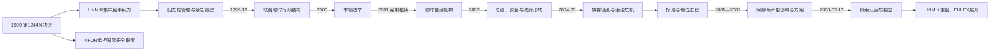

# 联合国临时管理时期

## 时间

1999—2008年

## 别称

UNMIK时期、联合国管理下的科索沃

## 概括

1999年6月，联合国安理会第1244号决议授权建立国际民事与安全存在。联合国科索沃临时行政当局特派团（UNMIK）最初集中行使立法、行政和司法权，北约主导的科索沃部队（KFOR）负责安全。此后权力逐步移交给民选的临时自治机构，但外交、最终地位、少数群体安全和部分法治事务仍由国际机构保留。难民回返、少数族群外逃、米特罗维察分裂、2004年骚乱及最终地位谈判决定了这一过渡时期的成败边界。

## 第1244号决议的制度安排

安理会第1244号决议在战争结束后建立了有意保持模糊的法律框架。它授权联合国提供临时行政，使科索沃居民享有实质自治；要求南联盟与塞尔维亚军警撤出，允许有限人员在将来承担联络、遗产保护等特定任务；同时重申成员国对南联盟主权和领土完整的承诺，并要求通过政治进程决定最终地位。

这种组合让不同方面保留相反解释：

- 塞尔维亚认为决议确认科索沃仍属其领土，国际管理只是临时安排。
- 科索沃阿尔巴尼亚领导人认为南联盟暴力、撤军和自决进程使独立成为唯一可持续结局。
- 联合国在任务执行中采取“地位中立”，既不建立塞尔维亚实际统治，也不预先承认独立。
- 承认与不承认科索沃的国家后来都援引决议中的不同部分。

因此，1999年不是国家地位的最终法律结算，而是有效控制和行政权的根本转移。

## UNMIK与KFOR的权力结构

UNMIK首份行政条例宣布科索沃全部立法、行政权以及司法管理权归特别代表行使。特别代表可以发布具有法律效力的条例、任免官员、管理公共财产和推翻本地机构决定。历任联合国秘书长特别代表及其准确任期见[科索沃国家领导人与国际行政首脑表](/%E4%BA%BA%E6%96%87%E7%A7%91%E5%AD%A6/%E5%8E%86%E5%8F%B2/%E6%AC%A7%E6%B4%B2/%E4%B8%9C%E5%8D%97%E6%AC%A7%E4%B8%8E%E5%B7%B4%E5%B0%94%E5%B9%B2/%E7%A7%91%E7%B4%A2%E6%B2%83/%E7%A7%91%E7%B4%A2%E6%B2%83%E5%9B%BD%E5%AE%B6%E9%A2%86%E5%AF%BC%E4%BA%BA%E4%B8%8E%E5%9B%BD%E9%99%85%E8%A1%8C%E6%94%BF%E9%A6%96%E8%84%91%E8%A1%A8.md)。

初期“四支柱”分工如下：

| 支柱 | 主导机构 | 主要职责 |
|---|---|---|
| 第一支柱 | 联合国／早期由联合国难民署承担人道事务 | 民事行政、警察和司法；人道紧急阶段结束后重新组合。 |
| 第二支柱 | 联合国 | 地方行政、公共服务和法规执行。 |
| 第三支柱 | 欧洲安全与合作组织 | 民主化、选举、媒体、人权和机构培训。 |
| 第四支柱 | 欧洲联盟 | 经济重建、企业和金融制度。 |
| 国际安全存在 | 北约主导的KFOR | 维持安全环境、解除武装、边界与行动自由，职责不隶属UNMIK行政链。 |

KFOR与UNMIK相互合作但并非同一指挥系统。随着科索沃警察、司法和自治政府建立，国际机构从直接执行转向监督、保留权和危机处置。

## 紧急重建与权力真空

1999年夏，阿尔巴尼亚难民快速返乡，公共机构、警察、法院、能源和住房系统却严重破坏。许多塞族、罗姆人及被视为合作方的阿尔巴尼亚人遭绑架、杀害、纵火或威胁，大批居民逃往塞尔维亚、中部和北部飞地。科索沃解放军成员在地方安全、财产和行政中填补真空，部分指挥官建立事实权力网络。

UNMIK必须同时完成相互冲突的任务：恢复基本服务、解除科索沃解放军武装、保护少数群体、组织回返、建立中立警察司法并避免形成永久国际殖民式治理。国际人员到位缓慢，语言、档案和本地知识不足；KFOR各国责任区做法不同，使早期暴力和财产占领难以及时制止。

科索沃解放军依据协议解散，部分成员进入科索沃保护团。保护团名义上是民事紧急和灾害响应机构，不是军队，但许多阿尔巴尼亚人把它视为未来武装力量胚胎，塞族社会则担心原游击网络合法化。

## 米特罗维察与塞族飞地

伊巴尔河把米特罗维察分为阿尔巴尼亚人占多数的南部和塞族占多数的北部。北部与塞尔维亚在医疗、教育、工资和安全方面保持联系，桥梁和社区边界多次发生冲突。塞尔维亚资助的“平行机构”与UNMIK、后来科索沃自治机构的权限重叠，使北部成为有效控制分裂最明显地区。

其他塞族居民集中在格拉查尼察、什特尔普采及分散村庄和修道院周边。KFOR设检查点、护送车队并保护重要正教遗产，安全改善却常以隔离为代价。回返者面临被占房产、失业、交通风险和缺少信任，少数群体自由行动长期受限。

## 联合临时行政结构

1999年12月，UNMIK与主要科索沃政治力量成立联合临时行政结构。特别代表仍有最终权力，本地代表共同领导行政部门；鲁戈瓦的民主联盟、原科索沃解放军政治派别和塞族代表参与程度不同。科索沃解放军领导的临时政府与鲁戈瓦平行政府于2000年初形式上终止，把人员和政治竞争转入UNMIK框架。

2000年市镇选举由欧洲安全与合作组织组织，民主联盟占优势。选举让地方政府获得社会授权，也暴露塞族抵制和选民登记、失踪者、流离失所者参与等问题。

## 2001年宪制框架与临时自治机构

UNMIK在2001年颁布《临时自治宪制框架》，建立120席议会、总统、总理和政府。议会为塞族及其他非多数族群保留席位，并设语言、社区权利和重要利益保障。2001年议会选举后，各主要阿尔巴尼亚政党经过数月谈判，于2002年选举易卜拉欣·鲁戈瓦为总统、巴伊拉姆·雷杰皮为总理。

自治机构负责教育、卫生、经济、地方行政等日常政策，特别代表保留以下核心权限：

- 最终地位、外交和与南联盟有关事务。
- 公共安全的关键部分及对KFOR的协调。
- 任命国际法官和检察官、推翻违反第1244号决议的决定。
- 管理部分公共财产、国有企业和私有化规则。
- 保护社区权利、边界及国际协议。
- 解散议会或否决法律的最终权力。

这种“本地负责、国际保留”的结构培养了行政能力，也造成责任模糊：本地政府可把失败归于国际否决，UNMIK则依赖缺少充分执行力的本地伙伴。

## 重要政治阶段

| 时间 | 本地机构发展 | 国际权力变化 |
|---|---|---|
| 1999—2000年 | 联合临时行政结构、市镇政治形成 | UNMIK直接管理全部关键部门。 |
| 2001—2002年 | 宪制框架、议会、总统和政府建立 | 日常社会经济权限开始移交。 |
| 2003—2004年 | 本地部委扩展、与贝尔格莱德技术对话启动 | 特别代表仍可否决法律，警务司法逐步本地化。 |
| 2004—2005年 | 骚乱后政府改组，国际审查加强 | “先标准、后地位”转向标准与地位并行。 |
| 2005—2007年 | 多党代表参与最终地位谈判 | 联合国特使主持谈判，UNMIK准备重组。 |
| 2008年 | 议会代表宣布独立、宪法制定 | UNMIK无法在安理会取得统一授权结束，实际权能缩减。 |

各届总统、总理及短期代理者均列于[科索沃国家领导人与国际行政首脑表](/%E4%BA%BA%E6%96%87%E7%A7%91%E5%AD%A6/%E5%8E%86%E5%8F%B2/%E6%AC%A7%E6%B4%B2/%E4%B8%9C%E5%8D%97%E6%AC%A7%E4%B8%8E%E5%B7%B4%E5%B0%94%E5%B9%B2/%E7%A7%91%E7%B4%A2%E6%B2%83/%E7%A7%91%E7%B4%A2%E6%B2%83%E5%9B%BD%E5%AE%B6%E9%A2%86%E5%AF%BC%E4%BA%BA%E4%B8%8E%E5%9B%BD%E9%99%85%E8%A1%8C%E6%94%BF%E9%A6%96%E8%84%91%E8%A1%A8.md)。

## 2004年3月骚乱

2004年3月，一则关于阿尔巴尼亚儿童在伊巴尔河溺亡并被塞族人追赶的未经证实叙述，经媒体和政治网络迅速传播。科索沃多地爆发针对塞族、罗姆人及正教宗教遗产的暴力，也有阿尔巴尼亚人与国际安全人员伤亡。两天内约19人死亡、数百人受伤、四千余人流离失所，大量住房和数十处教堂、修道院或宗教建筑被破坏。

骚乱暴露：

- 国际情报、警务指挥和KFOR快速反应不足。
- 失业、青年挫折和地位僵局易被民族主义动员。
- 媒体核查和政治领导危机沟通失败。
- 少数群体回返与文化遗产保护远未达到稳定标准。
- 阿尔巴尼亚多数社会内部对暴力的制止能力和追责存在缺口。

国际机构随后加强警察改革、社区保护和遗产重建，但塞族社会对科索沃机构的不信任进一步加深。

## “标准先于地位”与谈判启动

联合国最初提出科索沃需在民主治理、法治、少数族群权利、回返、经济和与贝尔格莱德对话方面达到标准，才能讨论最终地位。2004年暴力显示无限期推迟地位同样会制造不稳定。2005年联合国评估认为标准执行不完整，但维持现状不可持续，安理会遂支持启动地位谈判。

前芬兰总统马尔蒂·阿赫蒂萨里主持2006—2007年谈判。塞尔维亚提出实质自治但坚持主权，科索沃阿尔巴尼亚代表坚持独立，双方在根本地位上没有交集。阿赫蒂萨里方案建议：

- 科索沃在国际监督下独立。
- 以宪法保障多民族国家、官方语言和社区席位。
- 向塞族占多数市镇下放教育、医疗和地方权限。
- 对塞尔维亚正教会遗产设保护区和制度保障。
- 保留国际民事代表、EULEX和KFOR。
- 禁止科索沃与其他国家合并。

塞尔维亚和俄罗斯反对方案，安理会未通过将其转化为新决议的文本。美国和多数欧盟成员认为谈判穷尽，支持由科索沃依方案单独行动；俄罗斯、塞尔维亚及部分国家坚持第1244号决议不能被绕过。

## 经济与法治建设

UNMIK建立中央财政、海关、银行监管、欧元支付体系和私有化机构，恢复电力、道路与学校。经济增长很大程度依赖国际援助、侨汇、进口和公共消费，失业、非正规经济、土地档案冲突与电力短缺持续。社会对私有化透明度、原南斯拉夫企业所有权和员工权益争议很大。

本地警察从多族群招募起步，逐步接手日常治安。司法系统同时使用本地法官、国际法官和多层旧法源，案件积压、证人保护和战争罪调查困难。对科索沃解放军前成员的案件容易引发政治压力，对塞尔维亚境内嫌疑人又缺少管辖和引渡，形成长期追责缺口。

## 2008年的制度转换

2007年末最后一轮美欧俄“三驾马车”调解没有达成妥协。2008年2月17日，科索沃民选代表宣布独立并承诺执行阿赫蒂萨里方案。新宪法于6月15日生效。国际民事办公室监督独立实施，欧盟法治特派团承担部分警务、司法和海关支持；KFOR继续依据第1244号决议驻留。

UNMIK因安理会成员对独立意见分裂而没有正式终止。它随后缩编和重组，把重点转向安全、稳定、人权、社区沟通及与不承认科索沃的机构联络。由此出现多层并存：共和国机构主张主权，UNMIK保持地位中立，EULEX以欧洲法治任务运作，KFOR维持国际军事存在，塞尔维亚继续支持部分塞族机构。

## 成败评估

### 主要成果

- 在战争废墟中恢复公共服务、选举、警察、法院和财政。
- 让难民大规模返乡，并建立非多数族群保留席位及语言权框架。
- 从直接国际行政逐步培育本地议会和政府。
- 避免科索沃重新陷入持续的常规战争。
- 为最终地位谈判和宪法制度提供行政基础。

### 主要局限

- 早期未能阻止对塞族、罗姆人及政治对手的报复。
- 北部与飞地长期分裂，回返人数有限。
- 2004年骚乱显示国际治理与本地责任均不足。
- 高度行政权缺少直接民主问责，法规和私有化常被视为外来决定。
- 地位中立既使各方留在框架内，也推迟主权冲突解决。
- 战争罪、失踪人员和财产权案件积压，成为独立后的持续负担。

## 重要事件

| 时间 | 事件 | 影响 |
|---|---|---|
| 1999年6月 | 第1244号决议、KFOR和UNMIK部署 | 建立国际行政与安全框架。 |
| 1999年末 | 联合临时行政结构成立 | 本地政治力量进入共同管理。 |
| 2000年 | 首次市镇选举 | 民选地方政府恢复。 |
| 2001年 | 临时自治宪制框架和议会选举 | 建立总统、总理、议会和保留席位制度。 |
| 2002年 | 鲁戈瓦与雷杰皮政府就职 | 临时自治机构开始系统运作。 |
| 2004年3月 | 大规模族群骚乱 | 少数群体保护和国际治理遭严重质疑。 |
| 2005年 | 最终地位进程启动 | 现状被认定不可持续。 |
| 2007年 | 阿赫蒂萨里方案与安理会僵局 | 监督独立方案形成，却无新安理会决议。 |
| 2008年2月 | 宣布独立 | 国际直接行政转向多层监督与支持。 |
| 2008年6—12月 | 宪法生效、UNMIK重组、EULEX展开 | 共和国机构取得主要日常权力。 |

## 演变关系

- 前一阶段：[自治撤销与科索沃战争](/%E4%BA%BA%E6%96%87%E7%A7%91%E5%AD%A6/%E5%8E%86%E5%8F%B2/%E6%AC%A7%E6%B4%B2/%E4%B8%9C%E5%8D%97%E6%AC%A7%E4%B8%8E%E5%B7%B4%E5%B0%94%E5%B9%B2/%E7%A7%91%E7%B4%A2%E6%B2%83/%E8%87%AA%E6%B2%BB%E6%92%A4%E9%94%80%E4%B8%8E%E7%A7%91%E7%B4%A2%E6%B2%83%E6%88%98%E4%BA%89.md)。
- 后一阶段：[独立后的科索沃](/%E4%BA%BA%E6%96%87%E7%A7%91%E5%AD%A6/%E5%8E%86%E5%8F%B2/%E6%AC%A7%E6%B4%B2/%E4%B8%9C%E5%8D%97%E6%AC%A7%E4%B8%8E%E5%B7%B4%E5%B0%94%E5%B9%B2/%E7%A7%91%E7%B4%A2%E6%B2%83/%E7%8B%AC%E7%AB%8B%E5%90%8E%E7%9A%84%E7%A7%91%E7%B4%A2%E6%B2%83.md)。
- 国际行政表：[科索沃国家领导人与国际行政首脑表](/%E4%BA%BA%E6%96%87%E7%A7%91%E5%AD%A6/%E5%8E%86%E5%8F%B2/%E6%AC%A7%E6%B4%B2/%E4%B8%9C%E5%8D%97%E6%AC%A7%E4%B8%8E%E5%B7%B4%E5%B0%94%E5%B9%B2/%E7%A7%91%E7%B4%A2%E6%B2%83/%E7%A7%91%E7%B4%A2%E6%B2%83%E5%9B%BD%E5%AE%B6%E9%A2%86%E5%AF%BC%E4%BA%BA%E4%B8%8E%E5%9B%BD%E9%99%85%E8%A1%8C%E6%94%BF%E9%A6%96%E8%84%91%E8%A1%A8.md)。
- 返回：[科索沃历史](/%E4%BA%BA%E6%96%87%E7%A7%91%E5%AD%A6/%E5%8E%86%E5%8F%B2/%E6%AC%A7%E6%B4%B2/%E4%B8%9C%E5%8D%97%E6%AC%A7%E4%B8%8E%E5%B7%B4%E5%B0%94%E5%B9%B2/%E7%A7%91%E7%B4%A2%E6%B2%83/README.md)。
