# 自治撤销与科索沃战争

## 时间

1989—1999年

## 概括

1989—1990年塞尔维亚通过修宪、紧急措施和解散省级机构，大幅取消科索沃在1974年体制下的自治。多数阿尔巴尼亚公务员、教师、警察与工人被排除出国家机构，科索沃阿尔巴尼亚社会建立平行议会、政府、教育、医疗和税收网络，并由易卜拉欣·鲁戈瓦推动非暴力国际化路线。长期政治僵局、塞尔维亚警察压制、代际变化和1995年代顿和谈未处理科索沃问题，使科索沃解放军逐渐取得影响。1998年冲突升级为战争；1999年北约空袭、南联盟与塞尔维亚军警的大规模驱逐行动、库马诺沃协定和安理会第1244号决议终结贝尔格莱德的现场统治。

```mermaid
flowchart LR
    A["1989 塞尔维亚修宪削减自治"] --> B["1990 省议会与政府被解散"]
    B --> C["科索沃阿尔巴尼亚平行共和国"]
    C --> D["鲁戈瓦非暴力抵抗与平行社会"]
    D -->|1995 后政治失望扩大| E["科索沃解放军崛起"]
    E -->|1998 德雷尼察战争升级| F["塞尔维亚与南联盟大规模安全行动"]
    F --> G["停火、核查与拉察克事件"]
    G --> H["朗布依埃谈判失败"]
    H -->|1999-03-24| I["北约空袭南联盟"]
    I --> J["大规模驱逐、杀戮与跨境难民潮"]
    J -->|1999-06| K["库马诺沃协定与第1244号决议"]
    K --> L["塞军警撤出、KFOR与UNMIK进入"]
```

## 1989—1990年的制度断裂

1989年3月塞尔维亚宪法修正案收回对警察、司法、教育、经济和修宪程序的控制。科索沃议会在紧急状态、军警部署和政治压力下通过修正案，多数阿尔巴尼亚政治力量否认其自由和合法性。罢工、示威与镇压持续，人员伤亡和大规模逮捕进一步破坏省级机构的代表性。

1990年塞尔维亚当局先后接管警察、媒体和企业，解散科索沃议会与执行委员会。大批阿尔巴尼亚官员、教师、医生、矿工和产业工人被解职或拒绝接受新忠诚要求。塞尔维亚政府将措施解释为恢复共和国统一法制、制止分离主义和保护塞族居民；阿尔巴尼亚社会则把它视为取消自治、民族歧视与警察统治。

## 平行共和国的建立

1990年7月2日，科索沃议会中的阿尔巴尼亚代表在议会大楼外宣布科索沃为南斯拉夫框架内共和国。9月7日，他们在卡恰尼克秘密通过宪法。1991年非官方公投支持独立，1992年举行平行总统和议会选举，易卜拉欣·鲁戈瓦当选总统；布亚尔·布科希领导主要设在海外的政府。

这些机构没有获得广泛国际承认，也没有控制警察、边境或主要公共财产，却形成真实社会能力：

- 海外侨民以俗称“百分之三基金”的捐款支持教师、医生、政党和外交活动。
- 被国家学校排除的阿尔巴尼亚学生在私人住宅、地下室和临时校舍上课。
- 医疗、社会救助、文化出版和体育组织在非国家网络中运行。
- 民主联盟通过地方支部、知识分子和家族网络维持广泛动员。
- 阿尔巴尼亚居民普遍抵制塞尔维亚选举与机构，形成同一领土上的双重社会。

完整的平行共和国总统、政府首脑及后来的临时自治领导见[科索沃国家领导人与国际行政首脑表](/%E4%BA%BA%E6%96%87%E7%A7%91%E5%AD%A6/%E5%8E%86%E5%8F%B2/%E6%AC%A7%E6%B4%B2/%E4%B8%9C%E5%8D%97%E6%AC%A7%E4%B8%8E%E5%B7%B4%E5%B0%94%E5%B9%B2/%E7%A7%91%E7%B4%A2%E6%B2%83/%E7%A7%91%E7%B4%A2%E6%B2%83%E5%9B%BD%E5%AE%B6%E9%A2%86%E5%AF%BC%E4%BA%BA%E4%B8%8E%E5%9B%BD%E9%99%85%E8%A1%8C%E6%94%BF%E9%A6%96%E8%84%91%E8%A1%A8.md)。

## 非暴力路线的机制与局限

鲁戈瓦主张避免与优势明显的南斯拉夫军队正面冲突，以社会自我组织、国际游说和等待外部条件变化推进独立。这一策略在波黑战争最激烈阶段减少了科索沃迅速陷入全面战争的风险，也让阿尔巴尼亚社会保持教育与政治组织。

但其局限逐步显现：

1. 平行机构无法阻止警察搜查、任意拘押、殴打和财产侵害。
2. 国际社会在波黑战争中优先处理停火，1995年代顿协定没有解决科索沃地位。
3. 教育与就业长期隔离使青年看不到非暴力路线的具体成果。
4. 海外侨民中支持武装斗争的筹资网络扩大。
5. 阿尔巴尼亚1997年国家秩序崩溃后，大量武器流入边境地区。
6. 塞尔维亚反对派也很少接受恢复1974年自治或独立，谈判空间有限。

1996年鲁戈瓦与米洛舍维奇就教育设施达成原则协议，但执行迟缓。协议失败被许多青年视为和平谈判无力的证据。

## 科索沃解放军的形成

科索沃解放军源于1980年代地下民族主义组织、流亡网络和地方武装小组，1990年代中期开始公开承认对塞尔维亚警察、官员及被指为合作者的阿尔巴尼亚人发动袭击。它最初规模小、组织分散，塞尔维亚当局将其定性为恐怖组织；随着国家报复波及平民，越来越多村庄提供人员、情报和庇护。

1998年3月，塞尔维亚特警围攻德雷尼察普雷卡兹的阿德姆·亚沙里家族院落，亚沙里及数十名家人和战斗人员死亡。事件使亚沙里成为抵抗象征，科索沃解放军招募激增。1998年春夏，该组织一度控制连接村庄的乡村地带和道路，设置检查站并试图建立地方行政。

科索沃解放军并非统一常规军。地方指挥官、侨民政治派别、阿尔巴尼亚境内补给线和后来的临时总参谋部并存。其成员袭击和绑架塞族、罗姆人、阿尔巴尼亚政治对手及被认定的合作者，部分拘押者失踪或被杀；这些罪行不能因其反抗国家压制的目标而忽略。

## 1998年战争升级

南联盟军队、塞尔维亚内务部警察和特种部队使用重武器清除科索沃解放军据点，焚毁被视为支援游击队的村庄，大批居民反复逃入山地或邻国。普雷卡兹、上奥布里涅等行动中平民大量死亡。科索沃解放军也处决俘虏、袭击村庄和切断道路，但国家力量在火力、拘押系统和大范围人口控制上的规模远大于游击组织。

| 阶段 | 主要过程 | 转折 |
|---|---|---|
| 1998年2—3月 | 德雷尼察警察行动与普雷卡兹围攻 | 武装抵抗由边缘路线转为大众动员。 |
| 1998年春夏 | 科索沃解放军扩张乡村控制 | 塞尔维亚和南联盟投入更大兵力。 |
| 1998年夏秋 | 安全部队反攻、村庄破坏和人口流离失所 | 国际制裁和北约武力威胁增强。 |
| 1998年10月 | 米洛舍维奇与美国特使达成核查安排 | 南联盟部分减兵，欧洲安全与合作组织核查团进驻。 |
| 1998年冬 | 双方利用停火整补，冲突继续 | 核查无法形成强制执行机制。 |

## 拉察克与朗布依埃谈判

1999年1月拉察克村发现数十名阿尔巴尼亚死者。国际核查团负责人将其称为针对平民的屠杀，南联盟和塞尔维亚方面主张死者中有科索沃解放军战斗人员，并质疑现场叙述。法医、证词和后续司法材料使事件继续成为事实与政治解释争议点，但它无疑加速西方国家推动最后期限谈判。

2—3月的朗布依埃与巴黎谈判提出科索沃在南联盟内获得高度自治、建立民主机构、科索沃解放军解除武装，并由北约主导军事执行；三年后召开会议评估最终安排。科索沃阿尔巴尼亚代表团在美国压力下接受文本，南联盟代表团反对北约部队的广泛通行与地位条款，并拒绝可能通向独立的政治进程。谈判没有产生双方签署的协议。

将失败只归结为一方缺乏妥协会遗漏文本的不对称与此前暴力；但南联盟拒绝国际军事执行、塞尔维亚继续安全行动和西方已形成的干预决心共同使外交空间耗尽。

## 北约空袭

1999年3月24日，北约在没有获得联合国安理会明确授权的情况下开始空袭南联盟，目标包括防空、军队、警察、交通、能源和政府设施。支持者称干预旨在制止迫近的人道灾难，反对者认为它违反联合国宪章关于使用武力的规则。其合法性与正当性至今仍是国际法和国际政治争论对象。

空袭持续78天。部分打击误中客车、列车、广播电视台、医院附近设施和民居，造成塞尔维亚、科索沃及其他地区平民死亡；使用集束弹药、工业设施破坏和环境后果也引起批评。南联盟军队通过分散、伪装和假目标保存相当部分装备，因此空袭的军事效果与外交、经济压力相互作用。

## 大规模驱逐与战争罪行

空袭开始后，南联盟军队、塞尔维亚警察、准军事人员和地方武装在科索沃实施范围更广的清村、杀戮、抢劫、焚毁和强迫迁移。约八十多万科索沃阿尔巴尼亚人越境进入阿尔巴尼亚、北马其顿和黑山，另有大量人在境内流离失所。身份证件被没收或毁坏、列车和车队被组织到边境，使行动具有系统性人口驱逐特征。

梅亚、伊兹比察、苏瓦雷卡等地发生大规模平民杀戮，受害者遗体有些被转移到塞尔维亚境内秘密墓地。国际刑事审判认定南联盟与塞尔维亚高级官员参与共同的强迫迁移和迫害行动。与此同时，科索沃解放军继续杀害、绑架塞族、罗姆人及阿尔巴尼亚对手；战争结束后的报复又造成新的失踪和出逃。不同规模和组织能力应如实区分，不能以“双方都有罪”抹平国家系统行动与游击队罪行的差异。

## 战争结束的具体过程

1. 北约持续空袭交通、能源、军队与政权基础设施，南联盟经济和军事压力累积。
2. 俄罗斯、欧盟与美国形成包含国际安全存在和南联盟撤军的共同原则。
3. 1999年6月3日南联盟领导层接受和平方案。
4. 6月9日，南联盟与北约代表签署库马诺沃军事技术协定，规定南联盟和塞尔维亚军警分阶段撤出科索沃。
5. 6月10日，联合国安理会通过第1244号决议，授权国际民事与安全存在，确认临时自治和政治进程，同时在序言和附件中保留对南联盟主权与领土完整的表述。
6. 6月12日起KFOR进入，南联盟部队撤离，难民大规模返乡。
7. 科索沃解放军同意解除武装、复员并把部分人员转入不具军队地位的科索沃保护团。

战争没有直接以塞尔维亚承认独立结束。它改变的是有效控制：贝尔格莱德失去在科索沃的日常行政与安全权，UNMIK取得临时行政权，KFOR负责安全，最终地位被留待以后政治进程。

## 后果与争议

- 超过一万名不同族群居民在冲突期死亡或失踪，科索沃阿尔巴尼亚平民占多数；精确数字随时间和统计范围调整。
- 数十万住房、企业、学校和宗教设施受损，地雷及未爆弹药威胁持续。
- 阿尔巴尼亚难民迅速返乡后，塞族、罗姆人及其他少数群体遭报复、绑架和驱逐，形成新的流离失所。
- 战争罪追诉分别由前南斯拉夫问题国际刑事法庭、塞尔维亚与科索沃司法、EULEX及后来的科索沃专门法庭承担，责任认定与政治记忆仍有冲突。
- 北约干预成为“人道干预”与安理会授权争论的典型案例。
- 第1244号决议有意保留地位模糊性，为2008年独立与持续不承认留下不同法律解释。

## 重要事件

| 时间 | 事件 | 影响 |
|---|---|---|
| 1989年3月 | 塞尔维亚修宪 | 高自治核心权限被收回。 |
| 1990年7—9月 | 共和国宣言与卡恰尼克宪法 | 阿尔巴尼亚平行国家框架形成。 |
| 1991—1992年 | 公投与平行选举 | 鲁戈瓦非暴力路线取得社会授权。 |
| 1995年 | 代顿进程未处理科索沃 | 和平路线的国际信誉受损。 |
| 1996—1997年 | 科索沃解放军公开行动、阿尔巴尼亚武器外流 | 武装路线迅速扩张。 |
| 1998年3月 | 普雷卡兹围攻 | 战争大众化，亚沙里成为抵抗象征。 |
| 1998年10月 | 核查协议 | 暂时降级冲突，但无可靠执行机制。 |
| 1999年1月 | 拉察克事件 | 加速最后期限外交与干预准备。 |
| 1999年2—3月 | 朗布依埃谈判失败 | 北约转向武力。 |
| 1999年3—6月 | 北约空袭与大规模驱逐 | 人道灾难扩大，南联盟最终同意撤军。 |
| 1999年6月 | 库马诺沃协定与第1244号决议 | 国际管理和安全存在取代贝尔格莱德现场统治。 |

## 演变关系

- 前一阶段：[社会主义南斯拉夫自治省时期](/%E4%BA%BA%E6%96%87%E7%A7%91%E5%AD%A6/%E5%8E%86%E5%8F%B2/%E6%AC%A7%E6%B4%B2/%E4%B8%9C%E5%8D%97%E6%AC%A7%E4%B8%8E%E5%B7%B4%E5%B0%94%E5%B9%B2/%E7%A7%91%E7%B4%A2%E6%B2%83/%E7%A4%BE%E4%BC%9A%E4%B8%BB%E4%B9%89%E5%8D%97%E6%96%AF%E6%8B%89%E5%A4%AB%E8%87%AA%E6%B2%BB%E7%9C%81%E6%97%B6%E6%9C%9F.md)。
- 后一阶段：[联合国临时管理时期](/%E4%BA%BA%E6%96%87%E7%A7%91%E5%AD%A6/%E5%8E%86%E5%8F%B2/%E6%AC%A7%E6%B4%B2/%E4%B8%9C%E5%8D%97%E6%AC%A7%E4%B8%8E%E5%B7%B4%E5%B0%94%E5%B9%B2/%E7%A7%91%E7%B4%A2%E6%B2%83/%E8%81%94%E5%90%88%E5%9B%BD%E4%B8%B4%E6%97%B6%E7%AE%A1%E7%90%86%E6%97%B6%E6%9C%9F.md)。
- 国家背景：[南斯拉夫联盟共和国与塞尔维亚和黑山](/%E4%BA%BA%E6%96%87%E7%A7%91%E5%AD%A6/%E5%8E%86%E5%8F%B2/%E6%AC%A7%E6%B4%B2/%E4%B8%9C%E5%8D%97%E6%AC%A7%E4%B8%8E%E5%B7%B4%E5%B0%94%E5%B9%B2/%E5%8D%97%E6%96%AF%E6%8B%89%E5%A4%AB%E5%8E%86%E5%8F%B2/%E5%8D%97%E6%96%AF%E6%8B%89%E5%A4%AB%E8%81%94%E7%9B%9F%E5%85%B1%E5%92%8C%E5%9B%BD%E4%B8%8E%E5%A1%9E%E5%B0%94%E7%BB%B4%E4%BA%9A%E5%92%8C%E9%BB%91%E5%B1%B1.md)、[南斯拉夫国家框架下的塞尔维亚](/%E4%BA%BA%E6%96%87%E7%A7%91%E5%AD%A6/%E5%8E%86%E5%8F%B2/%E6%AC%A7%E6%B4%B2/%E4%B8%9C%E5%8D%97%E6%AC%A7%E4%B8%8E%E5%B7%B4%E5%B0%94%E5%B9%B2/%E5%A1%9E%E5%B0%94%E7%BB%B4%E4%BA%9A/%E5%8D%97%E6%96%AF%E6%8B%89%E5%A4%AB%E5%9B%BD%E5%AE%B6%E6%A1%86%E6%9E%B6%E4%B8%8B%E7%9A%84%E5%A1%9E%E5%B0%94%E7%BB%B4%E4%BA%9A.md)。
- 返回：[科索沃历史](/%E4%BA%BA%E6%96%87%E7%A7%91%E5%AD%A6/%E5%8E%86%E5%8F%B2/%E6%AC%A7%E6%B4%B2/%E4%B8%9C%E5%8D%97%E6%AC%A7%E4%B8%8E%E5%B7%B4%E5%B0%94%E5%B9%B2/%E7%A7%91%E7%B4%A2%E6%B2%83/README.md)。
