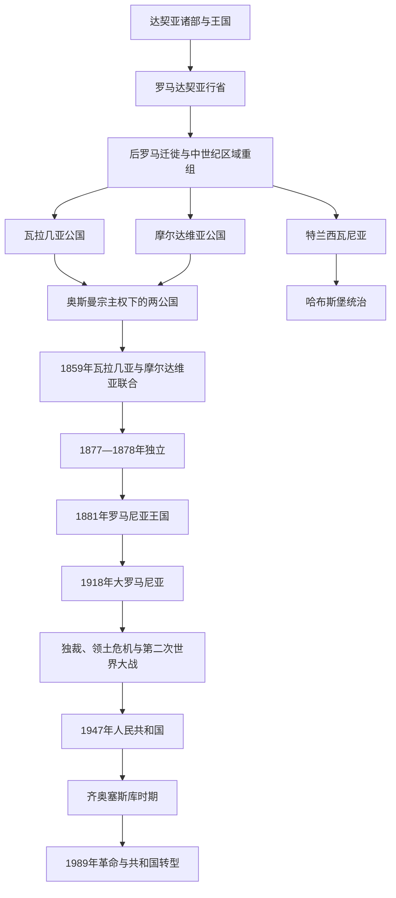

# 罗马尼亚

## 概括

罗马尼亚国家史连接古代达契亚与罗马行省遗产、中世纪瓦拉几亚和摩尔达维亚公国、特兰西瓦尼亚、多瑙河与喀尔巴阡边疆、奥斯曼宗主权和哈布斯堡统治。1859年两公国联合、1877年独立、1881年王国建立及20世纪边界和政体变化构成现代主线。

## 演变关系

## 统治结构与政治阶段

| 阶段 | 时间 | 统治结构 |
|---|---|---|
| 中世纪公国 | 14世纪—19世纪 | 瓦拉几亚、摩尔达维亚由本地大贵族与君主管理，在奥斯曼宗主权下保留内部制度；特兰西瓦尼亚经历不同政治体系。 |
| 联合公国 | 1859—1881年 | 两公国选出同一统治者后逐步统一行政，1866年引入外来王朝和宪法。 |
| 罗马尼亚王国 | 1881—1947年 | 君主立宪与议会政治、威权统治和战时军事政权先后存在。 |
| 社会主义时期 | 1947—1989年 | 一党国家，早期受苏联影响，后在齐奥塞斯库统治下强调自主路线并形成个人独裁。 |
| 共和国转型 | 1989年至今 | 多党政治和市场经济转型，后加入北约与欧洲联盟。 |

## 重要事件

- 罗马征服达契亚留下语言和政治记忆，但罗马撤军后至中世纪国家形成之间存在复杂迁徙与连续性问题。
- 瓦拉几亚和摩尔达维亚在奥斯曼宗主权下并非普通行省，保留君主、法律和地方贵族体系。
- 1859年两公国共同选举亚历山德鲁·伊万·库扎，推动现代罗马尼亚国家联合。
- 1877—1878年俄土战争期间罗马尼亚宣布并获得独立，1881年建立王国。
- 1918年特兰西瓦尼亚、比萨拉比亚和布科维纳等地并入，形成“大罗马尼亚”，同时产生少数族群与边界问题。
- 第二次世界大战期间罗马尼亚与轴心国合作并参与对苏战争，1944年转而加入同盟国；犹太人和罗姆人遭到迫害、驱逐和杀害。
- 1989年革命推翻齐奥塞斯库政权，2007年加入欧洲联盟。

## 关键辨析

- 达契亚—罗马遗产是现代认同的重要组成部分，但不能跳过后罗马时期的迁徙、语言变化和中世纪国家形成。
- 瓦拉几亚、摩尔达维亚和特兰西瓦尼亚具有不同政治经历，现代罗马尼亚并非单一公国自然扩张的结果。
- “大罗马尼亚”既是民族统一叙事，也涉及复杂的多民族人口和边界争议。

## 相关入口

- [东南欧与巴尔干](/%E4%BA%BA%E6%96%87%E7%A7%91%E5%AD%A6/%E5%8E%86%E5%8F%B2/%E6%AC%A7%E6%B4%B2/%E4%B8%9C%E5%8D%97%E6%AC%A7%E4%B8%8E%E5%B7%B4%E5%B0%94%E5%B9%B2/README.md)
- [匈牙利](/%E4%BA%BA%E6%96%87%E7%A7%91%E5%AD%A6/%E5%8E%86%E5%8F%B2/%E6%AC%A7%E6%B4%B2/%E4%B8%AD%E6%AC%A7/%E5%8C%88%E7%89%99%E5%88%A9.md)
- [奥斯曼帝国](/%E4%BA%BA%E6%96%87%E7%A7%91%E5%AD%A6/%E5%8E%86%E5%8F%B2/%E8%A5%BF%E4%BA%9A/%E5%9C%9F%E8%80%B3%E5%85%B6/%E5%A5%A5%E6%96%AF%E6%9B%BC%E5%B8%9D%E5%9B%BD/README.md)
