# 1989年后的罗马尼亚

## 时间

1989年12月至今（现任职务核验截止至2026年7月14日）

## 概括

1989年革命推翻齐奥塞斯库后，救国阵线接管党国机构，迅速恢复多党选举，却也让原共产党中层、军队和行政网络在新制度中延续。1991年宪法确立半总统制；市场化、私有化和对外开放带来商品供给与企业重组，也造成通胀、失业、贫富差距和人口外流。1996年首次反对派和平执政标志权力轮替制度化，2004年加入北约、2007年加入欧洲联盟，2025年成为完整申根成员。反腐改革、总统与议会冲突、党派碎片化和民族民粹主义持续塑造政治。2024年总统选举被撤销后于2025年重选，尼库绍尔·丹当选；博洛让政府2026年5月倒阁后长期看守，截至核验日仍未产生获议会信任的新内阁。

## 政治与对外整合主线

```mermaid
flowchart LR
    Revolution["1989年革命与救国阵线接管"] --> Elections1990["1990年多党选举与矿工进城"]
    Elections1990 --> Constitution["1991年宪法"]
    Constitution --> Transition["市场转型与社会成本"]
    Transition --> Alternation["1996年首次反对派和平执政"]
    Alternation --> NATO["2004年加入北约"]
    NATO --> EU["2007年加入欧洲联盟"]
    EU --> AntiCorruption["反腐改革、总统停职与群众抗议"]
    AntiCorruption --> Coalition["2019—2024年联盟重组与疫情"]
    Coalition --> Schengen["2025年完整加入申根区"]
    Schengen --> ElectionCrisis["2024年选举撤销与2025年重选"]
    ElectionCrisis --> Dan["尼库绍尔·丹总统"]
    Dan --> Caretaker["2026年倒阁与长期看守政府"]
```

## 救国阵线与不完整断裂（1989—1992年）

救国阵线委员会由扬·伊利埃斯库等前共产党官员、军人、知识分子和革命者组成，接管电视台、部委和地方机构。它起初宣称只管理过渡，1990年1月却决定参加选举，引发历史政党和学生质疑。5月大选中伊利埃斯库和救国阵线凭组织、媒体与农村支持压倒性获胜，选举本身提供新合法性，但资源不对等和革命暴力责任未被充分追究。

1990年4—6月，反对者在布加勒斯特大学广场持续示威。警方清场后发生冲突，政府召集来自日乌河谷等地的矿工进入首都，矿工袭击示威者、反对党总部和独立媒体；“矿工进城”显示新政府仍可利用非正式强制力量。1991年又一次矿工行动促使彼得雷·罗曼辞职。

1991年宪法以公投通过，设直接民选总统、向议会负责的政府、两院议会、宪法法院和权利保障。总统提名总理、主持国防外交并可在有限条件下解散议会；政府须获议会信任，因此当总统与议会多数不同党时易出现“共治”冲突。

## 市场转型与权力轮替（1990年代）

| 领域 | 具体过程 | 成效与代价 |
|---|---|---|
| 价格与企业 | 解除管制、关闭或改组亏损国企，私有化速度反复 | 商品短缺结束，通胀、失业和工业衰退冲击工人城镇。 |
| 土地 | 归还或分配集体农庄土地 | 恢复私有产权，但地块碎片化、权属诉讼和低生产率延续。 |
| 社会 | 医疗、教育和福利财政承压，年轻劳动力外流 | 汇款后来成为收入来源，人口老龄化和城乡差距扩大。 |
| 政治 | 救国阵线分裂为多支，历史政党和匈牙利族联盟进入议会 | 多党竞争确立，也形成频繁联盟与个人化政党。 |

1996年，埃米尔·康斯坦丁内斯库击败伊利埃斯库，民主会议联盟同民主党、匈牙利族联盟组成政府。这是前救国阵线阵营首次经选举向反对派和平交权，证明制度已能承受轮替。联盟内部矛盾、改革成本和1999年矿工危机削弱政府，2000年伊利埃斯库回任；极右“大罗马尼亚党”进入总统决选又显示转型不满可被民族主义吸收。

## 北约、欧盟与国家能力重建（2000—2007年）

罗马尼亚以文官控制军队、同邻国和解、参加国际行动和改革安全部门争取北约资格，2004年正式加入。欧盟入盟要求修改竞争、司法、边境、农业和少数群体政策；经济增长、外资和人员流动加快，腐败与司法独立仍是重点监督问题。2007年1月加入欧洲联盟，同年围绕总统特拉扬·伯塞斯库权力风格和反腐议程，议会首次暂停其职权；公投使其复职。

北约与欧盟整合提供安全锚、市场和法律框架，却没有自动消除政党控制行政、公共采购腐败或区域差距。大量公民赴其他欧盟国家工作，汇款与技能流动并存；基础设施和城市服务改善较快，部分农村、去工业化地区发展滞后。

## 反腐、共治冲突与街头政治（2007—2019年）

- 国家反腐局和检察体系在欧盟监督、国内政治竞争和专业官僚推动下起诉多名部长、市长和党魁，增强问责，也引发“选择性司法”与情报机关介入争论。
- 2009年后全球金融危机迫使博克政府削减工资、福利和公共岗位；2012年抗议导致政府更替。议会第二次暂停伯塞斯库，总统罢免公投因投票率门槛未满足而无效。
- 2015年科莱克蒂夫夜总会火灾暴露许可腐败和消防失责，大规模抗议迫使维克托·蓬塔辞职，达奇安·乔洛什技术官僚政府接任。
- 2017年格林代亚努政府以紧急政令第13号试图缩小部分滥权罪范围，引发1989年后规模最大的持续示威之一；政府撤令，执政党随后又以不信任案推翻本党总理。
- 2018年政府同总统、检察体系和欧盟机构围绕司法改革长期冲突；2019年登奇勒政府倒阁，国家自由党少数政府上台。

这一阶段街头抗议成为议会、法院之外的问责渠道，但社会分裂也加深：海外公民、城市专业阶层较支持反腐和欧洲整合，部分农村及小城更重视工资、养老金和地方党组织提供的资源。

## 疫情、联盟重组与完整申根（2019—2025年）

新冠疫情使奥尔班、克楚政府在紧急状态、医疗采购、学校关闭和疫苗政策中承受压力。2020年选举后国家自由党、拯救罗马尼亚联盟和匈牙利族联盟组阁，2021年因司法、地方投资和领导权冲突瓦解；随后国家自由党与长期对手社会民主党组成大联盟，并约定2023年由尼古拉·丘克向马切尔·乔拉库轮换总理。

俄乌战争后，罗马尼亚强化北约东翼、接收难民并通过黑海和多瑙河协助乌克兰粮食外运；摩尔多瓦安全与能源问题的重要性上升。欧盟先于2024年取消罗马尼亚航空、海上内部边检，理事会再决定自2025年1月1日起取消陆地内部边检，罗马尼亚由此完整加入申根区。

## 2024—2026年选举与政府危机

### 总统选举撤销与2025年重选

2024年11月总统首轮中，独立候选人克林·杰奥尔杰斯库出人意料领先。解密材料和调查指向社交媒体竞选支出申报异常、协调传播网络及外部干预疑虑；宪法法院于12月6日撤销整个选举程序。撤销防止一场被认定不完整的程序继续，却也造成代表性、证据公开程度和司法介入选举的激烈争论。

克劳斯·约翰尼斯在任期届满后暂留任，面对政治压力于2025年2月12日辞职，参议院议长伊利耶·博洛让代理总统。5月重选中，布加勒斯特市长尼库绍尔·丹在第二轮击败民族主义候选人乔治·西米翁，5月26日宣誓就任。

### 博洛让政府倒阁后的看守状态

2025年6月23日，博洛让出任总理，社会民主党、国家自由党、拯救罗马尼亚联盟和匈牙利族联盟组成亲欧大联盟，重点处理高赤字与财政改革。紧缩措施和联盟内分歧扩大，社会民主党2026年退出并同反对派推动不信任案；5月5日议会通过动议，内阁失去完整职权。

宪法要求被解职政府在新内阁宣誓前继续处理日常事务。总统先后于6月4日提名欧根·托马克组阁，托马克6月14日退回授权；同日获提名的阿德里安-扬·韦什泰亚提交内阁，6月22日在议会仅获189票，未达到233票信任门槛。因此两人均不是已任首相。到2026年7月14日，尼库绍尔·丹仍为总统，博洛让仍以被解职的看守总理身份履职，政府不能按完整授权推进新政策，组阁谈判和提前选举讨论继续。

## 当前统治结构

| 角色 | 截至2026年7月14日的状态 | 权力边界 |
|---|---|---|
| 总统 | **尼库绍尔·丹**，2025年5月26日就任 | 提名总理、国防外交与制度协调；不能替代议会授予内阁信任。 |
| 政府首脑 | **伊利耶·博洛让**，2025年6月23日就任，2026年5月5日起为被解职看守 | 维持必要行政，政治和立法主动权受限。 |
| 议会 | 两院制，多党分裂；原大联盟已破裂 | 可授予或撤回政府信任，决定是否有可持续多数。 |
| 宪法法院 | 审查法律、选举和机构争议 | 2024年撤销总统选举使其权威与透明度成为核心争论。 |
| 地方政府与欧盟层级 | 市长、县议会及欧盟法律、资金共同影响政策 | 基础设施和公共服务不完全由中央政府单线决定。 |

## 成就、结构压力与未完成转型

- **制度成就**：多次和平轮替、法院与媒体多元、北约和欧盟嵌入，使重建一党独裁的成本显著提高。
- **经济转变**：制造业、信息技术、汽车零部件和服务出口增长，欧盟资金改善基础设施；地区差距、低税收能力、医疗教育外流仍突出。
- **人口问题**：低生育、老龄化和长期移民减少劳动力，海外公民又通过汇款和选票成为重要政治力量。
- **法治矛盾**：反腐机构提升高层问责，但司法任命、秘密情报合作和案件政治化疑虑反复出现。
- **政党危机**：大联盟可在危机中提供多数，却模糊执政与反对边界；民族民粹力量借物价、战争、安全和对精英不满上升。
- **直接风险**：2024年选举撤销削弱程序信任，2026年倒阁与两次组阁失败又造成行政能力受限；问题不是国家法统中断，而是议会多数无法形成。

## 重要事件

| 时间 | 事件 | 长期影响 |
|---|---|---|
| 1989年12月 | 革命与救国阵线接管 | 一党制结束，但旧行政网络延续。 |
| 1990年 | 首次多党选举与矿工进城 | 选举合法性与非正式暴力同时塑造新政体。 |
| 1991年 | 宪法公投 | 半总统制和议会负责政府确立。 |
| 1996年 | 反对派和平执政 | 权力轮替制度化。 |
| 2004年 | 加入北约 | 安全与军制改革锚定西方联盟。 |
| 2007年 | 加入欧盟、总统首次停职 | 欧洲整合与国内共治冲突并行。 |
| 2015年 | 科莱克蒂夫火灾抗议 | 腐败与公共安全问题推翻政府。 |
| 2017年 | 第13号紧急政令抗议 | 社会动员阻止部分司法倒退。 |
| 2025年1月1日 | 完整加入申根区 | 陆海空内部边检全部按申根框架取消。 |
| 2024—2025年 | 总统选举撤销、重选 | 外部干预与程序透明成为民主韧性考验。 |
| 2026年5—7月 | 博洛让政府倒阁、两次组阁失败 | 看守政府延长，议会多数危机持续。 |

## 演变关系

- 前一阶段：[罗马尼亚社会主义共和国](/%E4%BA%BA%E6%96%87%E7%A7%91%E5%AD%A6/%E5%8E%86%E5%8F%B2/%E6%AC%A7%E6%B4%B2/%E4%B8%9C%E5%8D%97%E6%AC%A7%E4%B8%8E%E5%B7%B4%E5%B0%94%E5%B9%B2/%E7%BD%97%E9%A9%AC%E5%B0%BC%E4%BA%9A/%E7%BD%97%E9%A9%AC%E5%B0%BC%E4%BA%9A%E7%A4%BE%E4%BC%9A%E4%B8%BB%E4%B9%89%E5%85%B1%E5%92%8C%E5%9B%BD.md)
- 完整国家元首：[罗马尼亚君主与国家元首表](/%E4%BA%BA%E6%96%87%E7%A7%91%E5%AD%A6/%E5%8E%86%E5%8F%B2/%E6%AC%A7%E6%B4%B2/%E4%B8%9C%E5%8D%97%E6%AC%A7%E4%B8%8E%E5%B7%B4%E5%B0%94%E5%B9%B2/%E7%BD%97%E9%A9%AC%E5%B0%BC%E4%BA%9A/%E7%BD%97%E9%A9%AC%E5%B0%BC%E4%BA%9A%E5%90%9B%E4%B8%BB%E4%B8%8E%E5%9B%BD%E5%AE%B6%E5%85%83%E9%A6%96%E8%A1%A8.md)
- 完整政府首脑：[罗马尼亚历任政府首脑表](/%E4%BA%BA%E6%96%87%E7%A7%91%E5%AD%A6/%E5%8E%86%E5%8F%B2/%E6%AC%A7%E6%B4%B2/%E4%B8%9C%E5%8D%97%E6%AC%A7%E4%B8%8E%E5%B7%B4%E5%B0%94%E5%B9%B2/%E7%BD%97%E9%A9%AC%E5%B0%BC%E4%BA%9A/%E7%BD%97%E9%A9%AC%E5%B0%BC%E4%BA%9A%E5%8E%86%E4%BB%BB%E6%94%BF%E5%BA%9C%E9%A6%96%E8%84%91%E8%A1%A8.md)
- 总览：[罗马尼亚历史总览](/%E4%BA%BA%E6%96%87%E7%A7%91%E5%AD%A6/%E5%8E%86%E5%8F%B2/%E6%AC%A7%E6%B4%B2/%E4%B8%9C%E5%8D%97%E6%AC%A7%E4%B8%8E%E5%B7%B4%E5%B0%94%E5%B9%B2/%E7%BD%97%E9%A9%AC%E5%B0%BC%E4%BA%9A/README.md)
