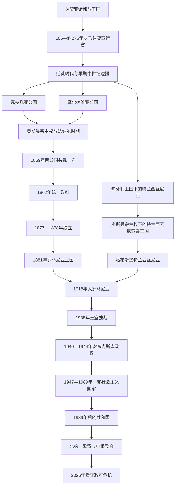

# 罗马尼亚历史

## 历史主线

现代罗马尼亚的历史不是从达契亚王国到民族国家的单线继承。古代达契亚与罗马行省之后，喀尔巴阡山内外经历迁徙、帝国边疆和不同制度发展；中世纪瓦拉几亚、摩尔达维亚与特兰西瓦尼亚分别处于奥斯曼、匈牙利、哈布斯堡及地方等级政治的交叉体系。1859年两公国共戴一君、1862年行政统一、1877—1878年独立和1881年建国构成现代国家形成主线；1918年版图扩大后，又经历王室独裁、轴心国战争、苏联控制下的一党制与1989年后的民主和市场转型。

## 全史演进图

## 分阶段导航

| 顺序 | 阶段 | 时间 | 简要概括 |
|---|---|---|---|
| 1 | [达契亚、罗马行省与早期中世纪](/%E4%BA%BA%E6%96%87%E7%A7%91%E5%AD%A6/%E5%8E%86%E5%8F%B2/%E6%AC%A7%E6%B4%B2/%E4%B8%9C%E5%8D%97%E6%AC%A7%E4%B8%8E%E5%B7%B4%E5%B0%94%E5%B9%B2/%E7%BD%97%E9%A9%AC%E5%B0%BC%E4%BA%9A/%E8%BE%BE%E5%A5%91%E4%BA%9A%E3%80%81%E7%BD%97%E9%A9%AC%E8%A1%8C%E7%9C%81%E4%B8%8E%E6%97%A9%E6%9C%9F%E4%B8%AD%E4%B8%96%E7%BA%AA.md) | 约前1世纪—13世纪 | 达契亚王权、罗马征服与撤军、迁徙社会及罗马尼亚语人群形成争议。 |
| 2 | [中世纪三公国与奥斯曼—哈布斯堡边疆](/%E4%BA%BA%E6%96%87%E7%A7%91%E5%AD%A6/%E5%8E%86%E5%8F%B2/%E6%AC%A7%E6%B4%B2/%E4%B8%9C%E5%8D%97%E6%AC%A7%E4%B8%8E%E5%B7%B4%E5%B0%94%E5%B9%B2/%E7%BD%97%E9%A9%AC%E5%B0%BC%E4%BA%9A/%E4%B8%AD%E4%B8%96%E7%BA%AA%E4%B8%89%E5%85%AC%E5%9B%BD%E4%B8%8E%E5%A5%A5%E6%96%AF%E6%9B%BC%E2%80%94%E5%93%88%E5%B8%83%E6%96%AF%E5%A0%A1%E8%BE%B9%E7%96%86.md) | 约13世纪—1711／1716年 | 瓦拉几亚、摩尔达维亚、特兰西瓦尼亚的不同建国线和实际宗主关系。 |
| 3 | [法纳尔时期、帝国竞争与民族运动](/%E4%BA%BA%E6%96%87%E7%A7%91%E5%AD%A6/%E5%8E%86%E5%8F%B2/%E6%AC%A7%E6%B4%B2/%E4%B8%9C%E5%8D%97%E6%AC%A7%E4%B8%8E%E5%B7%B4%E5%B0%94%E5%B9%B2/%E7%BD%97%E9%A9%AC%E5%B0%BC%E4%BA%9A/%E6%B3%95%E7%BA%B3%E5%B0%94%E6%97%B6%E6%9C%9F%E3%80%81%E5%B8%9D%E5%9B%BD%E7%AB%9E%E4%BA%89%E4%B8%8E%E6%B0%91%E6%97%8F%E8%BF%90%E5%8A%A8.md) | 1711／1716—1859年 | 法纳尔任命、俄奥奥斯曼竞争、1821年危机、《组织条例》与统一运动。 |
| 4 | [联合公国、独立与王国建立](/%E4%BA%BA%E6%96%87%E7%A7%91%E5%AD%A6/%E5%8E%86%E5%8F%B2/%E6%AC%A7%E6%B4%B2/%E4%B8%9C%E5%8D%97%E6%AC%A7%E4%B8%8E%E5%B7%B4%E5%B0%94%E5%B9%B2/%E7%BD%97%E9%A9%AC%E5%B0%BC%E4%BA%9A/%E8%81%94%E5%90%88%E5%85%AC%E5%9B%BD%E3%80%81%E7%8B%AC%E7%AB%8B%E4%B8%8E%E7%8E%8B%E5%9B%BD%E5%BB%BA%E7%AB%8B.md) | 1859—1914年 | 库扎改革、外来王朝、独立战争、王国建设与1907年农村危机。 |
| 5 | [第一次世界大战与大罗马尼亚](/%E4%BA%BA%E6%96%87%E7%A7%91%E5%AD%A6/%E5%8E%86%E5%8F%B2/%E6%AC%A7%E6%B4%B2/%E4%B8%9C%E5%8D%97%E6%AC%A7%E4%B8%8E%E5%B7%B4%E5%B0%94%E5%B9%B2/%E7%BD%97%E9%A9%AC%E5%B0%BC%E4%BA%9A/%E7%AC%AC%E4%B8%80%E6%AC%A1%E4%B8%96%E7%95%8C%E5%A4%A7%E6%88%98%E4%B8%8E%E5%A4%A7%E7%BD%97%E9%A9%AC%E5%B0%BC%E4%BA%9A.md) | 1914—1938年 | 参战、雅西防御、1918年联合、战后整合及议会制衰落。 |
| 6 | [王室独裁、安东内斯库与第二次世界大战](/%E4%BA%BA%E6%96%87%E7%A7%91%E5%AD%A6/%E5%8E%86%E5%8F%B2/%E6%AC%A7%E6%B4%B2/%E4%B8%9C%E5%8D%97%E6%AC%A7%E4%B8%8E%E5%B7%B4%E5%B0%94%E5%B9%B2/%E7%BD%97%E9%A9%AC%E5%B0%BC%E4%BA%9A/%E7%8E%8B%E5%AE%A4%E7%8B%AC%E8%A3%81%E3%80%81%E5%AE%89%E4%B8%9C%E5%86%85%E6%96%AF%E5%BA%93%E4%B8%8E%E7%AC%AC%E4%BA%8C%E6%AC%A1%E4%B8%96%E7%95%8C%E5%A4%A7%E6%88%98.md) | 1938—1947年 | 领土崩溃、军事独裁、轴心国战争、大屠杀、1944年转向与共产党夺权。 |
| 7 | [罗马尼亚社会主义共和国](/%E4%BA%BA%E6%96%87%E7%A7%91%E5%AD%A6/%E5%8E%86%E5%8F%B2/%E6%AC%A7%E6%B4%B2/%E4%B8%9C%E5%8D%97%E6%AC%A7%E4%B8%8E%E5%B7%B4%E5%B0%94%E5%B9%B2/%E7%BD%97%E9%A9%AC%E5%B0%BC%E4%BA%9A/%E7%BD%97%E9%A9%AC%E5%B0%BC%E4%BA%9A%E7%A4%BE%E4%BC%9A%E4%B8%BB%E4%B9%89%E5%85%B1%E5%92%8C%E5%9B%BD.md) | 1947—1989年 | 苏联化、乔治乌-德治自主路线、齐奥塞斯库个人统治与1989年革命。 |
| 8 | [1989年后的罗马尼亚](/%E4%BA%BA%E6%96%87%E7%A7%91%E5%AD%A6/%E5%8E%86%E5%8F%B2/%E6%AC%A7%E6%B4%B2/%E4%B8%9C%E5%8D%97%E6%AC%A7%E4%B8%8E%E5%B7%B4%E5%B0%94%E5%B9%B2/%E7%BD%97%E9%A9%AC%E5%B0%BC%E4%BA%9A/1989%E5%B9%B4%E5%90%8E%E7%9A%84%E7%BD%97%E9%A9%AC%E5%B0%BC%E4%BA%9A.md) | 1989年至今 | 民主和市场转型、北约与欧盟整合、2024—2026年选举和组阁危机。 |

## 统治者与政府专表

| 范围 | 专表 | 使用说明 |
|---|---|---|
| 瓦拉几亚 | [瓦拉几亚统治者世系表](/%E4%BA%BA%E6%96%87%E7%A7%91%E5%AD%A6/%E5%8E%86%E5%8F%B2/%E6%AC%A7%E6%B4%B2/%E4%B8%9C%E5%8D%97%E6%AC%A7%E4%B8%8E%E5%B7%B4%E5%B0%94%E5%B9%B2/%E7%BD%97%E9%A9%AC%E5%B0%BC%E4%BA%9A/%E7%93%A6%E6%8B%89%E5%87%A0%E4%BA%9A%E7%BB%9F%E6%B2%BB%E8%80%85%E4%B8%96%E7%B3%BB%E8%A1%A8.md) | 从建国传说、巴萨拉布家分支到法纳尔君主、占领与库扎双重当选。 |
| 摩尔达维亚 | [摩尔达维亚统治者世系表](/%E4%BA%BA%E6%96%87%E7%A7%91%E5%AD%A6/%E5%8E%86%E5%8F%B2/%E6%AC%A7%E6%B4%B2/%E4%B8%9C%E5%8D%97%E6%AC%A7%E4%B8%8E%E5%B7%B4%E5%B0%94%E5%B9%B2/%E7%BD%97%E9%A9%AC%E5%B0%BC%E4%BA%9A/%E6%91%A9%E5%B0%94%E8%BE%BE%E7%BB%B4%E4%BA%9A%E7%BB%9F%E6%B2%BB%E8%80%85%E4%B8%96%E7%B3%BB%E8%A1%A8.md) | 从匈牙利边防区、穆沙特家到法纳尔君主、领土割离与1859年联合。 |
| 特兰西瓦尼亚 | [特兰西瓦尼亚统治结构与亲王世系表](/%E4%BA%BA%E6%96%87%E7%A7%91%E5%AD%A6/%E5%8E%86%E5%8F%B2/%E6%AC%A7%E6%B4%B2/%E4%B8%9C%E5%8D%97%E6%AC%A7%E4%B8%8E%E5%B7%B4%E5%B0%94%E5%B9%B2/%E7%BD%97%E9%A9%AC%E5%B0%BC%E4%BA%9A/%E7%89%B9%E5%85%B0%E8%A5%BF%E7%93%A6%E5%B0%BC%E4%BA%9A%E7%BB%9F%E6%B2%BB%E7%BB%93%E6%9E%84%E4%B8%8E%E4%BA%B2%E7%8E%8B%E4%B8%96%E7%B3%BB%E8%A1%A8.md) | 区分匈牙利沃伊沃德体制、选举亲王、并立军政府与哈布斯堡君主。 |
| 现代国家元首 | [罗马尼亚君主与国家元首表](/%E4%BA%BA%E6%96%87%E7%A7%91%E5%AD%A6/%E5%8E%86%E5%8F%B2/%E6%AC%A7%E6%B4%B2/%E4%B8%9C%E5%8D%97%E6%AC%A7%E4%B8%8E%E5%B7%B4%E5%B0%94%E5%B9%B2/%E7%BD%97%E9%A9%AC%E5%B0%BC%E4%BA%9A/%E7%BD%97%E9%A9%AC%E5%B0%BC%E4%BA%9A%E5%90%9B%E4%B8%BB%E4%B8%8E%E5%9B%BD%E5%AE%B6%E5%85%83%E9%A6%96%E8%A1%A8.md) | 库扎、王室摄政、国王、共产党法定与实际领导、1989年后总统和代理总统。 |
| 现代政府首脑 | [罗马尼亚历任政府首脑表](/%E4%BA%BA%E6%96%87%E7%A7%91%E5%AD%A6/%E5%8E%86%E5%8F%B2/%E6%AC%A7%E6%B4%B2/%E4%B8%9C%E5%8D%97%E6%AC%A7%E4%B8%8E%E5%B7%B4%E5%B0%94%E5%B9%B2/%E7%BD%97%E9%A9%AC%E5%B0%BC%E4%BA%9A/%E7%BD%97%E9%A9%AC%E5%B0%BC%E4%BA%9A%E5%8E%86%E4%BB%BB%E6%94%BF%E5%BA%9C%E9%A6%96%E8%84%91%E8%A1%A8.md) | 1862年以来完整首相、代理、看守政府及2026年组阁失败辨析。 |

## 重要转折与时间节点

| 时间 | 转折 | 核心意义 |
|---|---|---|
| 106年 | 罗马征服达契亚 | 部分地区纳入罗马行省，拉丁化遗产形成。 |
| 1330年 | 波萨达战役 | 瓦拉几亚取得事实独立。 |
| 约1359年 | 博格丹建立独立摩尔达维亚 | 匈牙利边防区转为公国。 |
| 1526—1570年 | 匈牙利分裂与特兰西瓦尼亚亲王国形成 | 奥斯曼—哈布斯堡边疆秩序建立。 |
| 1691—1711年 | 哈布斯堡接管特兰西瓦尼亚 | 选举亲王线被世袭王冠领地取代。 |
| 1711／1716年 | 两公国进入法纳尔任命制 | 苏丹加强王位控制，公国内部制度仍存。 |
| 1821—1822年 | 起义与恢复本地君主 | 法纳尔时代终结。 |
| 1859／1862年 | 双重选举与行政统一 | 现代罗马尼亚国家形成。 |
| 1877—1881年 | 独立与建立王国 | 奥斯曼宗主权终结，君主国地位制度化。 |
| 1918—1920年 | 联合与战后条约 | 大罗马尼亚边界形成，多民族整合成为核心议题。 |
| 1938—1940年 | 王室独裁与领土崩溃 | 议会制终止，安东内斯库掌权。 |
| 1944年8月23日 | 王室政变 | 退出轴心国战争，苏联控制随即加强。 |
| 1947年12月30日 | 废除君主制 | 一党共和国建立。 |
| 1989年12月 | 革命 | 齐奥塞斯库和一党国家倒台。 |
| 2004／2007／2025年 | 加入北约、欧盟、完整申根 | 安全、法律和人员流动嵌入欧洲—大西洋体系。 |
| 2024—2026年 | 总统选举撤销、重选与政府倒阁 | 民主程序、外部干预和议会多数面临持续压力。 |

## 关键辨析

- 达契亚—罗马遗产是现代认同的重要资源，但罗马撤军至中世纪公国之间不存在可直接列成同一王朝的国家世系。
- 奥斯曼宗主权通常意味着贡赋、敕封和外交约束；瓦拉几亚、摩尔达维亚及特兰西瓦尼亚亲王国的内部制度与普通奥斯曼行省不同。
- 1599—1600年勇敢者米哈伊对三地的控制短暂且以战争、个人权力为基础，不等同于1859年后的制度化统一。
- 1918年“大罗马尼亚”既是民族统一过程，也纳入大量少数族群和不同法制区；边界与代表性不能只用单一民族叙事解释。
- 共产党时期应区分法定国家元首、政府首脑和党最高领导；1989年后则应区分总统、总理、代理职务及仅获提名但组阁失败者。

## 相关入口

- [东南欧与巴尔干历史](/%E4%BA%BA%E6%96%87%E7%A7%91%E5%AD%A6/%E5%8E%86%E5%8F%B2/%E6%AC%A7%E6%B4%B2/%E4%B8%9C%E5%8D%97%E6%AC%A7%E4%B8%8E%E5%B7%B4%E5%B0%94%E5%B9%B2/README.md)
- [匈牙利历史](/%E4%BA%BA%E6%96%87%E7%A7%91%E5%AD%A6/%E5%8E%86%E5%8F%B2/%E6%AC%A7%E6%B4%B2/%E5%8C%88%E7%89%99%E5%88%A9/README.md)
- [奥斯曼帝国](/%E4%BA%BA%E6%96%87%E7%A7%91%E5%AD%A6/%E5%8E%86%E5%8F%B2/%E8%A5%BF%E4%BA%9A/%E5%9C%9F%E8%80%B3%E5%85%B6/%E5%A5%A5%E6%96%AF%E6%9B%BC%E5%B8%9D%E5%9B%BD/README.md)
