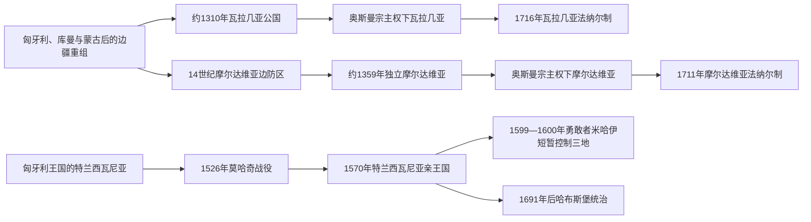

# 中世纪三公国与奥斯曼—哈布斯堡边疆

## 时间

约13世纪—1711／1716年

## 概括

现代罗马尼亚的中世纪政治遗产来自三条不同主线：瓦拉几亚在喀尔巴阡山南侧形成，摩尔达维亚在山脉东侧由匈牙利边防区转为独立公国，特兰西瓦尼亚则长期属于匈牙利王国，1526年后成为奥斯曼宗主权下的选举亲王国。瓦拉几亚、摩尔达维亚通常向苏丹纳贡并接受敕封，却保留东正教、土地法、贵族议会、君主和内部行政；它们不是普通奥斯曼行省。特兰西瓦尼亚的奥斯曼宗主关系又建立在等级议会、宗派自治和匈牙利政治传统上。

## 三条政权主线

## 三公国的建立机制

### 瓦拉几亚

13世纪蒙古入侵削弱库曼联盟与匈牙利在山南的直接控制，奥尔特河以东、西的地方沃伊沃德、贵族和商路据点逐步整合。巴萨拉布一世约1310年掌权，最初承认匈牙利国王某种宗主要求；1330年波萨达战役中，他在山地伏击并击败查理一世，确立事实独立。公国依靠多瑙河关税、牧业农业、山口贸易和大贵族军役维持，但王位由王族成员中推举，丹系、德拉库列什蒂系和贵族集团反复竞争。

### 摩尔达维亚

匈牙利王权为抵御金帐汗国，在14世纪中叶于喀尔巴阡山东侧设边防区，由德拉戈什家族管理。来自马拉穆列什的博格丹反叛匈牙利，约1359年越山夺权，建立独立公国。公国控制从喀尔巴阡到德涅斯特河、黑海贸易路线，首府由巴亚、苏恰瓦等地发展；波兰、匈牙利、克里米亚汗国和奥斯曼都可影响其外交与王位。

### 特兰西瓦尼亚

匈牙利王权逐步建立县、教区和沃伊沃德制，并给予塞凯伊人、萨克森人团体特权。1437年农民起义后形成“三民族联盟”，巩固贵族、塞凯伊和萨克森等级政治，罗马尼亚语东正教人口未获同等团体代表。1526年匈牙利王国分裂，扎波尧家统治的东部匈牙利王国在奥斯曼保护下存在；1570年《施派尔条约》把它转化为选举亲王国。

## 统治结构与实际宗主权

| 政体 | 君主产生 | 内部权力 | 外部约束 | 不是何种关系 |
|---|---|---|---|---|
| 瓦拉几亚 | 巴萨拉布王族成员、外家或强势贵族由大贵族推举，并日益需苏丹敕封 | 君主、贵族会议、东正教都会、地方官和庄园 | 匈牙利早期封臣要求；15世纪后奥斯曼贡赋、外交和废立干预 | 并非长期由奥斯曼帕夏按行省法直接治理。 |
| 摩尔达维亚 | 博格丹—穆沙特王族及其他家族在贵族、波兰或奥斯曼支持下竞争 | 君主、大贵族会议、教会、堡垒与税务官 | 波兰封臣关系曾同奥斯曼宗主竞争；16世纪后苏丹确认加强 | 纳贡不等于领土、教会和私法被全面奥斯曼化。 |
| 特兰西瓦尼亚亲王国 | 等级议会选举，通常需苏丹确认；哈布斯堡亦主张王冠权利 | 亲王、议会、“三民族”和公认宗教特权、县与自治共同体 | 向奥斯曼纳贡、受外交限制，同时以条约同哈布斯堡周旋 | 既非完全主权民族国家，也非普通奥斯曼行省。 |

## 崛起与鼎盛条件

- **边疆空隙**：蒙古入侵后旧霸权松动，山口、河谷和贸易网络让地方领主有条件整合军队与税源。
- **地形防御**：喀尔巴阡山口、森林和河流帮助巴萨拉布、米尔恰、斯特凡等以伏击、焦土和堡垒抵御大国。
- **贸易财政**：多瑙河、布拉索夫、利沃夫和黑海路线提供关税；盐、牲畜、谷物和葡萄酒支撑宫廷与军队。
- **帝国制衡**：在匈牙利、波兰、奥斯曼和后来哈布斯堡之间变换盟约，能换取短期自主。
- **宗教合法性**：东正教都会、修道院捐赠和拜占庭—南斯拉夫礼仪传统帮助君主建立超越地方贵族的声望。

## 重要事件与具体过程

| 时间 | 事件 | 过程与结果 |
|---|---|---|
| 1330年 | 波萨达战役 | 巴萨拉布一世利用山地击败匈牙利军，瓦拉几亚取得事实独立。 |
| 约1359年 | 博格丹夺取摩尔达维亚 | 从匈牙利边防区转为独立公国，穆沙特家随后扩张至黑海。 |
| 1386—1418年 | 老米尔恰统治 | 扩张至多瑙河口，参加反奥斯曼战争；在战败、复位和纳贡间保存公国。 |
| 1448、1456—1462、1476年 | 穿刺公弗拉德三度在位 | 借严刑和清洗强化君权，1462年袭击奥斯曼后被拉杜三世取代；“民族抗战者”与暴力统治者形象需并看。 |
| 1457—1504年 | 斯特凡大公统治摩尔达维亚 | 建堡、扩军并在1475年瓦斯卢伊击败奥斯曼；1484年失去基利亚、白堡，后以纳贡保存国家。 |
| 1526—1570年 | 莫哈奇战役至《施派尔条约》 | 匈牙利王位内战、1541年布达陷落后，特兰西瓦尼亚逐步形成奥斯曼保护下的亲王国。 |
| 1593—1601年 | 勇敢者米哈伊战争 | 参加反奥斯曼同盟，1599年击败巴托里·安德拉什、1600年控制摩尔达维亚；贵族反抗、波兰与哈布斯堡干预使联合数月即解体，1601年米哈伊被杀。 |
| 1613—1648年 | 拜特伦与拉科齐一世时期 | 特兰西瓦尼亚利用三十年战争扩大影响，财政、教育和宗教文化繁荣。 |
| 1683—1699年 | 大土耳其战争 | 哈布斯堡军进入特兰西瓦尼亚；1691年《利奥波德文书》确立统治，1699年《卡尔洛维茨条约》国际确认。 |
| 1711年 | 坎特米尔—俄国联盟失败 | 摩尔达维亚君主迪米特里耶·坎特米尔与彼得一世在普鲁特河战败，苏丹转向法纳尔任命。 |
| 1714—1716年 | 布兰科韦亚努与坎塔库泽诺被处死 | 苏丹怀疑瓦拉几亚君主勾结哈布斯堡、俄国，1716年也改用法纳尔君主。 |

## 衰落、被控制与制度转型

三公国并非同时“灭亡”。瓦拉几亚、摩尔达维亚的王位竞争、高额贡赋和大国干预削弱外交自主，却仍保留公国法统；1711／1716年法纳尔制只是君主任命方式和精英构成改变。特兰西瓦尼亚在拉科齐二世1657年擅自远征波兰后遭奥斯曼惩罚、鞑靼袭击和并立亲王危机，1683年后又面对哈布斯堡压倒性军力；1691年起选举亲王权逐步被世袭君权替代，1711年拉科齐起义失败后独立亲王线终结。

## 演变关系

- 前一阶段：[达契亚、罗马行省与早期中世纪](/%E4%BA%BA%E6%96%87%E7%A7%91%E5%AD%A6/%E5%8E%86%E5%8F%B2/%E6%AC%A7%E6%B4%B2/%E4%B8%9C%E5%8D%97%E6%AC%A7%E4%B8%8E%E5%B7%B4%E5%B0%94%E5%B9%B2/%E7%BD%97%E9%A9%AC%E5%B0%BC%E4%BA%9A/%E8%BE%BE%E5%A5%91%E4%BA%9A%E3%80%81%E7%BD%97%E9%A9%AC%E8%A1%8C%E7%9C%81%E4%B8%8E%E6%97%A9%E6%9C%9F%E4%B8%AD%E4%B8%96%E7%BA%AA.md)
- 后一阶段：[法纳尔时期、帝国竞争与民族运动](/%E4%BA%BA%E6%96%87%E7%A7%91%E5%AD%A6/%E5%8E%86%E5%8F%B2/%E6%AC%A7%E6%B4%B2/%E4%B8%9C%E5%8D%97%E6%AC%A7%E4%B8%8E%E5%B7%B4%E5%B0%94%E5%B9%B2/%E7%BD%97%E9%A9%AC%E5%B0%BC%E4%BA%9A/%E6%B3%95%E7%BA%B3%E5%B0%94%E6%97%B6%E6%9C%9F%E3%80%81%E5%B8%9D%E5%9B%BD%E7%AB%9E%E4%BA%89%E4%B8%8E%E6%B0%91%E6%97%8F%E8%BF%90%E5%8A%A8.md)
- 统治者专表：[瓦拉几亚统治者世系表](/%E4%BA%BA%E6%96%87%E7%A7%91%E5%AD%A6/%E5%8E%86%E5%8F%B2/%E6%AC%A7%E6%B4%B2/%E4%B8%9C%E5%8D%97%E6%AC%A7%E4%B8%8E%E5%B7%B4%E5%B0%94%E5%B9%B2/%E7%BD%97%E9%A9%AC%E5%B0%BC%E4%BA%9A/%E7%93%A6%E6%8B%89%E5%87%A0%E4%BA%9A%E7%BB%9F%E6%B2%BB%E8%80%85%E4%B8%96%E7%B3%BB%E8%A1%A8.md)、[摩尔达维亚统治者世系表](/%E4%BA%BA%E6%96%87%E7%A7%91%E5%AD%A6/%E5%8E%86%E5%8F%B2/%E6%AC%A7%E6%B4%B2/%E4%B8%9C%E5%8D%97%E6%AC%A7%E4%B8%8E%E5%B7%B4%E5%B0%94%E5%B9%B2/%E7%BD%97%E9%A9%AC%E5%B0%BC%E4%BA%9A/%E6%91%A9%E5%B0%94%E8%BE%BE%E7%BB%B4%E4%BA%9A%E7%BB%9F%E6%B2%BB%E8%80%85%E4%B8%96%E7%B3%BB%E8%A1%A8.md)、[特兰西瓦尼亚统治结构与亲王世系表](/%E4%BA%BA%E6%96%87%E7%A7%91%E5%AD%A6/%E5%8E%86%E5%8F%B2/%E6%AC%A7%E6%B4%B2/%E4%B8%9C%E5%8D%97%E6%AC%A7%E4%B8%8E%E5%B7%B4%E5%B0%94%E5%B9%B2/%E7%BD%97%E9%A9%AC%E5%B0%BC%E4%BA%9A/%E7%89%B9%E5%85%B0%E8%A5%BF%E7%93%A6%E5%B0%BC%E4%BA%9A%E7%BB%9F%E6%B2%BB%E7%BB%93%E6%9E%84%E4%B8%8E%E4%BA%B2%E7%8E%8B%E4%B8%96%E7%B3%BB%E8%A1%A8.md)
- 总览：[罗马尼亚历史总览](/%E4%BA%BA%E6%96%87%E7%A7%91%E5%AD%A6/%E5%8E%86%E5%8F%B2/%E6%AC%A7%E6%B4%B2/%E4%B8%9C%E5%8D%97%E6%AC%A7%E4%B8%8E%E5%B7%B4%E5%B0%94%E5%B9%B2/%E7%BD%97%E9%A9%AC%E5%B0%BC%E4%BA%9A/README.md)
