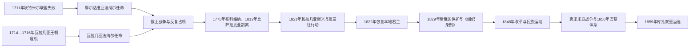

# 法纳尔时期、帝国竞争与民族运动

## 时间

1711／1716—1859年

## 概括

1711年摩尔达维亚、1716年瓦拉几亚先后进入法纳尔君主时期：苏丹主要从君士坦丁堡法纳尔区的希腊语东正教精英家族任命君主，以压低本地王朝同俄国、哈布斯堡结盟的风险。君主任期短、买官与贡赋沉重，但公国仍保存本地法、东正教和贵族土地制度，部分法纳尔君主还改革税制、农民身份、法律和学校。18—19世纪俄土、俄奥战争使两公国反复被占领；1821年危机结束法纳尔制，俄国保护、《组织条例》、1848年运动和克里米亚战争最终把“共同君主”方案推到1859年双重选举。

## 演变主线

## 法纳尔任命制的建立与运行

| 层面 | 实际机制 | 结果与矛盾 |
|---|---|---|
| 任命 | 候选家族在奥斯曼宫廷竞争，由苏丹授予君位，常在两公国间轮调 | 缩短任期并提高获取职位成本，君主倾向迅速筹税还债。 |
| 地方治理 | 君主依靠“大贵族议会”、法庭、教会和地方官，希腊语宫廷人员同本地贵族合作或竞争 | 公国制度连续存在，并未变成帕夏行省；精英冲突加剧。 |
| 财政 | 对苏丹贡赋、宫廷馈赠、战争征发和本地税收叠加 | 农民与小地主负担上升，买官与包税扩张。 |
| 改革 | 康斯坦丁·马夫罗科达托斯等整顿税制、限制或废除农民人身依附，编纂法规、扩展教育 | 改革提高行政理性，却常因频繁换君和贵族抵制而不彻底。 |
| 外交 | 对外政策由奥斯曼约束，俄国以保护东正教和条约权利扩大干预 | 公国成为俄、奥、奥斯曼竞争缓冲区。 |

法纳尔统治的“衰落”不能只归因于希腊精英腐败。结构性问题在于职位买卖、奥斯曼财政需求、战争占领和短任期相互强化；同时本地大贵族也参与包税和行政，并非单纯被外来官僚压制。

## 帝国战争、占领与领土割离

- 1716—1739年哈布斯堡控制奥尔泰尼亚，试图推行直接税政；地方抵抗和新一轮战争后将其归还瓦拉几亚。
- 1736—1739、1768—1774、1787—1792、1806—1812年战争中，两公国多次由俄军或哈布斯堡军占领。外国军队征粮、征车、设置军政长官，名义君主和实际控制经常错位。
- 1774年《库楚克开纳吉和约》使俄国获得干预奥斯曼东正教臣民与公国事务的更大空间；奥斯曼宗主权仍在。
- 1775年哈布斯堡取得摩尔达维亚西北部布科维纳，把通往加利西亚的走廊纳入帝国；此后该地不再受雅西君主实际治理。
- 1812年《布加勒斯特条约》把普鲁特河以东的摩尔达维亚领土割给俄国，俄方把“比萨拉比亚”名称扩用于全区。割地打断公国领土与人口网络，成为19—20世纪边界争议来源。

## 1821年双重危机与法纳尔制终结

1821年，瓦拉几亚小贵族出身的图多尔·弗拉迪米雷斯库率“潘杜尔”武装进入布加勒斯特，要求限制滥税、恢复本地权利和整顿政府；与此同时，亚历山大·伊普西兰蒂率希腊友爱社从俄属比萨拉比亚进入摩尔达维亚，希望引发反奥斯曼战争。两者目标不同：图多尔重视公国政治和社会诉求，友爱社以希腊独立为中心。俄国不支持行动，奥斯曼军进入两公国；友爱社处死图多尔后又被击败。苏丹为降低希腊法纳尔家族的政治风险，1822年恢复任命本地君主。

## 俄国保护、《组织条例》与社会变化

1828—1829年俄土战争后，《阿德里安堡条约》确认奥斯曼宗主权，却让俄国取得保护权并取消部分贸易限制。俄军总督帕维尔·基谢廖夫主持制定瓦拉几亚、摩尔达维亚的《组织条例》，分别于1831、1832年实施：建立较稳定的预算、部委、民兵、城市管理和等级议会，是早期宪制与官僚国家的重要步骤。

条例也把选举与土地权集中在大贵族手中，规定农民劳役，扩大商业化农业压力。多瑙河谷谷物出口、港口和城市中产阶层增长，青年贵族赴巴黎、维也纳学习，形成自由主义、民族统一和农民改革主张。文字、学校、报刊和教会逐渐采用更一致的罗马尼亚语公共文化。

## 1848年运动：共同诉求与地区差异

| 地区 | 主要诉求与过程 | 结果 |
|---|---|---|
| 摩尔达维亚 | 1848年3月雅西改革请愿要求法治、责任政府与行政改革 | 米哈伊·斯图尔扎迅速逮捕、驱逐领导者，未形成长期革命政府。 |
| 瓦拉几亚 | 6月《伊斯拉兹宣言》提出公民权、责任政府、土地改革与民族旗帜；临时政府在布加勒斯特执政 | 俄国与奥斯曼协调干预，9月奥斯曼军镇压；改革网络和象征保留下来。 |
| 特兰西瓦尼亚 | 匈牙利革命议会宣布同匈牙利合并；罗马尼亚大会要求民族承认、农奴解放和代表权 | 匈牙利、罗马尼亚、萨克森和帝国军队冲突，1849年俄军协助哈布斯堡获胜；农奴制废除，但自治与民族问题未解。 |

## 克里米亚战争至双重选举

1853年俄军占领两公国引发克里米亚战争；俄军撤退后奥地利军进入。1856年《巴黎条约》终结俄国单独保护，把两公国置于列强集体保证下，并把南比萨拉比亚部分地区归还摩尔达维亚。特别议会显示多数政治精英支持联合，但列强只同意保留两个政府、两个议会的有限联盟。

联合派利用制度空隙：1859年1月5日摩尔达维亚议会选举亚历山德鲁·伊万·库扎，1月24日瓦拉几亚议会又选同一人。巴黎公约没有禁止两地共戴一君，奥斯曼和列强最终承认既成事实。这里的直接触发是双重选举，结构条件则包括商业与官僚整合、1848年网络、俄国战败和列强互相制衡。

## 重要事件

| 时间 | 事件 | 意义 |
|---|---|---|
| 1711／1716年 | 两公国先后采用法纳尔君主 | 王位由苏丹更直接控制，外交自主下降。 |
| 1775年 | 布科维纳割给哈布斯堡 | 摩尔达维亚西北边界重组。 |
| 1812年 | 比萨拉比亚割给俄国 | 普鲁特河成为新的帝国边界。 |
| 1821—1822年 | 图多尔起义、友爱社行动与恢复本地君主 | 法纳尔任命制终结。 |
| 1829—1832年 | 《阿德里安堡条约》与《组织条例》 | 俄国保护加强，现代官僚和等级宪制形成。 |
| 1848年 | 三国地区革命 | 把社会改革、民族承认与统一问题连接起来。 |
| 1856年 | 《巴黎条约》 | 列强集体保证取代俄国单独保护，开放有限联合。 |
| 1859年 | 库扎双重当选 | 以共同君主突破列强限制，启动国家统一。 |

## 演变关系

- 前一阶段：[中世纪三公国与奥斯曼—哈布斯堡边疆](/%E4%BA%BA%E6%96%87%E7%A7%91%E5%AD%A6/%E5%8E%86%E5%8F%B2/%E6%AC%A7%E6%B4%B2/%E4%B8%9C%E5%8D%97%E6%AC%A7%E4%B8%8E%E5%B7%B4%E5%B0%94%E5%B9%B2/%E7%BD%97%E9%A9%AC%E5%B0%BC%E4%BA%9A/%E4%B8%AD%E4%B8%96%E7%BA%AA%E4%B8%89%E5%85%AC%E5%9B%BD%E4%B8%8E%E5%A5%A5%E6%96%AF%E6%9B%BC%E2%80%94%E5%93%88%E5%B8%83%E6%96%AF%E5%A0%A1%E8%BE%B9%E7%96%86.md)
- 后一阶段：[联合公国、独立与王国建立](/%E4%BA%BA%E6%96%87%E7%A7%91%E5%AD%A6/%E5%8E%86%E5%8F%B2/%E6%AC%A7%E6%B4%B2/%E4%B8%9C%E5%8D%97%E6%AC%A7%E4%B8%8E%E5%B7%B4%E5%B0%94%E5%B9%B2/%E7%BD%97%E9%A9%AC%E5%B0%BC%E4%BA%9A/%E8%81%94%E5%90%88%E5%85%AC%E5%9B%BD%E3%80%81%E7%8B%AC%E7%AB%8B%E4%B8%8E%E7%8E%8B%E5%9B%BD%E5%BB%BA%E7%AB%8B.md)
- 君主专表：[瓦拉几亚统治者世系表](/%E4%BA%BA%E6%96%87%E7%A7%91%E5%AD%A6/%E5%8E%86%E5%8F%B2/%E6%AC%A7%E6%B4%B2/%E4%B8%9C%E5%8D%97%E6%AC%A7%E4%B8%8E%E5%B7%B4%E5%B0%94%E5%B9%B2/%E7%BD%97%E9%A9%AC%E5%B0%BC%E4%BA%9A/%E7%93%A6%E6%8B%89%E5%87%A0%E4%BA%9A%E7%BB%9F%E6%B2%BB%E8%80%85%E4%B8%96%E7%B3%BB%E8%A1%A8.md)、[摩尔达维亚统治者世系表](/%E4%BA%BA%E6%96%87%E7%A7%91%E5%AD%A6/%E5%8E%86%E5%8F%B2/%E6%AC%A7%E6%B4%B2/%E4%B8%9C%E5%8D%97%E6%AC%A7%E4%B8%8E%E5%B7%B4%E5%B0%94%E5%B9%B2/%E7%BD%97%E9%A9%AC%E5%B0%BC%E4%BA%9A/%E6%91%A9%E5%B0%94%E8%BE%BE%E7%BB%B4%E4%BA%9A%E7%BB%9F%E6%B2%BB%E8%80%85%E4%B8%96%E7%B3%BB%E8%A1%A8.md)
- 总览：[罗马尼亚历史总览](/%E4%BA%BA%E6%96%87%E7%A7%91%E5%AD%A6/%E5%8E%86%E5%8F%B2/%E6%AC%A7%E6%B4%B2/%E4%B8%9C%E5%8D%97%E6%AC%A7%E4%B8%8E%E5%B7%B4%E5%B0%94%E5%B9%B2/%E7%BD%97%E9%A9%AC%E5%B0%BC%E4%BA%9A/README.md)
