# 特兰西瓦尼亚统治结构与亲王世系表

## 范围与关键辨析

特兰西瓦尼亚不是自古至今不变的单一国家。约11世纪至1526年，它逐步纳入匈牙利王国，沃伊沃德是国王任命或认可的高级官员；1526年莫哈奇战役后，它先是扎波尧统治的东部匈牙利王国，1570年《施派尔条约》后成为在奥斯曼宗主权下享有广泛内政与外交空间的选举亲王国；1691年后又逐步成为哈布斯堡君主统治的独立王冠领地，1867年并入奥匈帝国的匈牙利部分。

“三民族联盟”中的“民族”是享有等级政治特权的匈牙利贵族、塞凯伊人共同体和特兰西瓦尼亚萨克森人共同体，不是现代人口统计概念。罗马尼亚语东正教人口人数众多，却长期没有作为第四个政治等级获得同等团体代表。亲王通常由议会选举、再由奥斯曼苏丹确认；奥斯曼收贡并约束外交，但亲王国并非普通行省。1599—1604年、1657—1662年和1690年前后存在并立亲王、外国军政府与名义统治，必须同实际控制分开。

## 政权演变

```mermaid
flowchart LR
    Hungary["匈牙利王国的特兰西瓦尼亚沃伊沃德领地"] --> Mohacs["1526年莫哈奇战役与王位内战"]
    Mohacs --> Eastern["东部匈牙利王国"]
    Eastern --> Principality["1570年奥斯曼宗主权下的选举亲王国"]
    Principality --> Crisis["1599—1604年多方军事争夺"]
    Crisis --> Revival["博奇考伊、拜特伦与拉科齐时期"]
    Revival --> OttomanCrisis["1657—1662年废立与并立"]
    OttomanCrisis --> Habsburg["1691年后哈布斯堡统治"]
    Habsburg --> Grand["1765年特兰西瓦尼亚大公国"]
    Grand --> Hungary1848["1848年合并争议与革命战争"]
    Hungary1848 --> Crownland["1849年奥地利王冠领地恢复"]
    Crownland --> Dualism["1867年并入匈牙利王国"]
```

## 匈牙利王国时期的统治结构（约1000—1526年）

- 马扎尔势力进入喀尔巴阡盆地后，王权在11—13世纪间逐步把特兰西瓦尼亚纳入县制、教区和边防体系；具体推进速度及同早期地方政治中心的关系仍有争议。
- 沃伊沃德通常由匈牙利国王任命，统辖若干县的司法和军务，但萨克森人、塞凯伊人及部分王室领地拥有另行授予的团体自治，故其权力不是近代意义上的统一省长。
- 12世纪起王室招徕德语移民开发矿业和城镇；1224年《安德烈亚努姆》确认萨克森人的集体特权。塞凯伊人以边防军事义务换取自治和免税。
- 1241—1242年蒙古入侵造成严重破坏，随后石堡、设防城市与贵族庄园扩张。
- 1437年博博尔瑙农民起义后，匈牙利贵族、塞凯伊人和萨克森人结成后来所谓“三民族联盟”，巩固等级政治；东正教罗马尼亚人主要通过个别贵族身份而非集体等级参与。
- 1526年莫哈奇战役后，扎波尧·亚诺什与哈布斯堡的斐迪南争夺匈牙利王位；1541年奥斯曼占领布达，扎波尧家控制的东部领地在苏丹保护下继续存在。

## 从东部匈牙利王国到选举亲王国

1570年《施派尔条约》中，扎波尧·亚诺什·西吉斯蒙德放弃“匈牙利国王”称号，改称特兰西瓦尼亚亲王及匈牙利部分地区领主。亲王由等级议会选举，依靠宫廷官僚、财政领地、要塞和贵族军役治理；苏丹的确认与贡赋构成外部约束，哈布斯堡皇帝则持续主张匈牙利王冠权利。1568年图尔达法令形成当时欧洲罕见的多宗派政治安排，但对东正教的承认仍不等同于四个“公认宗教”的完整地位。

### 亲王、摄政与实际统治者（1570—1690年）

| 顺序 | 统治者／实际政权 | 在位或掌权时间 | 身份与继承关系 | 关键事件、共治与争议 |
|---|---|---|---|---|
| 1 | **扎波尧·亚诺什·西吉斯蒙德** | 1570—1571年 | 扎波尧·亚诺什之子；此前称匈牙利选王 | 签署《施派尔条约》，以亲王称号确立新法统；无嗣去世。 |
| 2 | **巴托里·伊什特万** | 1571—1576年 | 等级议会选举的巴托里家亲王 | 在奥斯曼确认与哈布斯堡压力间稳固政权；1576年成为波兰国王后把当地治理交给兄长。 |
| — | 巴托里·克里什托夫 | 1576—1581年 | 伊什特万之兄；沃伊沃德／总督 | 代表身兼波兰国王的伊什特万执政，不宜另列为完全独立亲王。 |
| 3 | 巴托里·西吉斯蒙德 | 1581—1597年；1598年3—4月；1598年8月—1599年；1601—1602年 | 克里什托夫之子；未成年继位 | 1588年前由摄政会议执政；在反奥斯曼战争、哈布斯堡条约与贵族反对中多次退位、复位。 |
| — | 巴托里·伊什特万的宗主性影响／摄政会议 | 1581—1588年 | 波兰国王与特兰西瓦尼亚贵族会议 | 西吉斯蒙德未成年期间的实际权力中心，不能视为另一位正式亲王。 |
| — | 奥地利的玛丽亚·克里斯蒂娜 | 1597—1598年 | 西吉斯蒙德之妻；哈布斯堡安排中的名义受让者 | 婚姻和退位协议曾赋予名义主权，但未按通常方式独立统治。 |
| 4 | 巴托里·安德拉什 | 1599年 | 西吉斯蒙德堂兄；枢机 | 获波兰、奥斯曼支持，遭勇敢者米哈伊入侵，在谢伦贝尔克战败后被杀。 |
| — | **勇敢者米哈伊** | 1599—1600年 | 瓦拉几亚君主；皇帝名义下的军事统治者 | 击败安德拉什并控制特兰西瓦尼亚，1600年又进入摩尔达维亚；其短暂三地联合是个人军事控制，并非制度化民族国家。 |
| — | 乔尔乔·巴斯塔军政府 | 1600—1601年；1602—1604年 | 哈布斯堡将领 | 帝国军队直接控制并镇压等级反抗；与西吉斯蒙德复位、塞凯伊争位等阶段交叠。 |
| 5 | 塞凯伊·莫泽什 | 1603年 | 反哈布斯堡贵族领袖 | 获奥斯曼支持自称亲王，在布拉索战败阵亡。 |
| 6 | **博奇考伊·伊什特万** | 1605—1606年 | 反哈布斯堡起义领袖；议会选举 | 维也纳和约恢复匈牙利等级权利，席特瓦托罗克和约缓和奥斯曼—哈布斯堡战争；无嗣。 |
| 7 | 拉科齐·西吉斯蒙德 | 1607—1608年 | 贵族选举；拉科齐家 | 在巴托里·加博尔压力下退位。 |
| 8 | 巴托里·加博尔 | 1608—1613年 | 巴托里家 | 试图强化亲王权并控制萨克森城市，引起等级、奥斯曼与邻国反对，最终遇刺。 |
| 9 | **拜特伦·加博尔** | 1613—1629年 | 奥斯曼支持、议会选举 | 建立强财政和常备军，参加三十年战争；1620年一度当选匈牙利国王，后以领土和权利保障换取退称。 |
| 10 | 勃兰登堡的卡塔琳娜 | 1629—1630年 | 拜特伦遗孀；议会承认的女亲王 | 依亡夫安排继位，因宗教、外交和贵族冲突退位。 |
| — | 拜特伦·伊什特万 | 1630年 | 加博尔之兄；短暂当选 | 未能取得奥斯曼稳定确认和足够等级支持，数周后让位。 |
| 11 | **拉科齐·捷尔吉一世** | 1630—1648年 | 拉科齐家 | 巩固贵族联盟、发展教育，参加三十年战争；林茨和约再次确认匈牙利新教权利。 |
| 12 | 拉科齐·捷尔吉二世 | 1648—1657年；1658年；1659—1660年 | 捷尔吉一世之子 | 未获苏丹许可出兵波兰，引发奥斯曼废黜；其复位造成数位亲王并立，最终战伤而死。 |
| 13 | 雷代伊·费伦茨 | 1657—1658年 | 奥斯曼压力下的等级选举 | 在拉科齐支持者压力下退位。 |
| 14 | 巴尔乔伊·阿科什 | 1658—1660年 | 奥斯曼扶立 | 与复位的拉科齐二世并立；因贡赋和外军依赖失去支持，退位后被杀。 |
| 15 | 凯梅尼·亚诺什 | 1661—1662年 | 拉科齐阵营将领；哈布斯堡支持 | 与奥斯曼扶立的阿帕菲并立，在纳吉瑟勒什战死。 |
| 16 | **阿帕菲·米哈伊一世** | 1661—1690年 | 奥斯曼扶立、议会承认 | 前期同凯梅尼并立；在奥斯曼、哈布斯堡与法国之间周旋，1680年代哈布斯堡军队逐渐进入。 |
| — | 特克利·伊姆雷 | 1690年 | 奥斯曼支持的上匈牙利领袖 | 在泽尔内什特击败哈布斯堡军后被选为亲王，但控制短暂。 |
| 17 | 阿帕菲·米哈伊二世 | 1690—1701年名义亲王 | 阿帕菲一世之子；未成年 | 在哈布斯堡监护下无法独立执政；1696年被召至维也纳，1701年正式放弃称号。 |

## 哈布斯堡统治与大公国（1691—1867年）

1691年《利奥波德文书》承认等级、宗教和地方制度，同时把亲王国置于哈布斯堡君主权下；1699年《卡尔洛维茨条约》使奥斯曼在国际条约中放弃主要权利。总督委员会、总督和维也纳宫廷机构共同治理，议会仍存但自主性受限。1765年玛丽亚·特蕾西亚把领地升为“大公国”，称号由哈布斯堡君主兼任。

| 顺序 | 哈布斯堡君主／反对政权 | 作为特兰西瓦尼亚统治者时间 | 权力结构与备注 |
|---|---|---|---|
| 1 | 利奥波德一世 | 1691—1705年 | 以《利奥波德文书》确立统治；同阿帕菲二世、特克利的名义权利一度重叠。 |
| 2 | 约瑟夫一世 | 1705—1711年 | 面对拉科齐独立战争。 |
| — | **拉科齐·费伦茨二世** | 1704—1711年 | 反哈布斯堡等级在起义中选为亲王，未能稳定控制全境；1711年萨特马尔和约结束战争。 |
| 3 | 查理六世（匈牙利称查理三世） | 1711—1740年 | 恢复哈布斯堡行政，强化天主教与希腊礼天主教制度。 |
| 4 | **玛丽亚·特蕾西亚** | 1740—1780年 | 1765年设大公国；推进税役、边防和行政改革。 |
| 5 | 约瑟夫二世 | 1780—1790年 | 推行宽容、农民与中央集权改革，部分措施遭等级抵制。 |
| 6 | 利奥波德二世 | 1790—1792年 | 恢复部分传统制度并召开议会。 |
| 7 | 弗朗茨二世／奥地利皇帝弗朗茨一世 | 1792—1835年 | 革命战争后加强审查与官僚控制。 |
| 8 | 斐迪南一世（匈牙利称斐迪南五世） | 1835—1848年 | 1848年特兰西瓦尼亚议会表决同匈牙利合并，罗马尼亚、萨克森和部分塞凯伊政治诉求发生冲突。 |
| 9 | 弗朗茨·约瑟夫 | 1848—1867年 | 革命战争后于1849年恢复独立王冠领地；1867年奥匈妥协后并入匈牙利王国。 |

## 崛起、繁荣与终结机制

- **亲王国形成**：匈牙利中央王权在1526年后分裂，奥斯曼需要一个纳贡缓冲区，地方等级又希望保存宗教与财产权，三者共同塑造了选举亲王国。
- **强盛条件**：拜特伦与拉科齐一世利用矿业、盐税、王室领地和国际战争强化财政，在奥斯曼保护与哈布斯堡牵制之间取得空间；宗派多元和学校、印刷业亦受益。
- **结构弱点**：亲王继承取决于等级、苏丹确认和外援，缺乏稳定世袭规则；奥斯曼、哈布斯堡、波兰和两公国均可介入废立。
- **直接危机**：拉科齐二世未经许可远征波兰，使奥斯曼在1658—1662年以战争、贡赋和扶立亲王惩罚，人口与财政受损；1683年后哈布斯堡军事优势又打破旧平衡。
- **法统终结**：1691年起亲王选举被哈布斯堡世袭君权取代，1704—1711年拉科齐起义失败后再无可持续的独立亲王政府；1867年大公国作为单列王冠领地终止。

## 相关笔记

- [罗马尼亚历史总览](/%E4%BA%BA%E6%96%87%E7%A7%91%E5%AD%A6/%E5%8E%86%E5%8F%B2/%E6%AC%A7%E6%B4%B2/%E4%B8%9C%E5%8D%97%E6%AC%A7%E4%B8%8E%E5%B7%B4%E5%B0%94%E5%B9%B2/%E7%BD%97%E9%A9%AC%E5%B0%BC%E4%BA%9A/README.md)
- [中世纪三公国与奥斯曼—哈布斯堡边疆](/%E4%BA%BA%E6%96%87%E7%A7%91%E5%AD%A6/%E5%8E%86%E5%8F%B2/%E6%AC%A7%E6%B4%B2/%E4%B8%9C%E5%8D%97%E6%AC%A7%E4%B8%8E%E5%B7%B4%E5%B0%94%E5%B9%B2/%E7%BD%97%E9%A9%AC%E5%B0%BC%E4%BA%9A/%E4%B8%AD%E4%B8%96%E7%BA%AA%E4%B8%89%E5%85%AC%E5%9B%BD%E4%B8%8E%E5%A5%A5%E6%96%AF%E6%9B%BC%E2%80%94%E5%93%88%E5%B8%83%E6%96%AF%E5%A0%A1%E8%BE%B9%E7%96%86.md)
- [法纳尔时期、帝国竞争与民族运动](/%E4%BA%BA%E6%96%87%E7%A7%91%E5%AD%A6/%E5%8E%86%E5%8F%B2/%E6%AC%A7%E6%B4%B2/%E4%B8%9C%E5%8D%97%E6%AC%A7%E4%B8%8E%E5%B7%B4%E5%B0%94%E5%B9%B2/%E7%BD%97%E9%A9%AC%E5%B0%BC%E4%BA%9A/%E6%B3%95%E7%BA%B3%E5%B0%94%E6%97%B6%E6%9C%9F%E3%80%81%E5%B8%9D%E5%9B%BD%E7%AB%9E%E4%BA%89%E4%B8%8E%E6%B0%91%E6%97%8F%E8%BF%90%E5%8A%A8.md)
- [第一次世界大战与大罗马尼亚](/%E4%BA%BA%E6%96%87%E7%A7%91%E5%AD%A6/%E5%8E%86%E5%8F%B2/%E6%AC%A7%E6%B4%B2/%E4%B8%9C%E5%8D%97%E6%AC%A7%E4%B8%8E%E5%B7%B4%E5%B0%94%E5%B9%B2/%E7%BD%97%E9%A9%AC%E5%B0%BC%E4%BA%9A/%E7%AC%AC%E4%B8%80%E6%AC%A1%E4%B8%96%E7%95%8C%E5%A4%A7%E6%88%98%E4%B8%8E%E5%A4%A7%E7%BD%97%E9%A9%AC%E5%B0%BC%E4%BA%9A.md)
- [瓦拉几亚统治者世系表](/%E4%BA%BA%E6%96%87%E7%A7%91%E5%AD%A6/%E5%8E%86%E5%8F%B2/%E6%AC%A7%E6%B4%B2/%E4%B8%9C%E5%8D%97%E6%AC%A7%E4%B8%8E%E5%B7%B4%E5%B0%94%E5%B9%B2/%E7%BD%97%E9%A9%AC%E5%B0%BC%E4%BA%9A/%E7%93%A6%E6%8B%89%E5%87%A0%E4%BA%9A%E7%BB%9F%E6%B2%BB%E8%80%85%E4%B8%96%E7%B3%BB%E8%A1%A8.md)
- [摩尔达维亚统治者世系表](/%E4%BA%BA%E6%96%87%E7%A7%91%E5%AD%A6/%E5%8E%86%E5%8F%B2/%E6%AC%A7%E6%B4%B2/%E4%B8%9C%E5%8D%97%E6%AC%A7%E4%B8%8E%E5%B7%B4%E5%B0%94%E5%B9%B2/%E7%BD%97%E9%A9%AC%E5%B0%BC%E4%BA%9A/%E6%91%A9%E5%B0%94%E8%BE%BE%E7%BB%B4%E4%BA%9A%E7%BB%9F%E6%B2%BB%E8%80%85%E4%B8%96%E7%B3%BB%E8%A1%A8.md)
