# 王室独裁、安东内斯库与第二次世界大战

## 时间

1938—1947年

## 概括

1938年卡罗尔二世借政党瘫痪和铁卫团暴力废除议会竞争，建立王室独裁，却没有形成稳定群众组织或可靠外交保障。1940年苏联、匈牙利和保加利亚先后迫使罗马尼亚割地，王室合法性崩溃；扬·安东内斯库迫使卡罗尔退位，先同铁卫团共建“民族军团国家”，1941年镇压军团叛乱后实行军事独裁，并随轴心国进攻苏联。政权实施大规模反犹与反罗姆迫害、驱逐和屠杀。1944年米哈伊一世政变转向同盟国，但苏军占领和停战体系使共产党逐步控制内政，1947年迫使国王退位。

## 政权演变

```mermaid
flowchart LR
    Constitution1938["1938年新宪法与王室独裁"] --> FRN["民族复兴阵线一党化"]
    FRN --> Losses1940["1940年比萨拉比亚、北特兰西瓦尼亚、南多布罗加丧失"]
    Losses1940 --> Abdication["卡罗尔二世退位"]
    Abdication --> Legionary["安东内斯库—铁卫团民族军团国家"]
    Legionary --> Rebellion["1941年军团叛乱被镇压"]
    Rebellion --> Military["安东内斯库军事独裁"]
    Military --> EasternWar["进攻苏联与大屠杀"]
    EasternWar --> Coup1944["1944年8月23日王室政变"]
    Coup1944 --> SovietControl["苏军占领与盟国管制委员会"]
    SovietControl --> Groza["1945年格罗查政府"]
    Groza --> Abolition["1947年废除君主制"]
```

## 卡罗尔二世的王室独裁（1938—1940年）

1938年2月，卡罗尔解散政府、实行戒严并以受控制的公投通过新宪法。宪法把立法和行政主导权集中于国王，缩小议会功能，以职业团体而非自由党派组织代表。政党被解散，1938年底建立“民族复兴阵线”，1940年改组为“民族党”。国王依靠宫廷亲信、官僚、军队和警察，但新组织缺乏独立社会根基。

王室一方面采用民族主义和反犹政策，另一方面严厉镇压铁卫团。领袖科尔内留·泽列亚·科德里亚努等于1938年被以“逃跑”名义处决；铁卫团则在1939年刺杀首相阿尔曼德·克利内斯库，政府随即公开处决大批军团成员。暴力循环消灭了合法反对空间，却没有解决经济、外交和军队准备问题。

## 1940年领土崩溃与权力转移

| 日期 | 领土变动 | 过程与政治后果 |
|---|---|---|
| 1940年6月26—28日 | 比萨拉比亚与北布科维纳被苏联占领，赫尔察地区亦被夺取 | 德国在《苏德互不侵犯条约》秘密安排背景下不支持罗马尼亚抵抗；仓促撤军造成行政混乱和暴力。 |
| 1940年8月30日 | 第二次维也纳裁决把北特兰西瓦尼亚交给匈牙利 | 德国、意大利仲裁，约250万人随边界改变；罗马尼亚社会视为王室失败。 |
| 1940年9月7日 | 《克拉约瓦条约》把南多布罗加归还保加利亚 | 附带有组织的人口交换，结束1913年取得的领土。 |

三次割地使“大罗马尼亚”安全体系彻底崩溃。安东内斯库将军获任政府首脑后要求全权，9月6日迫使卡罗尔退位，年仅19岁的米哈伊一世复位。安东内斯库采用“国家领袖”称号，国王保留法统与象征军权，实际政府和军队由安东内斯库控制。

## 民族军团国家与军事独裁

1940年9月14日，安东内斯库同获德国支持的铁卫团建立民族军团国家。军团接管部分部门、财产和地方机构，发起“罗马尼亚化”并迫害犹太人，也报复杀害约尔加等旧政权人物。军队、传统官僚和军团在权力与经济掠夺上冲突。

1941年1月21—23日铁卫团发动叛乱并在布加勒斯特制造反犹大屠杀。希特勒选择更能维持军事秩序的安东内斯库，军队镇压叛乱，霍里亚·西马等领导人逃往德国。民族军团国家终结，安东内斯库以军队、警察和官僚实行个人军事独裁。

## 对苏战争与国家实施的大屠杀

罗马尼亚于1940年11月加入三国同盟，允许德军进驻保护石油和训练军队。1941年6月22日参加“巴巴罗萨行动”，以收复比萨拉比亚、北布科维纳为初始目标；收复后安东内斯库决定越过德涅斯特河，围攻敖德萨并把军队推进至斯大林格勒、高加索。1942—1943年顿河与斯大林格勒惨败造成巨大伤亡，军队装备、补给和国内支持恶化。

反犹政策不是单纯由德国强迫执行。罗马尼亚军队、宪兵、警察和地方机构参与1941年雅西大屠杀及“死亡列车”，在比萨拉比亚、布科维纳和敖德萨实施集体杀戮，并把大量犹太人与罗姆人驱逐至罗马尼亚控制的“德涅斯特河沿岸”区域；饥饿、疾病、强迫劳动和处决造成大规模死亡。旧王国和南特兰西瓦尼亚许多犹太人后来未被送往德国灭绝营，部分缘于1942年后战局和外交算计变化，这不减轻政权已经实施的国家犯罪。北特兰西瓦尼亚当时由匈牙利统治，其1944年驱逐线属于另一行政体系。

## 1944年8月23日政变与转向

1944年苏军突破雅西—基希讷乌战线，安东内斯库仍试图以附带条件退出战争。米哈伊一世联合宫廷军官、国家农民党、自由党、社会民主党和共产党代表，于8月23日逮捕安东内斯库，宣布接受停战并命令军队停止对苏作战。德国轰炸布加勒斯特后，罗马尼亚对德宣战；罗军随后参加收复北特兰西瓦尼亚和匈牙利、捷克斯洛伐克作战。

政变缩短了东南欧战事并使罗马尼亚脱离轴心国，但未阻止苏军把军人作为战俘或控制交通、媒体和行政。9月12日停战协定确认苏联主导的盟国管制委员会，要求巨额赔款并暂按1940年前罗匈边界恢复北特兰西瓦尼亚；1947年和平条约最终确认该边界，同时承认苏联和保加利亚的1940年所得。

## 共产党夺权与君主制灭亡（1944—1947年）

| 阶段 | 实际过程 | 权力变化 |
|---|---|---|
| 1944年8月—1945年2月 | 瑟讷泰斯库、勒代斯库组成多党政府，共产党控制或争夺内政、司法、宣传等关键部门 | 苏军和管制委员会给小党提供远超其社会基础的强制资源。 |
| 1945年3月6日 | 苏联特使施压国王任命彼得鲁·格罗查 | 共产党主导的“农民阵线”政府取得行政机器；作为交换，北特兰西瓦尼亚行政归还。 |
| 1945年8月—1946年1月 | 米哈伊发动“王室罢工”，拒绝签署政府法令，要求扩大代表性 | 西方只促成加入少数反对党部长，未改变实权结构。 |
| 1946年11月 | 选举在恐吓、操纵和篡改中宣布政府阵营压倒胜利 | 反对派失去议会途径。 |
| 1947年 | 《巴黎和约》生效后，国家农民党领导人借“特默德乌事件”被捕，党被取缔；自由派亦被清除 | 多党组织被摧毁，安全机构和法院完成政治垄断。 |
| 1947年12月30日 | 格罗查与乔治乌-德治迫使米哈伊退位，议会当天宣布人民共和国 | 君主制在军警压力和苏联支配环境下直接终结。 |

## 政权兴衰原因

- **王室独裁失败**：卡罗尔摧毁议会制却没有建立高效军政国家；外交孤立、军备不足和领土裁决直接摧毁其合法性。
- **安东内斯库崛起**：军队声望、德国压力、铁卫团群众动员和王室危机结合，使他获得全权；镇压军团后权力更个人化。
- **军事政权衰落**：跨越德涅斯特河使战争目标由“收复领土”转为侵略战争，斯大林格勒损失、盟军轰炸、苏军推进和德国拒绝妥协共同削弱政权；1944年苏军突破是直接触发。
- **共产党胜出**：红军占领是决定性外部条件；控制内政、安全、土地改革宣传和行政任命是内部机制；西方在势力安排与战后秩序中无意军事干预。
- **君主制终结**：1946年选举与1947年反对党清洗已经消灭替代权力中心，12月30日强迫退位只是最后一步。

## 重要事件

| 时间 | 事件 | 结果 |
|---|---|---|
| 1938年2月 | 王室政变 | 竞争性议会政治终止。 |
| 1940年6—9月 | 连续领土损失 | 卡罗尔退位，安东内斯库掌权。 |
| 1941年1月 | 铁卫团叛乱 | 民族军团共治结束，军事独裁确立。 |
| 1941年6月 | 参加进攻苏联 | 收复地与侵略扩张并行，大屠杀扩大。 |
| 1942—1943年 | 斯大林格勒灾难 | 军队遭重创，轴心路线失去战略前景。 |
| 1944年8月23日 | 王室政变 | 逮捕安东内斯库，国家转向同盟国。 |
| 1945年3月6日 | 格罗查政府成立 | 共产党依托苏联控制国家关键机构。 |
| 1946年11月 | 被操纵的选举 | 反对派议会道路被封闭。 |
| 1947年12月30日 | 米哈伊退位 | 王国灭亡，人民共和国建立。 |

## 演变关系

- 前一阶段：[第一次世界大战与大罗马尼亚](/%E4%BA%BA%E6%96%87%E7%A7%91%E5%AD%A6/%E5%8E%86%E5%8F%B2/%E6%AC%A7%E6%B4%B2/%E4%B8%9C%E5%8D%97%E6%AC%A7%E4%B8%8E%E5%B7%B4%E5%B0%94%E5%B9%B2/%E7%BD%97%E9%A9%AC%E5%B0%BC%E4%BA%9A/%E7%AC%AC%E4%B8%80%E6%AC%A1%E4%B8%96%E7%95%8C%E5%A4%A7%E6%88%98%E4%B8%8E%E5%A4%A7%E7%BD%97%E9%A9%AC%E5%B0%BC%E4%BA%9A.md)
- 后一阶段：[罗马尼亚社会主义共和国](/%E4%BA%BA%E6%96%87%E7%A7%91%E5%AD%A6/%E5%8E%86%E5%8F%B2/%E6%AC%A7%E6%B4%B2/%E4%B8%9C%E5%8D%97%E6%AC%A7%E4%B8%8E%E5%B7%B4%E5%B0%94%E5%B9%B2/%E7%BD%97%E9%A9%AC%E5%B0%BC%E4%BA%9A/%E7%BD%97%E9%A9%AC%E5%B0%BC%E4%BA%9A%E7%A4%BE%E4%BC%9A%E4%B8%BB%E4%B9%89%E5%85%B1%E5%92%8C%E5%9B%BD.md)
- 国家元首与政府首脑：[罗马尼亚君主与国家元首表](/%E4%BA%BA%E6%96%87%E7%A7%91%E5%AD%A6/%E5%8E%86%E5%8F%B2/%E6%AC%A7%E6%B4%B2/%E4%B8%9C%E5%8D%97%E6%AC%A7%E4%B8%8E%E5%B7%B4%E5%B0%94%E5%B9%B2/%E7%BD%97%E9%A9%AC%E5%B0%BC%E4%BA%9A/%E7%BD%97%E9%A9%AC%E5%B0%BC%E4%BA%9A%E5%90%9B%E4%B8%BB%E4%B8%8E%E5%9B%BD%E5%AE%B6%E5%85%83%E9%A6%96%E8%A1%A8.md)、[罗马尼亚历任政府首脑表](/%E4%BA%BA%E6%96%87%E7%A7%91%E5%AD%A6/%E5%8E%86%E5%8F%B2/%E6%AC%A7%E6%B4%B2/%E4%B8%9C%E5%8D%97%E6%AC%A7%E4%B8%8E%E5%B7%B4%E5%B0%94%E5%B9%B2/%E7%BD%97%E9%A9%AC%E5%B0%BC%E4%BA%9A/%E7%BD%97%E9%A9%AC%E5%B0%BC%E4%BA%9A%E5%8E%86%E4%BB%BB%E6%94%BF%E5%BA%9C%E9%A6%96%E8%84%91%E8%A1%A8.md)
- 总览：[罗马尼亚历史总览](/%E4%BA%BA%E6%96%87%E7%A7%91%E5%AD%A6/%E5%8E%86%E5%8F%B2/%E6%AC%A7%E6%B4%B2/%E4%B8%9C%E5%8D%97%E6%AC%A7%E4%B8%8E%E5%B7%B4%E5%B0%94%E5%B9%B2/%E7%BD%97%E9%A9%AC%E5%B0%BC%E4%BA%9A/README.md)
