# 瓦拉几亚统治者世系表

## 范围与读法

本表从传说中的“黑鲁杜”写到1859年亚历山德鲁·伊万·库扎的双重当选，并延伸至1862年两公国行政正式合并。瓦拉几亚君主称“沃伊沃德／多姆尼托尔”，并非按固定长子继承；巴萨拉布家族的丹系、德拉库列什蒂系、本地大贵族、摩尔达维亚或希腊法纳尔家族都可凭血缘、贵族支持、奥斯曼敕封或外国军队争位。

十四至十五世纪常同时受到匈牙利王权与奥斯曼压力；十五世纪后通常承认奥斯曼苏丹宗主权，但保留东正教、土地法、贵族会议、财政和本地行政，不是普通奥斯曼行省。表中“占领”表示外国军队或军事行政实际接管，不等同于公国法统永久消失。日期越早越多存在编年史差异，均以约年或争议说明标注。

## 世系与政权演变

```mermaid
flowchart LR
    Legend["传说中的黑鲁杜"] --> Basarab["巴萨拉布一世与独立公国"]
    Basarab --> Branches["丹系与德拉库列什蒂系竞争"]
    Branches --> Ottoman["奥斯曼敕封、贵族推举与多次复位"]
    Ottoman --> Michael["1593—1600年勇敢者米哈伊"]
    Michael --> Boyars["十七世纪本地贵族家族"]
    Boyars --> Phanariot["1715年后法纳尔任命制"]
    Phanariot --> Uprising["1821年起义与法纳尔制终结"]
    Uprising --> Native["1822年后本地君主与《组织条例》"]
    Native --> Cuza["1859年库扎双重当选"]
    Cuza --> Union["1862年联合公国行政合并"]
```

## 建国与巴萨拉布家族分支（约1290—1495年）

| 顺序 | 统治者 | 在位时间 | 家族／继承关系 | 关键事件与争议 |
|---|---|---|---|---|
| — | 黑鲁杜（Radu Negru） | 约1290—1310年 | 传说建国者 | 较晚编年史人物，可能是托科梅里乌斯或巴萨拉布一世的传说化，不作为确定世系起点。 |
| 1 | **巴萨拉布一世（Basarab I）** | 约1310—1352年 | 托科梅里乌斯之子；巴萨拉布家始祖 | 1330年波萨达战役击败匈牙利国王查理一世，确立事实独立。 |
| 2 | 尼古拉·亚历山德鲁（Nicolae Alexandru） | 1352—1364年；1344年起与父共治 | 巴萨拉布一世之子 | 建立都会主教区，继续在匈牙利封臣关系与独立之间周旋。 |
| 3 | 弗拉迪斯拉夫一世（Vladislav I／Vlaicu Vodă） | 1364—1377年 | 尼古拉·亚历山德鲁之子 | 发展铸币与多瑙河贸易，同匈牙利和保加利亚势力交涉。 |
| 4 | 拉杜一世（Radu I） | 1377—1383年 | 尼古拉·亚历山德鲁之子 | 其后裔形成德拉库列什蒂系的重要祖线。 |
| 5 | 丹一世（Dan I） | 1383—1386年 | 拉杜一世之子 | 其后裔形成丹系，后与德拉库列什蒂系长期争位。 |
| 6 | **米尔恰一世“老者”（Mircea cel Bătrân）** | 1386—1395年；1397—1418年复位 | 拉杜一世之子 | 扩大领土并抗击奥斯曼；1395年被弗拉德篡位，后在外援下复位。 |
| — | 弗拉德一世“篡位者” | 1395—1397年 | 丹一世之子 | 依靠反米尔恰集团夺位，后被米尔恰复位取代。 |
| 7 | 米哈伊一世（Mihail I） | 1418—1420年；1415年起与父共治 | 米尔恰一世之子 | 在奥斯曼压力下战死。 |
| 8 | 拉杜二世“秃头” | 1420—1422年；1426—1427年复位 | 米尔恰一世之子；德拉库列什蒂系 | 同丹二世在奥斯曼、匈牙利支持变化中反复争位。 |
| 9 | 丹二世“勇者” | 1422—1426年；1427—1431年复位 | 丹一世之子；丹系 | 多次抗击奥斯曼，亦依赖匈牙利支持。 |
| 10 | 亚历山德鲁一世·阿尔代亚 | 1431—1436年 | 米尔恰一世之子 | 击败丹二世，在奥斯曼压力下维持统治。 |
| 11 | 弗拉德二世“龙公”（Vlad II Dracul） | 1436—1442年；1443—1447年复位 | 米尔恰一世私生子；德拉库列什蒂系 | 龙骑士团成员；在奥斯曼称臣与匈雅提压力之间摇摆，1447年被杀。 |
| — | 米尔恰二世 | 1442年9—12月；1446年与父共治 | 弗拉德二世之子 | 父亲离境时摄政，后被匈雅提阵营弄瞎并杀害。 |
| 12 | 巴萨拉布二世 | 1442—1443年 | 丹二世之子 | 匈雅提扶立，后被弗拉德二世复位取代。 |
| 13 | 弗拉迪斯拉夫二世 | 1447—1456年；1448年曾短暂失位 | 丹二世之子 | 匈雅提支持；最终在同弗拉德三世作战中死亡。 |
| 14 | **弗拉德三世“穿刺公”（Vlad Țepeș）** | 1448年10—11月；1456—1462年；1476—1477年复位 | 弗拉德二世之子；德拉库列什蒂系 | 强化君权并以严刑震慑贵族；1462年袭击奥斯曼后失位，第三次在位不久死亡。 |
| 15 | 拉杜三世“美男子” | 1462—1473年；1473—1474年、1474年、1474—1475年多次复位 | 弗拉德二世之子 | 奥斯曼支持，与巴萨拉布三世反复争夺。 |
| 16 | 巴萨拉布三世“老者” | 1473年；1474年两次；1475—1476年；1477年 | 丹二世之子 | 在摩尔达维亚、奥斯曼和贵族支持变化中五度取得王位。 |
| 17 | 巴萨拉布四世“小穿刺公” | 1477—1481年；1481—1482年复位 | 巴萨拉布二世之子 | 1480年曾受“米尔恰”挑战；后被弗拉德四世取代。 |
| — | 米尔恰（王位争夺者） | 1480年7—11月 | 自称弗拉德二世私生子 | 受摩尔达维亚的斯特凡大公支持，合法性与实际控制存在争议。 |
| 18 | 弗拉德四世“修士” | 1481年9—11月；1482—1495年复位 | 弗拉德二世之子 | 第二次统治较稳定，为拉杜四世之父。 |

## 奥斯曼宗主权强化与王位频繁更替（1495—1593年）

| 顺序 | 统治者 | 在位时间 | 家族／继承关系 | 关键事件与争议 |
|---|---|---|---|---|
| 19 | 拉杜四世“大公” | 1495—1508年 | 弗拉德四世之子 | 以向奥斯曼纳贡换取较长期和平，发展教会文化。 |
| 20 | 米赫内亚一世“恶人” | 1508—1509年 | 弗拉德三世之子 | 同贵族冲突，被迫退位。 |
| 21 | 米尔恰三世 | 1509—1510年 | 米赫内亚一世之子 | 短期继位后失势。 |
| 22 | 弗拉德五世“年轻者” | 1510—1512年 | 弗拉德四世之子 | 被克拉约韦什蒂贵族集团推翻。 |
| 23 | **尼亚戈耶·巴萨拉布（Neagoe Basarab）** | 1512—1521年 | 克拉约韦什蒂家；自称巴萨拉布四世之子 | 文化与教会建设达到高峰，出身在史学中有争议。 |
| 24 | 特奥多西耶（Teodosie） | 1521年9—12月 | 尼亚戈耶幼子 | 由母亲米利察摄政；同时受到“修士德拉戈米尔”挑战，败后流亡。 |
| — | 米利察摄政／德拉戈米尔争位 | 1521年9—12月 | 王太后与王位争夺者 | 并行权力，不能另算稳定王朝。 |
| 25 | 拉杜五世·德拉阿富马茨 | 1521—1523、1524、1524—1525、1525—1529年四次统治 | 拉杜四世之子 | 在奥斯曼军、贵族和多名竞争者之间反复复位，最终被杀。 |
| 26 | 弗拉迪斯拉夫三世 | 1523年、1524年、1525年三次短期统治 | 弗拉迪斯拉夫二世之侄 | 与拉杜五世交替。 |
| 27 | 拉杜六世·伯迪卡 | 1523—1524年 | 拉杜四世私生子 | 贵族推举的短期君主。 |
| — | 巴萨拉布六世 | 1529年1—2月 | 非传统王族；穆罕默德贝伊之子 | 在拉杜五世末期争位，控制范围有限。 |
| 28 | 莫伊塞（Moise） | 1529—1530年 | 弗拉迪斯拉夫三世之子；末代丹系 | 同亲奥斯曼贵族冲突，失位后战死。 |
| 29 | 弗拉德六世“溺水者” | 1530—1532年 | 弗拉德五世之子 | 意外溺亡。 |
| 30 | 弗拉德七世·温蒂勒 | 1532—1535年 | 拉杜四世私生子 | 在贵族冲突中被杀。 |
| 31 | 拉杜七世·帕伊谢 | 1535—1545年 | 拉杜四世之子 | 曾遭巴尔布、谢尔班和莱奥特等短期篡位或军事挑战。 |
| 32 | 米尔恰四世“牧羊人” | 1545—1552年；1553—1554年；1557—1559年 | 拉杜四世之子 | 倚靠奥斯曼敕封，多次清洗贵族，也因反对派与外援而两度失位。 |
| 33 | 拉杜八世·伊利耶 | 1552—1553年 | 拉杜五世之子 | 由反米尔恰集团拥立，后被废。 |
| 34 | 佩特拉什库“善良者” | 1554—1557年 | 拉杜七世之子 | 相对缓和贵族冲突。 |
| 35 | 佩特鲁一世“年轻者” | 1559—1568年 | 米尔恰四世之子 | 1559—1564年由母亲基亚日娜摄政，后被奥斯曼废黜。 |
| 36 | 亚历山德鲁二世·米尔恰 | 1568—1577年 | 米尔恰三世之子 | 1574年曾受温蒂勒短暂挑战。 |
| 37 | 米赫内亚二世“突厥人” | 1577—1583年；1585—1591年复位 | 亚历山德鲁二世之子 | 首次统治由母亲卡特琳娜摄政；失位后改宗伊斯兰。 |
| 38 | 佩特鲁二世“耳环公” | 1583—1585年 | 佩特拉什库之子 | 受法国支持，推行宫廷改革，后被奥斯曼废黜并处死。 |

## 勇敢者米哈伊与十七世纪贵族政权（1591—1715年）

| 顺序 | 统治者／政权 | 在位时间 | 家族／身份 | 关键事件与关系 |
|---|---|---|---|---|
| 39 | 斯特凡一世“聋者” | 1591—1592年 | 摩尔达维亚博格丹—穆沙特系 | 奥斯曼任命的短期君主。 |
| 40 | 亚历山德鲁三世“恶人” | 1592—1593年 | 摩尔达维亚博格丹—穆沙特系 | 亦曾短暂统治摩尔达维亚。 |
| 41 | **勇敢者米哈伊（Michael the Brave）** | 1593—1600年 | 德拉库列什蒂系；可能为佩特拉什库私生子 | 参加反奥斯曼同盟；1599控制特兰西瓦尼亚、1600控制摩尔达维亚，形成短暂个人军事联合，数月后崩解。 |
| — | 尼古拉·佩特拉什库 | 1599—1600年共治 | 米哈伊之子 | 父亲远征时管理瓦拉几亚，非独立王朝继承。 |
| 42 | 西米翁·莫维勒 | 1600—1601年；1602年 | 摩尔达维亚莫维勒家 | 波兰与贵族支持，同米哈伊阵营争权。 |
| 43 | 拉杜九世·米赫内亚 | 1601—1602、1611、1611—1616、1620—1623年 | 德拉库列什蒂系 | 多次受奥斯曼敕封，在瓦拉几亚、摩尔达维亚间轮任。 |
| 44 | 拉杜十世·谢尔班 | 1602—1610年；1611年 | 巴萨拉布旁系 | 延续反奥斯曼和亲哈布斯堡路线，后被特兰西瓦尼亚军驱逐。 |
| — | 加博尔·巴托里直接占领 | 1611年 | 特兰西瓦尼亚亲王 | 短期军事接管，未形成瓦拉几亚本地合法世系。 |
| 45 | 加布里埃尔·莫维勒 | 1616年；1618—1620年 | 莫维勒家 | 西米翁之子，多次复位。 |
| 46 | 亚历山德鲁四世·伊利亚什 | 1616—1618年；1627—1629年 | 博格丹—穆沙特系 | 奥斯曼在两公国间调任的君主。 |
| 47 | 亚历山德鲁五世“幼君” | 1623—1627年 | 拉杜·米赫内亚之子 | 幼年即位，依赖贵族与奥斯曼敕封。 |
| 48 | 莱昂·托姆沙 | 1629—1632年 | 托姆沙家 | 加重财政并依赖外来集团，引发贵族反抗。 |
| 49 | 拉杜十一世·伊利亚什 | 1632年 | 博格丹—穆沙特系 | 统治极短，被马泰·巴萨拉布取代。 |
| 50 | **马泰·巴萨拉布（Matei Basarab）** | 1632—1654年 | 布兰科韦内什蒂家 | 依靠本地贵族长期统治，改革法律、军队和印刷文化，同摩尔达维亚瓦西里·卢普战争。 |
| 51 | 康斯坦丁一世·谢尔班 | 1654—1658年 | 拉杜·谢尔班私生子 | 面对雇佣兵叛乱和奥斯曼干预，被废后继续争位。 |
| 52 | 米赫内亚三世 | 1658—1659年 | 自称德拉库列什蒂后裔 | 反奥斯曼失败后流亡。 |
| 53 | 格奥尔基·吉卡 | 1659—1660年 | 吉卡家 | 原摩尔达维亚君主，开启吉卡家在两公国轮任。 |
| 54 | 格里戈雷一世·吉卡 | 1660—1664年；1672—1673年 | 吉卡家 | 两次统治，介于奥斯曼要求与贵族联盟之间。 |
| 55 | 拉杜·莱昂 | 1664—1669年 | 博格丹—穆沙特系 | 依靠希腊宫廷集团，遭本地贵族反对。 |
| 56 | 安东尼耶·沃德·迪恩波佩什蒂 | 1669—1672年 | 本地波佩什蒂家 | 坎塔库泽诺集团扶立。 |
| 57 | 格奥尔基·杜卡 | 1673—1678年 | 杜卡家 | 此前与此后多次统治摩尔达维亚，因财政和派系斗争被废。 |
| 58 | **谢尔班·坎塔库泽诺** | 1678—1688年 | 坎塔库泽诺家 | 随奥斯曼参加1683年维也纳战役，同时秘密接触哈布斯堡；推动《布加勒斯特圣经》。 |
| 59 | **康斯坦丁·布兰科韦亚努** | 1688—1714年 | 布兰科韦内什蒂家 | 在奥斯曼、哈布斯堡和俄国间平衡，文化繁荣；因被疑不忠在君士坦丁堡被处死。 |
| 60 | 斯特凡·坎塔库泽诺 | 1714—1715年 | 坎塔库泽诺家 | 奥斯曼认定其同哈布斯堡联系过密后废杀，随后改用法纳尔任命。 |

## 法纳尔任命制、战争占领与1821年危机（1715—1822年）

法纳尔君主多来自君士坦丁堡希腊语东正教精英家族，任期短、常在两公国间轮换。苏丹掌握任免与对外政策，君主仍通过本地贵族、教会和法庭治理；高额买官和贡赋增加财政压力，但部分君主也废除农奴依附、编纂法律和改革税制。

| 顺序 | 统治者／实际政权 | 在位时间 | 家族／身份 | 关键事件与备注 |
|---|---|---|---|---|
| 61 | 尼古拉·马夫罗科达托斯 | 1715—1716年；1719—1730年复位 | 马夫罗科达托家 | 首位法纳尔君主；1716年被哈布斯堡军俘获，后复位。 |
| — | 哈布斯堡占领 | 1716年 | 外国军事控制 | 同期小瓦拉几亚／奥尔泰尼亚依《帕萨罗维茨条约》归哈布斯堡至1739年。 |
| 62 | 约安·马夫罗科达托斯 | 1716—1719年 | 马夫罗科达托家 | 尼古拉被俘后的替代君主。 |
| 63 | **康斯坦丁·马夫罗科达托斯** | 1730、1731—1733、1735—1741、1744—1748、1756—1758、1761—1763年 | 马夫罗科达托家 | 六度统治瓦拉几亚，并多次任摩尔达维亚君主；改革税制和农民身份。 |
| 64 | 米哈伊·拉科维策 | 1730—1731年；1741—1744年 | 拉科维策家 | 同马夫罗科达托、吉卡集团交替。 |
| 65 | 格里戈雷二世·吉卡 | 1733—1735年；1748—1752年 | 吉卡家 | 亦四度统治摩尔达维亚。 |
| 66 | 马泰·吉卡 | 1752—1753年 | 吉卡家 | 格里戈雷二世之子。 |
| 67 | 康斯坦丁·拉科维策 | 1753—1756年；1763—1764年 | 拉科维策家 | 两次统治。 |
| 68 | 斯卡拉特·吉卡 | 1758—1761年；1765—1766年 | 吉卡家 | 两次统治。 |
| 69 | 斯特凡·拉科维策 | 1764—1765年 | 拉科维策家 | 统治短暂。 |
| 70 | 亚历山德鲁一世·吉卡 | 1766—1768年 | 吉卡家 | 俄土战争前夕被替换。 |
| — | 俄国军事占领 | 1768—1774年 | 俄土战争 | 公国名义仍属奥斯曼宗主体系；期间保留或设置地方君主。 |
| 71 | 格里戈雷三世·吉卡 | 1768—1769年 | 吉卡家 | 在俄军推进中失位，后任摩尔达维亚君主。 |
| 72 | 伊曼努埃尔·吉亚尼·鲁塞特 | 1770—1771年 | 罗塞蒂家 | 在俄国占领条件下任职。 |
| 73 | 亚历山德鲁·伊普西兰蒂 | 1774—1782年；1796—1797年复位 | 伊普西兰蒂家 | 推动法典、教育和行政改革。 |
| 74 | 尼古拉·卡拉贾 | 1782—1783年 | 卡拉贾家 | 短期任职。 |
| 75 | 米哈伊·苏楚 | 1783—1786、1790—1793、1801—1802年 | 苏楚家 | 三度统治。 |
| 76 | 尼古拉·马夫罗格尼 | 1786—1789年 | 马夫罗格尼家 | 俄奥战争中组织奥斯曼侧防御，后被处决。 |
| — | 哈布斯堡占领 | 1789—1790年 | 约西亚斯亲王指挥 | 俄奥—奥斯曼战争中的军事行政。 |
| 77 | 亚历山德鲁·莫鲁齐 | 1793—1796年；1799—1801年 | 莫鲁齐家 | 两次统治，亦多次任摩尔达维亚君主。 |
| 78 | 康斯坦丁·汉杰尔利 | 1797—1799年 | 汉杰尔利家 | 因重税与政治斗争被苏丹处死。 |
| 79 | 亚历山德鲁·苏楚 | 1802年；1806年8—10月及12月；1818—1821年 | 苏楚家 | 1806年再次获奥斯曼任命，但俄军占领使实际控制短促且存在争议；最后一次统治末发生1821年危机。 |
| 80 | 康斯坦丁·伊普西兰蒂 | 1802—1806年 | 伊普西兰蒂家 | 在俄国支持下执政，俄土战争爆发后流亡。 |
| — | 俄国军事占领 | 1806—1812年 | 俄土战争 | 由俄方军政机构实际控制，奥斯曼法统未被正式取消。 |
| 81 | 约安·格奥尔基·卡拉贾 | 1812—1818年 | 卡拉贾家 | 任内发生“卡拉贾瘟疫”，亦推动法典。 |
| — | 格里戈雷·布兰科韦亚努等摄政 | 1818年；1821年 | 贵族凯马卡姆 | 君主交替与起义期间的临时行政。 |
| — | **图多尔·弗拉迪米雷斯库** | 1821年 | 潘杜尔军与反法纳尔运动领袖 | 以结束滥权和恢复本地政治为目标，占领布加勒斯特；同希腊友爱社冲突后被杀。 |
| — | 斯卡拉特·卡利马基 | 1821年获任命 | 卡利马基家 | 因战争与起义未能建立稳定统治。 |

## 本地君主恢复、列强保护与联合（1822—1862年）

| 顺序 | 统治者／政权 | 在位时间 | 身份 | 权力结构与关键事件 |
|---|---|---|---|---|
| 82 | 格里戈雷四世·吉卡 | 1822—1828年 | 本地吉卡家 | 法纳尔制终结后的首位本地君主。 |
| — | 俄国占领 | 1828—1834年 | 帕连、热尔图欣、基谢廖夫等军政长官 | 1829年《阿德里安堡条约》扩大自治；《组织条例》建立近代官僚和等级议会。 |
| 83 | 亚历山德鲁二世·吉卡 | 1834—1842年 | 本地君主 | 在俄国保护与奥斯曼宗主的双重框架下执政，后被列强废黜。 |
| 84 | 格奥尔基·比贝斯库 | 1842—1848年 | 比贝斯库家 | 改革派与保守派冲突；1848年革命中退位。 |
| — | 革命临时政府／三人摄政 | 1848年6—9月 | 内奥菲特都主教、特尔、赫利亚德、戈列斯库等 | 宣布解放农民与公民改革；奥斯曼、俄国干预后结束。 |
| — | 俄奥共同军事控制 | 1848—1851年 | 奥马尔帕夏与吕德斯等 | 镇压革命后恢复宗主—保护秩序。 |
| 85 | 巴尔布·什蒂尔贝伊 | 1848—1853年；1854—1856年复位 | 什蒂尔贝伊家 | 在《组织条例》下推进财政、学校和行政改革；克里米亚战争中一度离位。 |
| — | 俄、奥斯曼与奥地利先后占领 | 1853—1856年 | 克里米亚战争军政当局 | 俄国保护权在1856年《巴黎条约》后终结，列强集体保证公国。 |
| — | 亚历山德鲁二世·吉卡凯马卡姆 | 1856—1858年 | 临时统治者 | 组织讨论两公国前途的特别议会。 |
| — | 三人凯马卡姆 | 1858—1859年 | 约安·马努、埃马诺伊尔·伯勒亚努、约安·菲利佩斯库 | 按1858年《巴黎公约》过渡。 |
| 86 | **亚历山德鲁·伊万·库扎** | 1859—1862年作为瓦拉几亚君主；1859—1866年为联合公国统治者 | 库扎家；同时当选摩尔达维亚君主 | 双重当选绕开列强只准“制度联合”的限制；1862年两地议会和政府正式合并。 |

## 世系连续性与宗主权辨析

- 巴萨拉布后裔拥有重要合法性，但王位并非自动父传子；贵族会议、奥斯曼敕书、匈牙利或波兰支持以及军事占领取得同样重要作用。
- 1418—1535年丹系与德拉库列什蒂系的交替常为内战和外国干预结果，同一君主多次复位应视为分开的统治期。
- 承认奥斯曼宗主权通常意味着纳贡、接受苏丹确认和限制外交，不等于瓦拉几亚成为由帕夏直接治理的行省。
- 法纳尔制是奥斯曼任命方式改变，不是希腊民族国家对瓦拉几亚的殖民统治；法纳尔君主既有财政汲取，也有法律、教育和农民身份改革。
- 1829年后形成奥斯曼名义宗主、俄国保护和本地《组织条例》政府并存的复合结构；1856年才由列强集体保证取代俄国单独保护。
- 1859年库扎同时当选先形成个人联合，1862年行政统一后瓦拉几亚的独立君主世系才正式结束。

## 相关笔记

- [罗马尼亚历史总览](/%E4%BA%BA%E6%96%87%E7%A7%91%E5%AD%A6/%E5%8E%86%E5%8F%B2/%E6%AC%A7%E6%B4%B2/%E4%B8%9C%E5%8D%97%E6%AC%A7%E4%B8%8E%E5%B7%B4%E5%B0%94%E5%B9%B2/%E7%BD%97%E9%A9%AC%E5%B0%BC%E4%BA%9A/README.md)
- [中世纪三公国与奥斯曼—哈布斯堡边疆](/%E4%BA%BA%E6%96%87%E7%A7%91%E5%AD%A6/%E5%8E%86%E5%8F%B2/%E6%AC%A7%E6%B4%B2/%E4%B8%9C%E5%8D%97%E6%AC%A7%E4%B8%8E%E5%B7%B4%E5%B0%94%E5%B9%B2/%E7%BD%97%E9%A9%AC%E5%B0%BC%E4%BA%9A/%E4%B8%AD%E4%B8%96%E7%BA%AA%E4%B8%89%E5%85%AC%E5%9B%BD%E4%B8%8E%E5%A5%A5%E6%96%AF%E6%9B%BC%E2%80%94%E5%93%88%E5%B8%83%E6%96%AF%E5%A0%A1%E8%BE%B9%E7%96%86.md)
- [法纳尔时期、帝国竞争与民族运动](/%E4%BA%BA%E6%96%87%E7%A7%91%E5%AD%A6/%E5%8E%86%E5%8F%B2/%E6%AC%A7%E6%B4%B2/%E4%B8%9C%E5%8D%97%E6%AC%A7%E4%B8%8E%E5%B7%B4%E5%B0%94%E5%B9%B2/%E7%BD%97%E9%A9%AC%E5%B0%BC%E4%BA%9A/%E6%B3%95%E7%BA%B3%E5%B0%94%E6%97%B6%E6%9C%9F%E3%80%81%E5%B8%9D%E5%9B%BD%E7%AB%9E%E4%BA%89%E4%B8%8E%E6%B0%91%E6%97%8F%E8%BF%90%E5%8A%A8.md)
- [摩尔达维亚统治者世系表](/%E4%BA%BA%E6%96%87%E7%A7%91%E5%AD%A6/%E5%8E%86%E5%8F%B2/%E6%AC%A7%E6%B4%B2/%E4%B8%9C%E5%8D%97%E6%AC%A7%E4%B8%8E%E5%B7%B4%E5%B0%94%E5%B9%B2/%E7%BD%97%E9%A9%AC%E5%B0%BC%E4%BA%9A/%E6%91%A9%E5%B0%94%E8%BE%BE%E7%BB%B4%E4%BA%9A%E7%BB%9F%E6%B2%BB%E8%80%85%E4%B8%96%E7%B3%BB%E8%A1%A8.md)
- [特兰西瓦尼亚统治结构与亲王世系表](/%E4%BA%BA%E6%96%87%E7%A7%91%E5%AD%A6/%E5%8E%86%E5%8F%B2/%E6%AC%A7%E6%B4%B2/%E4%B8%9C%E5%8D%97%E6%AC%A7%E4%B8%8E%E5%B7%B4%E5%B0%94%E5%B9%B2/%E7%BD%97%E9%A9%AC%E5%B0%BC%E4%BA%9A/%E7%89%B9%E5%85%B0%E8%A5%BF%E7%93%A6%E5%B0%BC%E4%BA%9A%E7%BB%9F%E6%B2%BB%E7%BB%93%E6%9E%84%E4%B8%8E%E4%BA%B2%E7%8E%8B%E4%B8%96%E7%B3%BB%E8%A1%A8.md)
- [罗马尼亚君主与国家元首表](/%E4%BA%BA%E6%96%87%E7%A7%91%E5%AD%A6/%E5%8E%86%E5%8F%B2/%E6%AC%A7%E6%B4%B2/%E4%B8%9C%E5%8D%97%E6%AC%A7%E4%B8%8E%E5%B7%B4%E5%B0%94%E5%B9%B2/%E7%BD%97%E9%A9%AC%E5%B0%BC%E4%BA%9A/%E7%BD%97%E9%A9%AC%E5%B0%BC%E4%BA%9A%E5%90%9B%E4%B8%BB%E4%B8%8E%E5%9B%BD%E5%AE%B6%E5%85%83%E9%A6%96%E8%A1%A8.md)
