# 第一次世界大战与大罗马尼亚

## 时间

1914—1938年

## 概括

罗马尼亚在第一次世界大战初期保持中立，1916年以协约国承诺支持取得奥匈帝国罗马尼亚人地区为条件参战。初攻特兰西瓦尼亚很快被德、奥、保、奥斯曼军反击，首都失陷，国家退守摩尔达维亚；1917年守住战线后又因俄国革命被迫停战。1918年同盟国崩溃时重新参战，比萨拉比亚、布科维纳、特兰西瓦尼亚等地的代表机构分别表决联合，战后条约承认大部分新边界。“大罗马尼亚”扩大人口、资源与战略纵深，却继承多民族地区、不同法制和土地结构；中央集权、经济危机、王位问题和极右翼动员最终侵蚀议会政治，1938年卡罗尔二世建立王室独裁。

## 演变主线

```mermaid
flowchart LR
    Neutral["1914—1916年中立"] --> Entente["1916年加入协约国"]
    Entente --> Defeat["特兰西瓦尼亚攻势失败与布加勒斯特失陷"]
    Defeat --> Iasi["政府退守雅西并重整军队"]
    Iasi --> Battles1917["1917年默勒什蒂—默勒谢什蒂—奥伊图兹战役"]
    Battles1917 --> RussianCollapse["俄国革命与被迫停战"]
    RussianCollapse --> Treaty1918["1918年《布加勒斯特和约》"]
    Treaty1918 --> Reentry["1918年11月重新参战"]
    Reentry --> Unions["比萨拉比亚、布科维纳、特兰西瓦尼亚联合"]
    Unions --> Greater["战后大罗马尼亚"]
    Greater --> Reform["土地改革与1923年宪法"]
    Reform --> Polarization["经济危机、铁卫团与王位冲突"]
    Polarization --> RoyalDictatorship["1938年王室独裁"]
```

## 从中立到参战（1914—1916年）

卡罗尔一世认为1883年秘密同盟应使罗马尼亚靠近同盟国，但王室会议认定奥匈对塞尔维亚发动的是进攻战争，条约防御义务不适用。国内舆论更重视奥匈境内特兰西瓦尼亚、布科维纳的罗马尼亚人，斐迪南一世继位后仍维持中立，以粮食、石油出口和秘密谈判争取条件。

1916年8月，罗马尼亚同协约国签署秘密条约，获承诺在胜利后取得特兰西瓦尼亚、布科维纳及巴纳特等地。8月27日向奥匈宣战，军队越过喀尔巴阡。计划假定俄军和萨洛尼卡战线能牵制敌人，却低估铁路动员、南部保加利亚威胁和德国指挥协调。

## 1916年失败与1917年防御

| 阶段 | 具体过程 | 转折与结果 |
|---|---|---|
| 特兰西瓦尼亚攻势 | 罗军初期进入多个边境城镇，但推进分散、补给不足 | 法尔肯海因统率德奥军反攻，罗军退回山口。 |
| 多布罗加危机 | 马肯森的德保奥斯曼联军从南进攻，图尔图卡亚要塞迅速失守 | 罗马尼亚被迫两线作战，调兵削弱北方攻势。 |
| 布加勒斯特战役 | 1916年11—12月罗军试图在阿尔杰什河反击，计划泄露且协同失败 | 12月6日首都陷落，政府、王室和国家银行部分储备撤往雅西／俄国。 |
| 占领与退守 | 中央同盟控制瓦拉几亚、石油区和多布罗加大部；摩尔达维亚挤入军队、难民和俄军 | 斑疹伤寒、饥荒和行政压力严重；法国军事使团协助重整军队。 |
| 1917年战役 | 罗军在默勒什蒂发动有限进攻，在默勒谢什蒂和奥伊图兹阻止德奥突破 | 国家核心未被完全占领，军队声望恢复，但战略仍依赖俄国战线。 |

俄国二月、十月革命使驻罗俄军纪律瓦解，布尔什维克退出战争。罗马尼亚已被敌占区与同盟国军包围，1917年12月签署福克沙尼停战。1918年5月的《布加勒斯特和约》要求割让山口、接受经济控制并处理多布罗加；议会批准，斐迪南拒绝完成最后确认。协约国在巴尔干突破后，罗马尼亚于11月10日重新参战，次日德国停战，因而恢复战胜国地位。

## 1918年联合的具体过程

| 地区 | 决定与日期 | 背景、代表性与后续问题 |
|---|---|---|
| 比萨拉比亚 | “国家委员会”先于1917年宣布自治／共和国，1918年3月27日（新历4月9日）表决同罗马尼亚联合 | 俄国革命、地方秩序崩溃和罗军进入构成背景；部分少数族群代表弃权，苏俄及后来的苏联不承认。 |
| 布科维纳 | 1918年11月28日布科维纳大会决定联合 | 奥匈解体后罗马尼亚、乌克兰政治组织竞争；北部人口混居问题延续。 |
| 特兰西瓦尼亚及匈牙利东部地区 | 1918年12月1日阿尔巴尤利亚大国民会议宣布联合 | 罗马尼亚人代表大会承诺地方自治与民族权利；匈牙利国家不接受，罗匈战争持续至1919年。 |
| 巴纳特 | 罗军、塞军和法国占领区并存，巴黎和会最终分割 | 罗马尼亚未取得1916年秘密条约设想的全部巴纳特。 |

联合不仅是布加勒斯特政府的军事吞并，也有地方民族委员会和帝国解体中的代表会议；但表决机构的族群代表性、罗军驻扎和战后边界均存在争议，不能把所有居民视为一致选择。

## 战后条约与国家整合

1919年《圣日耳曼条约》处理奥地利及布科维纳，1920年《特里亚农条约》确认匈牙利向罗马尼亚割让特兰西瓦尼亚及部分巴纳特、克里沙纳和马拉穆列什；1920年巴黎议定书拟承认比萨拉比亚联合，但未获所有签署国批准，苏联始终拒绝。南多布罗加仍属罗马尼亚。国家领土和人口约增至战前两倍，罗马尼亚族成为约四分之三人口，其余包括匈牙利人、德意志人、犹太人、乌克兰人、俄语／鲁塞尼亚人、保加利亚人、土耳其人、鞑靼人和罗姆人。

统一需要整合旧王国、匈牙利法、奥地利法和俄国法区的官僚、司法、货币、铁路与土地制度。1921年大规模土地改革征收大地产并分配给农民，降低旧地主政治力量，却造成大量难以机械化的小农地块。1923年宪法以旧王国中央集权模式统一国家，确认普遍男性选举和权利，但地方自治承诺有限，少数语言、教会、学校和职位分配成为持续争议。

## 议会政治、王位危机与极右翼崛起

- 国家自由党凭行政网络、国王关系和经济民族主义主导1920年代；国家农民党整合特兰西瓦尼亚与旧王国农村反对力量，1928年首次大胜。
- 斐迪南之子卡罗尔因私生活和政治冲突于1925年放弃继承权。1927年斐迪南去世，年幼的米哈伊一世即位，由三人摄政；摄政缺乏权威，卡罗尔利用党争于1930年返国成为卡罗尔二世。
- 1929年后农业价格崩跌、信贷收缩和失业加重，政府紧缩与腐败指控削弱议会党。卡罗尔通过宫廷亲信“卡马里拉”干预政府和经济。
- 铁卫团把东正教神秘主义、极端民族主义、反犹主义、反共与政治暴力结合，刺杀首相扬·杜卡等人；其群众基础来自学生、部分农民和失望的中产。
- 1937年选举没有任何党达到组阁门槛。卡罗尔先任命仅获少数票的戈加政府，后借极右威胁和政局瘫痪，于1938年2月废除旧宪制。

## 鼎盛条件、结构弱点与议会制终结

大罗马尼亚的强盛来自领土、人口、石油、谷物和工业中心增加，以及法国支持和“小协约国”等安全体系。它的弱点则包括新边界遭匈牙利、苏联、保加利亚挑战；中央化未兑现所有地方自治承诺；小农经济对全球价格脆弱；选举受行政操纵；王室同党派争权。大萧条和极右翼暴力是加速因素，1937年无多数议会是直接危机，卡罗尔二世利用危机发动自上而下政变，议会制并非在外敌入侵时才结束。

## 重要事件

| 时间 | 事件 | 长期影响 |
|---|---|---|
| 1916年8月 | 加入协约国 | 以民族领土目标参战，也暴露两线战略弱点。 |
| 1916年12月 | 布加勒斯特失陷 | 国家退守雅西，战争转为生存防御。 |
| 1917年夏 | 默勒什蒂、默勒谢什蒂、奥伊图兹战役 | 保住摩尔达维亚核心并重建军队声望。 |
| 1918年 | 三地联合与重新参战 | 构成大罗马尼亚领土基础。 |
| 1920年 | 《特里亚农条约》 | 国际确认特兰西瓦尼亚等地归属，也固化匈罗矛盾。 |
| 1921—1923年 | 土地改革与新宪法 | 整合国家、扩大选举，同时延续中央集权和小农困境。 |
| 1927—1930年 | 摄政与卡罗尔复位 | 王位不稳使宫廷更深介入政党政治。 |
| 1933年 | 杜卡遇刺 | 极右翼暴力成为制度性威胁。 |
| 1938年 | 王室政变 | 大罗马尼亚议会阶段结束。 |

## 演变关系

- 前一阶段：[联合公国、独立与王国建立](/%E4%BA%BA%E6%96%87%E7%A7%91%E5%AD%A6/%E5%8E%86%E5%8F%B2/%E6%AC%A7%E6%B4%B2/%E4%B8%9C%E5%8D%97%E6%AC%A7%E4%B8%8E%E5%B7%B4%E5%B0%94%E5%B9%B2/%E7%BD%97%E9%A9%AC%E5%B0%BC%E4%BA%9A/%E8%81%94%E5%90%88%E5%85%AC%E5%9B%BD%E3%80%81%E7%8B%AC%E7%AB%8B%E4%B8%8E%E7%8E%8B%E5%9B%BD%E5%BB%BA%E7%AB%8B.md)
- 后一阶段：[王室独裁、安东内斯库与第二次世界大战](/%E4%BA%BA%E6%96%87%E7%A7%91%E5%AD%A6/%E5%8E%86%E5%8F%B2/%E6%AC%A7%E6%B4%B2/%E4%B8%9C%E5%8D%97%E6%AC%A7%E4%B8%8E%E5%B7%B4%E5%B0%94%E5%B9%B2/%E7%BD%97%E9%A9%AC%E5%B0%BC%E4%BA%9A/%E7%8E%8B%E5%AE%A4%E7%8B%AC%E8%A3%81%E3%80%81%E5%AE%89%E4%B8%9C%E5%86%85%E6%96%AF%E5%BA%93%E4%B8%8E%E7%AC%AC%E4%BA%8C%E6%AC%A1%E4%B8%96%E7%95%8C%E5%A4%A7%E6%88%98.md)
- 统治与政府表：[罗马尼亚君主与国家元首表](/%E4%BA%BA%E6%96%87%E7%A7%91%E5%AD%A6/%E5%8E%86%E5%8F%B2/%E6%AC%A7%E6%B4%B2/%E4%B8%9C%E5%8D%97%E6%AC%A7%E4%B8%8E%E5%B7%B4%E5%B0%94%E5%B9%B2/%E7%BD%97%E9%A9%AC%E5%B0%BC%E4%BA%9A/%E7%BD%97%E9%A9%AC%E5%B0%BC%E4%BA%9A%E5%90%9B%E4%B8%BB%E4%B8%8E%E5%9B%BD%E5%AE%B6%E5%85%83%E9%A6%96%E8%A1%A8.md)、[罗马尼亚历任政府首脑表](/%E4%BA%BA%E6%96%87%E7%A7%91%E5%AD%A6/%E5%8E%86%E5%8F%B2/%E6%AC%A7%E6%B4%B2/%E4%B8%9C%E5%8D%97%E6%AC%A7%E4%B8%8E%E5%B7%B4%E5%B0%94%E5%B9%B2/%E7%BD%97%E9%A9%AC%E5%B0%BC%E4%BA%9A/%E7%BD%97%E9%A9%AC%E5%B0%BC%E4%BA%9A%E5%8E%86%E4%BB%BB%E6%94%BF%E5%BA%9C%E9%A6%96%E8%84%91%E8%A1%A8.md)
- 相关区域结构：[特兰西瓦尼亚统治结构与亲王世系表](/%E4%BA%BA%E6%96%87%E7%A7%91%E5%AD%A6/%E5%8E%86%E5%8F%B2/%E6%AC%A7%E6%B4%B2/%E4%B8%9C%E5%8D%97%E6%AC%A7%E4%B8%8E%E5%B7%B4%E5%B0%94%E5%B9%B2/%E7%BD%97%E9%A9%AC%E5%B0%BC%E4%BA%9A/%E7%89%B9%E5%85%B0%E8%A5%BF%E7%93%A6%E5%B0%BC%E4%BA%9A%E7%BB%9F%E6%B2%BB%E7%BB%93%E6%9E%84%E4%B8%8E%E4%BA%B2%E7%8E%8B%E4%B8%96%E7%B3%BB%E8%A1%A8.md)
- 总览：[罗马尼亚历史总览](/%E4%BA%BA%E6%96%87%E7%A7%91%E5%AD%A6/%E5%8E%86%E5%8F%B2/%E6%AC%A7%E6%B4%B2/%E4%B8%9C%E5%8D%97%E6%AC%A7%E4%B8%8E%E5%B7%B4%E5%B0%94%E5%B9%B2/%E7%BD%97%E9%A9%AC%E5%B0%BC%E4%BA%9A/README.md)
