# 罗马尼亚历任政府首脑表

## 范围与读法

本表从1862年两公国设立统一政府起，完整列出首相、部长会议主席、看守或代理政府首脑。1859—1861年瓦拉几亚与摩尔达维亚仍各有政府，不纳入统一首相序列。君主制、王室独裁、军事政权、共产党一党制与1989年后的半总统制下，政府首脑的实际自主权不同；“代理”表示依法或临时履职，“候任／获提名”而未获议会信任者另列，不算正式首相。

现任状态核验截止至2026年7月14日：伊利耶·博洛让政府于2026年5月5日被不信任案推翻，但在新内阁获信任前继续以被解职的看守政府履职；6月两位总理人选均未组成获得议会信任的政府。

## 政府首脑制度演变

```mermaid
flowchart LR
    Separate["1859—1861年两套公国政府"] --> Unified["1862年统一部长会议主席"]
    Unified --> Kingdom["1881年王国议会政府"]
    Kingdom --> Royal["1938年王室独裁政府"]
    Royal --> Military["1940—1944年安东内斯库军事政权"]
    Military --> Coalition["1944—1947年联合与共产党夺权"]
    Coalition --> PartyState["1947—1989年一党制部长会议"]
    PartyState --> Transition["1989年救国阵线过渡政府"]
    Transition --> SemiPresidential["1991年宪法下议会负责政府"]
    SemiPresidential --> Crisis2026["2026年倒阁后的看守危机"]
```

## 联合公国与独立前后（1862—1881年）

| 顺序 | 政府首脑 | 任期 | 政治背景与关键事项 |
|---|---|---|---|
| 1 | 巴尔布·卡塔尔久 | 1862年1月22日—6月8日 | 首届统一政府首脑；推动行政整合，遇刺身亡。 |
| — | 阿波斯托尔·阿尔萨凯（代理） | 1862年6月8—23日 | 外交大臣临时主持政府。 |
| 2 | 尼古拉·克雷楚列斯库 | 1862年6月24日—1863年10月11日 | 温和自由派政府。 |
| 3 | **米哈伊尔·科格尔尼恰努** | 1863年10月11日—1865年1月26日 | 推动修道院地产世俗化、1864年土地改革与库扎强化行政。 |
| 4 | 康斯坦丁·博西亚努 | 1865年1月26日—6月14日 | 执行库扎的新制度。 |
| 5 | 尼古拉·克雷楚列斯库 | 1865年6月14日—1866年2月11日 | 第二次任职，库扎退位前夕离任。 |
| 6 | 扬·吉卡 | 1866年2月11日—5月10日 | 摄政与卡罗尔入境的过渡政府。 |
| 7 | 拉斯克尔·卡塔尔久 | 1866年5月11日—7月13日 | 保守派；参与制定1866年宪法。 |
| 8 | 扬·吉卡 | 1866年7月15日—1867年2月21日 | 第二次任职。 |
| 9 | 康斯坦丁·A.克雷楚列斯库 | 1867年3月1日—8月5日 | 自由派联盟政府。 |
| 10 | 斯特凡·戈列斯库 | 1867年8月17日—1868年4月29日 | 激进自由派。 |
| 11 | 尼古拉·戈列斯库 | 1868年5月1日—11月15日 | 自由派；因对外和国内争议失势。 |
| 12 | 迪米特里·吉卡 | 1868年11月16日—1870年1月27日 | 保守派。 |
| 13 | 亚历山德鲁·G.戈列斯库 | 1870年2月2日—4月18日 | 短期自由派政府。 |
| 14 | 马诺拉凯·科斯塔凯·埃普雷亚努 | 1870年4月20日—12月14日 | 保守派；面对普洛耶什蒂共和事件。 |
| 15 | 扬·吉卡 | 1870年12月18日—1871年3月11日 | 第三次任职。 |
| 16 | **拉斯克尔·卡塔尔久** | 1871年3月11日—1876年3月31日 | 长期保守政府，稳定卡罗尔王位并建设铁路、财政制度。 |
| 17 | 扬·埃马努埃尔·弗洛雷斯库 | 1876年4月4—26日 | 极短期保守过渡。 |
| 18 | 马诺拉凯·科斯塔凯·埃普雷亚努 | 1876年4月27日—7月23日 | 第二次任职。 |
| 19 | **扬·C.布勒蒂亚努** | 1876年7月24日—1881年4月9日 | 自由派；领导1877年独立战争与战后承认，任内1881年3月建立王国。 |

## 王国议会政治与第一次世界大战（1881—1918年）

| 顺序 | 政府首脑 | 任期 | 政治背景与关键事项 |
|---|---|---|---|
| 20 | 杜米特鲁·布勒蒂亚努 | 1881年4月10日—6月8日 | 王国建立后的短期自由派政府。 |
| 21 | **扬·C.布勒蒂亚努** | 1881年6月9日—1888年3月20日 | 长期自由派政府，推进国家建设并秘密加入三国同盟。 |
| 22 | 特奥多尔·罗塞蒂 | 1888年3月23日—1889年3月22日 | 保守派“朱尼梅亚”背景。 |
| 23 | 拉斯克尔·卡塔尔久 | 1889年3月29日—11月3日 | 短期保守政府。 |
| 24 | 格奥尔基·马努 | 1889年11月5日—1891年2月15日 | 保守派。 |
| 25 | 扬·埃马努埃尔·弗洛雷斯库 | 1891年2月21日—11月26日 | 第二次任职。 |
| 26 | 拉斯克尔·卡塔尔久 | 1891年11月27日—1895年10月3日 | 保守党长期政府。 |
| 27 | 迪米特里·斯图尔扎 | 1895年10月4日—1896年11月21日 | 国家自由党。 |
| 28 | 彼得雷·S.奥雷利安 | 1896年11月21日—1897年3月26日 | 自由派经济学家。 |
| 29 | 迪米特里·斯图尔扎 | 1897年3月31日—1899年3月30日 | 第二次任职。 |
| 30 | 格奥尔基·格里戈雷·坎塔库泽诺 | 1899年4月11日—1900年7月7日 | 保守党。 |
| 31 | 彼得雷·P.卡尔普 | 1900年7月7日—1901年2月13日 | 保守派“朱尼梅亚”领袖。 |
| 32 | 迪米特里·斯图尔扎 | 1901年2月14日—1904年12月20日 | 第三次任职。 |
| 33 | 格奥尔基·格里戈雷·坎塔库泽诺 | 1904年12月22日—1907年3月12日 | 第二次任职；1907年农民起义爆发时下台。 |
| 34 | 迪米特里·斯图尔扎 | 1907年3月12日—1908年12月27日 | 镇压起义并推行有限农村改革；第四次任职。 |
| 35 | **扬·I.C.布勒蒂亚努** | 1908年12月27日—1910年12月28日 | 国家自由党新一代领袖。 |
| 36 | 彼得雷·P.卡尔普 | 1910年12月29日—1912年3月27日 | 第二次任职。 |
| 37 | 蒂图·马约雷斯库 | 1912年3月28日—1913年12月31日 | 第二次巴尔干战争与《布加勒斯特条约》时期。 |
| 38 | **扬·I.C.布勒蒂亚努** | 1914年1月4日—1918年1月26日 | 先保持中立，1916年加入协约国；战败撤至雅西并继续政府。 |
| 39 | 亚历山德鲁·阿韦雷斯库 | 1918年1月29日—3月4日 | 将领政府，主持停战谈判。 |
| 40 | 亚历山德鲁·马尔吉洛曼 | 1918年3月5日—10月23日 | 亲同盟国保守派；在占领压力下签署《布加勒斯特和约》。 |
| 41 | 康斯坦丁·科安德 | 1918年10月24日—11月29日 | 组织罗马尼亚重新参战与战后过渡。 |

## 大罗马尼亚、王室独裁与战争（1918—1947年）

| 顺序 | 政府首脑 | 任期 | 政治背景与关键事项 |
|---|---|---|---|
| 42 | 扬·I.C.布勒蒂亚努 | 1918年11月29日—1919年9月27日 | 参与巴黎和会与新区整合。 |
| 43 | 阿图尔·沃伊托亚努 | 1919年9月27日—11月30日 | 军人看守政府，组织普选。 |
| 44 | 亚历山德鲁·瓦伊达-沃埃沃德 | 1919年12月1日—1920年3月13日 | 特兰西瓦尼亚背景的联合政府。 |
| 45 | 亚历山德鲁·阿韦雷斯库 | 1920年3月13日—1921年12月16日 | 推动1921年土地改革与统一行政。 |
| 46 | 塔凯·约内斯库 | 1921年12月17日—1922年1月17日 | 短期联盟政府。 |
| 47 | **扬·I.C.布勒蒂亚努** | 1922年1月19日—1926年3月27日 | 1923年宪法、中央集权和战后整合。 |
| 48 | 亚历山德鲁·阿韦雷斯库 | 1926年3月30日—1927年6月4日 | 第三次任职。 |
| 49 | 巴尔布·什蒂尔贝伊 | 1927年6月4—20日 | 宫廷过渡政府。 |
| 50 | 扬·I.C.布勒蒂亚努 | 1927年6月21日—11月24日 | 最后一次任职，在任内去世。 |
| 51 | 温蒂勒·布勒蒂亚努 | 1927年11月24日—1928年11月9日 | 国家自由党。 |
| 52 | 尤柳·马纽 | 1928年11月10日—1930年6月6日 | 国家农民党，面对经济危机和卡罗尔复归。 |
| 53 | 格奥尔基·米罗内斯库 | 1930年6月7—12日 | 卡罗尔二世复位期间的过渡。 |
| 54 | 尤柳·马纽 | 1930年6月13日—10月9日 | 第二次任职。 |
| 55 | 格奥尔基·米罗内斯库 | 1930年10月10日—1931年4月17日 | 第二次任职。 |
| 56 | 尼古拉·约尔加 | 1931年4月18日—1932年6月5日 | 国王支持的“专家”政府。 |
| 57 | 亚历山德鲁·瓦伊达-沃埃沃德 | 1932年6月6日—10月17日 | 第二次任职。 |
| 58 | 尤柳·马纽 | 1932年10月20日—1933年1月13日 | 第三次任职。 |
| 59 | 亚历山德鲁·瓦伊达-沃埃沃德 | 1933年1月14日—11月13日 | 第三次任职。 |
| 60 | 扬·G.杜卡 | 1933年11月14日—12月29日 | 取缔铁卫团后遇刺。 |
| — | 康斯坦丁·安杰列斯库（代理） | 1933年12月29日—1934年1月3日 | 杜卡遇刺后的临时政府。 |
| 61 | 格奥尔基·特特雷斯库 | 1934年1月4日—1937年12月28日 | 国王影响增强下的自由党政府。 |
| 62 | 奥克塔维安·戈加 | 1937年12月28日—1938年2月10日 | 极右民族基督教党政府，推行反犹措施；无议会多数。 |
| 63 | 米龙·克里斯泰亚 | 1938年2月11日—1939年3月6日 | 牧首；王室独裁的首届政府首脑，在任内去世。 |
| 64 | 阿尔曼德·克利内斯库 | 1939年3月7日—9月21日 | 王室独裁核心人物，镇压铁卫团后遇刺。 |
| 65 | 格奥尔基·阿尔杰沙努 | 1939年9月21—28日 | 军人报复性过渡政府。 |
| 66 | 康斯坦丁·阿尔杰托亚努 | 1939年9月28日—11月23日 | 王室独裁政府。 |
| 67 | 格奥尔基·特特雷斯库 | 1939年11月24日—1940年7月3日 | 第二次任职；苏联夺取比萨拉比亚、北布科维纳后下台。 |
| 68 | 扬·吉古尔图 | 1940年7月4日—9月4日 | 亲轴心国政府；接受进一步领土让步。 |
| 69 | **扬·安东内斯库** | 1940年9月4日—1944年8月23日 | “国家领袖”，1940—1941年同铁卫团共治，后军人独裁；参与对苏战争和大屠杀。 |
| 70 | 康斯坦丁·瑟讷泰斯库 | 1944年8月23日—12月5日 | 王家将领；政变后转向同盟国，苏军占领下组建联合政府。 |
| 71 | 尼古拉·勒代斯库 | 1944年12月6日—1945年2月28日 | 最后一位非共产党主导的政府首脑，受苏联压力下台。 |
| 72 | **彼得鲁·格罗查** | 1945年3月6日—1952年6月2日 | 苏联支持的农民阵线领导；共产党掌握关键部门，1947年迫使国王退位。 |

## 人民共和国与社会主义共和国（1952—1989年）

| 顺序 | 政府首脑 | 任期 | 实际权力结构与关键事项 |
|---|---|---|---|
| 73 | **格奥尔基·乔治乌-德治** | 1952年6月2日—1955年10月4日 | 同时为共产党实际最高领导，掌握党政与安全机构。 |
| 74 | 基伏·斯托伊卡 | 1955年10月4日—1961年3月20日 | 部长会议主席；党最高权力仍在乔治乌-德治。 |
| 75 | **扬·格奥尔基·毛雷尔** | 1961年3月21日—1974年3月28日 | 长期政府首脑，先后辅佐乔治乌-德治和齐奥塞斯库。 |
| 76 | 马内亚·默内斯库 | 1974年3月28日—1979年3月30日 | 齐奥塞斯库个人统治下的部长会议主席。 |
| 77 | 伊利耶·韦尔德茨 | 1979年3月30日—1982年5月20日 | 面对经济恶化和债务政策。 |
| 78 | 康斯坦丁·德斯克列斯库 | 1982年5月21日—1989年12月22日 | 执行紧缩和配给政策；革命中政府瓦解。 |
| — | 救国阵线委员会 | 1989年12月22—26日 | 革命后临时集体权力，直接组织新政府。 |

## 1989年后的政府首脑

| 顺序 | 政府首脑 | 任期 | 政治背景与关键事项 |
|---|---|---|---|
| 79 | 彼得雷·罗曼 | 1989年12月26日—1991年10月16日 | 先任临时政府首脑，1990年6月后任宪政过渡总理；矿工进城事件后辞职。 |
| 80 | 特奥多尔·斯托洛然 | 1991年10月16日—1992年11月19日 | 技术官僚过渡，稳定经济并组织选举。 |
| 81 | 尼古拉·沃克罗尤 | 1992年11月19日—1996年12月11日 | 少数派与议会支持安排下执政。 |
| 82 | 维克托·乔尔贝亚 | 1996年12月12日—1998年3月30日 | 反对派联盟首次执政，改革内斗后辞职。 |
| — | 加夫里尔·德茹（代理） | 1998年3月30日—4月17日 | 内政部长临时履职。 |
| 83 | 拉杜·瓦西列 | 1998年4月17日—1999年12月13日 | 联盟政府；矿工危机与党内冲突后被撤。 |
| — | 亚历山德鲁·阿塔纳休（代理） | 1999年12月13—22日 | 劳工部长临时主持政府。 |
| 84 | 穆古尔·伊瑟雷斯库 | 1999年12月22日—2000年12月28日 | 央行行长出任技术官僚总理，推进欧盟谈判准备。 |
| 85 | 阿德里安·讷斯塔塞 | 2000年12月28日—2004年12月21日 | 社会民主党政府，任内加入北约并完成大量欧盟入盟谈判。 |
| — | 欧根·贝日纳留（代理） | 2004年12月21—28日 | 新政府产生前代理。 |
| 86 | 克林·波佩斯库-特里恰努 | 2004年12月29日—2008年12月22日 | 自由派联盟政府；2007年加入欧盟。 |
| 87 | 埃米尔·博克 | 2008年12月22日—2012年2月6日 | 金融危机后实施紧缩，社会抗议中辞职。 |
| — | 克特林·普雷多尤（代理） | 2012年2月6—9日 | 司法部长代理。 |
| 88 | 米哈伊·勒兹万·温古雷亚努 | 2012年2月9日—5月7日 | 被不信任案推翻。 |
| 89 | **维克托·蓬塔** | 2012年5月7日—2015年6月22日 | 社会自由联盟后为社会民主党政府；同总统长期冲突。 |
| — | 加布里埃尔·奥普雷亚（代理） | 2015年6月22日—7月9日 | 蓬塔治疗期间代理。 |
| 89 | 维克托·蓬塔 | 2015年7月9—29日 | 恢复履职。 |
| — | 加布里埃尔·奥普雷亚（代理） | 2015年7月29日—8月10日 | 第二次代理。 |
| 89 | 维克托·蓬塔 | 2015年8月10日—11月5日 | 科莱克蒂夫夜总会火灾后抗议中辞职。 |
| — | 索林·肯佩亚努（代理） | 2015年11月5—17日 | 教育部长代理。 |
| 90 | 达奇安·乔洛什 | 2015年11月17日—2017年1月4日 | 技术官僚政府。 |
| 91 | 索林·格林代亚努 | 2017年1月4日—6月29日 | 紧急政令第13号引发大规模抗议；被本党推动的不信任案推翻。 |
| 92 | 米哈伊·图多塞 | 2017年6月29日—2018年1月16日 | 社会民主党内部冲突后辞职。 |
| — | 米哈伊·菲福尔（代理） | 2018年1月16—29日 | 国防部长代理。 |
| 93 | 维奥丽卡·登奇勒 | 2018年1月29日—2019年11月4日 | 首位女总理；政府被不信任案推翻。 |
| 94 | 卢多维克·奥尔班 | 2019年11月4日—2020年12月7日 | 国家自由党少数政府；疫情与2020年选举后辞职。 |
| — | 尼古拉·丘克（代理） | 2020年12月7—23日 | 国防部长代理。 |
| 95 | 弗洛林·克楚 | 2020年12月23日—2021年11月25日 | 中右联盟破裂，2021年不信任案后看守至新政府成立。 |
| 96 | 尼古拉·丘克 | 2021年11月25日—2023年6月12日 | 国家自由党—社会民主党大联盟，按轮换协议辞职。 |
| — | 克特林·普雷多尤（代理） | 2023年6月12—15日 | 轮换交接期间代理。 |
| 97 | 马切尔·乔拉库 | 2023年6月15日—2025年5月6日 | 大联盟政府；2024年选举危机和2025年总统重选首轮后辞职。 |
| — | 克特林·普雷多尤（代理） | 2025年5月6日—6月23日 | 内政部长代理，看守至博洛让内阁就任。 |
| 98 | **伊利耶·博洛让** | 2025年6月23日—2026年5月5日（完整职权）；2026年5月5日至今为被解职看守 | 跨党联合政府因财政紧缩和联盟破裂被不信任案推翻；依宪法留任处理日常事务，截至2026年7月14日尚无继任内阁。 |

### 2026年未组成政府的获提名人

| 人选 | 获总统提名／尝试组阁时间 | 结果 | 是否计入首相序列 |
|---|---|---|---|
| 欧根·托马克 | 2026年6月4—14日 | 未能形成可获多数支持的内阁，主动退回授权。 | 否；从未以新政府首脑身份宣誓。 |
| 阿德里安-扬·韦什泰亚 | 2026年6月14—22日 | 提交的内阁在议会仅获189票，低于233票门槛。 | 否；组阁方案被否决。 |

## 制度与实权辨析

- 1862—1937年首相通常需同时获得君主任命和议会多数，但国王可影响党派轮替、解散议会和选举安排。
- 1938—1940年政府直接从属于卡罗尔二世的王室独裁；1940—1944年安东内斯库本人兼任政府首脑和实际最高领导，国王主要保留象征地位。
- 1945年后内阁名义向大国民议会负责，实际重大路线由共产党政治局和最高领导决定。
- 1989年后总统提名总理，内阁须经议会信任。倒阁后原政府只处理必要行政，不能把获提名但组阁失败者写成已任首相。
- 表中同一首相因短期代理而分段时保留原顺序号，反映职务连续性而非新增任次。

## 相关笔记

- [罗马尼亚历史总览](/%E4%BA%BA%E6%96%87%E7%A7%91%E5%AD%A6/%E5%8E%86%E5%8F%B2/%E6%AC%A7%E6%B4%B2/%E4%B8%9C%E5%8D%97%E6%AC%A7%E4%B8%8E%E5%B7%B4%E5%B0%94%E5%B9%B2/%E7%BD%97%E9%A9%AC%E5%B0%BC%E4%BA%9A/README.md)
- [联合公国、独立与王国建立](/%E4%BA%BA%E6%96%87%E7%A7%91%E5%AD%A6/%E5%8E%86%E5%8F%B2/%E6%AC%A7%E6%B4%B2/%E4%B8%9C%E5%8D%97%E6%AC%A7%E4%B8%8E%E5%B7%B4%E5%B0%94%E5%B9%B2/%E7%BD%97%E9%A9%AC%E5%B0%BC%E4%BA%9A/%E8%81%94%E5%90%88%E5%85%AC%E5%9B%BD%E3%80%81%E7%8B%AC%E7%AB%8B%E4%B8%8E%E7%8E%8B%E5%9B%BD%E5%BB%BA%E7%AB%8B.md)
- [第一次世界大战与大罗马尼亚](/%E4%BA%BA%E6%96%87%E7%A7%91%E5%AD%A6/%E5%8E%86%E5%8F%B2/%E6%AC%A7%E6%B4%B2/%E4%B8%9C%E5%8D%97%E6%AC%A7%E4%B8%8E%E5%B7%B4%E5%B0%94%E5%B9%B2/%E7%BD%97%E9%A9%AC%E5%B0%BC%E4%BA%9A/%E7%AC%AC%E4%B8%80%E6%AC%A1%E4%B8%96%E7%95%8C%E5%A4%A7%E6%88%98%E4%B8%8E%E5%A4%A7%E7%BD%97%E9%A9%AC%E5%B0%BC%E4%BA%9A.md)
- [王室独裁、安东内斯库与第二次世界大战](/%E4%BA%BA%E6%96%87%E7%A7%91%E5%AD%A6/%E5%8E%86%E5%8F%B2/%E6%AC%A7%E6%B4%B2/%E4%B8%9C%E5%8D%97%E6%AC%A7%E4%B8%8E%E5%B7%B4%E5%B0%94%E5%B9%B2/%E7%BD%97%E9%A9%AC%E5%B0%BC%E4%BA%9A/%E7%8E%8B%E5%AE%A4%E7%8B%AC%E8%A3%81%E3%80%81%E5%AE%89%E4%B8%9C%E5%86%85%E6%96%AF%E5%BA%93%E4%B8%8E%E7%AC%AC%E4%BA%8C%E6%AC%A1%E4%B8%96%E7%95%8C%E5%A4%A7%E6%88%98.md)
- [罗马尼亚社会主义共和国](/%E4%BA%BA%E6%96%87%E7%A7%91%E5%AD%A6/%E5%8E%86%E5%8F%B2/%E6%AC%A7%E6%B4%B2/%E4%B8%9C%E5%8D%97%E6%AC%A7%E4%B8%8E%E5%B7%B4%E5%B0%94%E5%B9%B2/%E7%BD%97%E9%A9%AC%E5%B0%BC%E4%BA%9A/%E7%BD%97%E9%A9%AC%E5%B0%BC%E4%BA%9A%E7%A4%BE%E4%BC%9A%E4%B8%BB%E4%B9%89%E5%85%B1%E5%92%8C%E5%9B%BD.md)
- [1989年后的罗马尼亚](/%E4%BA%BA%E6%96%87%E7%A7%91%E5%AD%A6/%E5%8E%86%E5%8F%B2/%E6%AC%A7%E6%B4%B2/%E4%B8%9C%E5%8D%97%E6%AC%A7%E4%B8%8E%E5%B7%B4%E5%B0%94%E5%B9%B2/%E7%BD%97%E9%A9%AC%E5%B0%BC%E4%BA%9A/1989%E5%B9%B4%E5%90%8E%E7%9A%84%E7%BD%97%E9%A9%AC%E5%B0%BC%E4%BA%9A.md)
- [罗马尼亚君主与国家元首表](/%E4%BA%BA%E6%96%87%E7%A7%91%E5%AD%A6/%E5%8E%86%E5%8F%B2/%E6%AC%A7%E6%B4%B2/%E4%B8%9C%E5%8D%97%E6%AC%A7%E4%B8%8E%E5%B7%B4%E5%B0%94%E5%B9%B2/%E7%BD%97%E9%A9%AC%E5%B0%BC%E4%BA%9A/%E7%BD%97%E9%A9%AC%E5%B0%BC%E4%BA%9A%E5%90%9B%E4%B8%BB%E4%B8%8E%E5%9B%BD%E5%AE%B6%E5%85%83%E9%A6%96%E8%A1%A8.md)
