# 罗马尼亚君主与国家元首表

## 范围与读法

本表从1859年两公国共同选举亚历山德鲁·伊万·库扎开始，区分君主、摄政、共和国法定国家元首、临时集体机构和实际最高领导人。君主立宪时期的日常政府由首相负责；1940—1944年米哈伊一世仍是国王，但扬·安东内斯库以“国家领袖”身份掌握主要行政、军事权；共产党时期又需把国家机关首脑同执政党最高领导分列。总统在1989年后的半总统制中拥有重要任命、外交和国防权，政府仍须取得议会信任。

现任信息核验截止至2026年7月14日。2025年总统重选后尼库绍尔·丹就任；2026年政府危机不改变总统职位，但造成看守政府长期留任。

## 国家元首制度演变

```mermaid
flowchart LR
    Cuza["1859年库扎双重当选"] --> Regency["1866年摄政团"]
    Regency --> CarolPrince["卡罗尔一世公爵"]
    CarolPrince --> Kingdom["1881年罗马尼亚王国"]
    Kingdom --> RoyalDictatorship["1938年王室独裁"]
    RoyalDictatorship --> Antonescu["1940—1944年安东内斯库实权统治"]
    Antonescu --> RestoredKing["1944年政变后的王室政府"]
    RestoredKing --> Republic["1947年共和国"]
    Republic --> StateCouncil["1961年国务委员会"]
    StateCouncil --> SocialistPresident["1974年社会主义共和国总统"]
    SocialistPresident --> NSF["1989年救国阵线临时权力"]
    NSF --> ConstitutionalPresident["1991年宪法下的共和国总统"]
```

## 联合公国、王国与摄政（1859—1947年）

| 顺序 | 君主／国家元首 | 在位时间 | 王室、继承关系与权力结构 | 关键事件／备注 |
|---|---|---|---|---|
| 1 | **亚历山德鲁·伊万·库扎** | 1859年1月5／24日—1866年2月22日 | 库扎家；分别由摩尔达维亚、瓦拉几亚选举，1862年起统一政府 | 推动修道院地产世俗化、土地与行政改革；1864年政变强化统治，1866年被“怪异联盟”迫使退位。 |
| — | 王室摄政团 | 1866年2月22日—4月20日 | 拉斯克尔·卡塔尔久、尼古拉·戈列斯库、尼古拉·哈拉兰比耶三人 | 组织引入霍亨索伦外来王朝和新宪法。 |
| 2 | **卡罗尔一世** | 1866年4月20日—1914年10月10日 | 霍亨索伦-锡格马林根家；1866—1881年为统治公，1881年起为国王 | 1877年独立战争时期统帅军队；1881年建立王国，长期在党派轮替中维持君主立宪。 |
| 3 | **斐迪南一世** | 1914年10月10日—1927年7月20日 | 卡罗尔一世之侄 | 1916年加入协约国；1918年版图扩大，1922年在阿尔巴尤利亚加冕。 |
| 4 | 米哈伊一世（第一次） | 1927年7月20日—1930年6月8日 | 斐迪南之孙；未成年 | 其父卡罗尔先前放弃继承权，实际由摄政委员会行使王权。 |
| — | 摄政委员会 | 1927年7月20日—1930年6月8日 | 卡罗尔亲王尼古拉、米龙·克里斯泰亚牧首、格奥尔基·布兹杜甘；布兹杜甘1929年去世后由康斯坦丁·瑟勒采亚努替补 | 面对党争与卡罗尔复归运动，权威薄弱。 |
| 5 | 卡罗尔二世 | 1930年6月8日—1940年9月6日 | 斐迪南之子；废除自己先前的继承权放弃 | 1938年取消竞争性议会制度、实行王室独裁；1940年连续领土损失后被迫退位。 |
| 6 | **米哈伊一世（第二次）** | 1940年9月6日—1947年12月30日 | 卡罗尔二世之子；复位 | 1940—1944年大多为象征君主；1944年8月23日逮捕安东内斯库、转向同盟国，1947年在共产党压力下退位。 |
| — | **扬·安东内斯库（实际最高领导）** | 1940年9月6日—1944年8月23日 | “国家领袖”兼政府首脑 | 控制军政，1941年起随轴心国进攻苏联；对犹太人和罗姆人的迫害、驱逐与屠杀负有主要国家责任。 |

## 人民共和国与社会主义共和国法定元首（1947—1989年）

| 顺序 | 法定国家元首／机关 | 任期 | 机构与权力结构 | 关键事件／备注 |
|---|---|---|---|---|
| 1 | 康斯坦丁·扬·帕尔洪 | 1947年12月30日—1952年6月12日 | 1948年4月13日前主持临时主席团，后任大国民议会主席团主席 | 名义集体国家元首的首席代表，实权属于共产党领导层。 |
| 2 | 彼得鲁·格罗查 | 1952年6月12日—1958年1月7日 | 大国民议会主席团主席 | 由总理转任国家元首机关主席。 |
| — | 米哈伊尔·萨多维亚努、安东·莫伊塞斯库 | 1958年1月7—11日 | 主席团副主席共同代理 | 格罗查去世后的四日过渡。 |
| 3 | 扬·格奥尔基·毛雷尔 | 1958年1月11日—1961年3月21日 | 大国民议会主席团主席 | 1961年改设国务委员会后转任政府首脑。 |
| 4 | **格奥尔基·乔治乌-德治** | 1961年3月21日—1965年3月19日 | 国务委员会主席；同时是党最高领导 | 法定与实际最高权力合一，推动同苏联保持距离。 |
| — | 毛雷尔、斯特凡·沃伊泰克、阿夫拉姆·布纳丘 | 1965年3月19—24日 | 国务委员会副主席集体代理 | 乔治乌-德治去世后的过渡。 |
| 5 | 基伏·斯托伊卡 | 1965年3月24日—1967年12月9日 | 国务委员会主席 | 法定元首；党权已转移给尼古拉·齐奥塞斯库。 |
| 6 | **尼古拉·齐奥塞斯库** | 1967年12月9日—1989年12月22日 | 1967—1974年国务委员会主席；1974年3月28日起共和国总统 | 兼任党最高领导，逐步建立个人与家族独裁；1989年革命中失去权力。 |

### 共产党时期实际最高党领导

| 顺序 | 党最高领导 | 掌权时间 | 说明 |
|---|---|---|---|
| 1 | **格奥尔基·乔治乌-德治** | 1945年—1954年4月19日 | 依靠党组织、安全机构与苏联支持控制国家；辞去党第一书记后仍任政府首脑。 |
| 2 | 格奥尔基·阿波斯托尔 | 1954年4月19日—1955年9月30日 | 名义党第一书记；乔治乌-德治仍是政权核心，1955年复任。 |
| 3 | **格奥尔基·乔治乌-德治** | 1955年9月30日—1965年3月19日 | 再任党最高领导。 |
| 4 | **尼古拉·齐奥塞斯库** | 1965年3月22日—1989年12月22日 | 先任第一书记，1969年起称总书记；同国家元首、军队统帅职务结合。 |

## 1989年后的国家元首

| 顺序 | 国家元首 | 任期 | 产生方式与权力状态 | 关键事件／备注 |
|---|---|---|---|---|
| — | 救国阵线委员会 | 1989年12月22—26日 | 革命后临时集体权力机关；扬·伊利埃斯库为主要发言人 | 接管党国机构，随后设置委员会主席。 |
| 1 | **扬·伊利埃斯库** | 1989年12月26日—1996年11月29日 | 先任临时委员会主席，1990年6月起为民选总统 | 1991年宪法确立半总统制；市场转型与矿工进城事件塑造其早期统治。 |
| 2 | 埃米尔·康斯坦丁内斯库 | 1996年11月29日—2000年12月20日 | 民选总统 | 首次由反对派经选举和平接替前执政集团。 |
| 3 | 扬·伊利埃斯库 | 2000年12月20日—2004年12月20日 | 第二轮独立宪法任期 | 推进加入北约、欧洲联盟的制度准备。 |
| 4 | 特拉扬·伯塞斯库 | 2004年12月20日—2014年12月21日 | 民选总统 | 2007、2012年两次被议会暂停职权，均经公投恢复。 |
| — | 尼古拉·沃克罗尤（代理） | 2007年4月20日—5月23日 | 参议院议长依法代理 | 伯塞斯库第一次停职期间。 |
| — | 克林·安东内斯库（代理） | 2012年7月10日—8月27日 | 参议院议长依法代理 | 伯塞斯库第二次停职期间。 |
| 5 | 克劳斯·约翰尼斯 | 2014年12月21日—2025年2月12日 | 民选总统；2024年选举被撤销后暂留任 | 宪法法院因竞选过程不规则与外部干预疑虑撤销2024年首轮；其后在政治压力下辞职。 |
| — | **伊利耶·博洛让（代理）** | 2025年2月12日—5月26日 | 参议院议长依法代理 | 组织总统重选过渡；就任代理后暂停党务，不能参加总统竞选。 |
| 6 | **尼库绍尔·丹** | 2025年5月26日至今 | 2025年5月18日重选第二轮胜出 | 2025年5月26日宣誓；截至2026年7月14日仍任总统。 |

## 继承与实权辨析

- 1859年是两个公国分别选出同一君主，1862年才形成统一政府；库扎的国家称号与后来国王头衔不能混用。
- 1927—1930年米哈伊一世名义在位，摄政委员会行使王权；1930年卡罗尔二世返国并由议会恢复继承资格。
- 1940—1944年国王没有消失，但安东内斯库控制政府、军队和对外战争；1944年政变说明国王仍保留可在危机中动用的制度与宫廷资源。
- 1947—1989年的主席团、国务委员会和总统是国家元首机关；判断实际统治者还必须看共产党最高职务。
- 1989年后的代理总统只在总统职位空缺或暂停时履职，不应另算完整民选任期；2026年的政府倒阁也没有造成总统代理。

## 相关笔记

- [罗马尼亚历史总览](/%E4%BA%BA%E6%96%87%E7%A7%91%E5%AD%A6/%E5%8E%86%E5%8F%B2/%E6%AC%A7%E6%B4%B2/%E4%B8%9C%E5%8D%97%E6%AC%A7%E4%B8%8E%E5%B7%B4%E5%B0%94%E5%B9%B2/%E7%BD%97%E9%A9%AC%E5%B0%BC%E4%BA%9A/README.md)
- [联合公国、独立与王国建立](/%E4%BA%BA%E6%96%87%E7%A7%91%E5%AD%A6/%E5%8E%86%E5%8F%B2/%E6%AC%A7%E6%B4%B2/%E4%B8%9C%E5%8D%97%E6%AC%A7%E4%B8%8E%E5%B7%B4%E5%B0%94%E5%B9%B2/%E7%BD%97%E9%A9%AC%E5%B0%BC%E4%BA%9A/%E8%81%94%E5%90%88%E5%85%AC%E5%9B%BD%E3%80%81%E7%8B%AC%E7%AB%8B%E4%B8%8E%E7%8E%8B%E5%9B%BD%E5%BB%BA%E7%AB%8B.md)
- [第一次世界大战与大罗马尼亚](/%E4%BA%BA%E6%96%87%E7%A7%91%E5%AD%A6/%E5%8E%86%E5%8F%B2/%E6%AC%A7%E6%B4%B2/%E4%B8%9C%E5%8D%97%E6%AC%A7%E4%B8%8E%E5%B7%B4%E5%B0%94%E5%B9%B2/%E7%BD%97%E9%A9%AC%E5%B0%BC%E4%BA%9A/%E7%AC%AC%E4%B8%80%E6%AC%A1%E4%B8%96%E7%95%8C%E5%A4%A7%E6%88%98%E4%B8%8E%E5%A4%A7%E7%BD%97%E9%A9%AC%E5%B0%BC%E4%BA%9A.md)
- [王室独裁、安东内斯库与第二次世界大战](/%E4%BA%BA%E6%96%87%E7%A7%91%E5%AD%A6/%E5%8E%86%E5%8F%B2/%E6%AC%A7%E6%B4%B2/%E4%B8%9C%E5%8D%97%E6%AC%A7%E4%B8%8E%E5%B7%B4%E5%B0%94%E5%B9%B2/%E7%BD%97%E9%A9%AC%E5%B0%BC%E4%BA%9A/%E7%8E%8B%E5%AE%A4%E7%8B%AC%E8%A3%81%E3%80%81%E5%AE%89%E4%B8%9C%E5%86%85%E6%96%AF%E5%BA%93%E4%B8%8E%E7%AC%AC%E4%BA%8C%E6%AC%A1%E4%B8%96%E7%95%8C%E5%A4%A7%E6%88%98.md)
- [罗马尼亚社会主义共和国](/%E4%BA%BA%E6%96%87%E7%A7%91%E5%AD%A6/%E5%8E%86%E5%8F%B2/%E6%AC%A7%E6%B4%B2/%E4%B8%9C%E5%8D%97%E6%AC%A7%E4%B8%8E%E5%B7%B4%E5%B0%94%E5%B9%B2/%E7%BD%97%E9%A9%AC%E5%B0%BC%E4%BA%9A/%E7%BD%97%E9%A9%AC%E5%B0%BC%E4%BA%9A%E7%A4%BE%E4%BC%9A%E4%B8%BB%E4%B9%89%E5%85%B1%E5%92%8C%E5%9B%BD.md)
- [1989年后的罗马尼亚](/%E4%BA%BA%E6%96%87%E7%A7%91%E5%AD%A6/%E5%8E%86%E5%8F%B2/%E6%AC%A7%E6%B4%B2/%E4%B8%9C%E5%8D%97%E6%AC%A7%E4%B8%8E%E5%B7%B4%E5%B0%94%E5%B9%B2/%E7%BD%97%E9%A9%AC%E5%B0%BC%E4%BA%9A/1989%E5%B9%B4%E5%90%8E%E7%9A%84%E7%BD%97%E9%A9%AC%E5%B0%BC%E4%BA%9A.md)
- [罗马尼亚历任政府首脑表](/%E4%BA%BA%E6%96%87%E7%A7%91%E5%AD%A6/%E5%8E%86%E5%8F%B2/%E6%AC%A7%E6%B4%B2/%E4%B8%9C%E5%8D%97%E6%AC%A7%E4%B8%8E%E5%B7%B4%E5%B0%94%E5%B9%B2/%E7%BD%97%E9%A9%AC%E5%B0%BC%E4%BA%9A/%E7%BD%97%E9%A9%AC%E5%B0%BC%E4%BA%9A%E5%8E%86%E4%BB%BB%E6%94%BF%E5%BA%9C%E9%A6%96%E8%84%91%E8%A1%A8.md)
