# 罗马尼亚社会主义共和国

## 时间

1947—1989年

## 概括

1947年君主制被废后，罗马尼亚先称人民共和国，1965年改称社会主义共和国。早期政权依靠苏军占领环境、共产党组织、安全机构和苏联式经济改造建立：反对党被清除，工业国有化，农业强制集体化，政治监狱和驱逐压制真实或想象的反对者。乔治乌-德治在1950年代末逐步摆脱苏联直接控制；齐奥塞斯库1965年继位后把外交自主转化为个人合法性，1968年反对入侵捷克斯洛伐克一度获得广泛支持。1970年代后个人崇拜、家族用人、强制人口政策、外债投资失败与1980年代极端还债紧缩使国家失去社会基础，1989年蒂米什瓦拉镇压引发全国革命。

## 政权演变

```mermaid
flowchart LR
    Republic1947["1947年人民共和国"] --> Sovietization["国有化、集体化与政治镇压"]
    Sovietization --> Dej["乔治乌-德治巩固个人与党权"]
    Dej --> Withdrawal["1958年苏军撤离"]
    Withdrawal --> Autonomy["1964年自主路线声明"]
    Autonomy --> Ceausescu["1965年齐奥塞斯库继位"]
    Ceausescu --> Prague["1968年反对入侵捷克斯洛伐克"]
    Prague --> JulyTheses["1971年七月提纲与再意识形态化"]
    JulyTheses --> Presidency["1974年总统制与个人崇拜"]
    Presidency --> Debt["外债、短缺与1980年代紧缩"]
    Debt --> Brasov["1977年矿工抗议与1987年布拉索夫抗议"]
    Brasov --> Timisoara["1989年蒂米什瓦拉起义"]
    Timisoara --> Collapse["12月22日党国崩溃"]
```

## 一党国家的建立（1947—1953年）

共产党夺权并非从1947年12月才开始：内政、安全、司法和宣传部门在格罗查政府时期已逐步受控，1946年选举被操纵，1947年主要反对党遭取缔。废除君主制后，1948年宪法仿效苏联，形式上由大国民议会和主席团行使国家权力，实际决策集中于罗马尼亚工人党中央政治局及乔治乌-德治集团。

| 领域 | 具体过程 | 社会后果 |
|---|---|---|
| 政治垄断 | 共产党与社会民主党被迫合并为工人党，其他卫星党失去独立；选举使用单一名单 | 竞争性政党、独立工会和自由媒体消失。 |
| 国有化 | 1948年6月大规模接管银行、工业、矿山、运输，随后扩大至商业和住房 | 私营企业家与业主被剥夺，经济转为中央计划。 |
| 农业集体化 | 1949年起以税收、征购、宣传、逮捕和暴力推动农民加入集体农庄 | 多地发生抵抗；至1962年官方宣布基本完成，农村社会结构被重塑。 |
| 安全统治 | 1948年设国家安全部“塞库里塔特”，配合民兵、检察和党组织监控 | 真实反对者、旧精英、教士、农民和党内异议者被监禁、流放或处决。 |
| 苏联化经济 | “苏罗合营公司”抽取石油、铀等资源，重工业优先，消费被压缩 | 工业化和城市就业增长，同时生活水平、农业投入和主权受损。 |

党内同样经历清洗。安娜·波克尔、瓦西列·卢卡等“莫斯科派”1952年失势；原共产党知识分子卢克雷齐乌·珀特勒什卡努在长期拘押后于1954年被处决。乔治乌-德治通过在不同派系间结盟、再逐一清除对手，成为无可挑战的最高领导。

## 乔治乌-德治时期的工业化与自主化（1953—1965年）

斯大林死后，罗马尼亚没有立即进行深度去斯大林化。1956年匈牙利革命引发学生抗议和边境恐惧，政府支持苏联镇压并加强监控。乔治乌-德治随后利用忠诚表现与华约战略变化，促成苏军于1958年撤出；撤军扩大外交空间，却不意味着国内自由化。

国家继续把农业剩余投入钢铁、机械、化工和能源，盖拉茨钢铁项目象征拒绝经互会把罗马尼亚固定为农业、原料供应国。1964年党发表声明，主张各社会主义国家平等和自主，同年释放部分政治犯。自主路线的结构基础是本地党国机器已能独立维持统治、民族国家叙事可替代单纯苏联合法性，以及罗马尼亚可在中苏分裂中周旋。

## 齐奥塞斯库的上升与个人统治

乔治乌-德治1965年3月去世后，较年轻且被各派视为可接受人选的尼古拉·齐奥塞斯库出任党第一书记。1965年新宪法把国名改为“罗马尼亚社会主义共和国”，强调工业化和主权。齐奥塞斯库初期放松部分文化控制、批评前期“滥用”，并继续独立外交。

1968年8月，他公开谴责华约入侵捷克斯洛伐克，拒绝罗军参加，赢得国内声望和西方贷款、访问与贸易。罗马尼亚仍是华约一党国家，并未支持国内多党改革。1971年齐奥塞斯库访问中国、朝鲜后发表“七月提纲”，重新强化意识形态教育、媒体控制和青年动员；1974年新设共和国总统，党、国家、军队职务在其个人身上进一步合一。

埃列娜·齐奥塞斯库及其他亲属进入党政高层，干部晋升越来越依赖个人忠诚。大规模群众大会、历史神话和“天才领袖”宣传塑造个人崇拜；塞库里塔特通过线人、电话监听、出境限制和工作档案制造自我审查。与斯大林时期相比，1980年代公开大规模处决较少，但全面监控和行政惩罚仍足以压制组织化反对。

## 社会工程、经济模式与危机

- **人口政策**：1966年第770号法令严限堕胎与避孕，以提高出生率；国家对育龄女性实施检查，非法手术导致大量死亡，孤儿院和弃养问题扩大。
- **工业投资**：西方信贷用于石化、冶金、机械和大型工程，城市化与教育水平上升；项目常忽视成本、能源效率和市场需求。
- **农村“系统化”**：政府计划合并村庄、建设标准化中心并压缩私人空间；实际推进不均，却加深社会对文化与财产权受威胁的恐惧。
- **1977年转折**：弗朗恰地震造成严重伤亡与重建负担；同年日乌河谷矿工罢工要求改善工资、工时和养老金，齐奥塞斯库先谈判后镇压。
- **外债紧缩**：第二次石油危机、利率上升和出口困难使外债压力增大。齐奥塞斯库决定在1980年代提前偿清外债，以食品、燃料、电力和供暖配给扩大出口；宏观债务下降以居民营养、医疗、住房和工业更新为代价。
- **少数群体与移民**：国家以同化和人口管理处理匈牙利人、德意志人等群体；西德以款项换取德裔居民移民，匈牙利文化教育问题在1980年代加剧双边紧张。

## 反对积累与1989年革命

1977年矿工罢工、1979年自由工会尝试、知识分子个别抗议都被孤立镇压。1987年布拉索夫工人因减薪和短缺游行，冲击党部；政府逮捕、殴打并分散流放参与者，显示工人阶级合法性已经破裂。苏联戈尔巴乔夫改革后，罗马尼亚拒绝开放，在东欧共产党政府相继转型时更加孤立。

1989年12月，蒂米什瓦拉当局试图驱逐批评政府的匈牙利族改革宗牧师拉斯洛·特克什。12月16日起居民包围教堂，抗议迅速转为反政权示威；军警开火造成死伤，信息经逃亡者与外国广播扩散。齐奥塞斯库12月21日在布加勒斯特组织电视直播大会，群众嘘声使权威崩解。次日军队关键单位转向，示威者占领党中央，齐奥塞斯库夫妇逃离后被捕。

救国阵线委员会接管电视、军队和政府机构。12月22—25日布加勒斯特等地仍发生所谓“恐怖分子”交火，大量死者出现在齐奥塞斯库倒台后，开火者、命令链和误伤问题至今有争议。12月25日特别军事法庭经仓促审判判处齐奥塞斯库夫妇死刑并立即执行。个人独裁的直接终结来自地方镇压失败、群众扩散和军队倒戈；深层原因是经济紧缩、党内僵化、社会恐惧失效和外部阵营解体。

## 统治结构与主要领导

| 时期 | 法定国家元首 | 党内实际最高领导 | 政府首脑的地位 |
|---|---|---|---|
| 1947—1961年 | 大国民议会主席团集体元首 | 乔治乌-德治；1954—1955年党第一书记名义由阿波斯托尔担任，但德治仍掌核心权力 | 格罗查、德治、斯托伊卡先后主持政府；党决定路线。 |
| 1961—1965年 | 国务委员会主席乔治乌-德治 | 乔治乌-德治 | 毛雷尔主持部长会议，服从党领导。 |
| 1965—1967年 | 国务委员会主席基伏·斯托伊卡 | 齐奥塞斯库 | 法定元首与最高党领导暂时分离。 |
| 1967—1989年 | 齐奥塞斯库任国务委员会主席，1974年起任总统 | 齐奥塞斯库 | 毛雷尔、默内斯库、韦尔德茨、德斯克列斯库管理日常政府，无独立路线。 |

完整任期见国家元首、政府首脑专表，本页不重复全部人员。

## 重要事件

| 时间 | 事件 | 结果与长期影响 |
|---|---|---|
| 1948年 | 新宪法、国有化、塞库里塔特建立 | 苏联式党国和计划经济成形。 |
| 1949—1962年 | 农业集体化 | 消灭独立农民经济，造成抵抗和强制迁移。 |
| 1958年 | 苏军撤离 | 外部驻军退出，国内专政继续。 |
| 1964年 | 自主路线声明与部分政治犯获释 | 民族共产主义合法性加强。 |
| 1965年 | 齐奥塞斯库继位、改国名 | 新领导最初以有限开放和自主外交上升。 |
| 1968年 | 谴责入侵捷克斯洛伐克 | 国内外声望达到高点。 |
| 1971年 | “七月提纲” | 文化和意识形态重新收紧。 |
| 1974年 | 设共和国总统 | 个人权力制度化。 |
| 1977年 | 第770号法令后果加深、地震与矿工罢工 | 社会工程、经济压力和工人不满显性化。 |
| 1987年 | 布拉索夫工人抗议 | 工人阶级支持神话破裂。 |
| 1989年12月 | 革命与齐奥塞斯库被处决 | 一党国家崩溃，多党共和国开始。 |

## 演变关系

- 前一阶段：[王室独裁、安东内斯库与第二次世界大战](/%E4%BA%BA%E6%96%87%E7%A7%91%E5%AD%A6/%E5%8E%86%E5%8F%B2/%E6%AC%A7%E6%B4%B2/%E4%B8%9C%E5%8D%97%E6%AC%A7%E4%B8%8E%E5%B7%B4%E5%B0%94%E5%B9%B2/%E7%BD%97%E9%A9%AC%E5%B0%BC%E4%BA%9A/%E7%8E%8B%E5%AE%A4%E7%8B%AC%E8%A3%81%E3%80%81%E5%AE%89%E4%B8%9C%E5%86%85%E6%96%AF%E5%BA%93%E4%B8%8E%E7%AC%AC%E4%BA%8C%E6%AC%A1%E4%B8%96%E7%95%8C%E5%A4%A7%E6%88%98.md)
- 后一阶段：[1989年后的罗马尼亚](/%E4%BA%BA%E6%96%87%E7%A7%91%E5%AD%A6/%E5%8E%86%E5%8F%B2/%E6%AC%A7%E6%B4%B2/%E4%B8%9C%E5%8D%97%E6%AC%A7%E4%B8%8E%E5%B7%B4%E5%B0%94%E5%B9%B2/%E7%BD%97%E9%A9%AC%E5%B0%BC%E4%BA%9A/1989%E5%B9%B4%E5%90%8E%E7%9A%84%E7%BD%97%E9%A9%AC%E5%B0%BC%E4%BA%9A.md)
- 完整领导人：[罗马尼亚君主与国家元首表](/%E4%BA%BA%E6%96%87%E7%A7%91%E5%AD%A6/%E5%8E%86%E5%8F%B2/%E6%AC%A7%E6%B4%B2/%E4%B8%9C%E5%8D%97%E6%AC%A7%E4%B8%8E%E5%B7%B4%E5%B0%94%E5%B9%B2/%E7%BD%97%E9%A9%AC%E5%B0%BC%E4%BA%9A/%E7%BD%97%E9%A9%AC%E5%B0%BC%E4%BA%9A%E5%90%9B%E4%B8%BB%E4%B8%8E%E5%9B%BD%E5%AE%B6%E5%85%83%E9%A6%96%E8%A1%A8.md)、[罗马尼亚历任政府首脑表](/%E4%BA%BA%E6%96%87%E7%A7%91%E5%AD%A6/%E5%8E%86%E5%8F%B2/%E6%AC%A7%E6%B4%B2/%E4%B8%9C%E5%8D%97%E6%AC%A7%E4%B8%8E%E5%B7%B4%E5%B0%94%E5%B9%B2/%E7%BD%97%E9%A9%AC%E5%B0%BC%E4%BA%9A/%E7%BD%97%E9%A9%AC%E5%B0%BC%E4%BA%9A%E5%8E%86%E4%BB%BB%E6%94%BF%E5%BA%9C%E9%A6%96%E8%84%91%E8%A1%A8.md)
- 总览：[罗马尼亚历史总览](/%E4%BA%BA%E6%96%87%E7%A7%91%E5%AD%A6/%E5%8E%86%E5%8F%B2/%E6%AC%A7%E6%B4%B2/%E4%B8%9C%E5%8D%97%E6%AC%A7%E4%B8%8E%E5%B7%B4%E5%B0%94%E5%B9%B2/%E7%BD%97%E9%A9%AC%E5%B0%BC%E4%BA%9A/README.md)
